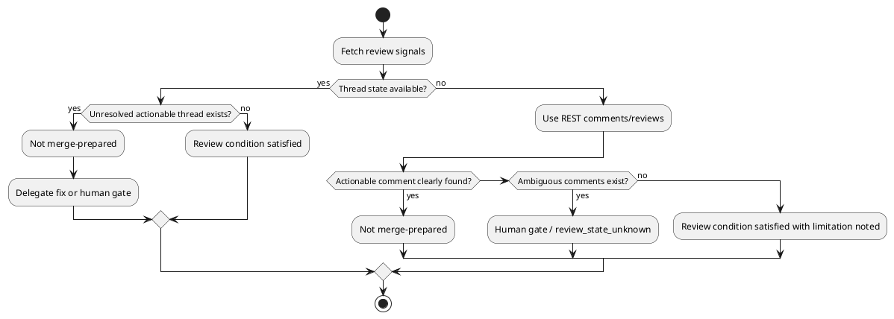

# 20260521t000352z-01-interview Review Thread State Policy

## 位置づけ
- 用途: 人間から目的、制約、期待、判断基準、未決事項を引き出し、回答を記録する。
- authority default: `raw`。通常は doc type から推定し、例外時だけ front matter の `authority` で override する。
- 技術的に調べられることは先に docs / code / tests / ADR / discussions / primary source を確認する。
- trivial な yes/no は、重要な判断、後続反映、回答証跡が必要なら `interview` を使い、そうでなければ issue comment や `scratch` で足りる。
- 回答から論点整理が必要になったら `disc`、追加調査が必要になったら `research`、長期判断が固まったら `adr` を新規作成する。

## ヒアリング概要 (必須)
- 対象者:
  - iwasawayuuta
- 回答が必要な理由:
  - PR review 指摘を「対応済み」と判定するには、コメントの存在だけでなく、review thread が unresolved か resolved か、outdated かを見たい場合がある。
  - 現行の shipped wrapper は REST GET で comments / reviews を取得できるが、thread-level state は弱い。
- 反映予定先:
  - `requirement.md`:
    - review feedback の扱い、merge-prepared 判定、scope / non-scope。
  - `design.md`:
    - review data source、fallback、limitations、human gate。
  - `plan.md`:
    - wrapper 追加有無、tests、pr-monitor update。
  - `adr`:
    - GitHub API read boundary を長期判断として固定する場合。

## 質問ブロック（必要な数だけ繰り返す） (必須)

### 質問 1
- 質問主題:
  - Review thread state を merge-prepared 判定に含めるか
- 回答してほしいこと:
  - 現行 REST wrapper の範囲で「Codex / review comments があるか」を見るだけにするか、unresolved / resolved / outdated thread state まで取得する仕組みを要求するか。
- なぜ質問するのか:
  - コメントが存在しても、すでに解決済み、古い diff に対する outdated comment、単なる補足、approval body などの場合がある。
  - 逆に unresolved thread が残っているなら、checks green でも人間が merge 判断に入れる状態とは言いにくい。
- 背景:
  - 現行 `github-codex-pr-review-comments` wrapper は次を取得する:
    - PR conversation comments
    - Inline review comments
    - Review bodies
  - wrapper は fixed REST GET endpoints のみを使い、direct arbitrary `gh api` / GraphQL / write operations を禁止している。
  - GitHub plugin の `gh-address-comments` skill は thread-aware review data が必要なとき GraphQL script を使う方針を持つが、現 shipped `pr-monitor` は direct GraphQL fallback を禁じている。
- 詳細説明:
  - REST comment list は「コメントが存在する」ことを知るには十分だが、「その指摘がまだ未解決か」を厳密には判断しにくい。
  - PR を仕上げる skill では、review 指摘が残っているかどうかが merge-prepared 判定に直結する。
  - ただし、thread state 取得のために arbitrary GraphQL を許すと、read-only 境界が広がり、既存の安全設計と衝突する。
  - 安全にやるなら、現 wrapper と同じように、入力を `--repo` / `--pr` / `--out` に限定した fixed read-only GraphQL wrapper を追加するのが筋になる。
- 事前分析:
  - 確認済みの docs / code / tests / ADR / discussions / primary source:
    - `.agents/skills/github-codex-pr-review-comments/SKILL.md`
    - `.agents/skills/github-codex-pr-review-comments/scripts/fetch_codex_pr_review_comments.sh`
    - `.codex/agents/pr-monitor.toml`
    - GitHub plugin `gh-address-comments/SKILL.md`
  - まだ人間判断が必要な理由:
    - 厳密な merge-prepared 判定を優先して実装範囲を広げるか、まずは既存 wrapper の安全境界を維持して小さく始めるかの判断だから。
- 回答案:
  - A:
    - 今回は現行 REST wrapper を前提にし、thread state 不足は limitation として扱う。
  - B:
    - 本 issue で fixed read-only GraphQL wrapper を追加し、unresolved / resolved / outdated thread state を取得する。
  - C:
    - GitHub plugin の `gh-address-comments` または GitHub connector を runtime 前提にする。
- 選択肢比較:
  - 評価軸:
    - 判定精度、安全境界、実装量、テストしやすさ、host / plugin 依存。
- メリット:
  - A:
    - 実装範囲が小さく、既存安全境界を壊さない。
    - 現行 `pr-monitor` と wrapper をそのまま活かせる。
  - B:
    - unresolved thread を見て、より正確な merge-prepared 判定ができる。
    - REST comment の存在だけで過剰に止まる/見逃す問題を減らせる。
  - C:
    - 既存 GitHub plugin の thread-aware workflow を利用できる。
- デメリット:
  - A:
    - resolved / outdated / informational comment を actionable と誤分類する可能性がある。
    - 未解決 thread を厳密に検出できない。
  - B:
    - 新 wrapper、input validation、tests、docs、pr-monitor guidance update が必要。
    - GraphQL schema / gh auth / rate limit の failure mode が増える。
  - C:
    - shipped skill が external plugin availability に依存する。
    - spec-dock managed asset としての再現性が弱くなる。
- リスク:
  - A のリスク:
    - review 対応済みなのにコメントが残っているだけで止まる。
    - 逆に unresolved state が分からず、人間確認が増える。
  - B のリスク:
    - issue scope が「PR merge preparation skill」から「GitHub review thread wrapper 追加」へ広がる。
  - C のリスク:
    - consumer repo に plugin がない環境で skill が再現できない。
- ベストプラクティス分析:
  - 長期的には thread state を read-only fixed wrapper で取得できる方が、merge-prepared 判定としては正確。
  - ただし、今回の primary value は「毎回口頭で指示している PR 仕上げ loop を skill 化すること」なので、初期版は現行 wrapper 前提でも価値がある。
  - 重要なのは、現行 wrapper の limitation を隠さず、thread state 不明時に `human gate` または `review_state_unknown` として止まれること。
- 推奨案:
  - 初期 requirement は A を baseline にしつつ、B を design option / follow-up candidate として残す。
  - ただし merge-prepared 判定では、Codex / reviewer comments が検出され、actionable か判断できない場合は `human gate` にする。
  - 本 issue の scope に余裕があり、`pr-monitor` output を拡張するなら、B の fixed read-only GraphQL wrapper を別 step として検討する。
- 未回答時の影響:
  - review 指摘対応済み判定の精度と実装範囲が固定できない。
- 回答欄:
  - 未回答
- 回答後フォローアップ:
  - 反映先:
    - `requirement.md`
    - `design.md`
    - 必要なら `plan.md`
  - 追加で作る discussion docs:
    - B を採用する場合、GraphQL wrapper design discussion を作る。

## 図解（任意）

