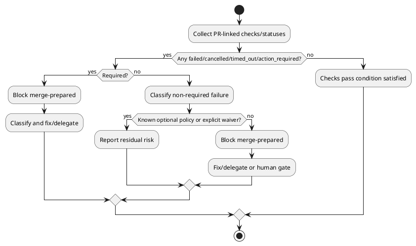

# 20260521t000352z-02-interview Non Required Check Policy

## 位置づけ
- 用途: 人間から目的、制約、期待、判断基準、未決事項を引き出し、回答を記録する。
- authority default: `raw`。通常は doc type から推定し、例外時だけ front matter の `authority` で override する。
- 技術的に調べられることは先に docs / code / tests / ADR / discussions / primary source を確認する。
- trivial な yes/no は、重要な判断、後続反映、回答証跡が必要なら `interview` を使い、そうでなければ issue comment や `scratch` で足りる。
- 回答から論点整理が必要になったら `disc`、追加調査が必要になったら `research`、長期判断が固まったら `adr` を新規作成する。

## ヒアリング概要 (必須)
- 対象者:
  - iwasawayuuta
- 回答が必要な理由:
  - PR を「人間が merge できる状態まで整える」とき、required checks 以外の failure を blocker とするか、残リスクとして報告するだけにするかを決める必要がある。
  - この判断は skill の自律停止条件、fix loop の対象範囲、ユーザーへの最終報告基準に直結する。
- 反映予定先:
  - `requirement.md`:
    - merge-ready / merge-prepared 判定、scope、human gate。
  - `design.md`:
    - check classification、failure handling、waiver handling。
  - `plan.md`:
    - pr-monitor output 拡張、classification tests / docs checks。
  - `adr`:
    - 必要なら non-required checks の扱いを長期運用判断として分離する。

## 質問ブロック（必要な数だけ繰り返す） (必須)

### 質問 1
- 質問主題:
  - Non-required check failure を blocker とするか
- 回答してほしいこと:
  - required ではない check / status が failed / cancelled / timed_out / action_required のとき、PR を「merge 可能に整った」と扱ってよいか。
- なぜ質問するのか:
  - GitHub の protected branch は required checks が pass すれば merge を許すことがあるが、non-required checks でも実際には重大な品質 failure を示す場合があるため。
- 背景:
  - GitHub status checks は各 push に対して pending / passing / failing を示す。
  - Required status checks は protected branch に merge する前に pass が必要。
  - 一方で、non-required checks は GitHub の merge button をブロックしない場合がある。
  - しかし、non-required checks には optional な lint、preview deploy、staging deploy、slow integration、security scan、外部サービス checks などが含まれ得る。
- 詳細説明:
  - 「GitHub 上で merge button が押せる」ことと「ユーザーが安心して merge 判断できる」ことは同じではない。
  - この skill の目的は後者、つまり人間が merge できる状態まで PR を整えること。
  - したがって、non-required failure を無視すると、GitHub の機械的 mergeability は満たしていても、実運用品質としては赤い PR を「仕上がった」と報告する危険がある。
  - ただし、non-required failure には flaky / external outage / unrelated infra failure / known optional check もあり、すべてを自動修正対象にすると scope creep する。
- 事前分析:
  - 確認済みの docs / code / tests / ADR / discussions / primary source:
    - GitHub Docs: status checks は external processes に基づき、required checks は protected branch merge 前に pass が必要。
    - `gh pr checks --json` は `bucket` で `pass` / `fail` / `pending` / `skipping` / `cancel` に分類できる。
    - 過去 memory では、staging 系 check が後から失敗し `mergeStateStatus=UNSTABLE` になった先例がある。
  - まだ人間判断が必要な理由:
    - プロダクト運用として「GitHub の required だけ通ればよい」のか、「赤い check は required でなくても仕上がり未達」とみなすのかは品質基準の判断だから。
- 回答案:
  - A:
    - Non-required failure も原則 blocker とする。明示 waiver がある場合だけ例外化する。
  - B:
    - Required checks だけ blocker とし、non-required failure は residual risk として報告する。
  - C:
    - Check を分類し、CI / test / deploy / security / docs / external / flaky などのカテゴリごとに blocker か residual risk かを変える。
- 選択肢比較:
  - 評価軸:
    - 安全性、運用負荷、scope creep、報告の明確さ、自律修正のしやすさ。
- メリット:
  - A:
    - 「赤い PR を仕上がったと報告しない」ので品質基準が明確。
    - ユーザーの追加確認なしで修正 loop に入る対象が分かりやすい。
  - B:
    - GitHub の mergeability に近く、過剰に止まりにくい。
    - 外部 optional failure で skill が止まりにくい。
  - C:
    - 実態に即した判断ができる。
    - 例えば optional preview deploy failure は報告、unit test failure は blocker のように扱える。
- デメリット:
  - A:
    - external / flaky / optional な失敗でも毎回 blocker になり、修正不能な原因で止まりやすい。
    - 既知の non-blocking check がある repo では waiver 運用が必要。
  - B:
    - 実際には重要な non-required failure を見逃す危険がある。
    - ユーザーが「merge 可能な状態」を品質込みで期待している場合、期待とずれる。
  - C:
    - 初期実装が複雑になる。
    - check 名や repo ごとの慣習に依存しやすい。
- リスク:
  - A のリスク:
    - 外部障害で skill が blocked になりやすい。
  - B のリスク:
    - 赤い check が残ったまま「merge できます」と言ってしまう。
  - C のリスク:
    - 分類ルールが曖昧だと agent ごとに判断が揺れる。
- ベストプラクティス分析:
  - PR を「仕上げる」skill では、GitHub の required status だけではなく、PR-linked checks / statuses 全体を観測し、失敗があれば少なくとも分類して報告するべき。
  - 自律修正対象にするかは別問題で、non-required failure を見つけた時点で「merge-prepared ではない」と判定し、原因が external / known optional なら human waiver または explicit policy を要求する形が安全。
- 推奨案:
  - A を基本に、C の分類だけ導入する。
  - 具体的には、non-required failure は原則 blocker。ただし次のように分類する:
    - product / test / lint / build / docs regression: fix loop 対象。
    - deploy / external service / permission / flaky suspected: blocked または human gate。
    - repo policy で known optional と明示された check: residual risk として報告可能。
  - 明示 waiver がない限り、failed / cancelled / timed_out / action_required の check が残る PR を merge-prepared と報告しない。
- 未回答時の影響:
  - `merge-prepared` の定義が曖昧になり、requirement の acceptance criteria を固定できない。
- 回答欄:
  - 未回答
- 回答後フォローアップ:
  - 反映先:
    - `requirement.md`
    - `design.md`
  - 追加で作る discussion docs:
    - 必要なら check classification table を design discussion に分離する。

## 図解（任意）

