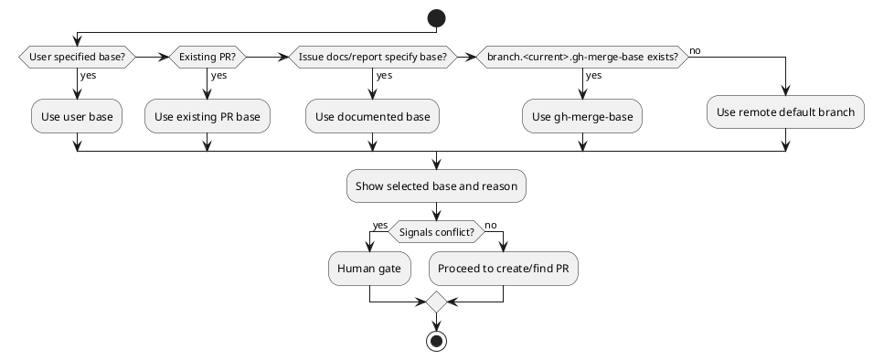

# 20260521t000352z-03-interview PR Draft Ready And Base Resolution Policy

## 位置づけ
- 用途: 人間から目的、制約、期待、判断基準、未決事項を引き出し、回答を記録する。
- authority default: `raw`。通常は doc type から推定し、例外時だけ front matter の `authority` で override する。
- 技術的に調べられることは先に docs / code / tests / ADR / discussions / primary source を確認する。
- trivial な yes/no は、重要な判断、後続反映、回答証跡が必要なら `interview` を使い、そうでなければ issue comment や `scratch` で足りる。
- 回答から論点整理が必要になったら `disc`、追加調査が必要になったら `research`、長期判断が固まったら `adr` を新規作成する。

## ヒアリング概要 (必須)
- 対象者:
  - iwasawayuuta
- 回答が必要な理由:
  - PR を作成する時点で draft にするか ready にするか、また base branch をどう決めるかは、PR lifecycle skill の最初の安全境界になる。
  - 誤った base や意図しない ready PR は、review / CI / merge 判断を誤らせる。
- 反映予定先:
  - `requirement.md`:
    - PR creation behavior、base resolution、human gate。
  - `design.md`:
    - state machine の prepare / create-or-find-pr、base selection algorithm、draft/ready decision。
  - `plan.md`:
    - `github-pr-creator` update、tests、skill text verification。
  - `adr`:
    - 必要なら base selection policy を長期判断として分離する。

## 質問ブロック（必要な数だけ繰り返す） (必須)

### 質問 1
- 質問主題:
  - PR 作成時の draft / ready default
- 回答してほしいこと:
  - PR 作成時、default を draft-first にするか、local final gates pass 後なら ready PR 作成を許可するか。
- なぜ質問するのか:
  - この skill は PR 作成で終わらず、merge 可能な状態まで持っていく。PR 作成直後から review / CI を走らせたいなら ready PR が自然だが、まだ人間に見せる前提でなければ draft が安全。
- 背景:
  - 既存 `github-pr-creator` は draft-first を強制していない。
  - GitHub plugin の `yeet` は default draft PR だが、これは「publish local changes」用途で安全寄り。
  - 今回の skill は、spec-dock issue の final gates 後に使われる想定が強い。
- 詳細説明:
  - Draft PR:
    - まだ review を正式に求めない、途中共有、CI だけ先に回したい場合に向く。
    - ただし、draft のままだと review / merge readiness の扱いが repo によって変わり、最終的に ready 化する判断が別途必要になる。
  - Ready PR:
    - すでに local final gates を通し、レビューと CI を正式に受ける状態として出す。
    - この skill の「PR を仕上げる」目的には合うが、docs / report / tests が未完了の時点で作ると危険。
- 事前分析:
  - 確認済みの docs / code / tests / ADR / discussions / primary source:
    - `.agents/skills/github-pr-creator/SKILL.md`
    - GitHub plugin `yeet/SKILL.md`
    - `workflow_issue.md` final quality gate / final commit rules
  - まだ人間判断が必要な理由:
    - PR 作成タイミングと review 開始の運用方針はユーザーの期待に依存するため。
- 回答案:
  - A:
    - Draft-first。ready 化は別 human gate。
  - B:
    - Local final gates pass 後なら ready PR 作成を許可する。未完了なら draft または blocker。
  - C:
    - 常にユーザー指示に従い、指示がなければ ask する。
- 選択肢比較:
  - 評価軸:
    - 安全性、手間削減、レビュー開始の早さ、誤公開リスク。
- メリット:
  - A:
    - 安全。途中 PR を誤って正式 review 対象にしない。
  - B:
    - この skill の目的と合う。毎回 ready 化を確認する手間が減る。
    - local final gates を通した後なら、PR 作成直後から CI / review / merge-preparation loop に入れる。
  - C:
    - 柔軟。
- デメリット:
  - A:
    - merge 可能状態まで持っていく skill なのに、ready 化が別確認になり手間が残る。
  - B:
    - local final gates の完了判定が甘いと、未完成 PR を ready にしてしまう。
  - C:
    - 毎回確認が増え、ユーザーが減らしたい口頭指示が残る。
- リスク:
  - Ready PR を許可する場合、skill は `requirement/design/plan/report`、final gates、commit / clean state を見て、未完了なら作成を止める必要がある。
- ベストプラクティス分析:
  - spec-dock issue execution 後の delivery workflow として使うなら、local final gates pass 後の ready PR 作成を default にするのが目的に合う。
  - 途中共有や未完了 worktree では draft または blocker に落とす条件を明記すれば、安全性を保てる。
- 推奨案:
  - B。
  - 条件:
    - active issue docs / report が実質記入済み。
    - final gates / relevant tests / reviewer gates が pass または明示 waiver。
    - working tree が意図した commit scope で clean。
    - PR body に未完了 / residual risk がある場合は ready にせず draft または human gate。
- 未回答時の影響:
  - PR creation state が曖昧になり、`github-pr-creator` と新 skill の使い分けが固定できない。
- 回答欄:
  - 未回答
- 回答後フォローアップ:
  - 反映先:
    - `requirement.md`
    - `design.md`
  - 追加で作る discussion docs:
    - なし

### 質問 2
- 質問主題:
  - Base branch resolution
- 回答してほしいこと:
  - base branch 解決で `branch.<current>.gh-merge-base` を尊重し、選択した base を必ず表示する方針でよいか。
- なぜ質問するのか:
  - base branch を間違えると、diff、PR body、CI、review、mergeability の全てが誤った前提になるため。
- 背景:
  - GitHub CLI manual では、`gh pr create --base` 未指定時、current branch の `gh-merge-base` git config があればそれを使い、なければ repository default branch を使う。
  - 既存 `github-pr-creator` は user-specified base、repository default branch の順で解決する。`gh-merge-base` は現状の明示候補ではない。
- 詳細説明:
  - base branch は次の順で決める案が安全:
    1. ユーザー明示 base。
    2. 既存 PR がある場合、その PR の base。
    3. active issue docs / report に明示された base。
    4. `branch.<current>.gh-merge-base`。
    5. remote default branch。
  - ただし、docs / config / existing PR が矛盾する場合は ask / blocker にする。
  - 選択した base は final response と PR creation summary に必ず表示する。
- 事前分析:
  - 確認済みの docs / code / tests / ADR / discussions / primary source:
    - GitHub CLI manual `gh pr create`
    - `.agents/skills/github-pr-creator/SKILL.md`
  - まだ人間判断が必要な理由:
    - `gh-merge-base` を既存 skill の base resolution に追加するかは behavior change だから。
- 回答案:
  - A:
    - `gh-merge-base` を尊重する。
  - B:
    - user-specified base と remote default のみ使う。
  - C:
    - `gh-merge-base` は検出して表示するが、自動採用せず ask する。
- 選択肢比較:
  - 評価軸:
    - GitHub CLI との一致、誤 base 防止、ユーザー確認頻度、既存挙動への影響。
- メリット:
  - A:
    - GitHub CLI と整合する。
    - repo / branch に事前設定された意図を尊重できる。
  - B:
    - 単純で予測しやすい。
  - C:
    - 安全側だが確認が増える。
- デメリット:
  - A:
    - 古い `gh-merge-base` config が残っていると誤採用の可能性がある。
  - B:
    - branch-local に設定した意図を無視する。
  - C:
    - この skill の「都度確認を減らす」価値が下がる。
- ベストプラクティス分析:
  - GitHub CLI と同じ base resolution を尊重しつつ、選択根拠を必ず表示するのがよい。
  - 既存 PR がある場合は PR base を優先し、途中で base を勝手に変えない。
  - docs / config / existing PR が矛盾した場合だけ human gate にする。
- 推奨案:
  - A。
- 追加質問:
  - Existing PR の base と `gh-merge-base` が矛盾した場合は、existing PR base を優先し、矛盾を報告する方針でよいですか。
  - Active issue docs / report に base が明示され、`gh-merge-base` と矛盾した場合は、人間確認で止める方針でよいですか。
- 未回答時の影響:
  - `github-pr-creator` 更新の base resolution contract を固定できない。
- 回答欄:
  - 未回答
- 回答後フォローアップ:
  - 反映先:
    - `requirement.md`
    - `design.md`
    - `github-pr-creator` update scope
  - 追加で作る discussion docs:
    - なし

## 図解（任意）

