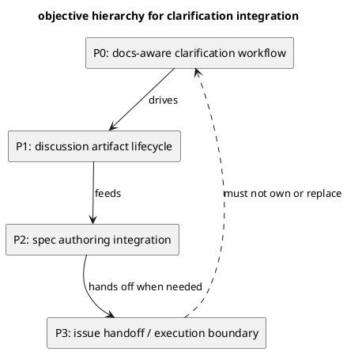
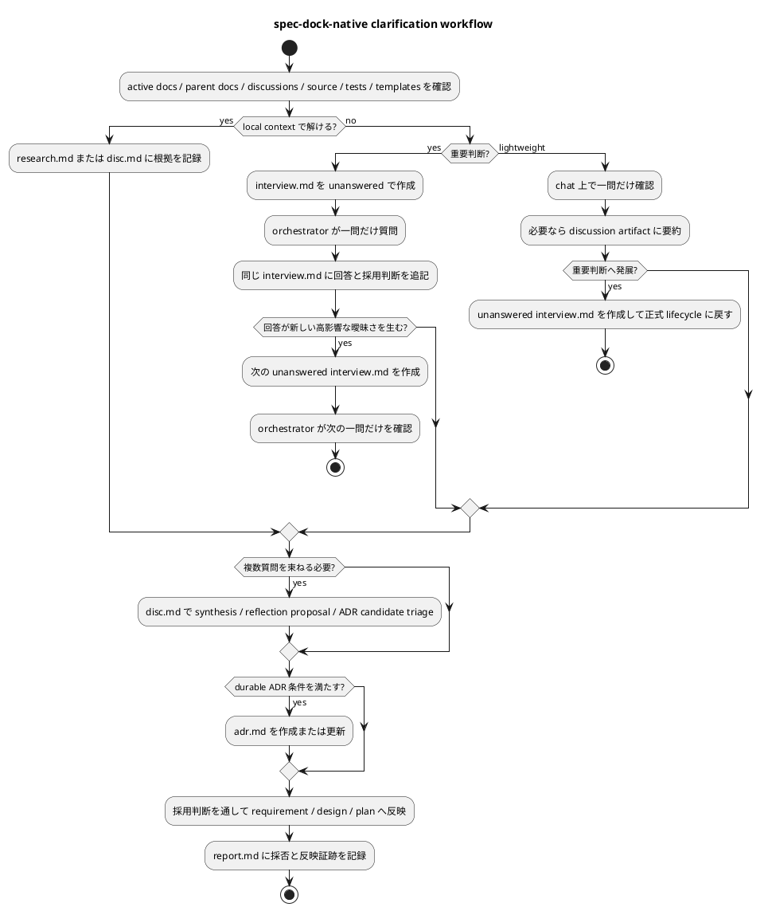
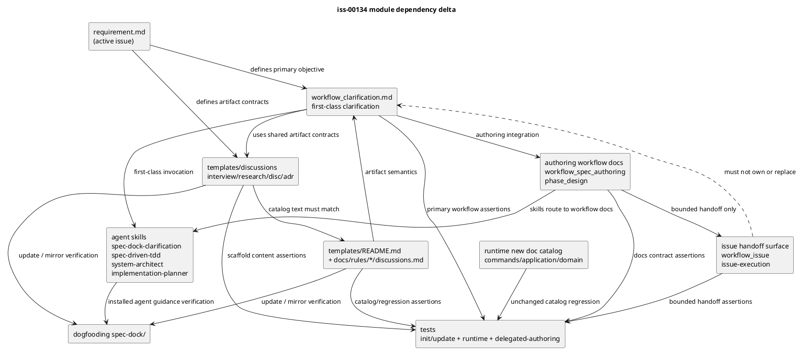

# iss-00134 docs-aware clarification workflow を spec-dock に取り込む — 設計

## 目的・制約

この設計は、Matt Pocock の既存パターンから抽出した essence を、`docs-aware clarification workflow` として spec-dock の既存 authoring workflow、discussion artifact、canonical docs、agent guidance に統合するための実装設計を固定する。

設計上の目的は、次の 5 点である。

- spec-dock-native な docs-aware clarification workflow を first-class concept として定義する。
- agent-to-human question の標準作法を、一問一答に寄せる。
- 重要判断では、質問前に未回答の質問シートを作り、回答後に同じ artifact を完成 record にする。
- `research` / `interview` / `disc` / `adr` / `report` を clarification 専用 variant ではなく共通 template / 共通概念として再設計する。
- 既存 workflow / template / skill guidance に残る矛盾、重複、使われなくなる複数質問 guidance を整理する。

非交渉制約:

- Matt Pocock 由来の pattern を無加工で移植しない。
- `CONTEXT.md` を spec-dock の新しい正本にしない。
- repo / docs / source で解ける質問を人間へ投げない。
- 人間ユーザーへの本質的な質問は一度に一つだけにする。
- 専門 agent / deep consultant は人間へ直接質問しない。
- discussion artifact は evidence / proposal であり、採用判断なしに canonical source of truth にしない。
- Issue planning / Issue execution の境界整理が必要な場合でも、clarification workflow の適用先 / handoff boundary に限定し、主目的より上位または同格に扱わない。

## 設計解釈階層

設計判断が衝突した場合は、次の優先順位で解釈する。

1. P0: docs-aware clarification workflow
   - source-grounded read、decision tree traversal、一問一答、domain language sharpening、concrete scenario、code / docs cross-check、docs synthesis、ADR sparingly を first-class workflow として保つ。
2. P1: discussion artifact lifecycle
   - `research` / `interview` / `disc` / `adr` / `report` を使い、質問、回答、分析、採用判断、反映先を追跡できるようにする。
3. P2: spec authoring integration
   - requirement / design / plan authoring、reviewer gate、canonical docs への promotion と整合させる。
4. P3: issue handoff / execution boundary
   - Issue planning / Issue execution の境界整理は、P0-P2 を implementation へ安全に渡すための minimal supporting surface として扱う。

P3 が P0-P2 を上書きする設計は不合格である。たとえば、Issue planning / execution 分離、execution policy、delegation framework、PR delivery、issue finish lifecycle が主要成果物として扱われ、clarification workflow がその内部の補助作法に縮退する設計は objective inversion として採用しない。

依存方向は次の順に固定する。



## 既存実装 / 規約の理解

参照した正本:

- `spec-dock/active/issue/requirement.md`
- `spec-dock/docs/workflow_spec_authoring.md`
- `spec-dock/docs/phase_design.md`
- `spec-dock/docs/workflow_issue.md`
- `src/spec_dock/assets/spec_dock/docs/workflow_clarification.md`（新設）
- `src/spec_dock/assets/spec_dock/templates/discussions/{interview,research,disc,adr}.md`
- `src/spec_dock/assets/spec_dock/templates/README.md`
- `src/spec_dock/assets/install_root/.agents/skills/spec-dock-clarification/SKILL.md`（新設）
- `src/spec_dock/assets/install_root/.agents/skills/spec-driven-tdd-workflow/SKILL.md`
- `src/spec_dock/assets/install_root/.agents/skills/spec-dock-{system-architect,implementation-planner,issue-execution}/SKILL.md`

現状理解:

- `src/spec_dock/assets/spec_dock/` が shipped scaffold docs / templates / runtime の provider-side source of truth である。
- `src/spec_dock/assets/install_root/` が installed agent-tooling assets の provider-side source of truth である。
- `spec-dock/` は dogfooding workspace であり、provider-side changes の検証 / mirror surface として扱う。
- discussion doc catalog は `scratch` / `interview` / `research` / `disc` / `adr` / `draft-*` を持つ。
- `report.md` は `new doc report` として作る discussion doc ではなく、issue / epic / initiative の canonical observed evidence ledger template として存在する。
- 現 `interview.md` template は複数質問ブロックを前提にしており、一問一答 workflow と衝突する。

採用する既存パターン:

- canonical docs は main orchestrator の single-writer authority とする。
- sub-agent authoring output は scope-local `discussions/` evidence として扱い、canonical docs への反映は orchestrator が行う。
- provider-side assets を先に変更し、必要に応じて dogfooding workspace へ反映 / 検証する。
- template は compliance checklist ではなく、agent が正しく書き始めるための最小 scaffold とする。

採用しないもの:

- clarification 専用の `clarification-interview.md` / `clarification-report.md` や旧称由来の `grill-interview.md` / `grill-report.md` などの新 template variant。
- 初期実装での `reflection.md` 追加。
- 初期実装での `new doc report` catalog 追加。
- 既存の複数質問 interview artifact の自動分割 / rename。

## 採用方針 / トレードオフ

### 方針 D-001: 既存 common template を再設計する

`interview` / `research` / `disc` / `adr` / `report` を clarification 専用に分けず、共通 template / 共通概念として再設計する。

理由:

- 要件上、テンプレートの重複や agent の迷いを避けることが重要である。
- clarification workflow は spec-dock の通常 authoring workflow と併用されるため、別系統にすると運用分岐が増える。

トレードオフ:

- 共通 template がやや厚くなる。
- ただし、PlantUML や詳細 tradeoff を条件付き項目にすることで、軽微な質問まで重くならないようにする。

### 方針 D-002: `disc.md` と `report.md` の責務を分離する

`disc.md` は synthesis / 中間レポート / 上位レポート / reflection proposal / ADR candidate triage を扱う。

`report.md` は observed evidence ledger として、実際の採否、canonical docs への反映、reviewer verdict、execution evidence を扱う。

`report.md` に未採用 proposal や synthesis 本文を抱え込ませない。

### 方針 D-003: 初期実装では runtime catalog を変えない

初期設計では、新しい discussion doc type を追加しない。

そのため、`commands/new.py`、`application/create_node.py`、`domain/validation.py` の catalog 変更は原則不要とする。

runtime 変更が必要になるのは、設計中または実装中に `report` / `reflection` などの新 doc type が独立 lifecycle を必要とすると確認された場合だけである。

### 方針 D-004: ADR は sparingly に扱う

ADR candidate は `disc.md` で triage し、原則として次の条件を満たす場合だけ ADR 化する。

- 後から戻しにくい。
- 将来の読者にとって意外性がある。
- 実質的な tradeoff がある。

局所的で可逆な判断は、質問シート、`disc.md`、または canonical docs への通常反映で閉じる。

### 方針 D-005: Issue handoff surface は最小に留める

Issue planning / Issue execution の境界整理が必要な場合でも、それは clarification workflow を implementation に渡すための handoff surface に限定する。

扱ってよいもの:

- `workflow_issue.md` や Issue 向け skill guidance から、first-class clarification workflow への参照を追加する。
- implementation start 前に未解決の requirement / design / plan gap があれば、clarification / authoring phase へ戻す境界を明記する。
- `report.md` に objective alignment / handoff readiness の観測証跡を残す。

扱わないもの:

- Issue planning / Issue execution 分離を新しい主要 workflow として設計する。
- `workflow_issue.md`、`spec-dock-issue-execution`、delegation framework、PR / finish lifecycle を、この issue の中心成果物にする。
- first-class clarification workflow を Issue planning 内の小さな節や補助ルールに閉じ込める。

この境界を超える必要が出た場合は、この issue の実装を止め、別 issue または明示的な design amendment と fresh `spec-reviewer` を要求する。

### 方針 D-006: first-class clarification invocation surface を定義する

spec-dock-native な docs-aware clarification workflow は、Issue planning の内部節ではなく、first-class workflow doc と shipped skill から呼び出す。

追加する入口:

- `src/spec_dock/assets/spec_dock/docs/workflow_clarification.md`
  - source-grounded read、decision tree traversal、一問一答、domain language sharpening、concrete scenario、code / docs cross-check、docs synthesis、ADR sparingly を扱う正本 workflow。
  - local analysis / draft / decision clarification と requirement / design / plan authoring の両方から参照できる。
- `src/spec_dock/assets/install_root/.agents/skills/spec-dock-clarification/SKILL.md`
  - ユーザーが「壁打ち」「曖昧さを潰したい」「設計や計画を詰めたい」「仕様を明確化したい」と依頼したときの shipped skill entrypoint。
  - canonical docs 作成を必須にしない analysis-only / draft-only mode と、scope-local `discussions/` から canonical docs へ昇格する authoring mode を分けて案内する。
  - skill は長い policy を複製せず、`workflow_clarification.md`、common discussion templates、scope workflow へ route する concise reminder とする。

既存 skill との関係:

- `spec-driven-tdd-workflow` は、曖昧さが残る authoring / planning request を `spec-dock-clarification` または `workflow_clarification.md` へ route できる。
- `spec-dock-system-architect` と `spec-dock-implementation-planner` は、人間へ直接質問せず、clarification 質問候補を orchestrator へ返す。
- `spec-dock-issue-execution` は、implementation 中に未解決仕様や objective inversion risk を見つけた場合、実装継続ではなく `workflow_clarification.md` / authoring phase へ戻す。
- Issue planning / execution split を表す新しい headline skill を、この issue の主成果物として追加しない。

## 境界 / 契約モデル

### 役割境界

- Orchestrator:
  - 人間ユーザーとの対話を所有する。
  - 質問シートを作成し、一問ずつ確認する。
  - 採用判断と canonical docs 反映を行う。
  - `report.md` の evidence ledger を所有する。
- 専門 agent:
  - source-grounded analysis、質問候補、質問理由、影響 artifact、推奨回答を返す。
  - 人間ユーザーには直接質問しない。
- Deep consultant:
  - 細かい設計判断の一次回答役になれる。
  - 判断材料不足、権限不足、人間の価値判断が必要な場合は回答を控え、orchestrator へ戻す。
- Spec reviewer:
  - requirement / design / plan の phase gate を fresh review する。
  - authoring specialist や consultant の代替ではなく、独立 gate として扱う。

### artifact 境界

- `research.md`:
  - source-grounding、事実、推測、未検証事項、用語衝突、edge case、判断への含意を分離して記録する。
- `interview.md`:
  - 一問一答の正式質問シート。
  - 未回答状態で作成し、回答後に同じ file を完成 record にする。
  - 回答によって新しい高影響な曖昧さが見つかった場合は、同じ質問シート内に追加質問を増やさず、次の unanswered `interview` artifact を作成する。
- `disc.md`:
  - 複数質問の synthesis、中間レポート、上位レポート、reflection proposal、ADR candidate triage。
- `adr.md`:
  - durable architecture / contract / migration decision。
- `report.md`:
  - observed evidence ledger。
  - Evidence Adoption Ledger / Spec Authoring Gate / review / execution evidence を持つ。

### 正式質問シートの起動条件

agent-to-human question は常に一問一答で行う。

その上で、次のいずれかに該当する質問は artifact-heavy な正式質問として扱い、回答前に unanswered `interview.md` を作成する。

- requirement / design / plan / ADR / scope / non-scope / workflow / template / agent role に影響する。
- 後続の implementation step、test obligation、review gate、migration / rollback、cleanup 対象を変える。
- 回答内容を複数の artifact へ反映する必要がある。
- 複数の選択肢、tradeoff、Codex recommendation を提示してからユーザー判断を得る必要がある。
- 回答後に採用 / 部分採用 / 棄却 / deferred の判断を追跡する必要がある。
- 将来の reviewer または別 agent が、なぜその判断になったかを evidence として参照する必要がある。

次のすべてを満たす質問だけは、chat 上の軽微な一問として扱ってよい。

- local context で解けず、人間確認は必要である。
- canonical docs、template、workflow、agent role、ADR candidate、実装計画に直接影響しない。
- 回答が後続 artifact の採用判断や反映先を変えない。
- はい / いいえ、短い確認、表記ゆれ確認などで、後から evidence として追跡する必要が低い。

軽微な一問の回答が重要判断へ発展した場合は、その時点で次の unanswered `interview.md` を作成し、以降は正式質問シートの lifecycle に戻す。

## clarification workflow



この図で固定する設計判断:

- source-grounding が human question より先に来る。
- 人間への質問は orchestrator が一問ずつ行う。
- 回答後に新しい高影響な曖昧さが見つかった場合も、同じ artifact に複数質問を足さず、次の unanswered `interview.md` へ戻る。
- 軽微な一問が重要判断へ発展した場合も、chat だけで確定せず formal `interview.md` lifecycle に戻る。
- synthesis は `disc.md`、採否 ledger は `report.md` に分ける。
- ADR は全判断の既定反映先ではない。

## interface contract

### frontmatter compatibility policy

既存 discussion template の identity fields は維持する。

維持する fields:

- `種別`
- `ID`
- `タイトル`
- `状態`
- `作成者`
- `最終更新`
- `親`
- `関連`
- `authority`
- `derived_from`
- `reflected_to`

今回の再設計では、既存 fields を削除・rename しない。

追加または意味を明確化する fields:

- `scope`: 対象範囲の種別。`issue` / `epic` / `initiative` / local scope を想定する。
- `scope_id`: 対象 scope id。
- `created_at`: artifact 作成日時。既存 `最終更新` と併用し、機械的な作成時刻が必要な場合に使う。
- `created_by`: artifact 作成主体。既存 `作成者` と併用し、agent role などを機械的に判別したい場合に使う。
- `status`: lifecycle status。`状態` が人間向け label を持つ場合でも、agent-facing contract は `status` を参照する。
- `adoption_status`: 採用状態。質問状態や artifact 状態とは分離する。

`research.md` / `interview.md` / `disc.md` / `adr.md` は、この compatibility policy に従う。

canonical `report.md` は discussion template ではないため、この policy の対象外である。ただし Evidence Adoption Ledger では `adoption_status`、`source`、`target`、`evidence`、`next_action` を使い、discussion evidence や外部支援 artifact の採否を記録する。

### `interview.md`

frontmatter:

- 既存 identity fields:
  - `種別`
  - `ID`
  - `タイトル`
  - `状態`
  - `作成者`
  - `最終更新`
  - `親`
  - `関連`
  - `authority`
  - `derived_from`
  - `reflected_to`
- `scope`: `issue` / `epic` / `initiative` / local scope
- `scope_id`
- `created_at`
- `created_by`
- `status`: `unanswered` / `answered` / `superseded` / `deferred`
- `authority`: `proposed` / `user-approved` / `synthesized`
- `adoption_status`: `unreviewed` / `adopted` / `partially_adopted` / `rejected` / `deferred` / `stale` / `blocked`
- `derived_from`
- `reflected_to`

required body sections:

- 位置づけ
- 質問の目的
- 質問
- source-grounded context
- 回答案
- Codex の分析
- Codex の推奨案
- ユーザー回答
- 追加確認の要否
- 採用判断
- requirement / design / plan / ADR への含意

conditional body sections:

- PlantUML 図
- 詳細 tradeoff
- 具体シナリオ / edge case
- 後続 reflection proposal

### `research.md`

`research.md` は、事実、推測、未検証事項、判断への含意を混ぜない。

追加する設計項目:

- 確認済み sources
- 観測事実
- 推測 / inference
- 未検証事項
- 用語衝突 / overloaded terms
- 具体シナリオ / edge case
- requirement / design / plan への含意

### `disc.md`

`disc.md` は意思決定前の synthesis を扱う。

追加する設計項目:

- 対象論点
- derived question sheets / research
- synthesis
- 選択肢 / tradeoff
- reflection proposal
- ADR candidate triage
- 推奨反映先
- 未採用 / deferred 理由

### `adr.md`

`adr.md` は、durable decision のみを固定する。

追加する設計項目:

- ADR 化条件
- hard to reverse
- surprising without context
- real tradeoff
- ADR 化しない場合の反映先

### `report.md`

`report.md` は discussion catalog に追加しない。

canonical `report.md` template / workflow guidance では、Objective Alignment Ledger、Evidence Adoption Ledger、Spec Authoring Gate を使って以下を記録する。

- primary objective evidence
- secondary requirement evidence
- inversion risk
- discussion evidence の採否
- 外部支援で作られた artifact の採否。ただし、外部ツール固有の操作手順や責務は spec-dock の構成要素として定義しない。
- canonical docs への反映先
- reviewer verdict
- blocking / non-blocking
- next action

## 依存関係分析

### module / file dependency

- Template changes are upstream of docs and skill examples.
- Workflow docs define the phase and authority rules used by skills.
- Skill guidance must route to docs rather than redefine long policy.
- Runtime catalog remains unchanged if no new doc type is added.
- Tests depend on provider-side asset content and runtime catalog behavior.
- Dogfooding mirror depends on provider-side shipped assets.

### 実装起点

実装時は、依存の少ない provider-side template から始める。

推奨順:

1. `templates/discussions/*.md`
2. `templates/README.md` と `docs/rules/*/discussions.md`
3. `workflow_clarification.md` / `workflow_spec_authoring.md` / `phase_design.md`
4. `.agents/skills/*/SKILL.md`
5. tests
6. dogfooding mirror / validation

runtime catalog は、doc type を追加しない限り read-only verification 対象にする。

## モジュール依存図（Module Dependency Diagram）



この図で固定する設計判断:

- provider-side template が最初の変更点である。
- `workflow_clarification.md` と `spec-dock-clarification` が first-class clarification entrypoint である。
- Issue handoff surface は authoring integration の下流にあり、clarification workflow を所有しない。
- runtime catalog は doc type を増やさない限り変更しない。
- dogfooding workspace は source of truth ではなく検証面である。

## ディレクトリ / ファイル変更計画

```text
.
|-- src/
|   `-- spec_dock/
|       `-- assets/
|           |-- spec_dock/
|           |   |-- templates/
|           |   |   |-- discussions/
|           |   |   |   |-- interview.md        # Modify: 一問一答質問シートへ再設計
|           |   |   |   |-- research.md         # Modify: source-grounding / terminology / edge case を追加
|           |   |   |   |-- disc.md             # Modify: synthesis / reflection proposal / ADR triage を追加
|           |   |   |   `-- adr.md              # Modify: durable decision / sparing criteria を明確化
|           |   |   `-- README.md             # Modify: common catalog semantics と report 非 catalog を説明
|           |   |-- docs/
   |           |   |   |-- workflow_clarification.md           # Add: first-class docs-aware clarification workflow
   |           |   |   |-- workflow_spec_authoring.md  # Modify: workflow_clarification への authoring integration を補強
   |           |   |   |-- phase_design.md             # Modify: design phase の clarification handoff を補強
   |           |   |   |-- workflow_issue.md           # Modify only if needed: workflow_clarification 参照 / bounded handoff
|           |   |   `-- rules/
|           |   |       |-- initiative/discussions.md   # Modify: discussion catalog 説明を同期
|           |   |       |-- epic/discussions.md         # Modify: discussion catalog 説明を同期
|           |   |       `-- issue/discussions.md        # Modify: discussion catalog 説明を同期
|           |   `-- scripts/
|           |       `-- spec_dock_runtime/             # Read only unless new doc type is introduced
|           `-- install_root/
|               `-- .agents/
   |                   `-- skills/
   |                       |-- spec-dock-clarification/SKILL.md     # Add: first-class docs-aware clarification entrypoint
   |                       |-- spec-driven-tdd-workflow/SKILL.md           # Modify: one-question phase gate reminder
   |                       |-- spec-dock-system-architect/SKILL.md        # Modify: question candidate boundary
   |                       |-- spec-dock-implementation-planner/SKILL.md  # Modify: question candidate boundary
   |                       `-- spec-dock-issue-execution/SKILL.md          # Modify only if needed: unresolved spec returns to workflow_clarification / authoring
|-- tests/
|   |-- test_init_update.py                         # Modify: shipped template / docs assertions
|   |-- cli_runtime/test_runtime_new_doc_s09.py     # Modify or verify: catalog unchanged
|   |-- domain_runtime/test_delegated_authoring.py  # Verify: flat discussion draft contract
|   `-- cli_runtime/test_delegated_authoring.py     # Verify: diff guard contract
|-- spec-dock/
|   |-- templates/
|   `-- docs/                                      # Dogfooding scaffold mirror / validation target after provider changes
`-- .agents/
    `-- skills/                                    # Dogfooding installed agent-tooling mirror / validation target
```

## 要件 -> 設計マッピング

- AC-000:
  - `workflow_clarification.md` と `spec-dock-clarification` を first-class entrypoint とし、docs-aware clarification workflow が Issue planning の内部補助に縮退しない設計にする。
- AC-001 / EC-001:
  - `research.md` と workflow docs に source-grounding、terminology sharpening、edge case 確認を追加する。
- AC-002:
  - workflow docs と skills に one-question-at-a-time を標準質問作法として明記する。
- AC-003 / AC-004:
  - `interview.md` を一問一答の正式質問シートへ再設計する。
- EC-002:
  - 回答が新しい高影響な曖昧さを生んだ場合、同じ質問シートに追加質問を積まず、次の unanswered `interview` artifact を作る guardrail を `interview.md` と workflow docs に入れる。
- AC-005 / AC-006 / EC-003:
  - `disc.md` を synthesis / 中間レポート / 上位レポート / reflection proposal / ADR candidate triage の受け皿にする。
- AC-007 / EC-004:
  - system architect / implementation planner / issue execution skills に、人間へ直接質問しない境界を残す。
- AC-008 / AC-009:
  - canonical docs 反映まで行う main workflow と、analysis / draft で止める skill use を `workflow_clarification.md` と `spec-dock-clarification` に分けて記述する。
- EC-005:
  - 外部支援 artifact は通常 evidence として Evidence Adoption Ledger に記録する。ただし外部ツール固有の利用手順は spec-dock 要件 / 設計には含めない。
- AC-010:
  - 古い複数質問 guidance、重複 template concept、不要な workflow 文言を cleanup 対象として plan に渡す。
- AC-011:
  - `report.md` に Objective Alignment Ledger を追加し、primary objective evidence、secondary requirement evidence、inversion risk、reviewer verdict を記録する。
  - Issue handoff surface の変更は `workflow_clarification.md` への参照、unresolved spec gap の return、handoff readiness evidence に限定する。

## テスト戦略

### unit / content assertions

- `tests/test_init_update.py`
  - `workflow_clarification.md` と `spec-dock-clarification` が shipped scaffold に含まれることを検証する。
  - `workflow_clarification.md` が source-grounded read、decision tree traversal、一問一答、domain language sharpening、concrete scenario、docs synthesis、ADR sparingly を含むことを検証する。
  - `report.md` template が Objective Alignment Ledger の required fields を持つことを検証する。
  - discussion template の必須 heading / labels を一問一答形式に更新する。
  - `interview.md` が複数質問ブロック前提でないことを検証する。
  - provider-side assets と installed scaffold の template / docs / skills が期待内容を含むことを検証する。

### runtime catalog regression

- `tests/cli_runtime/test_runtime_new_doc_s09.py`
  - `scratch` / `interview` / `research` / `disc` / `adr` / `draft-*` の catalog が維持されることを確認する。
  - `report` / `reflection` を新 doc type として追加しない設計を regression として固定する。

### delegated authoring regression

- `tests/domain_runtime/test_delegated_authoring.py`
- `tests/cli_runtime/test_delegated_authoring.py`

既存の flat discussion draft / provenance / diff guard contract が、新しい interview / disc semantics と矛盾しないことを確認する。

### validation

実装後の候補:

- `python -m unittest discover -v`
- `./spec-dock/scripts/spec-dock validate`
- `./spec-dock/scripts/spec-dock sync`
- `git diff --check`

## 要件 / 例外 -> 検証マッピング

- AC-000:
  - 検証対象: `workflow_clarification.md` と `spec-dock-clarification` が first-class clarification entrypoint として存在し、Issue planning / execution handoff がそれを所有または置換していないこと。
  - 検証方法: docs / skills content assertion、spec-reviewer inspection。
- AC-001 / EC-001:
  - 検証対象: `research.md` template と workflow / skill guidance が、local context で解ける疑問を人間へ聞かず、source-grounding record に残す契約を持つこと。
  - 検証方法: template content assertion、docs inspection、spec-reviewer による requirement/design alignment。
- AC-002:
  - 検証対象: agent-to-human question style が one-question-at-a-time として workflow / skill guidance に表現されていること。
  - 検証方法: docs / skills content assertion、spec-reviewer inspection。
- AC-003 / AC-004 / EC-002:
  - 検証対象: `interview.md` template が一問一答、未回答から回答済みへの同一 artifact completion、追加曖昧さ発生時の次 unanswered artifact 作成を表現すること。
  - 検証方法: `tests/test_init_update.py` の template assertion、manual docs inspection。
- artifact-heavy trigger / lightweight question boundary:
  - 検証対象: workflow docs / skills が、正式質問シート必須条件と chat 上の軽微な一問で足りる条件を分けて表現すること。
  - 検証方法: docs / skills content assertion、spec-reviewer inspection。
- AC-005 / AC-006 / EC-003:
  - 検証対象: `disc.md` が synthesis / 中間レポート / 上位レポート / reflection proposal / ADR candidate triage を扱い、issue `report.md` evidence ledger と混同されないこと。
  - 検証方法: template assertion、docs/rules inspection、spec-reviewer inspection。
- AC-007 / EC-004:
  - 検証対象: 専門 agent / deep consultant が人間へ直接質問せず、質問候補を orchestrator へ返す境界が skills に残ること。
  - 検証方法: skill text assertion、spec-reviewer inspection。
- AC-008 / AC-009:
  - 検証対象: main workflow の canonical docs reflection と、skill use の analysis / draft only mode が `workflow_clarification.md` / `spec-dock-clarification` 上で混同されないこと。
  - 検証方法: docs / skill content assertion、spec-reviewer inspection。
- AC-010:
  - 検証対象: 古い複数質問 guidance、重複 template concept、不要 workflow 文言の cleanup が実装 step に含まれること。
  - 検証方法: docs diff inspection、cleanup checklist、spec-reviewer inspection。
- AC-011:
  - 検証対象: `report.md` template が Objective Alignment Ledger を持ち、Issue handoff / execution guidance 変更が first-class clarification workflow を上書きしないこと。
  - 検証方法: report template assertion、docs / skill diff inspection、spec-reviewer inspection。
- EC-005:
  - 検証対象: 外部支援 artifact が通常 evidence として Evidence Adoption Ledger に採否記録され、外部ツール固有の操作手順が spec-dock 要件 / 設計に入らないこと。
  - 検証方法: report / workflow docs inspection、spec-reviewer inspection。

## 移行 / 互換性 / ロールバック

互換性:

- 既存の複数質問型 `interview` artifact は grandfathered として残す。
- legacy sequential discussion docs は既存 policy のまま grandfathered とする。
- `note` retired policy は変えない。
- delegated-authoring historical artifacts は削除・rename・validation failure 化しない。
- `new doc` catalog は初期実装では変えない。

移行:

- 新規作成される `interview.md` template だけを一問一答形式へ切り替える。
- 既存 artifact は自動変換しない。
- workflow docs / skills では、新規質問は一問一答、既存複数質問 artifact は historical evidence として扱うと明記する。

ロールバック:

- runtime catalog を変えないため、主な rollback は provider-side template / docs / skill text の差し戻しで足りる。
- dogfooding mirror は provider-side update を再適用して整合させる。
- もし実装中に runtime catalog 変更が必要になった場合は、plan amendment と fresh spec review を必須にする。

## 観測性

- `interview.md` の `status` / `authority` / `adoption_status` / `reflected_to` で lifecycle を追跡する。
- `disc.md` の `derived_from` で複数質問 / research を束ねる。
- `report.md` の Evidence Adoption Ledger で採否と canonical docs 反映を記録する。
- Spec Authoring Gate で requirement / design / plan の review status と promotion evidence を記録する。
- `reflected_to` は予定ではなく、実際に反映済みの artifact だけを持つ。

## ADR candidates

初期 ADR は作成しない。

候補はあるが、現時点では canonical docs / workflow docs に記述すれば足りる。

- `disc.md` と `report.md` の責務分離。
- `CONTEXT.md` を採用せず、active docs / parent docs / discussions / source / tests / templates を context source とする判断。

実装中にこの判断が hard to reverse、surprising without context、real tradeoff を満たすと reviewer が判断した場合だけ、ADR 化を再検討する。

## リスク

- Template が重くなりすぎると、軽快な一問一答の価値が失われる。
- PlantUML を形式要件化すると、無価値な図が増える。
- `disc.md` と `report.md` の境界が曖昧だと、未採用 proposal が採用済み evidence と誤読される。
- `report` を common catalog と表現しすぎると、`new doc report` 追加と誤解される。
- cleanup が不足すると、古い複数質問 guidance と新しい一問一答 guidance が併存して agent を迷わせる。

## 未確定事項

なし。

要件定義書の fresh `spec-reviewer` は pass 済みであり、設計フェーズを妨げる追加の人間確認事項はない。
