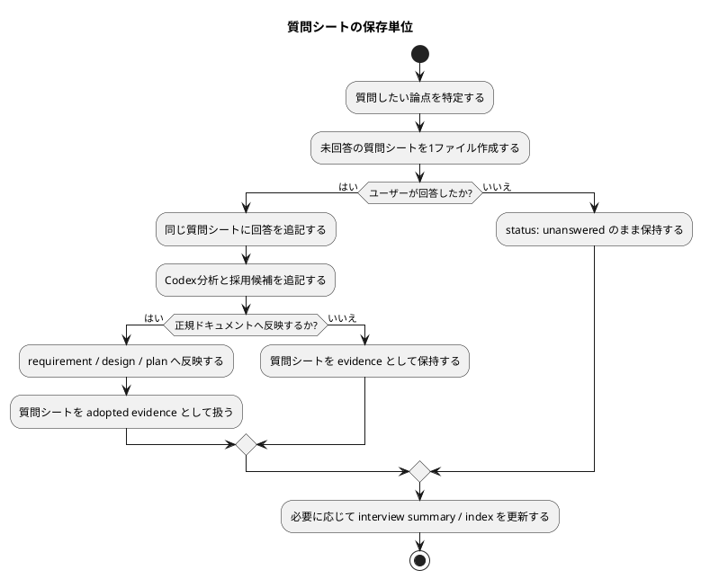

# 質問シート Q-004: 質問シートの保存単位

## 位置づけ

この文書は、ユーザー回答前に作成する未回答の質問シートである。
ユーザー回答を受けた後、この同じ文書に回答、採用判断、要件への含意を追記して完成させる。

## 質問の目的

`grill-with-docs` 型の一問ずつの壁打ち workflow では、質問と回答を record として積み上げる必要がある。

その record をどの粒度のファイルとして保存するかを決める必要がある。

この判断は、次に影響する。

- discussion directory の見通しの良さ
- 1つの質問の追跡しやすさ
- 後から `requirement.md` / `design.md` / `plan.md` に反映するときの採用判断
- template 設計
- 将来 CLI / skill 化したときの出力 contract

## 質問

質問シートは、どの単位で保存したいですか。

## 回答候補

### A. 1問ごとに1ファイル

各質問を独立した `interview` discussion file として保存する。

例:

- `20260528t021116z-interview-question-sheet-artifact-unit.md`
- `20260528t022000z-interview-question-sheet-reflection-rule.md`

利点:

- 1つの質問、回答、判断を追いやすい。
- 未回答 / 回答済み / 採用済みなどの状態管理がしやすい。
- 後から canonical docs へ反映するとき、採用単位が明確。

弱点:

- ファイル数が増える。
- 全体の流れを見るには index / summary が欲しくなる。

### B. 1セッションごとに1ファイル

今回作った `20260528t020135z-interview-grill-scope-and-surfaces.md` のように、複数の質問を1つの interview file に蓄積する。

利点:

- 会話の流れが一つのファイルで読める。
- ファイル数が増えにくい。

弱点:

- 1つの質問だけを採用 / 保留 / 反映する管理がやや難しい。
- 長くなると読みにくい。
- 未回答の質問シートと回答済み記録が混ざりやすい。

### C. 併用する

1問ごとの質問シートを作り、別途 session summary / interview index に流れをまとめる。

利点:

- 個別質問の管理と全体把握を両立できる。
- spec-dock の evidence adoption と相性がよい。
- 将来 CLI / skill 化するときも、単票出力と summary 出力を分けられる。

弱点:

- 作成する artifact が増える。
- summary / index の更新ルールが必要になる。

## Codex の分析

この workflow では、質問前に未回答の質問シートを作り、回答後に同じシートを完成させる。

そのため、質問単位の lifecycle が存在する。

- `unanswered`
- `answered`
- `adopted`
- `deferred`
- `superseded`

この lifecycle をきれいに扱うには、1問ごとに1ファイルの方が強い。

一方で、ユーザーとの会話の流れや大きな論点のまとまりも必要になる。したがって、単票だけではなく summary / index も必要になりうる。

## Codex の推奨案

推奨は **C: 併用する**。

具体的には:

- 1問ごとに質問シートを作成する。
- 質問シートは、回答前は `status: unanswered` とする。
- 回答後は同じファイルにユーザー回答と Codex 分析を追記し、`status: answered` へ更新する。
- 複数質問の流れは、別の interview summary / index artifact にまとめる。
- canonical docs へ反映するときは、質問シート単位で採用判断できるようにする。

## 視覚化

## この回答で決まること

この質問により、interview artifact の基本単位が決まる。

決まる内容:

- 質問シート template の前提
- `discussions/` に作るファイル数と命名方針
- 未回答 / 回答済みの状態管理
- 後から正規ドキュメントへ反映する単位

## ユーザー回答

原則として、一つの質問につき一つのファイルにする。

ただし、ある一つの概念を分析するために複数の質問が必要になることがある。その場合は、複数の質問シートを参照し、それらの回答を取りまとめた中間レポートや上位レポートを作成できるようにする。

質問を積み重ね、より上位の概念を分析する。その議論を積み上げて、最終的に ADR、要件定義書、設計書などへ昇華していく。

質問と要件定義書、質問と設計書の間に中間の分析レポートがあるのは好ましい。

## 回答後に追記する欄

### 採用判断

採用。

質問記録の基本単位は「一つの質問につき一つのファイル」とする。

ただし、単票の質問シートだけで完結させない。複数の質問シートを束ね、上位概念の分析、意思決定、ADR candidate、要件定義書、設計書、計画書への反映に進むための中間レポート / 上位レポートも workflow の一部として認める。

### 要件への含意

- 質問シート template は、一問一ファイルを前提にする。
- 質問シートには、上位レポートから参照できる stable な question id / title / status / source / reflected_to が必要になる。
- 中間レポートは、複数の質問シートを `derived_from` として参照できる必要がある。
- 中間レポートは、質問回答の単なる要約ではなく、より上位の概念分析、意思決定、ADR candidate、canonical docs 反映候補を整理する artifact として扱う。
- 最終的な requirement / design / plan への反映は、質問シート単位だけでなく、中間レポート単位でも採用判断できるようにする。
