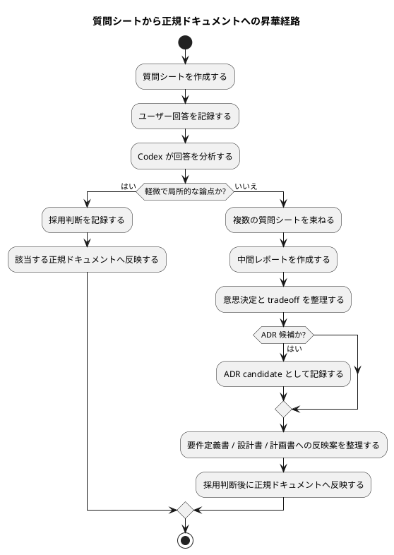

# 質問シート Q-005: 質問シートから正規ドキュメントへの昇華経路

## 位置づけ

この文書は、ユーザー回答前に作成する未回答の質問シートである。
ユーザー回答を受けた後、この同じ文書に回答、採用判断、要件への含意を追記して完成させる。

## 質問の目的

Q-004 で、原則として「一つの質問につき一つのファイル」を採用した。

また、複数の質問シートを参照し、中間レポートや上位レポートを作成し、それらを積み上げて ADR、要件定義書、設計書、計画書へ昇華していく方針も確認した。

次に決めるべきことは、質問シートから正規ドキュメントへ至る昇華経路である。

この判断は、次に影響する。

- 中間レポートの種類
- ADR candidate の扱い
- `requirement.md` / `design.md` / `plan.md` への反映タイミング
- orchestrator と専門 agent の責務分担
- discussion artifact が shadow source-of-truth にならないための採用ルール

## 質問

質問シートから正規ドキュメントへ昇華する流れは、どの形にしたいですか。

## 回答候補

### A. 質問シートから直接 canonical docs へ反映する

質問シートが回答済みになったら、必要に応じて `requirement.md` / `design.md` / `plan.md` へ直接反映する。

利点:

- シンプル。
- 手順が少ない。

弱点:

- 複数質問にまたがる判断や tradeoff が見えにくい。
- 会話途中の回答が早すぎる段階で正規文書に混ざるリスクがある。
- ADR candidate の抽出が弱くなりやすい。

### B. 原則として中間レポートを経由して canonical docs へ反映する

複数の質問シートを束ねて、中間レポート / 上位レポートを作る。
そのレポートで意思決定、採用判断、ADR candidate、正規ドキュメントへの反映候補を整理する。
その後、正規ドキュメントへ反映する。

利点:

- 質問と正規文書の間に分析層を置ける。
- 複数質問をまとめた判断がしやすい。
- ADR candidate や design tradeoff を抽出しやすい。
- evidence adoption の粒度が明確になる。

弱点:

- artifact が増える。
- 軽微な質問でも中間レポートが必要になると重い。

### C. 軽微なものは直接反映、大きな判断は中間レポートを経由する

単純で局所的な回答は、質問シートから直接 canonical docs へ反映できる。
一方、複数質問にまたがる概念、責務境界、ADR candidate、設計 tradeoff、phase owner などは中間レポートを経由する。

利点:

- 軽い論点は速く進められる。
- 重要な判断は分析層を通せる。
- workflow が重すぎず、かつ evidence-first を維持できる。

弱点:

- 「直接反映してよい軽微な論点」と「中間レポートが必要な論点」の判定基準が必要になる。

## Codex の分析

Q-004 の回答では、ユーザーは「質問と要件定義書、質問と設計書の間に中間の分析レポートがあるのは好ましい」と述べている。

これは B または C を支持している。

ただし、すべての質問に必ず中間レポートを要求すると、workflow が重くなりすぎる。たとえば、日本語 default のような単純な方針は、質問シートから requirement に直接反映してもよい可能性がある。

一方、次のようなものは中間レポートを経由した方がよい。

- 複数質問にまたがる概念整理
- issue / epic / initiative をまたぐ責務境界
- orchestrator と専門 agent の役割分担
- skill / template / CLI など複数 surface の product decision
- ADR candidate になりうる不可逆または長期的な判断
- requirement / design / plan の複数 artifact にまたがる反映

## Codex の推奨案

推奨は **C: 軽微なものは直接反映、大きな判断は中間レポートを経由する**。

ただし、判定基準を要件として明文化する。

中間レポート必須の条件:

- 複数の質問シートを根拠にする。
- 複数の正規ドキュメントに影響する。
- issue / epic / initiative の境界に影響する。
- agent の責務境界に影響する。
- ADR candidate になりうる。
- 実装 surface の選択、template 追加、CLI 追加など product decision を含む。

直接反映してよい条件:

- 単一の質問シートで十分に完結している。
- 影響する正規ドキュメントが一つだけである。
- reversible で、ADR candidate ではない。
- tradeoff が小さい。

## 視覚化

## この回答で決まること

この質問により、interview record、intermediate report、ADR、canonical docs の関係が決まる。

決まる内容:

- 中間レポートを必須にする条件
- 直接反映してよい条件
- ADR candidate の抽出場所
- 正規ドキュメントへの反映手順

## ユーザー回答

C を採用する。

軽微なものは直接反映し、大きな判断は中間レポートを経由する。

また、ChatGPT との壁打ちを何度も行った議論の記録は、Markdown として `discussions/` directory に配置し、情報を保全したい。ChatGPT 5.5 Pro の高度な分析が失われるのは望ましくない。すでに取り込まれているのであれば追加作業は不要だが、情報保全は行ってほしい。

## 回答後に追記する欄

### 採用判断

採用。

質問シートから正規ドキュメントへの昇華経路は、次の hybrid model とする。

- 軽微で局所的な論点:
  - 質問シートから直接 canonical docs へ反映してよい。
- 大きな判断:
  - 中間レポート / 上位レポートを経由する。
  - 複数の質問シートや ChatGPT research / discussion records を根拠にする。
  - ADR candidate、要件定義書、設計書、計画書への反映候補を整理する。

ChatGPT との壁打ち記録については、既存の `discussions/` に prompt / response / research / discussion が保存されていることを確認した。

確認済みの関連記録:

- `20260528t004700z-scratch-chatgpt-initial-analysis-prompt.md`
- `20260528t005600z-scratch-chatgpt-initial-analysis-response.md`
- `20260528t005900z-research-chatgpt-mattpocock-integration-patterns.md`
- `20260528t010300z-scratch-chatgpt-skill-design-followup-prompt.md`
- `20260528t011400z-scratch-chatgpt-skill-design-response.md`
- `20260528t011700z-research-spec-dock-requirement-grill-skill-design.md`
- `20260528t012300z-scratch-chatgpt-template-design-followup-prompt.md`
- `20260528t013400z-scratch-chatgpt-template-design-response.md`
- `20260528t013700z-research-requirement-grill-template-design.md`
- `20260528t021000z-scratch-chatgpt-s04-handoff-prompt.md`
- `20260528t021800z-scratch-chatgpt-s04-handoff-response.md`

### 要件への含意

- AC に「軽微な論点は質問シートから直接反映できる」を含める。
- AC に「大きな判断は中間レポート / 上位レポートを経由する」を含める。
- AC に「ChatGPT など外部分析を使った場合は prompt / response / synthesis を `discussions/` に保存する」を含める。
- 中間レポート必須条件を requirement または design に明記する。
- ChatGPT record は、canonical docs へ直接反映せず、research / discussion evidence として採用判断を通す。
