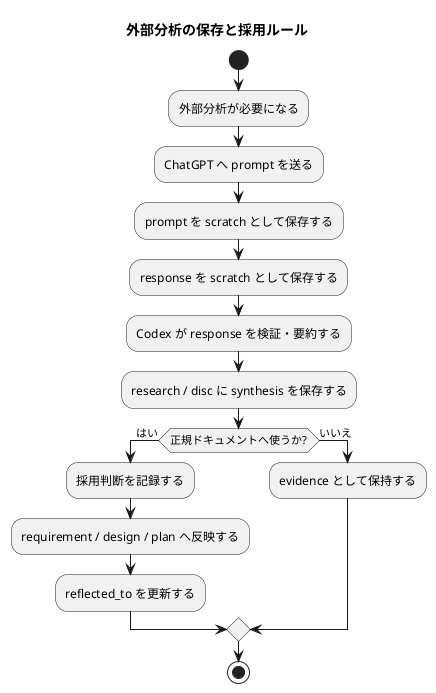

# 質問シート Q-006: ChatGPT など外部分析の保存単位と採用ルール

## 位置づけ

この文書は、ユーザー回答前に作成した質問シートである。
ユーザー回答を受け、この同じ文書に回答、採用判断、要件への含意を追記して完成させた。

## 質問の目的

この issue では、ChatGPT 5.5 Pro の高度な分析を使い、Matt Pocock skills と spec-dock の統合方針を深掘りしている。

ユーザーは、ChatGPT との壁打ち記録や高度な分析が失われることを懸念しており、Markdown として project の `discussions/` に取り込むことを望んでいる。

次に決めるべきことは、外部分析を使った場合に、どの artifact を必ず保存し、どの artifact を canonical docs へ反映する根拠として扱うかである。

この判断は、次に影響する。

- ChatGPT / 外部分析の prompt と response の保存範囲
- raw transcript と synthesis の関係
- 外部分析をそのまま採用してよいか
- `requirement.md` / `design.md` / `plan.md` への reflection rule
- future workflow / skill / CLI の evidence contract

## 質問

ChatGPT など外部分析を使った場合、どの保存・採用ルールにしたいですか。

## 回答候補

### A. raw prompt / raw response / synthesis をすべて保存する

外部分析を使った場合は、最低限次を保存する。

- prompt
- response
- Codex による synthesis / analysis
- 採用判断

利点:

- 情報が失われにくい。
- 後から分析経路を監査しやすい。
- ChatGPT の詳細な reasoning / recommendation を後から再利用しやすい。

弱点:

- ファイル数が増える。
- raw response が長くなる。
- 外部出力を保存する際の privacy / secret / license に注意が必要。

### B. synthesis / analysis のみ保存する

raw prompt / raw response は保存せず、Codex が要点をまとめた research / discussion だけを保存する。

利点:

- 読みやすい。
- ファイル数とノイズを減らせる。

弱点:

- ChatGPT の詳細な分析が失われる。
- 後から「なぜその結論になったか」を追いにくい。
- Codex の要約ミスを検証しにくい。

### C. 重要度で分ける

重要な外部分析では raw prompt / raw response / synthesis をすべて保存する。
軽微な外部分析では synthesis / analysis のみでもよい。

利点:

- 重要な分析は保全できる。
- 軽微な調査で artifact が増えすぎることを避けられる。

弱点:

- 何を「重要」とするかの判定基準が必要になる。

## Codex の分析

この issue では、外部分析は単なる補助ではなく、要件・設計判断の前段として重い役割を持っている。

特に次のような場合、raw prompt / raw response を残す価値が高い。

- ChatGPT 5.5 Pro など、外部の高度な分析能力を明示的に使った。
- product direction や workflow design に影響する。
- 後から requirement / design / plan へ反映する可能性がある。
- ユーザーが「完全な理解」「詳細な分析」「情報保全」を求めている。
- その回答が中間レポートや ADR candidate の根拠になる。

一方で、軽微な言い換え、短い比較、単発の補助分析まで raw response 保存を必須にすると workflow が重くなる。

## Codex の推奨案

推奨は **C: 重要度で分ける**。

ただし、この issue のように要件・設計・計画に影響する外部分析では、原則として raw prompt / raw response / synthesis / adoption decision をすべて保存する。

保存単位の推奨:

- `scratch-*prompt.md`: ChatGPT に送った prompt。
- `scratch-*response.md`: ChatGPT から得た raw response または実質的に等価な抽出。
- `research-*`: Codex が検証・整理した synthesis。
- `disc-*`: 採用判断、選択肢、tradeoff、反映候補。
- `interview-*`: ユーザーへの質問シートと回答。

採用ルール:

- ChatGPT response はそのまま canonical ではない。
- Codex が source / local context / user answer と照合し、research / disc / interview 上で採用判断する。
- canonical docs へ反映する場合は、どの external analysis artifact から採用したかを `derived_from` / `reflected_to` / report ledger で追跡する。

## 視覚化

## この回答で決まること

この質問により、外部分析を使う workflow の evidence contract が決まる。

決まる内容:

- raw prompt / raw response を保存する条件
- synthesis / research / discussion の役割
- ChatGPT response を canonical docs へ反映する前の採用判断
- 情報保全と artifact 増加の tradeoff

## ユーザー回答

ユーザーは **C: 重要度で分ける** を採用した。

ただし、今回のように重要な外部分析を行う場合は、原則として prompt / input と response / output をすべて残す方針である。
入力情報と出力結果を可能な限り完全に残すことで、外部分析の詳細、判断の根拠、後からの再利用可能性を失わないようにする。

また、ユーザーは、この情報の取り扱いや記録方法は `chatgpt-use` skill 側で定義する性質も強いと見ている。
そのため、`spec-dock` の要件に織り込むべきことがあれば織り込みつつ、ChatGPT 操作や記録の具体的な運用は `chatgpt-use` skill 側の責務として整理する余地がある。

## 回答後に追記する欄

### 採用判断

採用判断は **C: 重要度で分ける**。

ただし、重要な外部分析については C の中でも強い既定値を採用する。
要件、設計、計画、ADR、または issue / epic / initiative の意思決定に影響する外部分析では、原則として次をすべて保存する。

- 外部分析へ渡した prompt / input
- 外部分析から得た raw response / output
- Codex による synthesis / analysis
- ユーザー回答または Codex による採用判断
- canonical docs へ反映した場合の `reflected_to` または同等の追跡情報

軽微な補助分析、短い言い換え、単発の比較など、正規ドキュメントや意思決定に実質的な影響を持たないものについては、synthesis / analysis のみでも許容できる。
ただし、今回の issue のように product workflow の要件定義に関わるものは重要分析として扱う。

### 要件への含意

`spec-dock` 側の要件には、外部分析を使った場合の evidence contract を含める必要がある。

要件として含めるべきこと:

- 外部分析を canonical docs の根拠に使う場合、prompt / response / synthesis / adoption decision を保存する。
- 外部分析の raw output は canonical docs そのものではなく、検討材料として扱う。
- Codex は raw output を user answer、local context、既存 docs と照合し、採用判断を明示する。
- requirement / design / plan / ADR へ反映する場合は、根拠 artifact を追跡できるようにする。
- 重要度に応じて保存粒度を変えられるが、重要分析では full retention を原則にする。

一方で、`spec-dock` が直接持ちすぎない方がよいこと:

- ChatGPT Web をどのように開くか。
- Chrome / browser automation の詳細。
- ChatGPT Project や thread の操作手順。
- raw prompt / raw response を取得する具体的な UI 操作。
- `chatgpt-use` skill 固有の polling、cleanup、session handling。

したがって、`spec-dock` は evidence contract と canonical docs への反映ルールを定義し、`chatgpt-use` は ChatGPT 操作と raw capture の実行手順を定義する、という責務分担を次に確認する。
