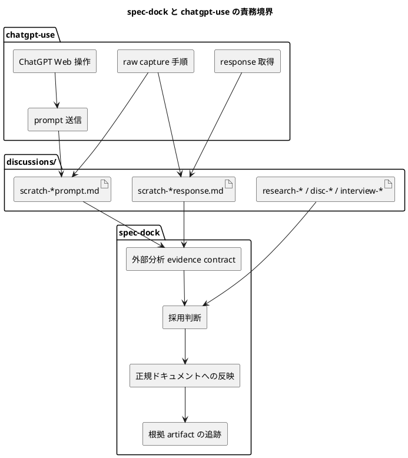

# 質問シート Q-007: `spec-dock` と外部ツールの責務境界

## 位置づけ

この文書は、ユーザー回答前に作成した質問シートである。
ユーザー回答を受け、この同じ文書に回答、採用判断、要件への含意を追記して完成させた。

## 質問の目的

Q-006 では、ChatGPT などの外部分析を使う場合、重要な分析では prompt / input、response / output、Codex の synthesis、採用判断を保存する方針を確認した。

一方で、ユーザーは、この保存や記録の具体的な取り扱いは `chatgpt-use` skill 側で定義する性質も強いと指摘した。

次に決めるべきことは、`spec-dock` がどこまでを要件として持ち、`chatgpt-use` がどこからを実行手順として持つかである。

この判断は、次に影響する。

- `spec-dock` の要件定義に含める外部分析 evidence contract
- `chatgpt-use` skill に期待する raw capture / session 操作
- canonical docs へ反映する前の adoption rule
- 将来の skill / workflow / CLI が参照する責務境界
- spec-dock が ChatGPT 固有実装に依存しすぎるリスク

## 質問

`spec-dock` と `chatgpt-use` の責務境界を、どのように定義したいですか。

## 回答候補

### A. `spec-dock` が ChatGPT 操作の詳細まで定義する

`spec-dock` の要件として、ChatGPT Web の操作、Chrome の開き方、thread の作り方、prompt / response の取得手順まで定義する。

利点:

- spec-dock だけ読めば workflow 全体を理解しやすい。
- 実行手順まで強く標準化できる。

弱点:

- `spec-dock` が ChatGPT Web や Chrome の UI 変更に引きずられる。
- `chatgpt-use` skill との責務が重複する。
- 外部分析 provider が ChatGPT 以外になったときに拡張しにくい。

### B. `chatgpt-use` がすべてを持ち、`spec-dock` は参照だけする

ChatGPT 操作だけでなく、保存粒度、採用判断、canonical docs への反映条件まで `chatgpt-use` 側に寄せ、`spec-dock` は外部分析を使えるとだけ記述する。

利点:

- `spec-dock` は軽く保てる。
- ChatGPT 固有の運用変更は `chatgpt-use` 側に閉じ込められる。

弱点:

- spec-dock の requirement / design / plan の根拠管理が弱くなる。
- 外部分析を canonical docs に反映する条件が spec-dock 側から見えにくい。
- ChatGPT 以外の外部分析を使った場合の evidence contract が曖昧になる。

### C. 責務を分ける

`spec-dock` は、外部分析を意思決定や canonical docs の根拠に使うための evidence contract と adoption / reflection rule を定義する。
`chatgpt-use` は、ChatGPT Web の操作、prompt / response の取得、session handling、raw capture の具体的手順を定義する。

利点:

- `spec-dock` は provider 非依存の要件として整理できる。
- `chatgpt-use` は ChatGPT 固有の実行手順に集中できる。
- canonical docs の根拠管理は spec-dock 側で保てる。
- 将来、ChatGPT 以外の外部分析 provider を使う場合にも拡張しやすい。

弱点:

- 2 つの skill / workflow 間の接続点を明文化する必要がある。
- `chatgpt-use` 側に必要な改善が見つかった場合、別 issue / 別 skill 更新として扱う必要がある。

## Codex の分析

`spec-dock` が本来守るべきものは、要件、設計、計画、ADR、issue / epic / initiative の意思決定がどの根拠から作られたかを追跡できることである。
つまり、外部分析を使う場合でも、必要なのは ChatGPT 固有の UI 操作ではなく、artifact と判断の traceability である。

一方で、`chatgpt-use` は ChatGPT Web を外部作業面として使うための skill である。
Chrome の操作、ChatGPT Project の扱い、prompt 送信、response 取得、session cleanup、raw capture の運用は、`chatgpt-use` の責務として定義する方が自然である。

したがって、両者は次のように分けると理解しやすい。

- `spec-dock`: 「外部分析を根拠にするなら何を残し、どう採用し、どこへ反映したか」
- `chatgpt-use`: 「ChatGPT Web からその根拠 artifact をどう取得し、どう保存可能な形にするか」

この分担なら、`spec-dock` は ChatGPT 固有の操作に依存せず、外部分析 evidence の品質基準を持てる。
また、`chatgpt-use` 側の記録規約が改善された場合でも、`spec-dock` 側はその artifact を受け取って traceability を維持できる。

## Codex の推奨案

推奨は **C: 責務を分ける**。

推奨する境界:

- `spec-dock` は provider 非依存の evidence contract を定義する。
- `spec-dock` は external analysis artifact を canonical docs へ反映する adoption / reflection rule を定義する。
- `spec-dock` は raw external output を canonical docs と同一視しない。
- `chatgpt-use` は ChatGPT Web の操作と raw capture 手順を定義する。
- `chatgpt-use` は prompt / response の保存に必要な実行上の注意を定義する。
- 両者の接続点は、`discussions/` に保存される `scratch-*prompt.md`、`scratch-*response.md`、`research-*`、`disc-*`、`interview-*` などの artifact とする。

この issue の要件には、`spec-dock` 側の責務として次を織り込むのがよい。

- 外部分析 evidence を使う場合の保存対象。
- 外部分析を採用する前の検証と採用判断。
- canonical docs への反映時の traceability。
- ChatGPT 固有操作は `chatgpt-use` 側の詳細として扱うという境界。

## 視覚化

## この回答で決まること

この質問により、外部分析 evidence をめぐる `spec-dock` と `chatgpt-use` の境界が決まる。

決まる内容:

- `spec-dock` の要件に含める範囲
- `chatgpt-use` skill 側に委ねる範囲
- `discussions/` artifact を両者の接続点として扱うか
- ChatGPT 固有実装と spec-dock の provider 非依存要件を分離するか

## ユーザー回答

完全に責任を分ける。

`spec-dock` と `chatgpt-use` は全く別の skill / tool である。
`spec-dock` の作業の一部として、ユーザーが明示的に指示した場合に外部分析を使うことはあり得る。
しかし、それは `spec-dock` の一部ではなく、別ツールを使った補助作業である。

したがって、`spec-dock` の要件定義において `chatgpt-use` を名指しで定義する必要はない。
`chatgpt-use` の操作方法、責務、保存規約、実行手順について、今回の `spec-dock` 側の要件でこれ以上分析・議論する必要もない。

また、質問が本筋からずれて細かくなっているため、議論を `spec-dock` の Matt Pocock / grill-style skill 導入の本筋へ戻す。
未確認事項が残っていなければ、要件定義書の作成へ進む。

## 回答後に追記する欄

### 採用判断

採用。

ただし、当初の選択肢 C のうち、`spec-dock` と `chatgpt-use` の接続点を明文化する方向は弱める。
正確には、次の方針とする。

- `spec-dock` は `chatgpt-use` を前提にしない。
- `spec-dock` の要件定義では `chatgpt-use` を名指しの構成要素として扱わない。
- 外部分析は、ユーザーが明示的に指示した場合に使われる補助手段として扱う。
- 外部分析を使って作成された discussion / research artifact がある場合、`spec-dock` はそれを通常の evidence artifact として扱える。
- 外部ツール固有の操作、保存手順、運用規約は `spec-dock` の要件外とする。

### 要件への含意

`requirement.md` では、`chatgpt-use` について言及しない。

一方で、外部分析や外部支援によって作成された `discussions/` artifact を evidence として扱えることは、tool 非依存の形で要件に含めてもよい。
ただし、要件の中心はあくまで次に戻す。

- Matt Pocock `grill-with-docs` の本質を spec-dock へ取り込む。
- 一問ずつユーザーと壁打ちし、完全な理解へ近づける。
- 質問前に質問シートを作成し、回答後に同じシートを完成させる。
- 質問、回答、分析、採用判断を `discussions/` に記録する。
- 複数の質問シートを中間レポートへまとめ、必要に応じて ADR / requirement / design / plan へ昇華する。
- 要件定義は orchestrator がユーザーと行い、設計・計画は専門 agent が分析する。ただし人間ユーザーへの質問は orchestrator が取りまとめて一つずつ行う。

この回答により、`chatgpt-use` に関する追加質問は打ち切り、要件定義書作成へ進む。
