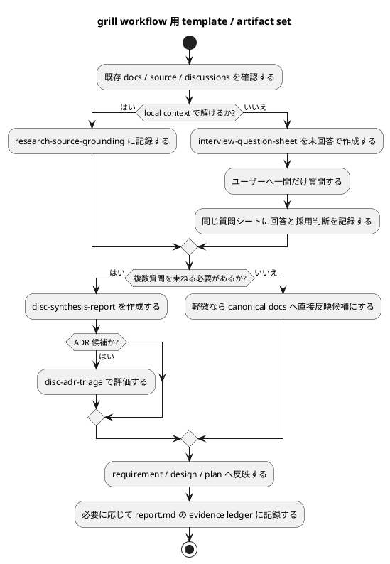

# 質問シート Q-008: grill workflow 用 template / artifact set の追加範囲

## 位置づけ

この文書は、ユーザー回答前に作成した質問シートである。
ユーザー回答を受け、この同じ文書に回答、採用判断、要件への含意を追記して完成させた。

## 質問の目的

ここまでの議論で、次の方針は決まっている。

- 一問一答形式で質問シートを作る。
- 原則として一つの質問につき一つの file にする。
- 質問前に未回答シートを作成し、回答後に同じ file を完成させる。
- 複数の質問シートを中間レポート / 上位レポートへ束ねる。
- 大きな判断は中間レポートを経由して ADR candidate や canonical docs へ昇華する。

一方で、既存の spec-dock template catalog は主に次で構成されている。

- `discussions/scratch.md`
- `discussions/interview.md`
- `discussions/research.md`
- `discussions/disc.md`
- `discussions/adr.md`
- issue / epic / initiative の `report.md`

既存 `interview.md` は複数質問を扱える汎用 interview record として読めるため、今回の一問一答式 workflow にはそのままでは合わない可能性がある。

次に決めるべきことは、grill workflow 用にどの template / artifact 概念を正式に追加または再設計するかである。

## 質問

grill workflow 用の template / artifact set は、どの範囲で正式化したいですか。

## 回答候補

### A. 既存 template を最小修正する

既存の `interview.md` を一問一答形式へ寄せ、`research.md`、`disc.md`、`adr.md`、`report.md` は既存のまま使う。

追加する概念は最小限にする。

利点:

- 変更範囲が小さい。
- 既存 catalog を増やさずに済む。
- 初期実装が軽い。

弱点:

- 汎用 interview と grill 質問シートの役割が混ざる。
- 中間レポートや ADR candidate triage の shape が揺れやすい。
- 「一問一答式」という今回の本質が template catalog 上で見えにくい。

### B. grill workflow 用の小さな専用 artifact set を追加する

既存 template catalog を尊重しつつ、grill workflow に必要なものだけを専用 template / guidance として追加する。

想定する artifact set:

- `interview-question-sheet`
  - 一問一答形式の質問シート。
  - 未回答状態と回答済み状態を同じ file で扱う。
- `research-source-grounding`
  - ユーザーに聞く前に、docs / code / tests / discussions で何を確認したかを記録する。
- `disc-synthesis-report`
  - 複数の質問シートを束ね、上位概念、選択肢、tradeoff、採用判断を整理する。
- `disc-adr-triage`
  - final ADR ではなく、ADR candidate かどうかを評価する。
- 既存 `report.md`
  - canonical docs へ反映した採用結果や evidence ledger として使う。新しい discussion artifact にはしない。

利点:

- 一問一答式 workflow の本質が template として明確になる。
- 中間レポート / 上位レポート / ADR candidate の shape を安定させられる。
- 既存 `research` / `disc` / `adr` / `report` の考え方と接続しやすい。
- 大規模な CLI 改修を前提にしなくても、template / skill guidance から導入できる。

弱点:

- template catalog が少し増える。
- 既存 `interview.md` との関係を明確にする必要がある。
- `new doc` などの template discovery と接続するかは設計で決める必要がある。

### C. grill workflow を新しい正式 workflow として大きく追加する

一問一答、source-grounding、中間レポート、ADR triage、canonical reflection を、すべて新しい workflow / CLI / template catalog として正式追加する。

想定する追加:

- 専用 CLI command。
- 専用 skill。
- 専用 template catalog。
- workflow docs の大幅更新。
- artifact lifecycle の明示的な状態遷移。

利点:

- product feature として強く定義できる。
- 将来の自動化や CLI integration に進みやすい。

弱点:

- 今回の issue としては scope が大きくなりやすい。
- 要件定義前に実装設計へ踏み込みすぎる。
- 既存 workflow との整合確認が重くなる。

## Codex の分析

ユーザーのこれまでの回答から、grill workflow は単なる `interview.md` の使い方ではなく、spec-dock に新しい作業概念を導入するものとして扱う方が自然である。

特に新しい概念は次である。

- 回答前に存在する「未回答の質問シート」。
- 回答後に同じ file が完成する「回答済み質問シート」。
- 複数の質問シートを束ねる「中間レポート / 上位レポート」。
- ADR そのものではなく ADR 化すべきかを判定する「ADR candidate triage」。
- canonical docs へ反映する前の「採用判断 / reflection rule」。

既存の `interview.md` は人間への質問記録として近いが、複数質問を含められる汎用 record として残すと、一問一答式の lifecycle が曖昧になりやすい。
一方で、いきなり CLI command や完全な workflow engine まで追加すると、要件定義段階としては広がりすぎる。

そのため、最初は専用 artifact set を小さく定義し、CLI integration は設計または後続 issue で判断するのがよい。

## Codex の推奨案

推奨は **B: grill workflow 用の小さな専用 artifact set を追加する**。

推奨する整理:

- 既存 `interview.md` は汎用 interview record として残すか、互換用途として扱う。
- grill workflow では `interview-question-sheet` を標準 template とする。
- ユーザーに聞く前の確認は `research-source-grounding` に分ける。
- 複数質問から上位判断を作る場合は `disc-synthesis-report` を使う。
- ADR 候補の評価は `disc-adr-triage` とし、final ADR とは分離する。
- issue / epic / initiative の `report.md` は、実装中の観測証跡や採用 ledger として既存責務を維持する。

この方針なら、今回の要件に「新しい概念と template を追加する」ことを明確に含めつつ、具体的な file path、frontmatter、CLI catalog 追加範囲は design で決められる。

## 視覚化

## この回答で決まること

この質問により、設計で具体化する template / artifact set の前提が決まる。

決まる内容:

- 既存 `interview.md` を差し替えるのか、汎用として残すのか。
- 一問一答式の質問シートを専用 template として追加するか。
- source-grounding、中間レポート、ADR triage を専用 artifact として扱うか。
- `report.md` を新しい中間レポートとして使うのか、既存の evidence ledger として維持するのか。
- CLI integration まで今回の scope に含めるか、設計または後続 issue に残すか。

## ユーザー回答

ユーザーは **B: grill workflow 用の小さな専用 artifact set を追加する** を採用した。

ただし、補足として、専用 artifact をむやみに増やすのではなく、既存 workflow と組み合わせられる共通 template / 共通 artifact として整理したい。

ユーザーの意図:

- 既存の半自動 workflow は維持する。
- grill workflow は skill として定義し、ユーザーが指示した場合に徹底的に追求・分析する workflow として使えるようにする。
- grill workflow は単独でも使えるし、既存 workflow と組み合わせても使える。
- すべての作業が徹底的な user interview を必要とするわけではない。
- 簡単に済ませられる仕事も多いため、grill workflow は常時強制ではなく、必要な場面で呼び出せる位置づけにする。
- template は workflow ごとに似たものを重複追加するのではなく、共通化しておきたい。
- 既存の複数質問型 interview sheet は不要であり、一問一答形式へ差し替えるのがよい。
- ADR は grill 専用ではなく、共通 template として利用したい。
- template は主に coding agent が作成・利用するため、人間向けの読みやすさだけでなく、agent がデータをまとめやすい構造を重視する。

## 回答後に追記する欄

### 採用判断

採用。

ただし、Q-008 の当初の B 案は「grill workflow 用の専用 artifact set を追加する」と表現していたが、ユーザー回答により、次のように補正する。

- skill / workflow の入口は分ける。
- template / artifact は可能な限り共通化する。
- 既存 `interview.md` は複数質問型のまま残すのではなく、一問一答形式へ再設計する方向で扱う。
- `research` は source-grounding を表現できる共通 template として強化する。
- `disc` は synthesis / decision report を表現できる共通 template として強化する。
- `adr` は grill 専用の triage template を別に増やすのではなく、共通 ADR への昇格前判断を `disc` または中間レポートで扱う方向を検討する。
- `report.md` は既存の evidence ledger / observed evidence の責務を維持する。
- 追加 template は、本当に既存 template では表現できない場合だけにする。

### 要件への含意

要件には、次の補正を反映する必要がある。

- grill workflow は既存 workflow を置き換えるものではなく、単独利用も組み合わせ利用もできる optional / composable skill workflow とする。
- すべての作業で grill workflow を強制しない。
- template catalog は重複を避け、共通 template として再設計する。
- 既存の複数質問型 `interview` template は、一問一答型の質問シート template へ差し替える。
- `research`、`disc`、`adr`、`report` は grill 専用 variant を増やす前に、共通 template として拡張・整理できるかを優先する。
- template の primary consumer は coding agent であるため、frontmatter、status、derived_from、reflected_to、adoption_status、question_id など、agent が扱いやすい構造化要素を重視する。
