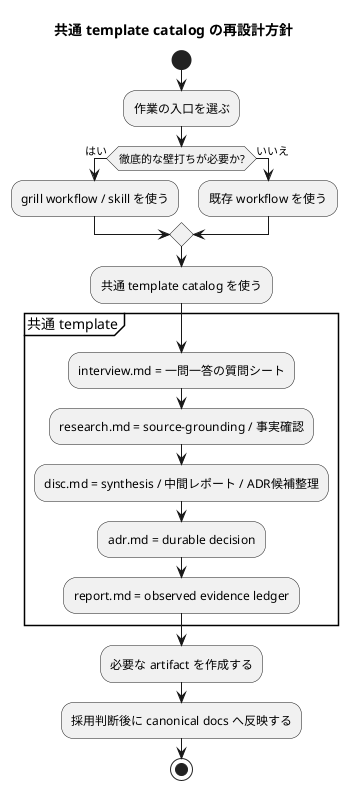

# 質問シート Q-009: 共通 template catalog の再設計方針

## 位置づけ

この文書は、ユーザー回答前に作成した質問シートである。
ユーザー回答を受け、この同じ文書に回答、採用判断、要件への含意を追記して完成させた。

## 質問の目的

Q-008 では、grill workflow を既存 workflow から独立した入口として使えるようにしつつ、既存 workflow と組み合わせられる composable skill workflow として扱う方針を確認した。

同時に、template は workflow ごとに似たものを重複追加するのではなく、共通化しておきたいという方針も確認した。

既存の `interview.md` は複数質問型であり、今回の「一問につき一ファイル」「質問前に未回答シートを作る」方式とは合わない。
一方で、`research`、`disc`、`adr`、`report` は既存概念としてすでに存在するため、grill 専用 variant を増やしすぎると catalog が複雑になる。

次に決めるべきことは、共通 template catalog をどのように再設計するかである。

## 質問

共通 template catalog は、どの方針で再設計したいですか。

## 回答候補

### A. 既存 template を残し、grill 専用 template を横に追加する

既存 `interview.md`、`research.md`、`disc.md`、`adr.md` はそのまま残す。
その横に、grill 専用の `interview-question-sheet`、`research-source-grounding`、`disc-synthesis-report`、`disc-adr-triage` を追加する。

利点:

- 既存 template を壊さない。
- grill workflow の専用 shape を明確にできる。

弱点:

- 似た template が増える。
- agent がどちらを使うべきか迷いやすい。
- simplicity が下がる。
- ユーザーの「共通化したい」という意図とややずれる。

### B. 既存 template を共通 template として再設計する

既存 catalog を維持しつつ、各 template の役割を grill workflow にも使えるよう再定義する。

想定する整理:

- `interview.md`
  - 複数質問型をやめ、一問一答形式の質問シートへ差し替える。
  - 未回答状態と回答済み状態を同じ file で扱う。
- `research.md`
  - source-grounding、事実確認、外部根拠、未検証事項を記録する共通 template として強化する。
- `disc.md`
  - 複数 artifact を束ねる synthesis、選択肢比較、採用判断、中間レポートを扱う共通 template として強化する。
- `adr.md`
  - final ADR / durable decision の共通 template として維持する。
  - ADR candidate triage は `disc.md` の中で扱い、必要な場合だけ `adr.md` へ昇格する。
- `report.md`
  - 実装中・運用中の observed evidence ledger として維持する。

利点:

- template catalog が増えすぎない。
- 既存 workflow と grill workflow が同じ artifact language を共有できる。
- coding agent が使う template の選択が単純になる。
- simplicity を保ちやすい。

弱点:

- 既存 `interview.md` の互換性をどう扱うかを決める必要がある。
- `disc.md` が synthesis / decision / ADR triage を担うため、section 設計を丁寧にする必要がある。

### C. template は最小限だけ直し、詳細は skill guidance に寄せる

既存 `interview.md` だけ一問一答へ修正し、`research`、`disc`、`adr`、`report` は大きく変えない。
grill workflow の詳細は skill 側に書く。

利点:

- template 変更は最小限にできる。
- 実装範囲が小さい。

弱点:

- skill を読まない agent が同じ artifact shape を再現しにくい。
- 中間レポート / 上位レポート / adoption rule の共通性が弱くなる。
- template catalog 側に workflow の学習が残りにくい。

## Codex の分析

ユーザーの補足では、次の価値が強調されている。

- 既存 workflow は維持する。
- grill workflow は optional / composable な skill workflow にする。
- 何でも徹底的に議論するわけではない。
- template は共通化し、似たものを増やしすぎない。
- template は coding agent が扱いやすい構造にする。
- 複数質問型 interview sheet は不要で、一問一答形式へ差し替える。
- ADR は共通化したい。

この条件を満たすのは B である。

A は grill workflow の独立性は高いが、template の重複が増える。
C は変更範囲は小さいが、今回追加したい中間レポートや adoption / reflection の概念が skill 内に閉じやすい。

B なら、workflow / skill の入口は分けつつ、artifact language は共通化できる。
これは spec-dock の既存思想である「discussion artifacts を canonical docs の前段 evidence として扱う」こととも合う。

## Codex の推奨案

推奨は **B: 既存 template を共通 template として再設計する**。

推奨する requirement への反映:

- grill workflow は optional / composable skill workflow とする。
- template catalog は grill 専用 variant をむやみに増やさず、既存 `interview` / `research` / `disc` / `adr` / `report` を共通 artifact として再設計する。
- `interview.md` は複数質問型から一問一答型へ差し替える。
- `disc.md` は中間レポート / 上位レポート / synthesis / ADR candidate triage を扱えるようにする。
- `adr.md` は final ADR の共通 template として維持する。
- `report.md` は observed evidence ledger として維持し、中間レポートの代替にはしない。
- 各 template は人間向け文章だけでなく、coding agent が処理しやすい frontmatter、status、id、derived_from、reflected_to、adoption fields を持つ。

## 視覚化

## この回答で決まること

この質問により、template を「grill 専用に増やす」のか、「既存 catalog を共通化して再設計する」のかが決まる。

決まる内容:

- 既存 `interview.md` を一問一答へ差し替えるか。
- `research.md` / `disc.md` / `adr.md` / `report.md` を共通 template として維持・拡張するか。
- ADR candidate triage を専用 template にするか、`disc.md` で扱うか。
- report を中間レポートとして使うか、observed evidence ledger として維持するか。
- template の主な利用者を coding agent として構造化要素を重視するか。

## ユーザー回答

ユーザーは **B: 既存 template を共通 template として再設計する** を採用した。

既存の template を再設計し、共通 template として使えるようにする。
そのうえで、足りない doc type / template があれば追加する。

ユーザーの補足:

- `research` は共通 template として扱う。
- `interview` も共通 template として扱う。
- `disc` も共通 template として扱う。
- ADR も共通 template として扱う。
- 既存 template では表現しきれない追加 document type が必要なら、その template を追加する。
- grill 専用の重複 template を増やすのではなく、共通 template catalog として整理する。

## 回答後に追記する欄

### 採用判断

採用。

template catalog は、grill workflow 専用 variant を横に増やすのではなく、既存 `interview` / `research` / `disc` / `adr` / `report` を共通 template として再設計する。

採用する基本方針:

- `interview.md` は一問一答形式の質問シートへ差し替える。
- `research.md` は source-grounding、事実確認、外部根拠、未検証事項を扱える共通 template として強化する。
- `disc.md` は synthesis、中間レポート、上位レポート、選択肢比較、採用判断、ADR candidate triage を扱える共通 template として強化する。
- `adr.md` は final ADR / durable decision の共通 template として維持する。
- `report.md` は observed evidence ledger として維持する。
- これらで表現できない document type が明確に必要な場合だけ、追加 template を設計する。

### 要件への含意

要件には、次を反映する。

- grill workflow は、共通 template catalog を使う optional / composable skill workflow とする。
- 既存 template は共通 template として再設計する。
- template は workflow ごとに重複させず、agent が選びやすい catalog を維持する。
- 足りない doc type / template がある場合だけ追加する。
- 追加 template の必要性は、既存 `interview` / `research` / `disc` / `adr` / `report` で表現できない責務があるかどうかで判断する。
