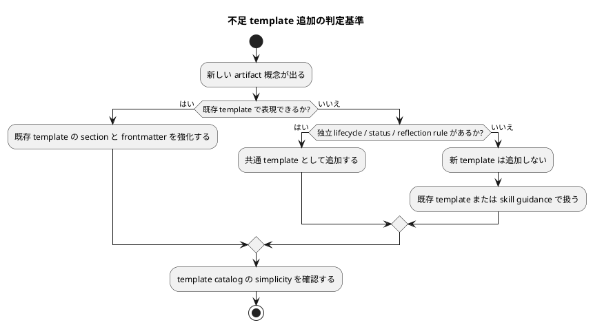

# 質問シート Q-010: 不足 template を追加する判定基準

## 位置づけ

この文書は、ユーザー回答前に作成した質問シートである。
ユーザー回答を受け、この同じ文書に回答、採用判断、要件への含意を追記して完成させた。

## 質問の目的

Q-009 では、既存 `interview` / `research` / `disc` / `adr` / `report` を共通 template として再設計する方針を採用した。
また、足りない doc type / template があれば追加する方針も確認した。

次に決めるべきことは、「足りない template」と判断する基準である。

この基準がないと、次のどちらにも寄りすぎる可能性がある。

- 何でも既存 template に押し込み、`disc.md` や `research.md` が肥大化する。
- 似た template を追加しすぎ、agent がどれを使うべきか迷う。

## 質問

不足 template は、どの基準で追加したいですか。

## 回答候補

### A. 原則として追加しない

既存 `interview` / `research` / `disc` / `adr` / `report` の再設計だけで対応する。
新しい template は今回の issue では追加しない。

利点:

- catalog が最もシンプルになる。
- 実装範囲が小さい。
- 既存 workflow との互換性を保ちやすい。

弱点:

- `disc.md` に中間レポート、上位レポート、ADR candidate triage、reflection proposal が集中しすぎる可能性がある。
- agent が section を使い分ける負担が増える。

### B. 明確に独立した lifecycle を持つものだけ追加する

既存 template で表現できない、独立した lifecycle / status / reflection rule を持つものだけを追加する。

追加候補の例:

- `reflection.md`
  - discussion artifacts から canonical docs へ何を反映したかを記録する。
  - ただし既存 `report.md` の evidence ledger と重複するなら追加しない。
- `synthesis.md`
  - 複数の questions / research / discussions を束ねる上位分析。
  - ただし `disc.md` の再設計で十分なら追加しない。

利点:

- template 追加に明確な基準を持てる。
- catalog の肥大化を避けながら、必要な doc type は追加できる。
- agent が「lifecycle が違うなら別 template」と判断しやすい。

弱点:

- 設計で lifecycle / status / reflection rule をきちんと整理する必要がある。

### C. agent の使いやすさを優先し、用途ごとに追加する

agent が迷わないよう、用途ごとに template を細かく分ける。

追加候補の例:

- `interview-question-sheet.md`
- `research-source-grounding.md`
- `disc-synthesis-report.md`
- `disc-adr-triage.md`
- `reflection-report.md`

利点:

- agent が用途に合わせて template を選びやすい。
- 各 template の section を短くできる。

弱点:

- catalog が増える。
- 似た template が増え、共通化の方針と衝突しやすい。
- 既存 workflow と grill workflow の artifact language が分かれやすい。

## Codex の分析

ユーザーは、共通化と simplicity を重視している。
また、template は主に coding agent が作成・利用するものなので、agent が構造化しやすいことも重要である。

この二つは一見 tension がある。

- 共通化を強めると、template 数は減るが一つの template が多用途になる。
- 用途別に分けると、template は使いやすくなるが catalog が増える。

この tension を解くには、「用途が違う」だけでは template を増やさず、「lifecycle が違う」「status が違う」「canonical docs への反映ルールが違う」場合にだけ template を増やす、という基準がよい。

たとえば、ADR は durable decision という独立 lifecycle を持つため共通 template として残す価値がある。
一方、ADR candidate triage は final decision ではなく、選択肢比較や採用判断の一部なので `disc.md` に含める方が自然である。

同様に、中間レポート / 上位レポートは `disc.md` の拡張で扱える可能性が高い。
ただし、canonical docs への反映結果を長期的に追跡する専用 ledger が `report.md` で足りない場合だけ、別 template を検討する余地がある。

## Codex の推奨案

推奨は **B: 明確に独立した lifecycle を持つものだけ追加する**。

推奨する判定基準:

- 既存 `interview` / `research` / `disc` / `adr` / `report` で表現できるなら追加しない。
- 独立した lifecycle / status / reflection rule が必要なら追加を検討する。
- 単なる section の違い、用途名の違い、workflow の入口の違いだけでは追加しない。
- 追加する場合も、grill 専用ではなく共通 template として追加する。

初期設計の仮説:

- `interview.md`: 一問一答の質問シート。
- `research.md`: source-grounding / 事実確認。
- `disc.md`: synthesis / 中間レポート / 上位レポート / ADR candidate triage。
- `adr.md`: final ADR。
- `report.md`: observed evidence ledger。
- 新規追加は、設計で `report.md` では不足する reflection ledger が必要と確認された場合だけ検討する。

## 視覚化

## この回答で決まること

この質問により、template catalog を増やす基準が決まる。

決まる内容:

- 追加 template を避けるのか、条件付きで追加するのか。
- 追加判断を用途別にするのか、lifecycle / status / reflection rule 別にするのか。
- `disc.md` が担う範囲。
- `report.md` で reflection ledger まで足りるか、別 template 検討を残すか。

## ユーザー回答

ユーザーは **B: 明確に独立した lifecycle を持つものだけ追加する** を採用した。

## 回答後に追記する欄

### 採用判断

採用。

template 追加の判定基準は、独立した lifecycle / status / reflection rule を持つかどうかとする。

採用する基準:

- 既存 `interview` / `research` / `disc` / `adr` / `report` で表現できるなら追加しない。
- 単なる用途名の違い、section の違い、workflow の入口の違いだけでは template を増やさない。
- 既存 template に押し込むと lifecycle、status、canonical docs への反映ルールが曖昧になる場合だけ追加する。
- 追加する場合も、grill 専用ではなく共通 template として追加する。

### 要件への含意

要件には、次を反映する。

- 不足 template は、独立した lifecycle / status / reflection rule が必要な場合だけ追加する。
- 中間レポート、上位レポート、ADR candidate triage は、まず `disc.md` の共通 template 再設計で扱う。
- final ADR は `adr.md` の共通 template で扱う。
- observed evidence / 実行中の証跡 ledger は `report.md` の共通 template で扱う。
- reflection ledger が `report.md` では不足すると設計で確認された場合だけ、追加 template を検討する。
