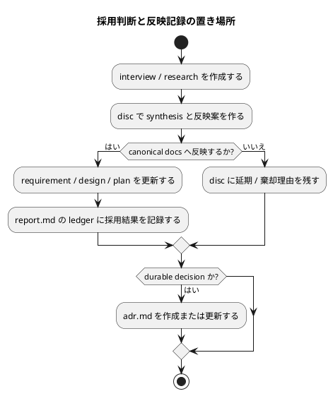

# 質問シート Q-011: 採用判断と canonical docs 反映記録の置き場所

## 位置づけ

この文書は、ユーザー回答前に作成した質問シートである。
ユーザー回答を受け、この同じ文書に回答、採用判断、要件への含意を追記して完成させた。

## 質問の目的

Q-010 では、不足 template は独立した lifecycle / status / reflection rule を持つ場合だけ追加する方針を採用した。

次に確認すべき具体論は、質問シート、research、disc、中間レポートを canonical docs へ反映したときの記録をどこに置くかである。

既存の issue / epic / initiative `report.md` には evidence ledger の役割がある。
一方で、grill workflow では、実装中の観測証跡だけでなく、要件定義前の interview / discussion / research を canonical docs へ反映する採用判断も重要になる。

この反映記録をどこに置くかにより、追加 template が必要かどうかが決まる。

## 質問

採用判断と canonical docs への反映記録は、どこに置きたいですか。

## 回答候補

### A. 各 artifact の frontmatter / 本文に分散して持つ

各 `interview` / `research` / `disc` が、自分自身の `reflected_to` や採用判断欄を持つ。
集約 ledger は作らない。

利点:

- 追加 template が不要。
- artifact 単位の追跡は単純。

弱点:

- 複数 artifact をまとめた反映状況を一覧しにくい。
- canonical docs へ何を反映済みかを横断確認しにくい。
- orchestrator が最後に全体を監査するときに手間が増える。

### B. `disc.md` に synthesis と reflection proposal を持ち、最終的な観測 ledger は既存 `report.md` に寄せる

`disc.md` は、複数 artifact を束ねた分析、採用候補、反映案、ADR candidate triage を扱う。
実際に canonical docs へ反映した結果や採否 ledger は、既存 `report.md` の evidence ledger / adoption ledger に記録する。

利点:

- 追加 template を増やさずに済む。
- `disc.md` と `report.md` の責務を分けられる。
- `disc.md` は proposed / analysis、`report.md` は observed / ledger として整理できる。
- 既存 `report.md` の役割を活かせる。

弱点:

- 要件定義前にも `report.md` を使うことになるため、`report.md` の用途説明を広げる必要がある。
- `disc.md` と `report.md` のどちらに何を書くかを設計で明確にする必要がある。

### C. 新しい `reflection.md` / `adoption-ledger.md` template を追加する

discussion artifacts から canonical docs へ反映した採用判断を、専用 template に集約する。

利点:

- 反映 ledger の役割が非常に明確。
- requirement / design / plan 作成前後の採用判断を一箇所で追いやすい。

弱点:

- 新しい template が増える。
- 既存 `report.md` の evidence ledger と重複する可能性がある。
- Q-009 / Q-010 の simplicity 方針から少し離れる。

## Codex の分析

Q-010 の採用基準では、新しい template は独立した lifecycle / status / reflection rule が必要な場合だけ追加する。

既存 `report.md` は、すでに observed evidence ledger や adoption ledger に近い責務を持っている。
そのため、まずは `report.md` を反映結果の ledger として使えるかを設計で確認するのが自然である。

一方で、`disc.md` は中間レポートや上位レポートとして、まだ採用前の分析、選択肢比較、反映提案を扱うのに向いている。
したがって、次の分担が最も単純である。

- `interview.md`: 一問一答の raw / user-approved answer。
- `research.md`: source-grounding / fact / inference。
- `disc.md`: synthesis / adoption proposal / ADR candidate triage / canonical wording proposal。
- `report.md`: 実際に反映した採用結果と evidence ledger。
- `adr.md`: durable decision。

この分担なら、`reflection.md` を追加しなくても、採用提案と採用結果を分けられる。
ただし、設計で `report.md` の用途を「実装中の観測証跡」だけに狭く保つべきだと判断した場合は、`reflection.md` 追加を再検討する余地がある。

## Codex の推奨案

推奨は **B: `disc.md` に synthesis と reflection proposal を持ち、最終的な観測 ledger は既存 `report.md` に寄せる**。

推奨する責務境界:

- `disc.md`
  - 複数 artifact の synthesis。
  - 採用候補。
  - canonical docs への反映案。
  - ADR candidate triage。
- `report.md`
  - 実際に反映したかどうか。
  - 採用 / 部分採用 / 棄却 / 延期。
  - 反映先 artifact。
  - 残った follow-up。
- `reflection.md`
  - 初期設計では追加しない。
  - `report.md` で責務が衝突すると分かった場合だけ、独立 lifecycle を持つ共通 template として検討する。

## 視覚化

## この回答で決まること

この質問により、reflection 専用 template を追加するかどうかの初期方針が決まる。

決まる内容:

- `disc.md` と `report.md` の責務境界。
- `reflection.md` / `adoption-ledger.md` を追加するか。
- requirement / design / plan 反映結果をどこで追跡するか。
- `report.md` を要件定義前の採用 ledger にも使うか。

## ユーザー回答

ユーザーは **B: `disc.md` に synthesis と reflection proposal を持ち、最終的な観測 ledger は既存 `report.md` に寄せる** を採用した。

## 回答後に追記する欄

### 採用判断

採用。

採用判断と canonical docs への反映記録は、次の責務分担で扱う。

- `disc.md`
  - 複数 artifact の synthesis。
  - 採用候補。
  - canonical docs への反映案。
  - ADR candidate triage。
  - proposed / analysis / recommendation の記録。
- `report.md`
  - 実際に反映したかどうか。
  - 採用 / 部分採用 / 棄却 / 延期。
  - 反映先 artifact。
  - 残った follow-up。
  - observed / ledger の記録。
- `reflection.md` / `adoption-ledger.md`
  - 初期設計では追加しない。
  - `report.md` と責務が衝突し、独立 lifecycle / status / reflection rule が必要だと設計で確認された場合だけ追加検討する。

### 要件への含意

要件には、次を反映する。

- `disc.md` は中間レポート / 上位レポート / synthesis / reflection proposal を扱える共通 template として再設計する。
- `report.md` は canonical docs へ実際に反映した採否と evidence ledger を扱える共通 template として維持・拡張する。
- reflection 専用 template は初期要件として追加しない。
- 追加 template は、既存 `disc.md` / `report.md` では lifecycle / status / reflection rule が衝突すると判明した場合だけ検討する。
