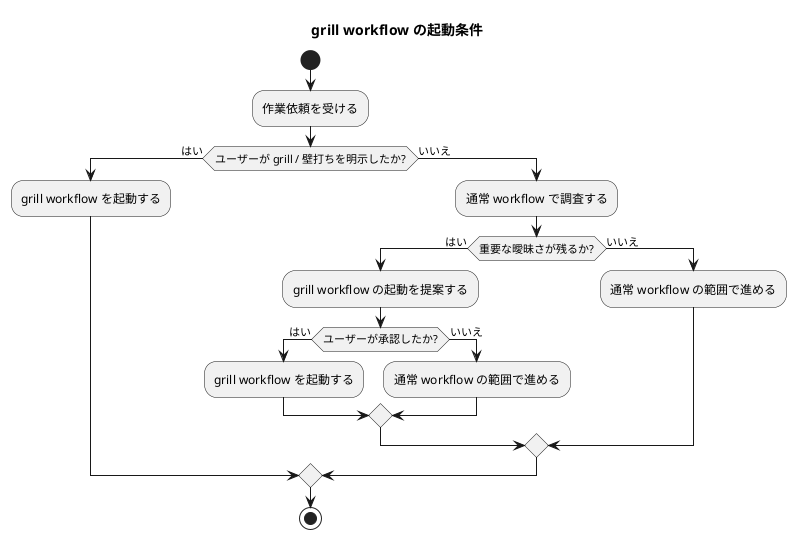

# 質問シート Q-012: grill workflow の起動条件

## 位置づけ

この文書は、ユーザー回答前に作成した質問シートである。
ユーザー回答を受け、この同じ文書に回答、採用判断、要件への含意を追記して完成させた。

## 質問の目的

これまでの議論で、grill workflow は既存 workflow を置き換えるものではなく、単独でも、既存 workflow と組み合わせても使える optional / composable skill workflow として扱う方針が決まっている。

一方で、ユーザーは「なんでもかんでも徹底的な議論が必要な仕事だけではない」と述べている。
したがって、grill workflow をいつ起動するか、誰が起動を判断するかを決める必要がある。

この判断は、次に影響する。

- 既存 workflow の軽さを維持できるか。
- agent が勝手に重い interview workflow を始めないか。
- ユーザーが明示的に深掘りしたいときに、確実に grill workflow を使えるか。
- skill guidance に書く trigger rule。
- workflow / template の使用頻度。

## 質問

grill workflow は、どの条件で起動する扱いにしたいですか。

## 回答候補

### A. 曖昧さがあれば agent が自動的に起動する

agent が重要な曖昧さを見つけたら、ユーザー確認なしに grill workflow を開始する。

利点:

- 曖昧さを見逃しにくい。
- 要件・設計の精度を高めやすい。

弱点:

- 軽い作業でも重い interview workflow に入りやすい。
- ユーザーが求めていない場面で質問シートが増える。
- 「必要な場面だけ使う」という方針と衝突しやすい。

### B. ユーザーが明示的に指示した場合だけ起動する

ユーザーが「grill して」「徹底的に壁打ちして」「質問しながら詰めて」などと明示した場合だけ、grill workflow を起動する。

利点:

- agent が勝手に重い workflow を始めない。
- 既存 workflow の軽さを守りやすい。

弱点:

- agent が重要な曖昧さに気づいても、grill workflow を提案しにくい。
- ユーザーが明示し忘れた場合、深掘り不足になる可能性がある。

### C. ユーザー明示で起動し、agent は必要時に提案だけできる

ユーザーが明示した場合は grill workflow を起動する。
また、agent が「このまま進めると推測が混ざる」と判断した場合は、grill workflow の起動を提案できる。
ただし、提案しただけでは開始せず、ユーザーの承認を得てから起動する。

利点:

- 既存 workflow の軽さを守れる。
- 必要な場面では agent が深掘りを提案できる。
- ユーザー主導を保ちながら、見落としも減らせる。

弱点:

- agent が「提案すべき場面」を判断する基準が必要になる。

## Codex の分析

この issue の核心は、徹底的な clarification workflow を spec-dock に導入することだが、それをすべての作業に強制することではない。

ユーザーは、軽い仕事、既存 context で十分に解ける仕事、簡単に済ませられる仕事が多くあることを明示している。
そのため、A は強すぎる。

一方で、B だけにすると、agent が明らかに曖昧さを検出した場合でも、深掘り workflow を提案しにくくなる。
これは「憶測や曖昧な理解を残さない」という本来の目的を弱める可能性がある。

したがって、ユーザー明示を基本にしつつ、agent は必要時に提案だけできる C が最も釣り合いがよい。

## Codex の推奨案

推奨は **C: ユーザー明示で起動し、agent は必要時に提案だけできる**。

推奨する trigger rule:

- ユーザーが明示した場合:
  - すぐに grill workflow を起動する。
- agent が重要な曖昧さを検出した場合:
  - grill workflow を開始する前に、起動を提案する。
  - ユーザーが承認した場合だけ開始する。
- local docs / code / tests / discussions で解ける場合:
  - grill workflow を起動せず、source-grounding として処理する。
- 軽微な確認で足りる場合:
  - 通常の短い質問または既存 workflow で扱う。

## 視覚化

## この回答で決まること

この質問により、grill workflow が既存 workflow を侵食しすぎないための起動条件が決まる。

決まる内容:

- grill workflow を自動起動するか。
- ユーザー明示を必須にするか。
- agent が起動提案できるか。
- 起動前にユーザー承認が必要か。
- skill guidance の trigger rule。

## ユーザー回答

ユーザーは **C: ユーザー明示で起動し、agent は必要時に提案だけできる** を採用した。

## 回答後に追記する欄

### 採用判断

採用。

grill workflow の起動条件は次の通りとする。

- ユーザーが明示的に grill / 壁打ち / 徹底分析を求めた場合は、grill workflow を起動する。
- agent が重要な曖昧さ、推測混入リスク、要件・設計・計画へ影響する未確認事項を検出した場合は、grill workflow の起動を提案できる。
- agent の提案だけでは grill workflow を開始しない。
- ユーザーが承認した場合にだけ、grill workflow を開始する。
- local docs / code / tests / discussions で解ける疑問は、grill workflow を起動せず source-grounding として処理する。
- 軽微な確認で足りる場合は、通常 workflow の短い確認で扱う。

### 要件への含意

要件には、grill workflow を optional / composable skill workflow として扱い、常時強制しないことを明記する。

また、agent は必要時に起動提案できるが、ユーザー承認なしに重い interview workflow を始めない、という trigger rule を skill guidance / workflow guidance に含める。

### 後続補正

Q-013 のユーザー回答により、この trigger policy は次のように補正する。

- agent から人間への質問方式は、常に一問一答を標準とする。
- 複数質問を一括提示することは基本的に行わない。
- この Q-012 の trigger policy は、標準的な質問作法ではなく、徹底分析 / artifact-heavy grill workflow の起動条件として扱う。
- つまり、一問一答は常時標準であり、PlantUML 付き質問シートや中間レポートまで含む重い workflow をいつ起動するかは別論点として扱う。
