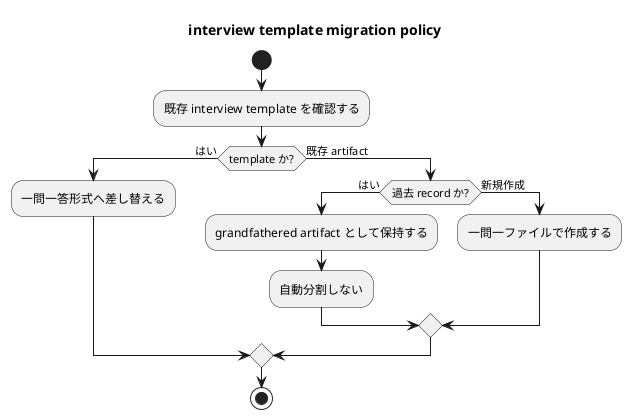

# 質問シート Q-013: 既存の複数質問型 interview artifact / template の移行方針

## 位置づけ

この文書は、ユーザー回答前に作成した質問シートである。
ユーザー回答を受け、この同じ文書に回答、採用判断、要件への含意を追記して完成させた。

## 質問の目的

Q-009 では、既存 `interview.md` を共通 template として再設計し、複数質問型から一問一答形式へ差し替える方針を採用した。

ただし、現時点の repository には既存の複数質問型 `interview.md` template があり、今回の issue 内にも Q-001 から Q-003 を一つの interview record にまとめた artifact が存在する。

次に決めるべきことは、既存の複数質問型 artifact / template をどう扱うかである。

この判断は、次に影響する。

- 既存 `interview.md` template を破壊的に差し替えるか。
- 既存の複数質問型 interview artifacts を移行するか。
- 過去 artifact の互換性をどう扱うか。
- design / plan に migration step を含めるか。

## 質問

既存の複数質問型 interview artifact / template は、どの方針で扱いたいですか。

## 回答候補

### A. template だけ差し替え、既存 artifacts は grandfathered として残す

provider-side の `interview.md` template は一問一答形式へ差し替える。
ただし、すでに作成済みの複数質問型 interview artifacts は過去記録として残し、自動分割や移行はしない。

利点:

- 既存記録を壊さない。
- 変更範囲が小さい。
- 今後作成される artifact だけを新形式にできる。
- spec-dock の既存「legacy artifact を許容する」考え方と合う。

弱点:

- 過去 artifact と新 artifact の形が混在する。
- 過去 artifact を読む agent は、legacy 形式も理解する必要がある。

### B. template を差し替え、今回 issue 内の複数質問 artifact だけ新形式へ分割する

provider-side の `interview.md` template を一問一答形式へ差し替える。
さらに、今回 issue 内の Q-001 から Q-003 を含む複数質問型 artifact を、質問ごとの file に分割する。

利点:

- この issue 内の record が新方針に揃う。
- 今後の requirement / design / plan から参照しやすい。

弱点:

- 既に回答済みの artifact を再構成するため、履歴が少し動く。
- 今回の議論記録に対して追加作業が増える。
- 過去 artifact 全般への migration policy までは解決しない。

### C. 既存の複数質問型 artifacts を全体的に移行する

template を差し替え、既存 repository 内の複数質問型 interview artifacts も可能な範囲で一問一答形式へ移行する。

利点:

- catalog と artifacts の整合性が高くなる。

弱点:

- 変更範囲が大きい。
- historical record を編集しすぎるリスクがある。
- 今回の issue の scope を超えやすい。

## Codex の分析

今回の目的は、今後の template と workflow を正しく定義することである。
過去に作成された record は、その時点の workflow の証跡であり、むやみに再構成すると audit trail としての性質が弱くなる。

また、spec-dock には既に legacy sequential discussion docs を grandfathered artifact として許容する考え方がある。
この思想に沿うなら、過去 artifact はそのまま残し、今後の template を新形式にするのが自然である。

一方、今回 issue 内の Q-001 から Q-003 は、現在進行中の要件定義に深く関わる。
ただし、すでに Q-004 以降は一問一ファイルになっており、Q-001 から Q-003 も `requirement.md` に反映済みである。
そのため、分割しなくても requirement traceability は保てる。

## Codex の推奨案

推奨は **A: template だけ差し替え、既存 artifacts は grandfathered として残す**。

推奨する migration 方針:

- provider-side `interview.md` template は一問一答形式へ差し替える。
- 今後作成する interview artifacts は一問一ファイルを標準とする。
- 既存の複数質問型 interview artifacts は historical / grandfathered record として残す。
- 既存 artifact を自動分割しない。
- design では、agent が legacy interview artifact を読む場合の扱いを明記する。
- 今回 issue 内の Q-001 から Q-003 も、履歴保持を優先してそのまま残す。

## 視覚化

## この回答で決まること

この質問により、既存複数質問型 interview の migration 方針が決まる。

決まる内容:

- 既存 template を差し替えるだけにするか。
- 既存 artifacts を分割 / 移行するか。
- 今回 issue 内の Q-001 から Q-003 を残すか。
- design / plan に migration step を含めるか。
- legacy interview artifact をどう読むか。

## ユーザー回答

ユーザーは、質問の仕方そのものを `grill-me` style に寄せるべきだと回答した。

つまり、agent から人間に質問する際は、複数質問をまとめて行うのではなく、一問ずつ質問することを標準の質問方式にする。
これは grill workflow が optional であるという以前の整理を補正するものである。

補正後の方針:

- agent から人間への質問は、基本的に一問一答形式を標準にする。
- 複数の質問を一括で投げることは、基本的に行わない。
- 何度も turn を繰り返しながら、質問を一つずつ進める。
- `grill-me` style は、単に明示的に呼び出す特別 workflow ではなく、人間への質問作法の標準として扱う。

この回答は、Q-012 の trigger policy を一部改める。
Q-012 の「ユーザー明示で起動し、agent は提案だけできる」は、重い artifact workflow / 徹底分析 mode の起動条件としては残せるが、人間への通常質問スタイルには適用しない。
通常質問スタイルは常に一問一答を標準とする。

## 回答後に追記する欄

### 採用判断

採用。

既存の複数質問型 `interview` template は、今後の標準 template としては不要である。
`interview.md` は一問一答形式の質問シートへ差し替える。

既存 artifact の扱いについては、この回答だけでは「過去 artifact を分割するか」までは明示されていない。
ただし、今後作成する artifact と agent の質問作法については、次を標準とする。

- 一問につき一つの質問。
- 原則、一問につき一つの interview artifact。
- 複数質問を一括で提示しない。
- 複数質問の回答を統合する場合は、後続の `disc.md` / 中間レポートで束ねる。

### 要件への含意

要件には、次を反映する。

- agent から人間への質問方式は、一問一答を標準とする。
- 複数質問を一括提示する interview template / guidance は標準から外す。
- `interview.md` は一問一答形式へ差し替える。
- `grill-me` style は、重い workflow の入口だけでなく、標準的な人間質問作法にも反映する。
- Q-012 の trigger policy は、標準の一問一答質問ではなく、徹底分析 / artifact-heavy grill workflow の起動条件として再解釈する必要がある。
