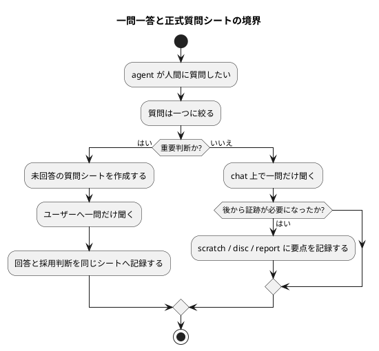

# 質問シート Q-014: 一問一答の標準質問と正式質問シートの境界

## 位置づけ

この文書は、ユーザー回答前に作成した質問シートである。
ユーザー回答を受け、この同じ文書に回答、採用判断、要件への含意を追記して完成させた。

## 質問の目的

Q-013 で、agent から人間への質問方式は `grill-me` style、つまり一問一答を標準にする方針が確認された。
複数質問を一括提示することは基本的に行わない。

一方で、これまでの議論では、重要な質問では次を含む正式な質問シートを作る方針も採用している。

- 質問の目的
- 質問内容
- 回答候補
- Codex の分析
- Codex の推奨案
- PlantUML 図
- ユーザー回答
- 採用判断
- 要件への含意

次に確認すべきことは、すべての人間質問で正式質問シートを必須にするのか、それとも一問一答は常時標準だが、正式質問シートは重要な判断だけに限定するのかである。

## 質問

一問一答の標準質問と、正式な質問シート作成の境界をどう定義したいですか。

## 回答候補

### A. すべての人間質問で正式質問シートを必須にする

agent が人間に質問する場合は、必ず事前に `interview` 質問シートを作る。
軽微な質問でも PlantUML や回答候補、分析を含める。

利点:

- 証跡が最も強い。
- すべての質問を file として追跡できる。

弱点:

- 軽微な確認でも重くなる。
- 作業速度が落ちる。
- 「簡単に済ませられる仕事も多い」という方針と衝突しやすい。

### B. 一問一答は常時標準、正式質問シートは重要判断のみ必須にする

agent から人間への質問は常に一問ずつ行う。
ただし、正式な質問シートを作るのは、要件、設計、計画、ADR、scope、責務境界、template / workflow などに影響する重要質問に限定する。

軽微な確認は、chat 上で一問だけ聞いてよい。
必要なら後から `scratch`、`disc`、`report` に要点を記録する。

利点:

- 一問一答の原則を標準化できる。
- 重要判断は証跡を残せる。
- 軽微な作業は重くなりすぎない。
- 既存 workflow と grill style の両立がしやすい。

弱点:

- 何を「重要質問」とするかの基準が必要になる。

### C. ユーザーが grill / 壁打ちを明示した場合だけ正式質問シートを作る

通常の質問は一問一答で行うが、正式質問シートはユーザーが grill workflow を明示した場合だけ作る。

利点:

- artifact が増えにくい。
- ユーザー主導が明確。

弱点:

- agent が重要な質問をしても、証跡が残らないことがある。
- 要件・設計・計画に関わる判断が chat の中だけに残るリスクがある。

## Codex の分析

Q-013 の回答により、「一問一答」は特別 workflow ではなく、標準の質問作法になった。
したがって、今後の設計では次を分離して考える必要がある。

- 質問作法:
  - 常に一問一答。
  - 複数質問の一括提示は基本禁止。
- artifact 化:
  - 重要な質問は正式質問シートにする。
  - 軽微な質問は chat 上の一問で足りる場合がある。

すべての質問を正式質問シートにすると、証跡は強いが workflow が重くなる。
一方で、正式質問シートをユーザー明示時だけにすると、重要判断が記録されないリスクがある。

そのため、B が最もバランスがよい。

## Codex の推奨案

推奨は **B: 一問一答は常時標準、正式質問シートは重要判断のみ必須にする**。

正式質問シートが必須になる条件:

- requirement / design / plan / ADR に影響する。
- scope、責務境界、workflow、template、agent role に影響する。
- 複数 artifact を束ねた後続 synthesis が必要になる。
- ユーザー回答を後から canonical docs へ反映する可能性が高い。
- 誤解すると実装や計画が大きく変わる。

正式質問シートが不要な条件:

- 単なる作業継続確認。
- typo / 表記 / 小さな好みの確認。
- local context でほぼ答えがあり、yes/no の軽微な確認だけで済む。
- canonical docs への反映予定がない。

## 視覚化

## この回答で決まること

この質問により、一問一答の標準化と、正式質問シート作成の重さの境界が決まる。

決まる内容:

- すべての質問で質問シートを作るか。
- 重要質問だけ質問シートを必須にするか。
- 軽微な質問を chat 上の一問で扱ってよいか。
- 質問シート必須条件。

## ユーザー回答

ユーザーは **B: 一問一答は常時標準、正式質問シートは重要判断のみ必須にする** を採用した。

## 回答後に追記する欄

### 採用判断

採用。

agent から人間への質問は、常に一問一答を標準とする。
ただし、正式な `interview` 質問シートを作成するのは、重要判断に関わる質問に限定する。

正式質問シートが必須になる条件:

- requirement / design / plan / ADR に影響する。
- scope、責務境界、workflow、template、agent role に影響する。
- 複数 artifact を束ねた後続 synthesis が必要になる。
- ユーザー回答を後から canonical docs へ反映する可能性が高い。
- 誤解すると実装や計画が大きく変わる。

正式質問シートが不要な条件:

- 単なる作業継続確認。
- typo / 表記 / 小さな好みの確認。
- local context でほぼ答えがあり、yes/no の軽微な確認だけで済む。
- canonical docs への反映予定がない。

### 要件への含意

要件には、次を反映する。

- 人間への質問方式は一問一答を標準とする。
- 複数質問を一括提示することは基本的に禁止する。
- 重要判断に関わる質問では、事前に未回答の正式質問シートを作成する。
- 軽微な確認は chat 上の一問一答で扱ってよい。
- 軽微な確認でも後から証跡が必要になった場合は、`scratch` / `disc` / `report` など適切な artifact に要点を記録する。
