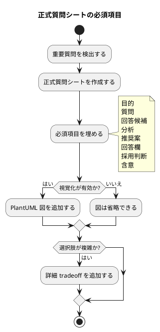

# 質問シート Q-015: 正式質問シートの必須項目

## 位置づけ

この文書は、ユーザー回答前に作成した質問シートである。
ユーザー回答を受け、この同じ文書に回答、採用判断、要件への含意を追記して完成させた。

## 質問の目的

Q-014 では、人間への質問は常に一問一答を標準とし、正式質問シートは重要判断のみ必須にする方針を採用した。

次に決めるべきことは、正式質問シートにどの項目を必須として固定し、どの項目を状況に応じた任意項目にするかである。

この判断は、再設計する `interview.md` template の構造に直接影響する。

## 質問

正式質問シートの項目は、どの粒度で必須化したいですか。

## 回答候補

### A. 最小項目だけ必須にする

必須項目を最小限にし、その他は任意にする。

必須候補:

- question_id
- status
- 質問
- ユーザー回答
- 採用判断
- reflected_to

利点:

- template が軽い。
- agent が素早く作れる。

弱点:

- 回答前にユーザーが判断するための文脈が不足しやすい。
- 質問の目的、選択肢、推奨案が抜ける可能性がある。
- 今回の「質問前シート」方針と弱くなる。

### B. 判断に必要な構造を必須にし、図や詳細は条件付きにする

ユーザーが回答前に判断でき、後から採用判断へつなげられる項目を必須にする。
PlantUML 図や詳細な比較表は、重要判断では原則含めるが、単純な質問では任意にする。

必須候補:

- frontmatter:
  - `kind`
  - `scope`
  - `scope_id`
  - `created_at`
  - `created_by`
  - `status`
  - `question_id`
  - `authority`
  - `derived_from`
  - `reflected_to`
- 本文:
  - 位置づけ
  - 質問の目的
  - 質問
  - 回答候補
  - Codex の分析
  - Codex の推奨案
  - ユーザー回答
  - 採用判断
  - 要件 / 設計 / 計画への含意
- 条件付き:
  - PlantUML 図
  - 詳細な tradeoff 表
  - 後続 synthesis / report への反映案

利点:

- 質問前に判断材料が揃う。
- agent が構造化しやすい。
- 軽微な正式質問にも対応できる。
- 図や詳細比較で template が過度に重くなることを避けられる。

弱点:

- A よりは template が長くなる。
- 図を必須にしないため、視覚化の徹底度は質問に依存する。

### C. すべての正式質問シートで PlantUML と詳細分析まで必須にする

正式質問シートを作る場合は、必ず PlantUML 図、詳細な回答候補、比較、推奨案まで含める。

利点:

- すべての正式質問シートが高密度になる。
- ユーザーが視覚的に理解しやすい。

弱点:

- template が重い。
- 単純な重要質問でも作成コストが高くなる。
- agent が形式を埋めるために不要な図や比較を作る可能性がある。

## Codex の分析

これまでのユーザー回答では、次が重視されている。

- 質問前に、ユーザーが判断しやすいシートを作る。
- 質問には意図、目的、回答候補、分析、推奨案を含める。
- PlantUML などの視覚化も使う。
- template は coding agent が扱いやすい構造にする。
- ただし、すべての作業を重くしすぎない。

この条件をすべて満たすには、B がよい。

A は軽いが、質問前シートとしては情報不足になりやすい。
C は今回のような深い議論では適しているが、重要質問すべてに強制すると過剰になる。

B なら、正式質問シートの core は安定し、PlantUML や詳細比較は「重要判断では原則含めるが、不要な場合は省略可能」とできる。

## Codex の推奨案

推奨は **B: 判断に必要な構造を必須にし、図や詳細は条件付きにする**。

推奨する必須項目:

- frontmatter:
  - `kind`
  - `scope`
  - `scope_id`
  - `created_at`
  - `created_by`
  - `status`
  - `question_id`
  - `authority`
  - `derived_from`
  - `reflected_to`
- 本文:
  - 位置づけ
  - 質問の目的
  - 質問
  - 回答候補
  - Codex の分析
  - Codex の推奨案
  - ユーザー回答
  - 採用判断
  - 要件 / 設計 / 計画への含意

条件付き項目:

- PlantUML 図:
  - workflow、責務境界、状態遷移、選択肢比較が視覚化できる場合は原則含める。
  - 単純な用語確認などでは省略できる。
- 詳細 tradeoff 表:
  - 選択肢が複雑な場合に含める。
- 後続反映案:
  - canonical docs へ反映する可能性がある場合に含める。

## 視覚化

## この回答で決まること

この質問により、再設計する `interview.md` template の必須項目が決まる。

決まる内容:

- frontmatter の必須 key。
- 本文 section の必須項目。
- PlantUML 図を必須にするか条件付きにするか。
- agent が省略してよい項目。

## ユーザー回答

ユーザーは **B: 判断に必要な構造を必須にし、図や詳細は条件付きにする** を採用した。

## 回答後に追記する欄

### 採用判断

採用。

正式質問シートは、ユーザーが回答前に判断でき、後から採用判断と canonical docs への反映へつなげられる構造を必須にする。
ただし、PlantUML 図、詳細 tradeoff、後続反映案は、質問の性質に応じて条件付き項目とする。

必須項目:

- frontmatter:
  - `kind`
  - `scope`
  - `scope_id`
  - `created_at`
  - `created_by`
  - `status`
  - `question_id`
  - `authority`
  - `derived_from`
  - `reflected_to`
- 本文:
  - 位置づけ
  - 質問の目的
  - 質問
  - 回答候補
  - Codex の分析
  - Codex の推奨案
  - ユーザー回答
  - 採用判断
  - 要件 / 設計 / 計画への含意

条件付き項目:

- PlantUML 図:
  - workflow、責務境界、状態遷移、選択肢比較など、視覚化が理解を助ける場合は原則含める。
  - 単純な用語確認などでは省略できる。
- 詳細 tradeoff:
  - 選択肢が複雑な場合に含める。
- 後続反映案:
  - canonical docs へ反映する可能性がある場合に含める。

### 要件への含意

要件には、次を反映する。

- 正式質問シートの必須 frontmatter と本文 section を定義する。
- PlantUML 図は重要判断では原則利用するが、すべての正式質問シートで機械的に必須とはしない。
- template は coding agent が扱いやすい構造を持つ必要がある。
- formal interview artifact は、回答前の判断材料と回答後の採用判断の両方を保持する。
