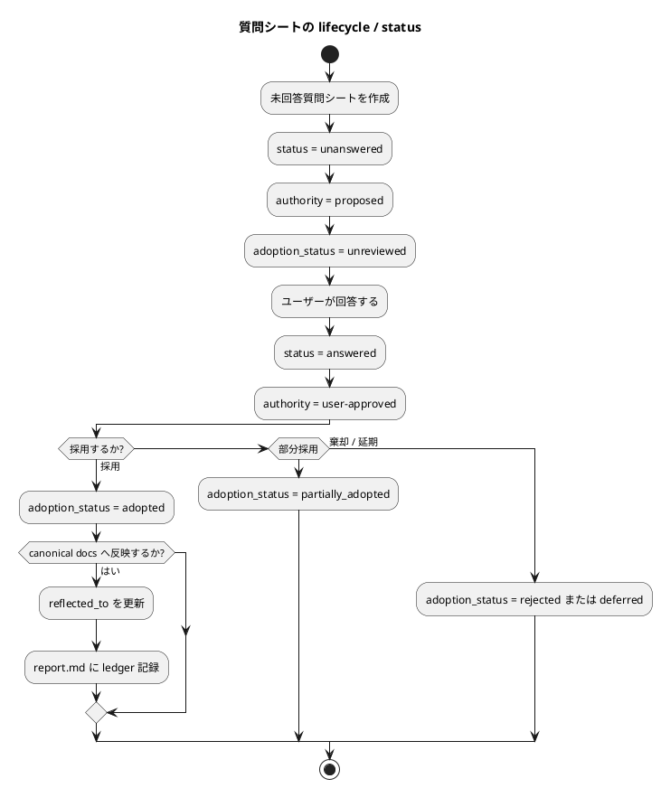

# 質問シート Q-016: 質問シートの lifecycle / status

## 位置づけ

この文書は、ユーザー回答前に作成した質問シートである。
ユーザー回答を受け、この同じ文書に回答、採用判断、要件への含意を追記して完成させた。

## 質問の目的

Q-015 では、正式質問シートに必要な frontmatter と本文 section を確認した。

次に決めるべきことは、正式質問シートの `status` や `authority` をどのように遷移させるかである。

この判断は、coding agent が質問シートを作成、更新、検索、canonical docs へ反映するときの扱いやすさに影響する。

## 質問

質問シートの lifecycle / status は、どの粒度で定義したいですか。

## 回答候補

### A. `unanswered` / `answered` だけにする

質問前は `unanswered`、ユーザー回答後は `answered` とする。
採用や反映は本文や `reflected_to` だけで表現する。

利点:

- シンプル。
- agent が迷いにくい。

弱点:

- 回答済みだが未採用、採用済みだが未反映、延期、置換などを表現しにくい。
- canonical docs への反映状況を status だけで追いにくい。

### B. 最小 lifecycle と反映情報を分ける

`status` は質問自体の状態に限定する。
採用や反映は `authority`、`adoption_status`、`reflected_to`、本文の採用判断で扱う。

想定:

- `status`
  - `unanswered`
  - `answered`
  - `superseded`
  - `deferred`
- `authority`
  - `proposed`
  - `user-approved`
  - `synthesized`
- `adoption_status`
  - `unreviewed`
  - `adopted`
  - `partially_adopted`
  - `rejected`
  - `deferred`
- `reflected_to`
  - canonical docs / report / adr への反映先

利点:

- 質問の回答状態と、採用・反映状態を混ぜずに管理できる。
- agent が検索・更新しやすい。
- `report.md` の adoption ledger と接続しやすい。

弱点:

- A より frontmatter が少し増える。
- `status` と `adoption_status` の違いを template で明示する必要がある。

### C. 詳細な workflow 状態を `status` に全部入れる

`status` に `unanswered`、`answered`、`adopted`、`reflected`、`rejected`、`superseded` などをすべて入れる。

利点:

- 一つの field で見た目は分かりやすい。

弱点:

- 質問状態、採用状態、反映状態が混ざる。
- `answered but rejected` や `adopted but not reflected` のような状態を表現しにくい。
- agent が更新ミスしやすい。

## Codex の分析

質問シートには、少なくとも二つの状態軸がある。

- 質問そのものの状態:
  - 未回答か。
  - 回答済みか。
  - 置換されたか。
  - 延期されたか。
- 回答の採用・反映状態:
  - 採用されたか。
  - 部分採用か。
  - 棄却か。
  - canonical docs へ反映済みか。

これらを一つの `status` に入れると、状態が混ざりやすい。
一方で、詳細にしすぎると template が重くなる。

そのため、`status` は質問 lifecycle に限定し、採用・反映は別 field と本文に分ける B がよい。

## Codex の推奨案

推奨は **B: 最小 lifecycle と反映情報を分ける**。

推奨する構造:

- `status`
  - `unanswered`
  - `answered`
  - `superseded`
  - `deferred`
- `authority`
  - `proposed`
  - `user-approved`
  - `synthesized`
- `adoption_status`
  - `unreviewed`
  - `adopted`
  - `partially_adopted`
  - `rejected`
  - `deferred`
- `reflected_to`
  - `requirement.md`
  - `design.md`
  - `plan.md`
  - `report.md`
  - `adr`
  - または空配列

運用:

- 質問前:
  - `status: unanswered`
  - `authority: proposed`
  - `adoption_status: unreviewed`
- 回答後:
  - `status: answered`
  - `authority: user-approved`
  - `adoption_status` は採用判断に応じて更新する。
- canonical docs 反映後:
  - `reflected_to` を更新する。
  - 必要なら `report.md` の ledger に採用結果を記録する。

## 視覚化

## この回答で決まること

この質問により、再設計する `interview.md` template の frontmatter lifecycle が決まる。

決まる内容:

- `status` に何を入れるか。
- `authority` の使い方。
- `adoption_status` を追加するか。
- `reflected_to` と `report.md` ledger の役割。

## ユーザー回答

ユーザーは **B: 最小 lifecycle と反映情報を分ける** を採用した。

また、今後の細かい質問については、人間ユーザーがすべて直接回答するのではなく、deep consultant を一次回答役として使う方針が示された。
deep consultant が既存議論と repository context から回答できる場合は回答し、判断材料不足、権限不足、または人間の価値判断が必要な場合だけ、orchestrator が人間ユーザーへ一問ずつ確認する。

## 回答後に追記する欄

### 採用判断

採用。

正式質問シートの lifecycle / status は、質問自体の状態と、回答の採用・反映状態を分離する。

採用する構造:

- `status`
  - `unanswered`
  - `answered`
  - `superseded`
  - `deferred`
- `authority`
  - `proposed`
  - `user-approved`
  - `synthesized`
- `adoption_status`
  - `unreviewed`
  - `adopted`
  - `partially_adopted`
  - `rejected`
  - `deferred`
- `reflected_to`
  - canonical docs、`report.md`、ADR などへの反映先を配列で持つ。

運用:

- 質問前:
  - `status: unanswered`
  - `authority: proposed`
  - `adoption_status: unreviewed`
- 回答後:
  - `status: answered`
  - `authority: user-approved`
  - `adoption_status` を採用判断に応じて更新する。
- canonical docs 反映後:
  - `reflected_to` を更新する。
  - 必要に応じて `report.md` の ledger に採用結果を記録する。

### 要件への含意

要件には、次を反映する。

- `status` は質問 lifecycle を表す。
- `adoption_status` は回答の採用状態を表す。
- `reflected_to` は canonical docs / report / ADR への反映先を表す。
- 質問シートの採用・反映状態を一つの `status` に混ぜない。
- 細かい設計判断は deep consultant が一次回答し、人間確認が必要な場合だけ orchestrator が人間へ質問する workflow を許容する。
