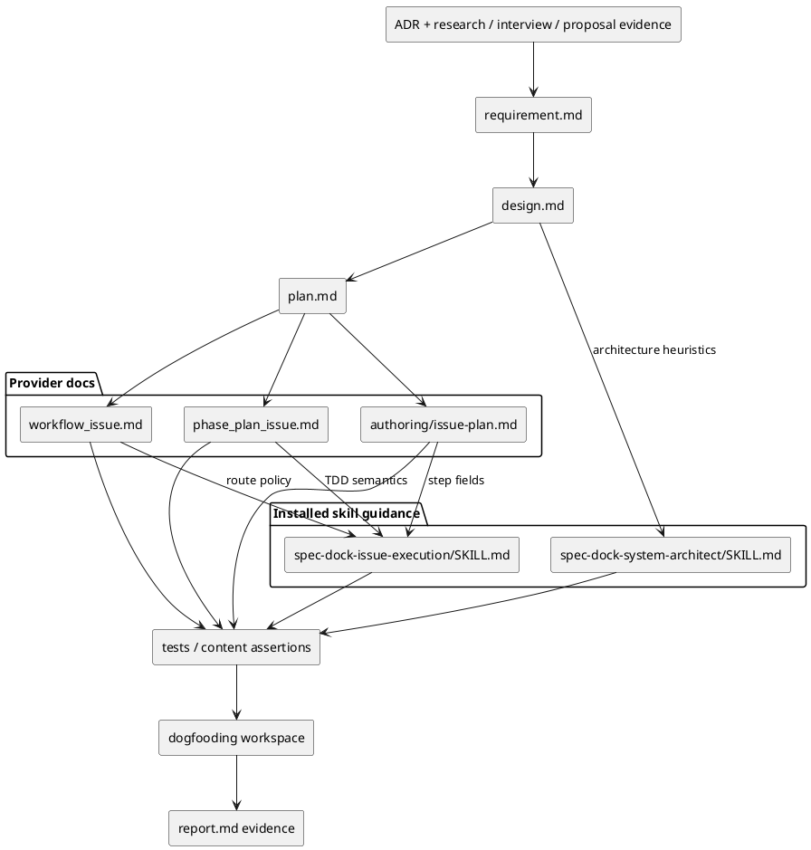
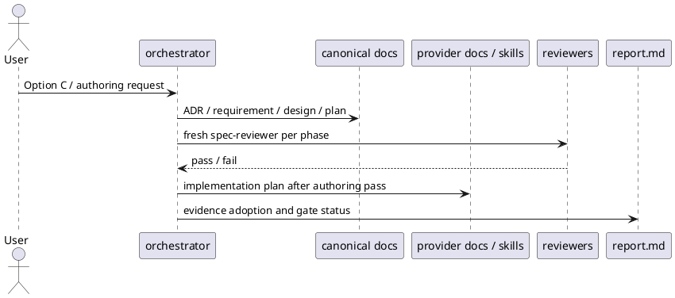

# iss-00142 Matt Pocock Skill Adoption Analysis — 設計

## 親図（Diagram）参照
- Epic 図:
  - `epic-00067` は installed agent tooling assets の source authority を `src/spec_dock/assets/install_root/` に寄せる文脈を持つ。
- Initiative 図:
  - `init-local-00003` は spec-dock 自身の architecture maintenance and hardening を扱う。
- 再利用する決定:
  - `discussions/20260530t094323z-adr-matt-pocock-skills-as-spec-dock-phase-discipline.md`: Matt Pocock skills は直接移植せず、spec-dock phase discipline として翻訳採用する。

## 目的・制約
- 目的:
  - Matt Pocock skills のうち、spec-dock に有効な discipline を existing docs / installed skill guidance に低リスクで反映できる設計へ落とす。
  - 実装者が runtime / CLI / new skill に広げず、docs-only / skill-text-only の bounded implementation として実行できる境界を固定する。
- 必須:
  - Core adoption を provider-side source of truth に反映する。
  - dogfooding workspace への反映確認を実装計画に含める。
  - content / scaffold / validate による検証方針を持つ。
- 禁止:
  - Direct import、new first-class skills、runtime / CLI behavior change、GitHub label readiness、`CONTEXT.md` authority、prototype lifecycle implementation。
- 非交渉制約:
  - Canonical artifacts は `requirement.md` / `design.md` / `plan.md` / `report.md`。
  - Delegated output は evidence であり、canonical edit / phase promotion は main orchestrator が行う。
  - Fresh `spec-reviewer` pass なしに次 phase へ進めない。
- 前提:
  - `requirement.md` は fresh `spec-reviewer` pass 済み。
  - User decision は Option C。

## 既存実装 / 規約の理解
- 参照した実装 / docs:
  - `src/spec_dock/assets/spec_dock/docs/workflow_issue.md`
  - `src/spec_dock/assets/spec_dock/docs/phase_plan_issue.md`
  - `src/spec_dock/assets/spec_dock/docs/authoring/issue-plan.md`
  - `src/spec_dock/assets/install_root/.agents/skills/spec-dock-issue-execution/SKILL.md`
  - `src/spec_dock/assets/install_root/.agents/skills/spec-dock-system-architect/SKILL.md`
  - `spec-dock/docs/workflow_spec_authoring.md`
  - `spec-dock/docs/workflow_adr.md`
- 現状理解:
  - `workflow_issue.md` は Issue lifecycle、execution gate、report evidence、delegation / reviewer mapping、completion policy の正本である。
  - `phase_plan_issue.md` は Issue plan の設計哲学、Spec-Locked Closure Index、review checklist を所有する。
  - `authoring/issue-plan.md` は executable step schema、delegation contract、具体テストケース一覧、docs-only / inspect-only evidence の field semantics を所有する。
  - `spec-dock-issue-execution/SKILL.md` は execution skill の短い reminder であり、詳細 policy は `workflow_issue.md` に route する。
  - `spec-dock-system-architect/SKILL.md` は delegated architecture proposal の operating boundary と source of truth を所有する。
- 採用するパターン:
  - Policy は docs の正本へ、agent-facing reminder は installed skills へ置く。
  - Detailed workflow text は `workflow_issue.md` / `phase_plan_issue.md` / `authoring/issue-plan.md` に残し、skill 側には要点と route だけを置く。
  - Tests は詳細文言の完全一致ではなく、重要 marker と shipped asset parity を中心にする。
- 採用しないもの:
  - `CONTEXT.md`、PRD、temporary handoff doc、GitHub label state machine、新規 lifecycle command。
- 影響範囲:
  - Shipped docs / installed skill guidance / tests / dogfooding generated copies。
  - Runtime command behavior、domain model、data persistence、GitHub API integration は対象外。

## 採用方針 / トレードオフ
- 論点:
  - 外部 skill をそのまま増やすか、既存 spec-dock workflow の discipline として吸収するか。
- 選択肢:
  - Direct import: 速いが authority model と衝突する。
  - Analysis only: 安全だが既存課題が改善しない。
  - Phase discipline adoption: 既存 workflow を守りつつ改善できるが、CLI enforcement はこの Issue では得られない。
- 決定:
  - Phase discipline adoption を採用する。
- トレードオフ:
  - Guidance-level の変更なので enforcement は弱い。
  - 代わりに runtime risk と scope creep を抑え、後続 Issue で first-class workflow を個別に設計できる。

## 採用分類
| 区分 | 対象 | 反映先 | この Issue の扱い |
|---|---|---|---|
| Core | `diagnose` | `workflow_issue.md`, `spec-dock-issue-execution/SKILL.md`, `plan.md` | bug / performance / unknown failure の feedback-loop-first discipline |
| Core | `tdd` | `phase_plan_issue.md`, `authoring/issue-plan.md`, `spec-dock-issue-execution/SKILL.md` | public interface / observable behavior と vertical tracer bullet の強化 |
| Core | `to-issues` | `phase_plan_issue.md`, `requirement.md`, `plan.md` | Epic -> Issue slicing の vertical slice / dependency / integration checkpoint guidance |
| Core | `improve-codebase-architecture` / `zoom-out` | `spec-dock-system-architect/SKILL.md`, `design.md` | architecture heuristic vocabulary として採用 |
| Optional | `handoff` | `report.md` / existing canonical references | 新しい正本を作らず既存 artifact references に限定 |
| Optional | `write-a-skill` | follow-up candidate | この Issue では skill authoring workflow を増やさない |
| Follow-up | `triage` | future issue / ADR | readiness model と GitHub label sync は別 Issue |
| Follow-up | `prototype` | future issue / ADR | throwaway lifecycle と cleanup gate は別 Issue |
| Rejected | direct import / `CONTEXT.md` authority | N/A | spec-dock authority model と衝突するため不採用 |

## 依存関係分析
- module 依存:
  - Canonical issue docs depend on ADR / research / interview / proposal evidence.
  - Provider docs depend on issue requirement / design / plan approval before implementation.
  - Installed skill guidance depends on provider docs wording because skills route users to docs.
  - Tests depend on final target markers and changed provider files.
  - Dogfooding workspace refresh depends on provider-side changes.
- file 依存:
  - `src/spec_dock/assets/spec_dock/docs/phase_plan_issue.md` and `src/spec_dock/assets/spec_dock/docs/authoring/issue-plan.md` should be updated before execution skill reminders, because they define plan field semantics.
  - `src/spec_dock/assets/spec_dock/docs/workflow_issue.md` should be updated before `spec-dock-issue-execution/SKILL.md`, because the skill routes execution policy to workflow docs.
  - `src/spec_dock/assets/install_root/.agents/skills/spec-dock-system-architect/SKILL.md` can be updated independently after architecture vocabulary is fixed in this design.
  - Test assertions should be updated after wording has stabilized.
- 上流 / 前提:
  - `requirement.md` and ADR accepted.
  - Design `spec-reviewer` pass.
- 下流 / 依存先:
  - `plan.md` implementation steps.
  - Implementation / tests / report evidence.
- 実装起点:
  - Start with planning docs (`phase_plan_issue.md`, `authoring/issue-plan.md`) because they define TDD and slicing discipline.
- 順序への影響:
  - Plan should separate docs guidance, skill reminder, tests, dogfooding, and final gates into distinct steps.

## モジュール依存図（Module Dependency Diagram）


## ローカル図の差分
- 変更する境界 / 責務 / 相互作用:
  - Runtime module dependency は変更しない。
  - Docs / skill guidance / tests / dogfooding artifact の依存順だけを設計対象にする。

## インターフェース契約
- Docs contract:
  - `workflow_issue.md`: Issue execution における diagnosis / report evidence の位置づけを所有する。
  - `phase_plan_issue.md`: Issue slicing / TDD plan philosophy を所有する。
  - `authoring/issue-plan.md`: concrete test case / delegation / alternative evidence fields の semantics を所有する。
- Skill contract:
  - `spec-dock-issue-execution/SKILL.md`: approved executable plan 前提を崩さず、diagnosis / TDD discipline を workflow docs へ route する。
  - `spec-dock-system-architect/SKILL.md`: architecture heuristic vocabulary を source-grounded design analysis の観点として追加し、`CONTEXT.md` authority を作らない。
- Test contract:
  - Existing scaffold / asset tests should verify shipped docs and installed skills include essential guidance markers without locking full prose.
- No API contract:
  - CLI arguments、runtime output、metadata schema、GitHub labels、domain objects は変更しない。

## シーケンス差分
- 変更する相互作用:
  - N/A: runtime sequence は変更しない。
- Authoring / execution sequence:


## ドメインモデル差分
- aggregate / entity / value object 変更:
  - N/A: docs / skill guidance only。
- domain event / policy / specification 変更:
  - N/A: runtime domain model は変更しない。
- 不変条件の変更:
  - N/A: runtime invariant は変更しない。

## ディレクトリ / ファイル変更計画
```text
.
|-- src/
|   `-- spec_dock/
|       `-- assets/
|           |-- spec_dock/
|           |   `-- docs/
|           |       |-- workflow_issue.md       # 変更: diagnosis feedback loop と report evidence guidance
|           |       |-- phase_plan_issue.md     # 変更: vertical slicing / public behavior TDD / no horizontal batching guidance
|           |       `-- authoring/
|           |           `-- issue-plan.md       # 変更: concrete test cases / alternative evidence semantics の補強
|           `-- install_root/
|               `-- .agents/
|                   `-- skills/
|                       |-- spec-dock-issue-execution/
|                       |   `-- SKILL.md          # 変更: execution reminder に diagnosis / behavior TDD route を追加
|                       `-- spec-dock-system-architect/
|                           `-- SKILL.md          # 変更: architecture heuristic vocabulary を追加
|-- tests/
|   `-- test_init_update.py                       # 変更: 必要最小限の content / asset assertion
|-- spec-dock/
|   `-- docs/                                     # 実装時に provider 反映結果を確認 / 必要なら update
`-- .agents/
    `-- skills/                                   # 実装時に installed skill parity を確認 / 必要なら update
```

## 要件 → 設計マッピング
- AC-001 -> ADR を accepted decision として `discussions/` に置き、requirement / design / plan / report から参照する。
- AC-002 -> `採用分類` table で Core / Optional / Follow-up / Rejected を固定する。
- AC-003 -> `phase_plan_issue.md` に vertical behavior slice / dependency order / integration checkpoint / HITL-AFK annotation guidance を置く。
- AC-004 -> `phase_plan_issue.md` / `authoring/issue-plan.md` / `spec-dock-issue-execution/SKILL.md` に public interface / observable behavior / vertical tracer bullet / no horizontal batching guidance を置く。
- AC-005 -> `workflow_issue.md` / `spec-dock-issue-execution/SKILL.md` に reproduction / hypotheses / instrumentation / regression evidence / report ledger guidance を置く。
- AC-006 -> `spec-dock-system-architect/SKILL.md` に deep module / interface as test surface / deletion test / locality / leverage guidance を置き、`CONTEXT.md` authority を禁止する。
- AC-007 -> ADR / design / plan / report に `triage`、`prototype`、first-class diagnosis、CLI slicing support を follow-up として残す。
- AC-008 -> `plan.md` に executable steps、delegation contracts、closure index、S90/S99 gates を置く。
- EC-001 -> direct import forbidden changes。
- EC-002 -> HITL/AFK is annotation, not readiness label。
- EC-003 -> no horizontal batching guidance。
- EC-004 -> diagnosis requires reproduction or justified alternative evidence。
- EC-005 -> prototype lifecycle follow-up only。

## テスト戦略
- 単体:
  - Existing unittest suite の scaffold / asset content assertions を最小追加または更新する。
  - Full prose の完全一致は避け、以下の essential markers を検出する。
    - `public interface / observable behavior`
    - `vertical tracer bullet`
    - `horizontal batching`
    - `feedback loop`
    - `hypotheses`
    - `instrumentation cleanup`
    - `deep module`
    - `interface as test surface`
    - `deletion test`
    - `CONTEXT.md` authority 禁止の趣旨
- 統合:
  - `./spec-dock/scripts/spec-dock validate` で issue docs / discussion naming / active structure を確認する。
  - Provider docs / dogfooding docs の parity は既存 tests または S90 inspection で確認する。
- E2E / manual:
  - Runtime behavior は変更しないため E2E は不要。
  - Dogfooding workspace に反映が必要な場合は `spec-dock update .` または既存 local update flow を使い、差分を inspection する。
- migration / rollback / feature flag:
  - Docs / skill guidance のみなので migration / feature flag は不要。
  - Rollback は該当 docs / skill text / tests の revert。

## 要件 / 例外 -> 検証マッピング
- AC-001 -> ADR file inspection。
- AC-002 -> requirement / design classification inspection。
- AC-003 -> `phase_plan_issue.md` marker assertion / inspection。
- AC-004 -> `phase_plan_issue.md`, `authoring/issue-plan.md`, `spec-dock-issue-execution/SKILL.md` marker assertion / inspection。
- AC-005 -> `workflow_issue.md`, `spec-dock-issue-execution/SKILL.md` marker assertion / inspection。
- AC-006 -> `spec-dock-system-architect/SKILL.md` marker assertion / inspection。
- AC-007 -> ADR / design / plan / report follow-up inspection。
- AC-008 -> plan `spec-reviewer` pass。
- EC-001..EC-005 -> forbidden scope inspection using `git diff --stat` / `git diff --name-only` and final reviewer gates。

## リスク / 移行 / ロールバック
- リスク:
  - Guidance-only のため、agent が常に守る保証は runtime enforcement より弱い。
  - Guidance を強く書きすぎると、approved plan 前の diagnosis 実装開始に見える。
  - HITL/AFK annotation が GitHub label readiness と誤読される。
  - Prototype lifecycle を少しだけ書くと cleanup gate 未設計のまま運用される。
- 緩和:
  - `workflow_issue.md` と skill reminder で approved docs / executable plan 前提を維持する。
  - Follow-up は明示するが、この Issue の implementation scope には含めない。
  - Tests / review で runtime / CLI / new skill / GitHub label 変更がないことを確認する。
- 移行:
  - Shipped asset change として扱い、dogfooding workspace の反映有無を S90 で確認する。
- ロールバック:
  - Docs / skill guidance / tests の revert で戻せる。

## 未確定事項
- Q-001:
  - 質問: Content assertion test をどの粒度で追加するか
  - 推奨案: Essential marker の presence を見る最小 assertion に限定し、文章全体は spec-review / inspection に委ねる
  - 影響範囲: `tests/test_init_update.py` の差分量と future wording change のしやすさ
