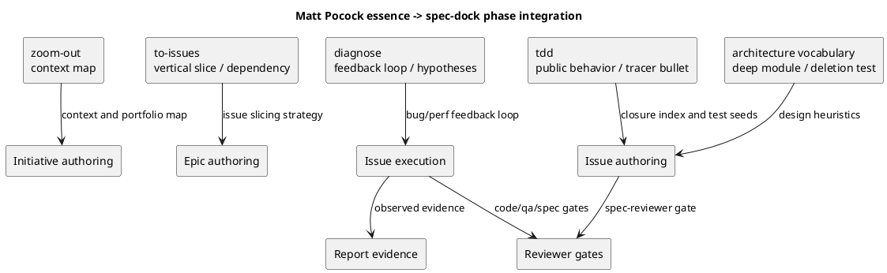

# 20260530t083404z-disc Matt Pocock skills spec-dock integration best practice proposal

## 位置づけ
- 用途: 集まった質問回答や調査をもとに、意思決定前の synthesis、選択肢、tradeoff、reflection proposal、ADR candidate triage、推奨反映先を整理する。
- authority default: `proposed`。通常は doc type から推定し、例外時だけ front matter の `authority` で override する。
- 人間から回答を引き出し、回答欄や未回答事項を管理する場合は `interview` を使う。
- 生ログや未整理の思考は `scratch`、事実確認や外部根拠は `research`、長期判断の固定は `adr` に分ける。
- この doc は proposal / synthesis であり、issue `report.md` の observed evidence ledger ではない。採否の最終証跡は canonical docs / ADR / `report.md` Evidence Adoption Ledger に昇格する。
- doc が大きくなりすぎたら、質問回答は `interview`、事実調査は `research`、raw capture は `scratch`、長期決定は `adr` へ分割する。

## 対象論点 (必須)
- 今回整理する論点:
  - Matt Pocock skills のうち `grill-me` / `grill-with-docs` 以外の essence を、spec-dock の既存 workflow / skill / artifact model にどう統合するか。
  - 特に `diagnose`、`tdd`、`to-issues`、`improve-codebase-architecture`、`handoff`、`triage`、`prototype` を、直接移植ではなく spec-dock-native な設計としてどこまで採用するか。
  - 要件定義書へ固定する前に、現在の spec-dock にとっての理想状態、低リスク反映、follow-up 分割、危険なアンチパターンを整理する。
- この synthesis が必要な理由:
  - 一度 `requirement.md` に固定すると、後続の design / plan / implementation はその契約に引っ張られる。
  - ユーザーは、要件定義前に複数の consultant / deep-consultant / repo-analysis 視点を集約し、ゼロベースに近い design thinking でベストプラクティス案を見たい。
  - `iss-00134` で `grill-me` / `grill-with-docs` の essence を `docs-aware clarification workflow` に翻訳した前例があり、今回も同じく外部 skill の直接移植ではなく spec-dock-native integration が必要である。

## derived question sheets / research (必須)
- `interview`:
  - `20260530t081150z-interview-matt-pocock-adoption-issue-primary-scope.md`
    - ユーザーは Option C を採用した。
    - この issue では、採用設計と spec-dock と自然に統合できる低リスクな docs / skill guidance の最小反映を扱う。
    - 大きな workflow 変更、新規 first-class skill、`triage` / `prototype` のような authority / lifecycle へ強く触れる内容は follow-up issue に分ける。
- `research`:
  - `20260529t154740z-research-initial-skill-adoption-research.md`
    - `diagnose` / `tdd` / `to-issues` を P0 concept adoption 候補として整理した。
    - `improve-codebase-architecture` / `zoom-out` を P1、`handoff` / `write-a-skill` を P2、`triage` / `prototype` を follow-up 候補として整理した。
    - `CONTEXT.md`、PRD、`ready-for-agent`、handoff、review などの用語衝突を指摘した。
- その他の根拠:
  - repo-analyst:
    - 現行 spec-dock には source-grounded clarification、canonical docs single-writer、fresh reviewer gate、Agent-Native TDD、report evidence ledger が既にある。
    - 弱い点は、bug/perf diagnosis の feedback-loop-first discipline、TDD の public-interface / horizontal-batching 禁止の明示、Epic -> Issue slicing の vertical tracer bullet / HITL-AFK 翻訳である。
  - consultant:
    - Option C が妥当であり、`diagnose` / `tdd` / `to-issues` は docs / skill guidance への concept absorption、`triage` / `prototype` / first-class diagnosis skill は follow-up に分けるべきとした。
  - deep-consultant:
    - Matt skills は新しい並列 workflow 群ではなく、spec-dock の phase discipline として吸収するべきとした。
    - Initiative / Epic / Issue authoring、Issue execution、Report evidence、Reviewer gate それぞれに、どの essence を置くかを提案した。

## synthesis (必須)
- 合意済みのこと:
  - Matt Pocock skills を無加工で移植しない。
  - 新しい first-class skill を増やす前に、既存 workflow docs / shipped skill guidance / templates へ最小限に概念吸収する。
  - spec-dock の authority は、`requirement.md` / `design.md` / `plan.md` / `report.md`、scope-local `discussions/` evidence、fresh reviewer gate に残す。
  - `CONTEXT.md`、PRD、GitHub label state、Matt Pocock 独自の issue tracker model を spec-dock の別正本にしない。
  - `diagnose` / `tdd` / `to-issues` は core concept として採用価値が高い。
  - `triage` / `prototype` は魅力があるが、readiness / artifact lifecycle / cleanup gate と衝突しやすいため、この issue では follow-up 分割に留める。
- 未合意 / 未確定のこと:
  - `diagnose` を将来的に first-class `spec-dock-diagnosis` skill にするか。
  - Epic -> Issue slicing を docs guidance だけで改善するか、将来的に template / CLI support まで拡張するか。
  - `prototype` を許可する場合、保存先、削除/吸収 gate、report evidence、cleanup validation をどの contract に置くか。
  - `write-a-skill` 由来の provider-side skill authoring guidance を今回扱うか、別 issue にするか。
- source-grounded に解決できたこと:
  - 既存 spec-dock は Agent-Native TDD の骨格をすでに持つ。したがって Matt `tdd` は新規導入ではなく、既存 contract を「public interface / observable behavior」「horizontal batching 禁止」「one test at a time」で補強する位置づけになる。
  - `to-issues` の HITL / AFK は GitHub label として移植せず、spec-dock では requirement/design/ADR/user decision/reviewer gate が未確定なら HITL、approved docs / dependency clear / executable plan が揃えば AFK 相当、という readiness annotation に翻訳する。
  - `diagnose` は execution 前提を壊さず、bug/perf issue の plan step と report evidence に feedback loop first、repro、hypotheses、instrumentation、post-mortem を埋め込む形が安全である。

## 統合の基本原則

1. **Direct import ではなく phase discipline への翻訳にする**
   - Matt Pocock skills をそのまま slash command / skill として増やすのではなく、spec-dock の Initiative / Epic / Issue authoring、Issue execution、Report evidence、Reviewer gate に分配する。
   - `iss-00134` の `docs-aware clarification workflow` と同じく、外部の便利な形ではなく spec-dock の正本構造に合わせて再表現する。

2. **Canonical authority を増やさない**
   - `CONTEXT.md`、PRD、GitHub label、外部 issue tracker comment を、新しい source of truth にしない。
   - 重要判断は `interview` / `research` / `disc` で evidence 化し、採用時に `requirement.md` / `design.md` / `plan.md` / `report.md` へ反映する。

3. **Skill proliferation を避ける**
   - 入口は既存の `spec-driven-tdd-workflow`、`spec-dock-clarification`、`spec-dock-issue-planning`、`spec-dock-issue-execution`、`spec-dock-system-architect` に寄せる。
   - 新規 first-class skill は、既存 skill では責務が明確に破綻する場合だけ follow-up で検討する。

4. **Issue 実行の readiness を壊さない**
   - `diagnose` や `tdd` を理由に、approved / reviewer-pass 済み `requirement.md` / `design.md` / executable `plan.md` を飛ばして実装しない。
   - bug/perf issue でも、再現 loop や仮説は plan/report contract の中に置く。

5. **低リスク反映は docs / skill guidance に限定する**
   - 今回は docs-only / skill-text-only / template wording 程度に留める。
   - runtime catalog、GitHub label state machine、prototype lifecycle、new first-class skill は follow-up とする。

## Phase 統合モデル

## Skill Essence Map

| Matt skill | 採用分類 | spec-dock-native な統合先 | 今回の扱い |
|---|---|---|---|
| `diagnose` | Core | `workflow_issue.md`、`authoring/issue-plan.md`、`spec-dock-issue-execution`、`report.md` evidence | bug/perf issue の feedback-loop-first guidance として最小吸収 |
| `tdd` | Core | `phase_plan_issue.md`、`authoring/issue-plan.md`、Issue plan template / execution skill | 既存 Agent-Native TDD を public-interface / vertical tracer bullet / horizontal batching 禁止で補強 |
| `to-issues` | Core | Epic plan / issue slicing guidance、dependency edges、reviewer-pass readiness | Epic -> Issue slicing の設計原則として吸収 |
| `improve-codebase-architecture` | Core-lite | `spec-dock-system-architect`、design guidance、ADR triage | deep module / deletion test / interface as test surface の語彙だけ吸収 |
| `zoom-out` | Core-lite | source-grounded read / architecture map / parent docs review | 独立 skill 化せず authoring / analysis の prompt pattern として吸収 |
| `handoff` | Optional | context-pack / report / discussion references | 重複要約を避ける session handoff guidance として限定採用 |
| `write-a-skill` | Optional | provider-side skill authoring guidance | trigger discipline / progressive disclosure を follow-up 候補にする |
| `triage` | Follow-up | GitHub intake / label / readiness bridge | この issue では実装しない |
| `prototype` | Follow-up | experimental workflow / cleanup gate / report evidence | この issue では実装しない |
| `to-prd` / setup / personal / writing / teach 系 | 見送り | なし | spec-dock core へ入れない |

## Epic -> Issue Slicing Best Practice

現状の弱点は、Epic から Issue を切るときに「layer / file / task」単位へ流れやすく、Issue が単独で検証可能な vertical behavior slice になりにくい点である。

Matt `to-issues` の essence は、spec-dock では次のように翻訳する。

1. **Issue は layer ではなく behavior slice**
   - 悪い例: `CLI を変更する issue`、`template を変更する issue`、`test を直す issue`。
   - 良い例: `package-installed update で install_root 配下の hidden workflow が同じ relative path で反映される`。
   - 1つの Issue は、必要なら docs / runtime / tests / dogfooding をまたいでよい。ただし完了時に単独で verify / demo できること。

2. **Issue body / requirement は end-to-end behavior を主語にする**
   - `What to build` は file path 羅列ではなく、利用者または maintainer が観測できる変化で書く。
   - file path は design / plan の `ディレクトリ / ファイル変更計画` に下ろす。

3. **HITL / AFK は label ではなく readiness annotation に翻訳する**
   - HITL 相当:
     - requirement / design / ADR / user decision / reviewer gate が未確定。
     - `workflow_clarification.md` に戻す必要がある。
   - AFK 相当:
     - approved requirement / design / executable plan があり、dependencies が clear で、reviewer gate と report evidence destination が明確。
     - ただし GitHub label `ready-for-agent` と同義にはしない。

4. **Dependency order は spec-dock dependency edge と一致させる**
   - Matt `Blocked by` は、spec-dock では `deps add --from <issue> --to <issue>` に相当する。
   - dependency は 「先に merge した方が楽」ではなく、「後続 issue の受け入れ条件や実装可能性を本当に unblock する」場合だけ置く。

5. **Integration checkpoint を明示する**
   - thin slice が増えるほど、どこで全体整合を確認するかが重要になる。
   - Epic plan には、Issue 群が合流する integration checkpoint、docs impact、validate/sync、final spec review の位置を置く。

## TDD / Diagnosis Best Practice

既存 spec-dock には、`Spec-Locked Closure Index`、step-local `具体テストケース一覧`、Red / alternative evidence、Green verification、Refactor guardrail がある。
Matt `tdd` はこれを置き換えるのではなく、次の品質原則を補強する。

1. **Tests describe public behavior**
   - test obligation は implementation shape ではなく、public interface / observable behavior を固定する。
   - private method、内部 collaborator、mock の形を固定する test は避ける。

2. **No horizontal batching**
   - `具体テストケース一覧` は issue 全体の全テストを先に書けという意味ではない。
   - 実行は behavior slice ごとに、1つの Red / characterization / inspect seed -> minimal implementation -> Green -> optional refactor の順に進む。

3. **Bug/perf issue starts with diagnosis loop**
   - 通常の fix より先に、fast deterministic feedback loop を作る。
   - 失敗 test、CLI fixture、HTTP script、trace replay、headless browser、throwaway harness などから、最短の pass/fail signal を選ぶ。
   - loop を作れない場合は、仮説実装へ進まず、必要な artifact / access / instrumentation を `report.md` に blocker として記録する。

4. **Hypothesis is evidence, not private reasoning**
   - bug/perf issue では、3〜5個の falsifiable hypotheses を rank し、instrumentation は各 hypothesis の prediction と対応させる。
   - raw transcript ではなく、`report.md` の Spec Interpretation / Decision Ledger、TDD evidence、Discovered Tests / Risks に要約する。

5. **Refactor only after Green**
   - GREEN 前の architecture cleanup は原則禁止。
   - no good test seam が見つかった場合は、その場で大改修せず、architecture follow-up または design amendment に昇格する。

## Architecture Best Practice

Matt `improve-codebase-architecture` は強力だが、`CONTEXT.md` 直接更新、HTML report、独自 language docs をそのまま入れると spec-dock の正本モデルと衝突する。

採用するのは語彙と判断軸だけにする。

- `deep module`:
  - 小さい interface の背後に実質的な behavior / policy を隠せているか。
- `interface as test surface`:
  - test は実装の内部形ではなく、module の interface / invariant / error mode を通して behavior を固定しているか。
- `deletion test`:
  - その module を消したとき、複雑さが消えるだけなら shallow。複雑さが複数 caller に散るなら価値がある。
- `locality / leverage`:
  - 変更理由、bug 原因、知識が局所化しているか。caller が得る価値が interface の複雑さを上回っているか。

反映先は `spec-dock-system-architect` と design guidance が妥当である。
ただし domain language は `CONTEXT.md` ではなく、active docs、parent docs、`discussions/`、source/tests/templates、ADR から読む。

## Handoff / Prototype / Triage の扱い

### Handoff

`handoff` は「既存 artifact を重複せず参照する」という一点だけ採用価値がある。
spec-dock では、handoff document を新しい正本にせず、次だけを守る。

- context-pack、active docs、report、discussion paths への参照を優先する。
- 既存 artifact の内容を長く重複要約しない。
- session boundary を越える作業メモは、必要なら `scratch` / `disc` / final response に置き、canonical authority を主張しない。

### Prototype

`prototype` は design question を解く道具として有用だが、この issue では follow-up に分ける。
理由は、repo 内 throwaway code の保存先、削除/吸収 gate、report evidence、cleanup validation を先に設計しないと prototype rot が起きるためである。

### Triage

`triage` は GitHub issue の state machine と label を扱うため、spec-dock の `issue start` / `issue finish`、GitHub sync、dependency、reviewer-pass readiness と衝突しやすい。
`ready-for-agent` は spec-dock の implementation readiness と同義にしてはいけない。
これは follow-up で、GitHub intake adapter / label sync / readiness bridge として設計する。

## Core Workflow Examples

### Feature Issue

1. Requirement:
   - user-visible / maintainer-visible behavior を固定する。
   - acceptance criteria は end-to-end に観測できる形にする。
2. Design:
   - module dependency、source-of-truth、file change plan を置く。
   - deep module / interface as test surface の観点で testable boundary を確認する。
3. Plan:
   - behavior slice ごとに `Spec-Locked Closure Index` と `具体テストケース一覧` を置く。
   - horizontal batching を避け、step ごとに Red / Green / Refactor / report evidence を固定する。
4. Execution:
   - plan の step を順に実行し、observed evidence は `report.md` に残す。

### Bug / Performance Issue

1. Requirement:
   - observed symptom、expected behavior、known reproduction condition、不明点を固定する。
2. Plan:
   - S01 を feedback loop construction にする。
   - loop が作れない場合の stop condition と必要 artifact を書く。
3. Execution:
   - loop で実際の failure を再現し、hypothesis を rank する。
   - correct seam がある場合だけ regression test を RED にする。
4. Report:
   - loop、repro rate、captured symptom、correct hypothesis、debug instrumentation cleanup、original repro re-run を記録する。

### Epic Slicing

1. Epic plan:
   - Issue Slicing Strategy を置く。
   - each issue: behavior slice、HITL/AFK annotation、dependency、verification、integration checkpoint。
2. Issue creation:
   - dependency order で issue を作る。
   - readiness は label ではなく approved docs / dependencies / executable plan で判断する。
3. Integration:
   - thin slice 群の合流地点で validate / sync / final spec review を行う。

## 選択肢 / tradeoff (必須)
- Option A: core concept を docs / skill guidance に最小吸収する
  - Pros:
    - 既存 authority model を壊さない。
    - 今回の Option C と整合する。
    - `requirement.md` / `design.md` / `plan.md` へ反映しやすい。
  - Cons:
    - CLI や template に強制力はまだ入らない。
    - Epic -> Issue slicing の改善は運用 guidance に留まる。
- Option B: new first-class skills / workflow を作る
  - Pros:
    - `diagnose` や `to-issues` の入口が明確になる。
    - 将来の agent には発見しやすい。
  - Cons:
    - skill proliferation が起きる。
    - approved plan / reviewer gate / report authority を飛ばす誤用が増える。
    - 今回の低リスク scope を超える。
- Option C: core guidance + follow-up issue 化
  - Pros:
    - 今回は価値が高い概念だけを吸収し、危険な lifecycle 変更は後続へ分離できる。
    - 要件定義前の議論としても、設計・計画へ進めやすい。
  - Cons:
    - follow-up が作られない限り、`triage` / `prototype` / first-class diagnosis skill は未実装のまま残る。
    - docs guidance のみでは、agent が必ず守るとは限らない。

## reflection proposal (必須)
- canonical docs / workflow / template / skill guidance へ反映すべき候補:
  - `requirement.md`:
    - Direct import 禁止、Core / Optional / Follow-up / 見送り分類、低リスク docs / skill guidance 反映、follow-up 分割を必須スコープにする。
  - `design.md`:
    - `diagnose` / `tdd` / `to-issues` / architecture vocabulary の反映先と境界を設計する。
    - 新規 first-class skill、GitHub triage adapter、prototype lifecycle は follow-up として明示する。
  - `plan.md`:
    - 採用分類固定、docs / skill guidance 最小反映、docs impact / validation、follow-up issue 作成を behavior slice として分ける。
  - `workflow_issue.md`:
    - bug/perf issue の diagnosis loop、hypothesis / instrumentation / post-mortem の report evidence 位置を短く追加する。
  - `phase_plan_issue.md`:
    - vertical tracer bullet、horizontal batching 禁止、public interface / observable behavior を Issue plan authoring philosophy に追加する。
  - `authoring/issue-plan.md`:
    - concrete test case / Red evidence / test obligation 欄に feedback loop、one test at a time、public-interface behavior の記述を追加する。
  - `spec-dock-issue-execution`:
    - bug/perf issue では feedback loop first で、repro なしに hypothesis fix へ進まない reminder を追加する。
  - `spec-dock-system-architect`:
    - deep module、deletion test、interface as test surface、locality/leverage を architecture analysis heuristic として短く追加する。
- まだ proposal に留める理由:
  - この文書は requirement 作成前の synthesis であり、canonical docs ではない。
  - 実際の採用には `requirement.md` への反映、fresh `spec-reviewer` gate、design / plan での traceability が必要である。

## ADR candidate triage (必須)
- ADR candidate か:
  - no
- hard to reverse:
  - no
- surprising without context:
  - no
- real tradeoff:
  - yes
- ADR 化しない場合の反映先:
  - `requirement.md` / `design.md` / `plan.md` / `report.md`

- 補足:
  - 「Matt Pocock skills を直接移植しない」という方向性は重要だが、現時点では `iss-00134` の前例と今回の requirement/design に反映すれば足りる。
  - 将来、`spec-dock-diagnosis` first-class skill、GitHub triage adapter、prototype lifecycle のような戻しにくい workflow decision を採用する場合は、その時点で ADR candidate とする。

## 推奨案 (必須)
- Option C を実行案として採用する。
- この issue では、`diagnose` / `tdd` / `to-issues` / architecture vocabulary を既存 docs / skill guidance へ最小吸収する方針を requirement / design / plan に固定する。
- 低リスク反映は docs-only / skill-text-only に限定する。
- `triage`、`prototype`、new first-class `spec-dock-diagnosis`、Epic -> Issue slicing の CLI/template deep support は follow-up issue に分ける。
- 理由:
  - spec-dock はすでに source-grounded clarification、canonical docs single-writer、fresh reviewer gate、Agent-Native TDD、report evidence ledger を持っている。
  - 不足しているのは新しい入口ではなく、既存 phase discipline に対する vocabulary / guidance / slicing heuristics の補強である。
  - direct import や skill proliferation は、readiness / authority / report evidence の意味を割るリスクが高い。

## 推奨反映先 (必須)
- `requirement.md`:
  - 目的:
    - Matt Pocock skills の有用な essence を spec-dock-native に分類し、低リスクな docs / skill guidance へ最小反映する。
  - 必須:
    - Core / Optional / Follow-up / 見送り分類。
    - `diagnose` / `tdd` / `to-issues` の core adoption。
    - `improve-codebase-architecture` / `zoom-out` の語彙吸収。
    - `triage` / `prototype` の follow-up 分離。
    - direct import / source-of-truth split / `ready-for-agent` 同義化の禁止。
  - AC:
    - Epic -> Issue slicing guidance が vertical behavior slice / HITL-AFK translation / dependency order を説明している。
    - TDD guidance が public interface / observable behavior / no horizontal batching を説明している。
    - diagnosis guidance が feedback loop / repro / hypotheses / report evidence を説明している。
- `design.md`:
  - 反映先を `workflow_issue.md`、`phase_plan_issue.md`、`authoring/issue-plan.md`、`spec-dock-issue-execution`、`spec-dock-system-architect` に限定する設計。
  - New first-class skills / runtime / GitHub label state / prototype lifecycle を out of scope とする boundary model。
  - Core workflow examples を design rationale として整理する。
- `plan.md`:
  - S01: requirement/design に採用分類を固定。
  - S02: docs-only guidance 反映。
  - S03: skill-text-only guidance 反映。
  - S90: docs impact / follow-up issue 整理。
  - S99: spec-review / validation。
- `ADR`:
  - 現時点では不要。
  - follow-up で first-class diagnosis / triage adapter / prototype lifecycle を採用する場合に再検討する。
- `report.md` Evidence Adoption Ledger:
  - この `disc`、initial research、Option C interview、consultant / deep-consultant / repo-analyst outputs の採用判断を記録する。

## 未採用 / deferred 理由 (必須)
- 未採用:
  - Matt Pocock skills の直接移植:
    - spec-dock の canonical docs / reviewer gate / report evidence と衝突するため。
  - `CONTEXT.md` を新正本にする:
    - spec-dock では active docs、parent docs、`discussions/`、source/tests/templates、ADR が context source であるため。
  - GitHub `ready-for-agent` label を implementation readiness と同義にする:
    - spec-dock の readiness は approved docs、dependency、executable plan、reviewer gate、report evidence で決まるため。
  - horizontal TDD batching:
    - `具体テストケース一覧` を全テスト先書きと誤解させ、behavior learning を失わせるため。
- deferred:
  - `spec-dock-diagnosis` first-class skill:
    - approved plan を飛ばす誤用リスクがあり、workflow boundary 設計が必要。
  - `triage` adapter:
    - GitHub issue label、sync、issue start/finish、readiness bridge を設計する必要がある。
  - `prototype` workflow:
    - 保存先、delete-or-absorb gate、cleanup validation、report evidence が必要。
  - Epic -> Issue slicing の CLI/template support:
    - まず docs guidance で運用し、必要性が明確になってから deep support を検討する。

## 次アクション (必須)
- `requirement.md` / `design.md` / `plan.md` / `adr` へ反映する内容:
  - 次に `requirement.md` を作成し、Option C、Core / Optional / Follow-up 分類、direct import 禁止、低リスク反映、AC / EC を固定する。
  - requirement 作成後、fresh `spec-reviewer` gate を通す。
  - design では反映先 docs / skills と out-of-scope boundary を具体化する。
  - plan では docs-only / skill-text-only step と verification evidence を小さく分ける。
- 追加で作る discussion docs:
  - 現時点では必須なし。
  - 要件作成中に `diagnose` first-class skill、prototype lifecycle、triage adapter の優先順位判断が必要になった場合は、別の unanswered `interview` を作成する。
