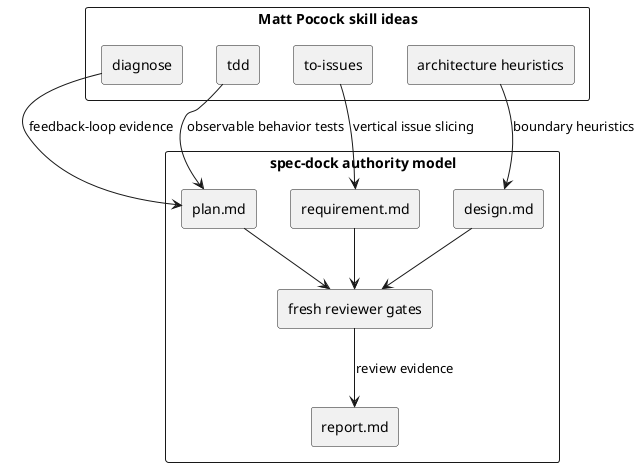

# 20260530t094323z-adr matt-pocock-skills-as-spec-dock-phase-discipline

## 位置づけ
- 用途: Matt Pocock 氏の周辺スキルを spec-dock にどう採用するかという、後続の要件・設計・実装計画に影響する方針を固定する。
- authority: この ADR はユーザーが Option C を採用した判断を受け、`accepted` として扱う。
- 反映先: `requirement.md`、`design.md`、`plan.md`、`report.md`。

## ADR 化基準
- hard to reverse:
  - yes: 直接移植、独立スキル追加、GitHub label readiness、`CONTEXT.md` authority を採用すると、spec-dock の authority model と workflow contract 全体に波及する。
- surprising without context:
  - yes: Matt Pocock 氏の skill set を分析した Issue だが、結論は「skill の直接移植」ではなく「spec-dock phase discipline への翻訳」である。
- real tradeoff:
  - yes: 導入速度と認知負荷、既存 workflow の一貫性、将来の first-class skill 化余地の間に tradeoff がある。
- ADR として残す理由:
  - 後続 Issue で `diagnose`、`tdd`、`to-issues`、`triage`、`prototype` を扱う際に、この Issue の採用境界を再説明せず参照できるようにする。

## 結論（Decision）
- Matt Pocock 氏の周辺スキルは、spec-dock に直接移植しない。
- この Issue では、既存の spec-dock 正本と phase gate を保ったまま、低リスクな docs / skill guidance として「phase discipline」に翻訳して採用する。
- Core adoption:
  - `diagnose`: bug / performance / unknown failure 系 Issue で、実装前に reproduction、ranked hypotheses、targeted instrumentation、regression evidence を固定する feedback-loop-first discipline として採用する。
  - `tdd`: 既存の Agent-Native TDD を強化し、public interface / observable behavior、vertical tracer bullet、one test -> minimal implementation -> refactor、no horizontal batching を Issue plan / execution guidance に反映する。
  - `to-issues`: Epic から Issue への slicing を、vertical behavior slice、dependency order、integration checkpoint、HITL/AFK readiness annotation として採用する。ただし GitHub label state machine にはしない。
  - `improve-codebase-architecture` / `zoom-out`: deep module、interface as test surface、deletion test、locality / leverage などの語彙を architecture review heuristic として採用する。ただし `CONTEXT.md` を authority にしない。
- Optional adoption:
  - `handoff`: 新しい正本を作らず、既存 canonical docs、report evidence、discussion references を指す軽量 handoff としてのみ扱う。
  - `write-a-skill`: 今後の skill authoring guidance の参考に留め、この Issue では first-class skill authoring workflow を増やさない。
- Follow-up:
  - `triage` の readiness / label model、`prototype` lifecycle、first-class `spec-dock-diagnosis` skill、CLI / template レベルの issue slicing support は、この Issue では設計・実装しない。

## 背景（Context）
- `iss-00134` では Grill with docs のエッセンスを clarification workflow に取り込み、source-grounded questions、interview artifact、spec authoring handoff が spec-dock-native に整理された。
- `iss-00142` では、Grill 以外の Matt Pocock 氏の skill set を対象に、spec-dock へ採用すべき要素と採用しない要素を分析する。
- 既存の spec-dock は、`requirement.md` / `design.md` / `plan.md` / `report.md`、`discussions/` evidence、fresh reviewer gates を正本にしている。
- そのため、外部 skill の `CONTEXT.md`、PRD、GitHub label readiness、temporary handoff doc をそのまま正本として輸入すると、spec-dock の authority model と競合する。
- ユーザーはこの Issue の scope として Option C を採用した。

### 統合モデル

## 選択肢（Options considered）
- 選択肢 A: Matt Pocock skills を直接移植する
  - 良い点:
    - 元 skill の運用語彙を短期間で利用できる。
    - `triage` や `prototype` など既存 spec-dock にない名前付き workflow をすぐ増やせる。
  - 悪い点 / 制約:
    - `CONTEXT.md`、PRD、GitHub label readiness、temporary handoff doc が spec-dock の正本と競合する。
    - first-class skill が急増し、ユーザーとエージェントの選択負荷が上がる。
    - 既存の reviewer gate / report evidence / active docs contract が弱まる。
  - 棄却理由:
    - spec-dock の強みである canonical docs と phase gate を崩すため、この Issue の低リスク採用方針に合わない。
- 選択肢 B: 分析だけ行い、採用しない
  - 良い点:
    - 既存 workflow への影響は最小。
    - 仕様変更やテスト追加が不要。
  - 悪い点 / 制約:
    - Epic -> Issue slicing、bug diagnosis、TDD planning の既存弱点が改善されない。
    - `iss-00134` で得た clarification 改善との連続性が切れる。
  - 棄却理由:
    - ユーザーは spec-dock との統合を希望しており、分析結果を実用的な workflow improvement に落とす必要がある。
- 選択肢 C: spec-dock phase discipline として翻訳採用する
  - 良い点:
    - 既存の正本、reviewer gate、report evidence を維持したまま、Matt skills の有効な思考法を採用できる。
    - 変更範囲を docs / skill guidance に抑え、runtime / CLI / first-class skill の大きな設計変更を避けられる。
    - 後続 Issue で `triage`、`prototype`、diagnosis skill を個別に設計する余地を残せる。
  - 悪い点 / 制約:
    - 直接移植より即効性は低く、ガイダンスの読み取り品質に依存する。
    - CLI による slicing enforcement や label automation はこの Issue では得られない。
  - 採用理由:
    - ユーザーが採用した Option C であり、spec-dock の authority model と最も整合する。

## 判断理由（Rationale）
- spec-dock は「どの artifact が正本か」を明確にすることで、複数エージェント協働でも仕様 drift を抑える設計である。
- Matt Pocock 氏の skills から採用すべき本質は、個別ファイル構造ではなく、以下の engineering discipline である。
  - 先に feedback loop を作る。
  - public interface / observable behavior でテストを固定する。
  - vertical slice で Issue を切り、水平分割で価値を遅らせない。
  - 変更の局所性、深い module、削除できる境界を設計判断に使う。
- これらは既存の `workflow_issue.md`、`phase_plan_issue.md`、`docs/authoring/issue-plan.md`、issue execution / architecture skills に反映できる。
- 一方で、`triage` label workflow や `prototype` lifecycle は spec-dock の state model / cleanup policy と衝突しやすいため、別 Issue で個別に扱う。

## 影響（Consequences）
- 良い影響（Positive）:
  - Epic -> Issue slicing の品質基準が、vertical behavior slice と dependency order で明確になる。
  - bug / performance Issue の実装前に、reproduction と hypothesis-driven debugging を求められる。
  - TDD plan が public interface / observable behavior と step-local concrete test cases に寄る。
  - architecture review が deep module / interface surface / deletion test / locality / leverage を明示的に扱える。
- 悪い影響 / 将来負債（Negative / Debt）:
  - この Issue の実装は guidance-level なので、CLI が誤った slicing や label misuse を機械的に止めるわけではない。
  - diagnosis / prototype / triage を first-class workflow にする場合は、追加の requirement / design / ADR が必要になる。
- 影響範囲（コード/テスト/運用/データ）:
  - 主な影響は shipped docs と installed agent skill guidance。
  - runtime command behavior、domain model、GitHub sync contract、データ永続化には影響させない。
  - verification は content / scaffold assertion、dogfooding validation、spec-reviewer gate を中心に行う。
- 移行/ロールバック:
  - docs / skill guidance の変更であり、問題があれば該当文言を revert できる。
  - runtime / CLI 変更を含めないため、rollback risk は低い。
- 追加対応（Follow-ups / Epic / Issue / ADR）:
  - first-class `spec-dock-diagnosis` skill の要否検討。
  - `triage` の readiness model を spec-dock status / reviewer gate / GitHub sync と統合する設計。
  - `prototype` lifecycle の create / absorb / delete / cleanup gate 設計。
  - Epic -> Issue slicing を CLI / template / validation で支援する後続 Issue。

## 参考（References）
- 関連仕様（requirement/design/plan/report）:
  - `../requirement.md`
  - `../design.md`
  - `../plan.md`
  - `../report.md`
- 元になった discussion docs（derived_from）:
  - `20260529t154740z-research-initial-skill-adoption-research.md`
  - `20260530t081150z-interview-matt-pocock-adoption-issue-primary-scope.md`
  - `20260530t083404z-disc-matt-pocock-skills-spec-dock-integration-best-practice-proposal.md`
- 反映先（reflected_to）:
  - `../requirement.md`
  - `../design.md`
  - `../plan.md`
  - `../report.md`
