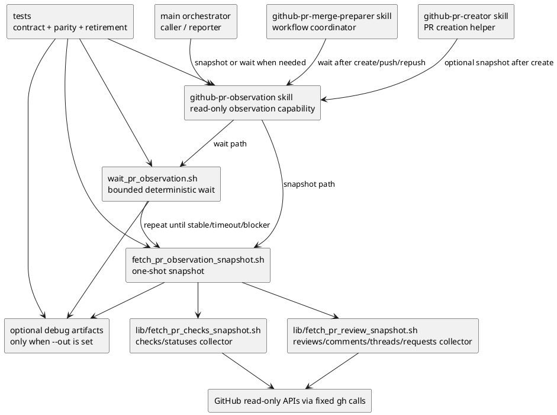

# iss-00170 Harden Pr Monitor Stable Observation — 設計（どう実現するか）

## 親図（Diagram）参照

- Epic:
  - `epic-00067` は installed agent-tooling assets の source of truth を `src/spec_dock/assets/install_root/` に固定する。
  - dogfooding mirror である `.agents/`、`.codex/`、`.github/` は provider-side asset の検証対象であり、主たる実装 source ではない。
- ADR:
  - `20260607t085456z-adr Script Driven Pr Observation Boundary`
- 採用済み決定:
  - `pr-monitor` sub-agent は完全廃止する。
  - deprecated `pr-monitor` shim は残さない。
  - 旧 `github-codex-pr-review-comments` skill は削除し、新 `github-pr-observation` review collector へ統合する。
  - PR observation の正規入口は `github-pr-observation` skill / scripts とする。
  - public skill / script 名に `stable` は出さない。
  - stdout final JSON text を primary result とする。
  - stderr progress は default で出すが、non-authoritative とする。
  - `--out` は optional debug/audit mode とし、通常 path の必須 artifact は作らない。
  - `summary.md` は生成しない。

## 目的・制約

- 目的:
  - PR 作成後または push 後の checks / statuses / reviews 観測を、sub-agent ではなく deterministic read-only skill / scripts に移管する。
  - long foreground wait 中の liveness と current state を stderr progress で可視化しつつ、最終判断の authority を stdout final JSON text に限定する。
  - all review signals と Codex-authored subset を同じ review collector 内で分離し、旧 Codex-only wrapper を不要にする。
  - `@codex review` trigger 後に付いた review/comment body と CI failure detail を stdout final JSON に含め、caller が direct GitHub API に逃げなくてよい contract を作る。
  - `github-pr-merge-preparer` / `github-pr-creator` / main orchestrator が、`pr-monitor` に handoff せず `github-pr-observation` を直接使える contract を作る。
- 必須:
  - `github-pr-observation` skill を provider-side `install_root` に新設する。
  - `wait_pr_observation.sh` は deterministic bounded polling loop を持つ。
  - `fetch_pr_observation_snapshot.sh` は1回分の normalized snapshot / fingerprint を返す。
  - wait wrapper / snapshot helper は final JSON / snapshot JSON を stdout にだけ出す。
  - progress は stderr にだけ出す。
  - `--progress stderr-summary` を default とし、`--progress none` を opt-out とする。
  - review/comment body は trigger window と body mode に従って stdout final JSON に含める。
  - CI failure detail は取得可能な workflow / run / job / failed step metadata として stdout final JSON に含める。
  - `--out <dir>` 指定時だけ debug/audit artifacts を書く。
  - provider-side asset と dogfooding mirror の parity を検証する。
  - init / update 後、旧 `pr-monitor` assets と旧 `github-codex-pr-review-comments` skill が残らないことを検証する。
- 禁止:
  - `pr-monitor` provider / mirror asset を残さない。
  - deprecated shim を残さない。
  - `github-codex-pr-review-comments` を互換 skill として残さない。
  - wait wrapper / snapshot helper / collectors に write operation を持たせない。
  - caller-provided endpoint / method / GraphQL query / body / header / `jq` expression を wrapper に受け付けない。
  - model / agent が direct GitHub API fallback や agent-side polling loop を行わない。
  - progress に final decision authority を持たせない。
  - stdout と stderr を merge した stream を JSON として parse する運用を正規契約にしない。
  - trigger window 外の old review/comment body を current review payload として扱わない。

## 既存実装 / 規約の理解

- provider-side source:
  - `src/spec_dock/assets/install_root/.codex/agents/pr-monitor.toml`
  - `src/spec_dock/assets/install_root/.github/agents/pr-monitor.agent.md`
  - `src/spec_dock/assets/install_root/.agents/skills/github-codex-pr-review-comments/SKILL.md`
  - `src/spec_dock/assets/install_root/.agents/skills/github-codex-pr-review-comments/scripts/fetch_codex_pr_review_comments.sh`
  - `src/spec_dock/assets/install_root/.agents/skills/github-pr-merge-preparer/SKILL.md`
  - `src/spec_dock/assets/install_root/.agents/skills/github-pr-creator/SKILL.md`
- dogfooding mirror:
  - `.codex/agents/pr-monitor.toml`
  - `.github/agents/pr-monitor.agent.md`
  - `.agents/skills/github-codex-pr-review-comments/`
- tests:
  - `tests/unit/infra/test_init_update.py`
  - installed asset inventory / parity / stale cleanup tests。
- 現状理解:
  - 既存 `pr-monitor` instruction は read-only だが、agent 自身が deadline / sleep / polling loop を管理する。
  - script-driven polling 採用後、`pr-monitor` は script executor / summarizer になり、独立 sub-agent としての責務が薄い。
  - 既存 `fetch_codex_pr_review_comments.sh` は Codex-focused wrapper であり、full PR observation と重複する。
  - `github-pr-merge-preparer` は workflow coordinator として、PR 作成/発見、観測、fix loop、human gate を担う。
  - `github-pr-creator` は PR 作成 workflow skill として、push / PR create / issue linkage を扱う。

## 採用方針 / トレードオフ

- D1: `github-pr-observation` skill を新設する。
  - PR observation の正規入口である。
  - usage guide、schema、progress contract、prerequisites、read-only boundary を保持する。
- D2: `wait_pr_observation.sh` を public wait entrypoint として追加する。
  - loop / sleep / timeout / quiet window / same fingerprint count / zero-check grace / head-change detection を持つ。
  - `github-pr-merge-preparer` と main orchestrator が待機込み観測に使う。
- D3: `fetch_pr_observation_snapshot.sh` を public snapshot entrypoint として追加する。
  - 1回分の normalized snapshot と fingerprint を stdout JSON text として返す。
  - `github-pr-creator` の作成直後確認、現状確認、timeout 後の再確認、debug / audit に使う。
- D4: checks/statuses collector と review/comment/thread/review_request collector は internal libs として分離する。
  - public wait result は同じ head SHA / observation window に基づく combined result とする。
- D5: `pr-monitor` sub-agent は削除する。
  - provider-side `.codex` / `.github` agent assets から削除する。
  - dogfooding mirror からも削除する。
  - deprecated shim は残さない。
- D6: 旧 `github-codex-pr-review-comments` skill は削除する。
  - 旧 wrapper の実質機能は `github-pr-observation` review collector に統合する。
  - Codex subset は unified review schema の一部として出力する。
- D7: stdout/stderr を分離する。
  - stdout は final JSON text only。
  - stderr は default bounded progress summary。
  - final JSON には trigger-window review/comment body と CI failure detail を含める。
  - debug / audit artifacts は `--out` 指定時だけ書く。
- D8: PR workflow skills は維持する。
  - `github-pr-merge-preparer` / `github-pr-creator` は今回 agent 化しない。
  - ただし `pr-monitor` handoff は `github-pr-observation` invocation に置き換える。

## 依存関係分析

- 上流:
  - `requirement.md`。
  - `20260607t085456z-adr`。
  - `epic-00067` の provider source of truth と dogfooding parity。
- 下流:
  - `github-pr-merge-preparer` は `wait_pr_observation.sh` の final JSON を消費する。
  - `github-pr-creator` は post-create behavior で snapshot default / wait optional を説明する。
  - main orchestrator は `pr-monitor` role routing ではなく `github-pr-observation` skill invocation を使う。
- 実装順序への影響:
  - 先に new skill / script schema を固定する。
  - 次に old skill / old agent asset retirement を実装する。
  - その後に workflow skill docs / role guidance を更新する。
  - 最後に init/update cleanup、dogfooding mirror parity、tests を確認する。

## モジュール依存図（Module Dependency Diagram）



## インターフェース契約

### Public wait wrapper

```text
.agents/skills/github-pr-observation/scripts/wait_pr_observation.sh \
  --repo OWNER/REPO \
  --pr <number> \
  --head-sha <sha> \
  [--timeout-seconds 1800] \
  [--poll-interval-seconds 30] \
  [--quiet-seconds 90] \
  [--same-fingerprint-count 2] \
  [--zero-check-grace-polls 2] \
  [--trigger-comment-id <issue-comment-id>] \
  [--trigger-created-at <iso8601>] \
  [--body-mode none|trigger-window-truncated|trigger-window-full|out-only] \
  [--progress stderr-summary|none] \
  [--out <dir>]
```

- 許可する入力:
  - `--repo`
  - `--pr`
  - `--head-sha`
  - optional trigger window inputs:
    - `--trigger-comment-id`
    - `--trigger-created-at`
    - `--body-mode`
  - bounded timing / progress options
  - optional `--out`
- 禁止する入力:
  - endpoint、method、GraphQL query、headers、body、mutation、`jq` expression、raw `gh` args。
- stdout:
  - final JSON text only。
  - progress、diagnostics、human text を混ぜない。
  - trigger window 内の review/comment body と CI failure detail は final JSON の fields として出してよい。
- stderr:
  - default bounded progress summary。
  - `--progress none` で progress を抑止する。
  - fatal diagnostics は progress とは別に stderr へ出してよい。
- exit code:
  - process failure と final observation status は分ける。
  - GitHub collection / auth / schema 失敗が observation result として表現できる場合、final JSON に limitation と non-success status を出す。
  - wrapper 自体が final JSON を生成できない場合は non-zero。
- artifacts:
  - `--out` 未指定時は durable artifact を作らない。
  - `--out` 指定時だけ `result.json`、`events.ndjson`、`latest.json`、`latest_delta.json`、`snapshots/`、必要に応じて `raw/` を書く。
  - `result.json` は stdout final JSON の copy であり、別 authority ではない。

### Public snapshot helper

```text
.agents/skills/github-pr-observation/scripts/fetch_pr_observation_snapshot.sh \
  --repo OWNER/REPO \
  --pr <number> \
  [--head-sha <sha>] \
  [--trigger-comment-id <issue-comment-id>] \
  [--trigger-created-at <iso8601>] \
  [--body-mode none|trigger-window-truncated|trigger-window-full|out-only] \
  [--out <dir>]
```

- 1回分の normalized snapshot と fingerprint を stdout JSON text として出す。
- wait loop は持たない。
- 内部で checks collector と review collector を呼ぶ。
- `--head-sha` が指定された場合は expected head SHA と current head SHA の一致を出力する。
- trigger window inputs が指定された場合は、その window に属する review/comment body を body mode に従って出力する。
- trigger window inputs が指定されない場合は、fixed logic で最新の `@codex review` comment を推定してよい。
- `--out` 指定時だけ raw / debug artifacts を書く。

### Fixed GitHub data collection boundary

script 内部の GitHub 取得は fixed read-only calls に限定する。

- PR metadata:
  - fixed REST GET for current PR head SHA / PR node id。
- PR conversation comments:
  - fixed REST GET for issue comments on the PR。
- Pull request reviews:
  - fixed REST GET for pull request reviews。
- Inline review comments:
  - fixed REST GET for pull request review comments。
- Review thread state:
  - fixed GraphQL query for pull request review threads, resolved / outdated state, and thread comments。
  - caller-provided GraphQL query は受け付けない。
- Checks:
  - fixed REST GET for check runs / commit statuses for the expected head SHA。
- GitHub Actions failure detail:
  - fixed REST GET for workflow runs by head SHA。
  - fixed REST GET for workflow jobs / job steps for failed or relevant runs。

caller は endpoint、method、GraphQL query、headers、body、mutation、`jq` expression、raw `gh` args を渡せない。

### Progress line contract

progress は event-diff log ではなく adaptive current-state summary とする。

```text
pr_obs poll=4 elapsed=06m00s remain=24m00s phase=waiting_checks ci=running checks=7/9 ok=6 fail=0 pend=2 other=1 review=requested quiet=00m30s limit=none
```

CI 完了後は compact status に畳む。

```text
pr_obs poll=9 elapsed=13m30s remain=16m30s phase=observing ci=passed review=none quiet=04m00s limit=none
```

review 指摘あり。

```text
pr_obs poll=10 elapsed=14m00s remain=16m00s phase=attention ci=passed review=changes_requested quiet=00m20s limit=none
```

Rules:

- stderr only。
- 1 poll 最大1行。
- no-change poll でも liveness を示すため1行出す。
- 常に出す fields:
  - `poll`, `elapsed`, `remain`, `phase`, `ci`, `review`, `quiet`, `limit`
- CI が進行中の場合だけ counters を出す:
  - `checks`, `ok`, `fail`, `pend`, `other`
- review が意味を持つ場合だけ補助 counters を出す:
  - `reviewers`, `changes` など、個人名や本文を含まない count。
- 個別 check 名、job 名、reviewer 名、comment body、URL、P1/P2、event diff は default progress に出さない。
- hard max は 200-240 chars 程度を目標にし、超過時は optional fields を落として `limit=truncated` を出す。
- terminal line を出す場合も final decision word ではなく `final=stdout_json` 程度に留める。

### CI status taxonomy

CI status は GitHub から機械的に取れる checks / commit statuses の観測結果だけで表す。

- `ci=unknown`:
  - API取得失敗、権限不足、schema不明、head不一致などで判定不能。
- `ci=none`:
  - current head に checks/statuses が観測されない。
- `ci=failed`:
  - failure / error / cancelled / timed_out / action_required / startup_failure / stale など否定的 terminal state が1件以上ある。
- `ci=running`:
  - failed がなく、in_progress が1件以上ある。
- `ci=pending`:
  - failed / running がなく、queued / requested / waiting / pending など開始前または待機中の状態がある。
- `ci=passed`:
  - failed / running / pending がなく、観測対象が merge-blocking ではない終端状態。
  - `success` だけでなく、GitHub上で終端済みとして扱われる `skipped` / `neutral` もここに含める。
  - workflow 自体が path filtering 等で skip され、required check が Pending のまま残る場合は `passed` ではなく `pending` とする。

`mixed` と `inconclusive` は default progress status として採用しない。
1件でも失敗系があれば `ci=failed`、未完了があれば `ci=running` / `ci=pending` とする。

### Review status taxonomy

Review status は GitHub から機械的に取れる reviewDecision、review states、review requests、review threads、comments の存在だけで表す。
P1/P2 など本文上の優先度は text interpretation なので progress status には含めない。

- `review=unknown`:
  - reviewDecision / reviews / comments / threads の取得が不完全。
- `review=unresolved`:
  - review thread に unresolved かつ non-outdated の thread があると取得できた場合。
- `review=changes_requested`:
  - `reviewDecision=CHANGES_REQUESTED` または有効 review state に CHANGES_REQUESTED がある。
- `review=requested`:
  - review request が残っている、または `reviewDecision=REVIEW_REQUIRED`。
- `review=commented`:
  - COMMENTED review や comment があるが、changes requested / unresolved とは断定しない。
- `review=approved`:
  - `reviewDecision=APPROVED` または有効 review state に APPROVED がある。
- `review=none`:
  - review、review comment、issue comment、review request が観測されない。

`review=blocked` は採用しない。
何が block かは branch protection、required review、draft、merge conflict、thread resolution などの合成であり、review単体の GitHub field から安全に言い切れないため。

### Review signal schema

review collector は、PR 上の review-related signals を「全体」と「Codex-authored subset」に分けて出力する。
全体 view は observation / blocker classification の primary source であり、Codex subset は Codex review reporting と Codex-specific findings summary のための subset である。
final JSON には、status summary とは別に `@codex review` trigger 後の body payload を `reviews.trigger_window` として含める。

```json
{
  "reviews": {
    "collection_status": "success",
    "thread_state_available": true,
    "review_decision": "APPROVED",
    "progress_status": "approved",
    "body_mode": "trigger-window-truncated",
    "trigger_window": {
      "cutoff_created_at": "2026-06-08T01:23:45Z",
      "items": [],
      "overflow": {
        "item_count_omitted": 0,
        "body_chars_omitted": 0
      }
    },
    "signals": {
      "all": {
        "issue_comments": [],
        "review_comments": [],
        "reviews": [],
        "review_requests": [],
        "review_threads": []
      },
      "codex": {
        "issue_comments": [],
        "review_comments": [],
        "reviews": [],
        "review_requests": [],
        "review_threads": []
      },
      "humans": {
        "issue_comments": [],
        "review_comments": [],
        "reviews": [],
        "review_requests": [],
        "review_threads": []
      },
      "bots": {
        "issue_comments": [],
        "review_comments": [],
        "reviews": [],
        "review_requests": [],
        "review_threads": []
      }
    },
    "authorship": {
      "codex_author_logins": ["codex"],
      "bot_author_types": ["Bot"],
      "classification_rule": "author login/type based, with raw author fields preserved per signal"
    }
  }
}
```

各 signal item は、少なくとも次を持つ。

```json
{
  "id": "string-or-number",
  "node_id": "optional-node-id",
  "author_login": "octocat",
  "author_type": "User|Bot|Unknown",
  "is_codex_authored": false,
  "created_at": "2026-06-07T00:00:00Z",
  "updated_at": "2026-06-07T00:00:00Z",
  "state": "APPROVED|CHANGES_REQUESTED|COMMENTED|OPEN|RESOLVED|UNKNOWN",
  "thread_state": "unresolved|resolved|outdated|unknown",
  "path": "optional/file/path",
  "position": null,
  "html_url": "optional-url",
  "body": "included only when item belongs to trigger_window and body_mode includes body",
  "body_truncated": false,
  "body_original_length": 0,
  "body_hash": "sha256:..."
}
```

body の raw text は progress に出さない。
final JSON では trigger window に属する review/comment body を body mode に従って出す。
trigger window 外の old review/comment body は current payload に含めず、必要な場合だけ metadata / body hash / stale classification として分離する。

### Trigger window and body mode

Trigger window は `@codex review` command comment を基準にする。

- explicit trigger:
  - caller が `--trigger-comment-id` と `--trigger-created-at` を渡す。
  - この mode が最も正確であり、推奨 path とする。
- inferred trigger:
  - explicit trigger がない場合、script は fixed logic で PR conversation comments から最新の `@codex review` comment を探してよい。
  - 推定した場合は `trigger.source=inferred` と `limitations` に `trigger_inferred` を出す。
- unknown trigger:
  - trigger が見つからない場合、body payload を全件化しない。
  - `trigger.source=unknown`、limitation、recommended next action を final JSON に出す。

Window 判定:

- PR conversation comment:
  - `created_at > trigger_created_at` を含める。
  - `created_at == trigger_created_at` の場合は `id > trigger_comment_id` のものだけ含める。
  - trigger comment 自身は含めない。
- Pull request review:
  - `submitted_at >= trigger_created_at` を候補にする。
  - `commit_id == expected_head_sha` を current-window として優先する。
  - expected head SHA と異なるものは stale / prior-head signal として分離する。
- Inline review comment:
  - `created_at >= trigger_created_at` または `updated_at >= trigger_created_at` を候補にする。
  - `commit_id` / `original_commit_id` が expected head SHA と一致しないものは stale / prior-head signal として分離する。
- Review thread:
  - fixed GraphQL query で thread comments の created/updated time、resolved/outdated state、path/line を取得できる場合は window 判定に参加させる。
  - GraphQL unavailable の場合は REST body collection は継続し、`thread_state_available=false` と limitation を出す。

Body mode:

- `none`:
  - stdout final JSON は metadata と `body_hash` のみ。
- `trigger-window-truncated`:
  - default。
  - trigger window 内の body を stdout final JSON に含める。
  - item cap、per-item body char cap、total body char cap を適用する。
- `trigger-window-full`:
  - 明示 opt-in。
  - trigger window 内の body を可能な範囲で全文出力する。
  - stdout 肥大化 risk を `limitations` または `body_policy` に出す。
- `out-only`:
  - stdout final JSON は metadata と `body_hash` のみ。
  - `--out` 指定時だけ raw body artifact に保存する。

Default cap:

- `max_items=50`
- `max_body_chars_per_item=12000`
- `max_total_body_chars=120000`

cap 超過時も valid JSON を保つ。
各 item は `body_truncated`, `body_original_length`, `body_sha256`, `omitted_reason` を持つ。
全体は `overflow.item_count_omitted` と `overflow.body_chars_omitted` を持つ。

Fingerprint participation rule:

- observation fingerprint には `reviews.signals.all` を primary として含める。
- Codex subset は `all` から導出できるが、Codex-specific reporting drift を検出するため `reviews.signals.codex` の ids / updated_at / state / thread_state / body_hash も fingerprint field list に明示する。
- raw body は fingerprint に直接含めず、`body_hash` を含める。
- trigger window payload も fingerprint では raw body ではなく `body_hash` と truncation metadata を使う。
- outstanding `review_requests` は default では success blocker ではないが、fingerprint と counts には含める。
- `thread_state_available=false` の場合、visible signals が0件でも `review_state_unknown` / limitation が fingerprint と final classification に参加する。

### CI failure detail schema

CI summary counts とは別に、失敗時は `ci.failures[]` を出す。

```json
{
  "ci": {
    "progress_status": "failed",
    "failures": [
      {
        "kind": "github_actions_job",
        "workflow_name": "CI",
        "workflow_run_id": 123,
        "workflow_run_attempt": 1,
        "job_name": "test",
        "job_id": 456,
        "check_run_id": 789,
        "status": "completed",
        "conclusion": "failure",
        "failed_steps": [
          {
            "number": 7,
            "name": "Run tests",
            "status": "completed",
            "conclusion": "failure"
          }
        ],
        "html_url": "https://github.com/OWNER/REPO/actions/runs/123/job/456",
        "details_url": "optional-details-url"
      }
    ]
  }
}
```

If GitHub Actions job / step details are unavailable, fall back to check-run level details:

```json
{
  "kind": "check_run",
  "name": "test",
  "check_run_id": 789,
  "status": "completed",
  "conclusion": "failure",
  "html_url": "https://github.com/OWNER/REPO/runs/789",
  "details_url": "optional-details-url",
  "limitation": "workflow_job_steps_unavailable"
}
```

CI logs の全文取得は通常 path には含めない。
必要なら future issue で opt-in log snippet / artifact policy を設計する。

### Optional debug artifacts

`--out <dir>` 指定時だけ、以下を保存してよい。

```text
<out>/
|-- result.json
|-- events.ndjson
|-- latest.json
|-- latest_delta.json
|-- snapshots/
|   |-- 000001.json
|   `-- 000002.json
`-- raw/
```

- `result.json` は stdout final JSON と同一内容の copy。
- `events.ndjson` / `latest_delta.json` は debug / audit 用であり、caller の通常判断 source ではない。
- `summary.md` は生成しない。

### Final JSON schema

```json
{
  "schema_version": "github-pr-observation.wait.v1",
  "repo": "OWNER/REPO",
  "pr": 123,
  "head": {
    "expected_sha": "abc123",
    "observed_sha": "abc123",
    "matches_expected": true
  },
  "trigger": {
    "source": "explicit",
    "comment_id": 123456,
    "created_at": "2026-06-08T01:23:45Z",
    "body_match": "@codex review"
  },
  "normalized_status": "ready|attention_required|timeout|stale_head|unknown",
  "overall_status": "success|action_required|timeout|stale|unknown",
  "observation_complete": true,
  "progress_summary": {
    "phase": "observing",
    "ci": "passed",
    "review": "none",
    "polls": 9,
    "elapsed_seconds": 810,
    "quiet_seconds": 240
  },
  "ci": {
    "progress_status": "passed",
    "check_runs": {
      "total": 7,
      "success": 5,
      "skipped": 2,
      "neutral": 0,
      "failed": 0,
      "running": 0,
      "pending": 0,
      "other": 0
    },
    "commit_statuses": {
      "total": 0,
      "success": 0,
      "failure": 0,
      "pending": 0,
      "error": 0
    },
    "failures": []
  },
  "reviews": {
    "progress_status": "none",
    "body_mode": "trigger-window-truncated",
    "thread_state_available": true,
    "trigger_window": {
      "cutoff_created_at": "2026-06-08T01:23:45Z",
      "items": [],
      "overflow": {
        "item_count_omitted": 0,
        "body_chars_omitted": 0
      }
    },
    "signals": {
      "all": {},
      "codex": {},
      "humans": {},
      "bots": {}
    }
  },
  "stability": {
    "same_fingerprint_count": 2,
    "quiet_seconds": 240,
    "fingerprint": "sha256:..."
  },
  "limitations": [],
  "summary": "Checks are passed for the expected head SHA and no review signals were observed.",
  "recommended_next_action": "Report merge-prepared evidence to the human owner.",
  "artifacts": null
}
```

`--out` 指定時だけ `artifacts` に path を入れる。

```json
{
  "artifacts": {
    "result_json": "/tmp/pr-observation/result.json",
    "events_ndjson": "/tmp/pr-observation/events.ndjson",
    "latest_json": "/tmp/pr-observation/latest.json",
    "latest_delta_json": "/tmp/pr-observation/latest_delta.json",
    "snapshots_dir": "/tmp/pr-observation/snapshots"
  }
}
```

`overall_status` は既存 caller がある場合の互換 field として残す。
新しい caller は `normalized_status`、`observation_complete`、`progress_summary.ci`、`progress_summary.review`、`limitations`、`recommended_next_action` を優先する。

## 判定フロー

1. Input validation:
   - repo / PR number / expected head SHA / timing options / trigger inputs / body mode を検証する。
   - arbitrary GitHub request option を受け付けない。
2. Trigger resolution:
   - explicit `--trigger-comment-id` / `--trigger-created-at` があれば `trigger.source=explicit` とする。
   - explicit trigger がない場合は fixed REST GET で PR conversation comments から最新の `@codex review` comment を推定する。
   - 推定した場合は `trigger.source=inferred` と `limitations=["trigger_inferred"]` 相当を出す。
   - trigger が不明な場合は body payload を全件化せず、limitation と recommended next action を出す。
3. Snapshot collection:
   - current PR head SHA を取得する。
   - expected head SHA と一致しない場合は `stale_head` を final JSON にして終了する。
   - checks/statuses collector と review collector を実行する。
   - failure 系 check がある場合は fixed Actions run/jobs collection で workflow / job / failed step detail を取得する。
   - review collector は trigger window に属する review/comment body を body mode に従って抽出する。
4. Status normalization:
   - CI を `unknown|none|failed|running|pending|passed` に集約する。
   - Review を `unknown|unresolved|changes_requested|requested|commented|approved|none` に集約する。
5. Fingerprint:
   - head SHA、checks/statuses normalized state、review ids/states/thread states/body_hash/review requests、limitations を含める。
   - raw body は含めない。
6. Progress:
   - poll ごとに stderr へ current-state summary を最大1行出す。
   - 完了済み領域は compact status に畳む。
   - body、URL、reviewer 名、job 名は progress に出さない。
7. Stability:
   - terminal / complete とみなせる状態で、quiet window と same fingerprint count を満たすまで success としない。
   - zero-check grace 中は即 success としない。
8. Finalization:
   - stdout に final JSON text を1回だけ出す。
   - final JSON は trigger-window review/comment body、truncation metadata、CI failure detail を含む。
   - `--out` 指定時は同じ JSON を `result.json` に保存する。

## Workflow skill 変更

### `github-pr-merge-preparer`

- `pr-monitor` handoff を削除する。
- PR 作成/発見後、expected head SHA と、可能なら `@codex review` trigger comment id / created_at を明示して `wait_pr_observation.sh` を呼ぶ。
- `@codex review` trigger comment を投稿または検出する処理が caller workflow に存在する場合、その comment id / created_at を observation input として渡す。
- push / fix 後は新 head SHA を取得し、再度 `wait_pr_observation.sh` を呼ぶ。
- merge-prepared / human gate 報告は stdout final JSON に基づく。
- review body と CI failure detail は stdout final JSON から読む。
- stderr progress は待機中の liveness として扱い、final decision には使わない。

### `github-pr-creator`

- PR 作成自体の skill として維持する。
- 作成後に軽い観測が必要な場合だけ `fetch_pr_observation_snapshot.sh` を呼ぶ。
- snapshot を呼ぶ場合、既に `@codex review` trigger comment id / created_at が分かっていれば渡す。
- merge-prepared まで求められた場合は `github-pr-merge-preparer` または `wait_pr_observation.sh` 契約へ進む。
- `pr-monitor` handoff を削除する。

## 実装対象パス

- Add:
  - `src/spec_dock/assets/install_root/.agents/skills/github-pr-observation/SKILL.md`
  - `src/spec_dock/assets/install_root/.agents/skills/github-pr-observation/scripts/wait_pr_observation.sh`
  - `src/spec_dock/assets/install_root/.agents/skills/github-pr-observation/scripts/fetch_pr_observation_snapshot.sh`
  - `src/spec_dock/assets/install_root/.agents/skills/github-pr-observation/scripts/lib/fetch_pr_checks_snapshot.sh`
  - `src/spec_dock/assets/install_root/.agents/skills/github-pr-observation/scripts/lib/fetch_pr_review_snapshot.sh`
- Remove:
  - `src/spec_dock/assets/install_root/.codex/agents/pr-monitor.toml`
  - `src/spec_dock/assets/install_root/.github/agents/pr-monitor.agent.md`
  - `src/spec_dock/assets/install_root/.agents/skills/github-codex-pr-review-comments/`
  - `.codex/agents/pr-monitor.toml`
  - `.github/agents/pr-monitor.agent.md`
  - `.agents/skills/github-codex-pr-review-comments/`
- Update:
  - `src/spec_dock/assets/install_root/.agents/skills/github-pr-merge-preparer/SKILL.md`
  - `src/spec_dock/assets/install_root/.agents/skills/github-pr-creator/SKILL.md`
  - host / role guidance that mentions `pr-monitor`
  - installer / update cleanup behavior if stale managed assets are otherwise left behind
  - tests for asset inventory, parity, stale cleanup, stdout/stderr contract, progress taxonomy。

## テスト設計

- Unit / contract tests:
  - `wait_pr_observation.sh` が stdout に final JSON だけを出す。
  - progress が stderr にだけ出る。
  - `--progress none` で progress が抑止される。
  - no-change poll でも progress line が出る。
  - poll ごとの progress が最大1行で bounded key/value になる。
  - `--out` 未指定時に durable artifacts が作られない。
  - `--out` 指定時に `result.json` が stdout final JSON と一致する。
  - `summary.md` が生成されない。
  - stdout/stderr merged stream を JSON contract としない guidance が skill に書かれている。
  - caller-provided endpoint / method / query / jq / raw `gh` args が拒否される。
  - `--body-mode` の許可値以外が拒否される。
  - explicit trigger inputs の timestamp / id validation が行われる。
- CI normalization tests:
  - success のみなら `ci=passed`。
  - success + skipped + neutral なら `ci=passed`。
  - failure / error / cancelled / timed_out / action_required / startup_failure / stale が1件でもあれば `ci=failed`。
  - in_progress があれば `ci=running`。
  - queued / requested / waiting / pending があり、running がなければ `ci=pending`。
  - required check が Pending のまま残る path-filter skip は `ci=pending`。
  - check/status が取得できない場合は `ci=unknown` と limitation。
  - check/status が0件なら zero-check grace 中は success にしない。
  - failure 系 check がある場合、final JSON に `ci.failures[]` が出る。
  - GitHub Actions job / step fixture がある場合、workflow / run / job / failed steps が `ci.failures[]` に出る。
  - job / step detail が取得できない場合、check-run level failure detail と limitation が出る。
- Review normalization tests:
  - thread state 取得失敗は `review=unknown` と limitation。
  - unresolved non-outdated thread が取れる場合は `review=unresolved`。
  - `reviewDecision=CHANGES_REQUESTED` は `review=changes_requested`。
  - review request / `REVIEW_REQUIRED` は `review=requested`。
  - COMMENTED review / comment presence は `review=commented`。
  - `reviewDecision=APPROVED` は `review=approved`。
  - visible review signals がなければ `review=none`。
  - P1/P2 や body text interpretation を progress status に使わない。
- Trigger window / body payload tests:
  - explicit trigger 指定時、trigger 前の old review/comment body は `reviews.trigger_window.items[]` に出ない。
  - trigger 後の PR conversation comment body、inline review comment body、review body が body mode に応じて出る。
  - PR conversation comment が trigger と同一 timestamp の場合、`id > trigger_comment_id` のものだけ含まれる。
  - expected head SHA と一致しない review/comment は stale / prior-head signal として分離される。
  - explicit trigger がない場合、最新 `@codex review` comment が inferred trigger になり、`trigger_inferred` limitation が出る。
  - trigger が見つからない場合、body payload が全件化されず、trigger unknown limitation と recommended next action が出る。
  - `trigger-window-truncated` で per-item / total cap 超過時も valid JSON が出て、truncation / overflow metadata が付く。
  - `none` では body が出ず、metadata と body hash のみになる。
  - `out-only` では stdout に body が出ず、`--out` 指定時だけ raw body artifact が作られる。
  - stderr progress に body、URL、reviewer 名、job 名が出ない。
- Integration / scaffold tests:
  - init/update で `github-pr-observation` が installed asset に含まれる。
  - init/update で `pr-monitor` assets が残らない。
  - init/update で `github-codex-pr-review-comments` skill が残らない。
  - provider-side source と dogfooding mirror の parity を確認する。
  - stale managed assets cleanup が必要な場合、test-visible にする。

## リスクと緩和

- Risk:
  - shell wrapper が大きくなりすぎ、保守性が落ちる。
- Mitigation:
  - public scripts は thin orchestration にし、checks / reviews collectors を lib に分ける。

- Risk:
  - GitHub API shape / permission により review thread state が取得できない。
- Mitigation:
  - `thread_state_available=false` と limitation を final JSON に出し、unconditional success にしない。

- Risk:
  - stderr progress を caller が final status と誤解する。
- Mitigation:
  - skill docs と tests で stdout final JSON only を明記する。
  - progress line に merge-ready / success verdict を出さない。

- Risk:
  - stdout と stderr を統合する host で JSON parse が壊れる。
- Mitigation:
  - caller guidance に stream separation を明記する。
  - stdout JSON contract tests を置く。

- Risk:
  - review/comment body を stdout final JSON に含めることで、secret、internal URL、巨大 log 断片、長大 markdown が Codex session / shell capture / CI log に残る。
- Mitigation:
  - default body mode は `trigger-window-truncated` とし、trigger window、item cap、per-item cap、total cap、truncation metadata を必須にする。
  - `none` / `out-only` mode を提供する。
  - fingerprint は raw body ではなく body hash を使う。

- Risk:
  - trigger 推定が誤ると古い review body を混ぜる、または必要な review body を落とす。
- Mitigation:
  - 推奨 path は explicit `--trigger-comment-id` + `--trigger-created-at` とする。
  - inferred trigger は `limitations` に明示する。
  - trigger unknown の場合は全件 body 出力に fallback しない。

- Risk:
  - `skipped` / `neutral` の扱いが repo policy により異なる。
- Mitigation:
  - GitHub 上で pending / required として残るものは `ci=pending` とする。
  - 終端済みで blocking ではない `skipped` / `neutral` は `ci=passed` に畳む。

## 未確定事項

- 現時点でユーザー確認が必要な未確定事項はない。
- review request commenter は本 issue の対象外であり、必要なら別 issue で設計する。
