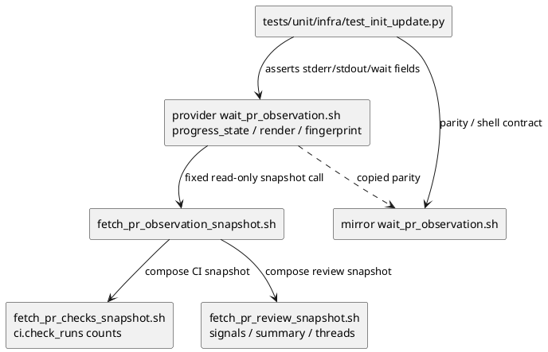
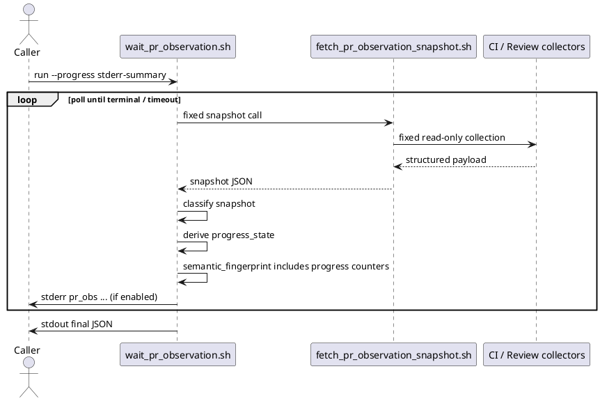

# iss-00174 Refine PR Observation Two Stage Progress Output — 設計（どう実現するか）

## 親図（Diagram）参照
- 親 epic:
  - `epic-00067` は installed agent-tooling assets の provider source / dogfooding mirror parity を前提にする。
- 再利用する決定:
  - `github-pr-observation` skill / scripts が deterministic PR observation を担い、旧 `pr-monitor` sub-agent を復活させない。
  - stdout final JSON を authoritative result とし、stderr progress は長時間待機中の current-state summary に限定する。

## 目的・制約
- 目的:
  - `wait_pr_observation.sh --progress stderr-summary` の progress line を「進行中は詳細、完了後は圧縮」の二段階表示にする。
  - CI / review の count-based progress と quiet reset の意味を、AI agent と human が stderr から推測できるようにする。
- 必須:
  - CI running / pending 中は `checks=done/total` と短い内訳を出す。
  - Review observing 中は、`@codex review` trigger 以後に今回の観測窓で捕捉した Codex review comments / review signals 件数を `comments=N` として出す。
  - CI count progress と review count / thread progress を semantic fingerprint に含め、quiet reset と表示を揃える。
  - provider source と dogfooding mirror の `wait_pr_observation.sh` を一致させる。
- 禁止:
  - progress line に review body、URL、reviewer name、workflow name、job name、failed step detail、P1/P2 text interpretation を出さない。
  - progress 専用の新しい GitHub API call、arbitrary GitHub query、raw `gh` args を追加しない。
  - stdout final JSON の authority を progress line へ移さない。
- 非交渉制約:
  - stdout は final JSON のみ。
  - stderr progress は 1 poll 最大 1 行。
  - `--progress none` は progress を出さない。
  - 通常の `limit` は `none`、optional fields を落としたときだけ `truncated`。

## 既存実装 / 規約の理解
- 参照した実装 / docs:
  - `src/spec_dock/assets/install_root/.agents/skills/github-pr-observation/scripts/wait_pr_observation.sh`
  - `src/spec_dock/assets/install_root/.agents/skills/github-pr-observation/scripts/fetch_pr_observation_snapshot.sh`
  - `src/spec_dock/assets/install_root/.agents/skills/github-pr-observation/scripts/lib/fetch_pr_checks_snapshot.sh`
  - `src/spec_dock/assets/install_root/.agents/skills/github-pr-observation/scripts/lib/fetch_pr_review_snapshot.sh`
  - `.agents/skills/github-pr-observation/scripts/wait_pr_observation.sh`
  - `tests/unit/infra/test_init_update.py`
  - `discussions/20260608t043253z-disc-system-architect-progress-line-two-stage-design.md`
- 現状理解:
  - `wait_pr_observation.sh` は poll ごとに snapshot JSON を取得し、`semantic_fingerprint(payload)` の変化で `latest_change_poll` / quiet window を更新する。
  - 現行 `progress_line()` は `poll elapsed remain phase ci review quiet limit=ok final=stdout_json` の粗い表示だけを返し、最後に `line[:240]` で切る。
  - checks collector は `ci.check_runs` に `total`、`success`、`skipped`、`neutral`、`failed`、`running`、`pending`、`other`、`stale` を出せる。
  - review collector は `review.signals`、`review.codex_authored`、`review.summary`、`review.threads`、`review.fingerprint` を出せる。
- 採用するパターン:
  - 新しい外部取得を増やさず、wait wrapper 内部で snapshot payload から progress projection を作る。
  - rendering と fingerprint が同じ progress-significant counters を参照できる境界を作る。
- 採用しないもの:
  - collectors に progress-only schema を先に追加する。
  - stdout final JSON に progress 専用 schema を追加する。
  - stderr progress を event delta log にする。
- 影響範囲:
  - 主変更は provider / mirror の `wait_pr_observation.sh` と focused regression tests。
  - snapshot collectors は原則変更しない。既存 payload から導出できないことが実装で判明した場合のみ、最小の collector 補助を検討する。

## 採用方針 / トレードオフ
- 論点: progress line の情報量
  - 決定: 進行中だけ count detail を出し、terminal / stable 後は compact status に圧縮する。
  - 理由: 長時間待機中の liveness には counts が必要だが、完了後は stdout final JSON が詳細 authority になるため。
- 論点: quiet reset の説明可能性
  - 決定: progress に出す主要 counters を `semantic_fingerprint()` にも含める。
  - 理由: `ci=running` のまま `checks=1/4 -> 2/4` と進むケースで quiet が伸び続けると、待機の意味が読めないため。
- 論点: review comment count の定義
  - 決定: `comments=N` は `@codex review` trigger 以後に今回の観測窓で捕捉した Codex review comments / review signals 件数とする。
  - 理由: 古い PR 全体コメントや過去 unresolved thread を積むと、今回のレビュー進捗が読めないため。
- 論点: line length
  - 決定: 通常は optional field drop で 240 chars 程度に収める。通常経路で token 途中 slice はしない。
  - 理由: key/value token が途中で切れると agent と human の両方にとって観測価値が落ちるため。

## 依存関係分析
- module / file 依存:
  - `wait_pr_observation.sh` は `fetch_pr_observation_snapshot.sh` に固定契約で依存する。
  - snapshot script は CI collector と review collector を合成する。
  - tests は fake `gh` / fake snapshot harness で wait behavior と stdout/stderr boundary を検証する。
- 上流 / 前提:
  - `fetch_pr_checks_snapshot.sh` が check run counts を snapshot に含める。
  - `fetch_pr_review_snapshot.sh` が trigger-window signals / summary / threads を snapshot に含める。
- 下流 / 依存先:
  - `github-pr-observation` skill を呼ぶ main orchestrator agent が stderr progress を読む。
  - stdout final JSON を読む後続判断は既存契約を維持する。
- 実装起点:
  - focused tests で progress line と quiet reset を先に固定する。
  - provider wait wrapper を変更し、mirror へ同期する。
- 順序への影響:
  - plan では tests -> provider implementation -> mirror parity -> verification の順で組む。

## モジュール依存図（Module Dependency Diagram）
- タイトル:
  - PR observation wait progress projection dependency
- 答える問い:
  - progress 表示と quiet reset の責務をどこに置き、どの dependency direction を固定するか。
- 範囲:
  - `github-pr-observation` の wait wrapper、snapshot script、CI / review collectors、focused tests。
- 含めない詳細:
  - GitHub API endpoint の網羅、全 test fixture、review body persistence の詳細。
- 更新条件:
  - progress projection を collector contract や stdout final JSON schema へ移す場合。
- 図:



## ローカル図の差分（Local Diagram Delta）
- 変更する境界 / 責務:
  - wait wrapper 内に progress projection 境界を追加する。
  - collectors は既存 structured payload の提供元として据え置く。
  - stderr rendering と semantic fingerprint は projection-derived counters により整合させる。

## インターフェース契約
- Public CLI:
  - `wait_pr_observation.sh --progress stderr-summary` は stderr に poll ごとの current-state summary を出す。
  - `wait_pr_observation.sh --progress none` は stderr progress を出さない。
  - stdout は最後に一度だけ parseable JSON を出す。
- Internal helpers:
  - `ci_progress_counts(payload) -> dict`
    - `status`, `done`, `total`, `ok`, `run`, `pend`, `fail`, `other`, `stale` を返す。
    - `checks=done/total` の denominator は初期実装では check runs の `total`。
    - `done` は terminal check runs、`ok` は success / skipped / neutral 相当、`fail` は failure 相当。
  - `review_progress_counts(payload) -> dict`
    - `status`, `comments`, `threads`, `unresolved`, `requested`, `limits` を返す。
    - `comments` は trigger-window Codex review comments / review signals 件数。
    - body text や reviewer name は返さない。
  - `progress_state(payload, phase, poll, elapsed, remain, quiet_elapsed, quiet_required, same_count, same_required, observation_complete) -> dict`
    - rendering と tests の入力になる normalized projection。
  - `render_progress_line(state) -> str`
    - key/value line を deterministic に組み立て、optional fields drop で length budget を守る。
  - `semantic_fingerprint(payload) -> str`
    - progress-significant CI / review counters を含める。
- Progress line always fields:
  - `pr_obs`
  - `poll=N`
  - `elapsed=N`
  - `remain=N`
  - `phase=wait|terminal|timeout`
  - `ci=...`
  - `review=...`
  - `quiet=current/required`
  - `stable=current/required`
  - `limit=none|truncated`
  - `final=stdout_json`
- CI detailed fields:
  - CI が `running` / `pending` / `none` / `unknown`、または required-check wait 中の場合に `checks=D/T ok=N run=N pend=N fail=N` を出す。
  - `other=N` は optional。
- CI compact fields:
  - `ci=passed` は通常 detailed counts を省略する。
  - `ci=failed` は最小 human-action hint として `fail=N` を残せる。
- Review detailed fields:
  - observation complete 前は `review=observing` または current review status に `comments=N` を付ける。
  - `threads=N`、`unresolved=N`、`requested=N` は optional だが、quiet reset 説明に有用な範囲で出す。
- Review compact fields:
  - `review=none` / `review=approved` は通常 count を省略する。
  - `review=unresolved` / `review=changes_requested` / `review=commented` の human gate では `comments=N` を必ず残す。
  - thread state が human gate の根拠なら `threads=N` と `unresolved=N` も残す。
- Optional field drop order:
  - `other`
  - `requested`
  - `threads`
  - `unresolved`
  - `stable`
  - `pend`
  - `run`
  - defensive fallback slice は最後の保険に限る。

## シーケンス差分
- 変更する相互作用:
  - 各 poll で snapshot 取得後、classification / fingerprint の前後に progress projection を作る。
  - fingerprint と renderer が progress-significant counters を共有する。
- retry / external API:
  - 新しい GitHub API call は増やさない。
  - snapshot subprocess timeout / fallback handling は既存どおり。
- UML:



## ドメインモデル差分
- aggregate / entity / value object 変更:
  - N/A。永続 domain model は追加しない。
- policy 変更:
  - wait wrapper の observation policy に「visible progress counters と quiet reset counters を揃える」方針を追加する。
- 不変条件の変更:
  - stdout final JSON は authoritative result のまま。
  - progress line は non-authoritative current-state summary のまま。

## クラス / インターフェース詳細設計
- 対象:
  - shell script 内 Python block の helper functions。
- 責務:
  - `ci_progress_counts`: check run aggregation のみ。
  - `review_progress_counts`: trigger-window review progress aggregation のみ。
  - `progress_state`: rendering 用 state の組み立て。
  - `render_progress_line`: bounded key/value string のみ。
  - `semantic_fingerprint`: quiet reset に必要な semantic source の hashing。
- 連携:
  - `progress_state` と `semantic_fingerprint` は同じ count helper を使うか、少なくとも同じ field set を明示的に参照する。

## ディレクトリ / ファイル変更計画

```text
.
|-- src/spec_dock/assets/install_root/.agents/skills/github-pr-observation/scripts/
|   `-- wait_pr_observation.sh
|       # 変更: progress projection、two-stage rendering、semantic fingerprint counters
|-- .agents/skills/github-pr-observation/scripts/
|   `-- wait_pr_observation.sh
|       # 変更: provider と同一内容へ同期
`-- tests/unit/infra/
    `-- test_init_update.py
        # 変更: PR observation wait progress / quiet reset / parity regression
```

## 要件 → 設計マッピング
- AC-001:
  - `ci_progress_counts` と CI detailed rendering で `checks=2/4 ok=2 run=2 pend=0 fail=0` を出す。
- AC-002:
  - `semantic_fingerprint` に CI check counts を含め、count progress で quiet reset する。
- AC-003:
  - CI terminal passed では compact rendering に切り替える。
- AC-004:
  - `review_progress_counts` の `comments` を trigger-window Codex review comments / signals count として算出する。
- AC-005:
  - `semantic_fingerprint` に review progress counts / threads / unresolved を含める。
- AC-006:
  - review human gate compact rendering で `comments=N` を必須、thread gate では `threads=N unresolved=N` を残す。
- AC-007:
  - public CLI `--progress none` branch を維持し、stderr progress を抑止する。
- AC-008:
  - renderer の入力 projection に body / URL / reviewer / workflow / job / failed step detail を含めない。
- AC-009:
  - `render_progress_line` の optional field drop と `limit=truncated` で満たす。
- AC-010:
  - provider implementation 後に mirror へ同期し、diff / test で parity を確認する。
- EC-001:
  - zero-check grace / limitations は既存 classification を維持し、progress は `ci=none|pending|unknown` と count だけを出す。
- EC-002:
  - skipped / neutral は `ok` と `done` に含める。
- EC-003:
  - failed compact は `ci=failed fail=N` の最小 hint に留める。
- EC-004:
  - `comments=N` は trigger-window count のため、old unresolved thread だけでは増やさない。
- EC-005:
  - trigger timestamp 不明時は既存 limitations を尊重し、安全側 count とする。
- EC-006:
  - timeout / fallback payload でも renderer が stdout final JSON を壊さない。
- EC-007:
  - raw body text だけを progress reset の主因にしない。body hash / metadata は existing review fingerprint に委ねる。
- EC-008:
  - optional field drop と `limit=truncated` で line length を制御する。

## テスト戦略
- 単体 / focused regression:
  - `tests/unit/infra/test_init_update.py` の既存 fake `gh` / fake snapshot 近傍に追加する。
  - CI running detail: stderr に `pr_obs`、`ci=running`、`checks=2/4`、`ok=2`、`run=2`、`pend=0`、`fail=0`。
  - CI progress quiet reset: `checks=0/3 -> 1/3 -> 2/3 -> 3/3` で `latest_change_poll` と stderr `quiet` が更新される。
  - CI passed compact: `ci=passed` で detailed `checks=` を通常省略。
  - Review observing: `comments=0 -> 1 -> 2` が出る。
  - Review quiet reset: comments / threads / unresolved count 変化で `latest_change_poll` が更新される。
  - Review human gate compact: `review=unresolved comments=N threads=N unresolved=N`。
  - `--progress none`: stderr empty、stdout parseable。
  - boundary: progress line に body / URL / reviewer name / workflow name / job name / failed step detail が出ない。
  - truncation: optional fields drop で `limit=truncated`。
  - provider / mirror parity。
- 構文 / parity:
  - `bash -n` を provider / mirror 両方に実行する。
  - `diff -u` で provider / mirror を比較する。
- E2E / manual:
  - 本 issue では live GitHub polling は必須にしない。fixed scripts の fake harness と focused tests を優先する。

## 要件 / 例外 -> 検証マッピング
- AC-001 -> focused pytest stderr assertion。
- AC-002 -> focused pytest final JSON `wait.latest_change_poll` / stderr `quiet` assertion。
- AC-003 -> focused pytest stderr assertion。
- AC-004 -> focused pytest trigger-window fixture / stderr assertion。
- AC-005 -> focused pytest final JSON / stderr assertion。
- AC-006 -> focused pytest human gate stderr assertion。
- AC-007 -> focused pytest stdout/stderr assertion。
- AC-008 -> forbidden token assertion。
- AC-009 -> length / `limit` assertion。
- AC-010 -> `diff -u` / parity test。
- EC-001..EC-008 -> focused pytest または existing regression の維持。

## リスク / 移行 / ロールバック
- リスク: review count drift
  - 対応: `comments=N` の定義を helper と tests に固定し、古い PR 全体コメントを count しない fixture を置く。
- リスク: fingerprint / projection drift
  - 対応: progress に出る count 変化が quiet reset する test と、no-change poll では quiet が伸びる test を置く。
- リスク: line length pressure
  - 対応: deterministic optional field drop と `limit=truncated` を test する。
- リスク: provider / mirror skew
  - 対応: implementation step で provider first、mirror sync、`diff -u`。
- 移行:
  - CLI option は変えない。stderr content のみ richer になる。
  - stdout JSON schema の変更は行わない。
- ロールバック:
  - provider / mirror wait script と focused tests を revert すればよい。永続 schema / data migration はない。

## 未確定事項
- なし。
  - `comments=N` の定義はユーザー interview で確定済み。
  - live GitHub API で review 完了を絶対確定しない方針は requirement の非交渉制約と整合している。
