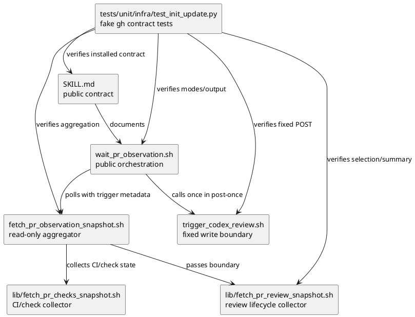
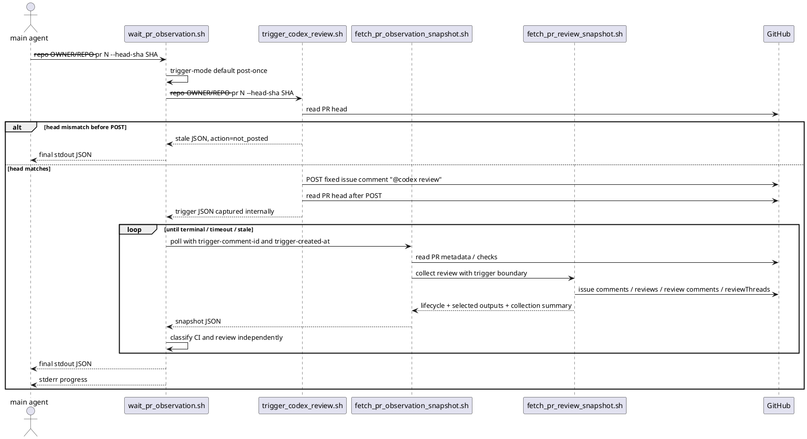

# iss-00176 GitHub PR observation should trigger and wait for Codex review completion — 設計（どう実現するか）

## 親図（Diagram）参照

- Epic:
  - `epic-00067` は、agent-tooling asset の実装 authority を `src/spec_dock/assets/install_root/` に固定している。
  - したがって、この issue の実装 source of truth は `src/spec_dock/assets/install_root/.agents/skills/github-pr-observation/` である。
- Initiative:
  - `init-local-00003` は architecture maintenance / hardening を目的とし、provider-side asset と dogfooding workspace の責務分離を維持する。
- 再利用する決定:
  - retired `pr-monitor` sub-agent は復活しない。
  - retired `github-codex-pr-review-comments` skill は互換 shim として残さない。
  - PR observation は skill / script contract に集約する。

## 目的・制約

- 目的:
  - `wait_pr_observation.sh` の通常実行で、固定本文 `@codex review` の trigger comment を機械的に1回投稿する。
  - 投稿された trigger comment の `comment_id` / `created_at` を、今回 run の唯一の Codex review observation boundary として使う。
  - CI terminal state と Codex review lifecycle を独立に観測し、final `stdout` JSON だけで次アクションを判断できるようにする。
- 必須:
  - trigger mode 未指定時は default `post-once`。
  - timeout / limit 後の継続観測は明示 `resume` mode。
  - selected Codex review 本文と selected review comment 本文は final `stdout` JSON に含める。
  - `stdout` は最終 JSON 1個、`stderr` は progress / diagnostics、`--out` は optional debug / audit copy。
- 禁止:
  - 通常 path で既存 `@codex review` comment を自動 reuse しない。
  - caller-provided body / endpoint / method / raw `gh` args / GraphQL / jq / headers を受け付けない。
  - POST 失敗時に blind retry しない。
  - quiet window、issue comment、reaction だけを Codex review completion primary にしない。
- 前提:
  - `gh` は対象 PR の read と issue comment POST 権限を持つ。
  - `@codex review` comment が Codex review 起動 trigger として機能する。
  - Codex review completion の primary signal は GitHub PR review object として取得できる。取得できない場合は limitation / fallback として表現する。

## 既存実装 / 規約の理解

- 参照した実装 / docs:
  - `src/spec_dock/assets/install_root/.agents/skills/github-pr-observation/SKILL.md`
  - `src/spec_dock/assets/install_root/.agents/skills/github-pr-observation/scripts/wait_pr_observation.sh`
  - `src/spec_dock/assets/install_root/.agents/skills/github-pr-observation/scripts/fetch_pr_observation_snapshot.sh`
  - `src/spec_dock/assets/install_root/.agents/skills/github-pr-observation/scripts/lib/fetch_pr_review_snapshot.sh`
  - `tests/unit/infra/test_init_update.py`
  - `spec-dock/active/epic/design.md`
  - `discussions/20260609t133000z-disc-design-draft-system-architect-pr-observation-codex-review.md`
- 現状理解:
  - `wait_pr_observation.sh` は polling と final JSON / progress / `--out` 境界を持つが、自身では `@codex review` を投稿しない。
  - `fetch_pr_observation_snapshot.sh` は read-only aggregator として PR metadata / CI / review snapshot を集約する。
  - `fetch_pr_review_snapshot.sh` は issue comments / PR reviews / PR review comments / review requests / review threads を固定 API で収集する。
  - 既存の review collector は trigger metadata が無い場合に trigger を推定できるが、通常 wait path では今回 run の trigger boundary を明示的に渡す必要がある。
- 採用するパターン:
  - shipped asset は provider 側 `src/spec_dock/assets/install_root/` を変更する。
  - GitHub 呼び出しは固定 endpoint / fixed args / strict validation に閉じる。
  - テストは既存の fake `gh` harness を使い、live GitHub に依存しない。
- 採用しないもの:
  - 汎用 GitHub write helper。
  - `wait_pr_observation.sh` から caller-provided body を受け取る設計。
  - PR monitor sub-agent / retired skill の復活。
- 影響範囲:
  - `github-pr-observation` skill contract。
  - shipped script 群。
  - installer / update で配布される hidden install-root asset。
  - script contract を検証する unit tests。

## 採用方針 / トレードオフ

- 論点1: `@codex review` 投稿をどこに置くか。
  - 選択肢:
    - A: `wait_pr_observation.sh` 内に直接 POST 実装を埋め込む。
    - B: 固定 write 専用 helper を追加し、`wait_pr_observation.sh` が内部で呼ぶ。
    - C: skill 手順で呼び出しエージェントに投稿させる。
  - 決定:
    - B を採用する。`scripts/trigger_codex_review.sh` を固定 write boundary とし、通常利用者向け entrypoint は `wait_pr_observation.sh` のままにする。
  - 理由:
    - write boundary を audit / test しやすくしつつ、利用エージェントの裁量を排除できる。
- 論点2: timeout 後の継続観測。
  - 選択肢:
    - A: default 実行で常に新規 trigger を投稿する。
    - B: 既存 trigger を自動推定して reuse する。
    - C: default は `post-once`、継続時だけ明示 `resume`。
  - 決定:
    - C を採用する。
  - 理由:
    - 初回の決定性と二重 trigger 回避を両立できる。自動 reuse は古い trigger や手動投稿の混入リスクが高い。
- 論点3: review 本文の所在。
  - 選択肢:
    - A: `--out` にのみ raw body を置く。
    - B: final `stdout` JSON に selected body full text を含める。
    - C: 実行エージェントが後続 `gh api` で取得する。
  - 決定:
    - B を採用する。
  - 理由:
    - final `stdout` JSON を authority に保ち、エージェントが危険な追加 API やノイズの多い全件取得を行う必要をなくす。

## 依存関係分析

- module / file 依存:
  - `SKILL.md`
    - public contract を説明する。実装 script には依存しないが、利用者の entrypoint / option / authority 境界を固定する。
  - `scripts/trigger_codex_review.sh`
    - fixed write boundary。`wait_pr_observation.sh` から内部呼び出しされる。
  - `scripts/wait_pr_observation.sh`
    - public orchestration entrypoint。trigger helper、snapshot aggregator、progress / final JSON / `--out` を統合する。
  - `scripts/fetch_pr_observation_snapshot.sh`
    - read-only snapshot aggregator。trigger metadata を review collector に渡す。
  - `scripts/lib/fetch_pr_review_snapshot.sh`
    - read-only review lifecycle / collection summary authority。
  - `tests/unit/infra/test_init_update.py`
    - shipped asset inclusion、strict validation、fake `gh` behavior、stdout / stderr / `--out` contract を検証する。
- 上流 / 前提:
  - `requirement.md` の AC-001 から AC-008。
  - parent epic の install-root source authority。
- 下流 / 依存先:
  - `github-pr-merge-preparer` など、PR observation JSON を読む skill / workflow。
  - PR 作成後に `wait_pr_observation.sh` を実行するメインエージェント。
- 実装起点:
  - 先に `trigger_codex_review.sh` の固定 contract と tests を作り、次に `wait` の mode / orchestration、最後に snapshot / review JSON shape を接続する。
- 順序への影響:
  - `plan.md` では、固定 write helper → wait mode → review collector output → skill docs / package tests の順で step を組む。

## モジュール依存図（Module Dependency Diagram）

- タイトル:
  - `github-pr-observation` trigger / observation responsibility split
- 答える問い:
  - write boundary と read-only collector の境界をどこで固定し、どの順序で実装するか。
- 範囲:
  - `github-pr-observation` skill 配下 script と関連 tests。
- 含めない詳細:
  - GitHub API の全 field、全 shell function、全 test helper。
- 更新条件:
  - write boundary、entrypoint、JSON authority、review completion primary が変わるとき。



## ローカル図の差分（Local Diagram Delta）

- 変更する境界 / 責務 / 相互作用:
  - `github-pr-observation` は read-only only ではなく、「固定 write helper + read-only observation」に変わる。
  - write は `trigger_codex_review.sh` に閉じ込め、snapshot / review collector は read-only のままにする。
  - public workflow は引き続き `wait_pr_observation.sh` を中心にする。

## インターフェース契約

### `trigger_codex_review.sh`

- 追加する script。
- 入力:
  - `--repo OWNER/REPO`
  - `--pr NUMBER`
  - `--head-sha SHA`
- 許可する GitHub write:
  - `POST repos/{owner}/{repo}/issues/{pr}/comments`
  - body は固定文字列 `@codex review`
- 禁止入力:
  - `--body`
  - `--body-file`
  - `--endpoint`
  - `--method`
  - `--header`
  - `--graphql`
  - `--jq`
  - raw `gh` args
- 処理:
  - POST 前に PR head を固定 read で確認する。
  - head mismatch なら投稿せず、stale/non-success JSON を返す。
  - POST 成功時は comment metadata と body equality evidence を返す。
  - POST 後に PR head を再確認する。
  - POST 後 head mismatch は trigger metadata を保持した stale/non-success とする。
  - POST failure は fail closed。recovery する場合は、before/after issue comments snapshot の差分から exact body `@codex review` が1件だけ新規確認できる場合に限る。
- 出力:
  - `stdout`: JSON 1個。
  - `stderr`: diagnostics のみ。

### `wait_pr_observation.sh`

- 変更する public entrypoint。
- 追加 option:
  - `--trigger-mode post-once|resume`
  - default: `post-once`
- `post-once` mode:
  - `--trigger-comment-id` / `--trigger-created-at` が指定された場合は usage error。
  - `trigger_codex_review.sh` を polling 前に1回だけ呼ぶ。
  - trigger helper stdout は内部で捕捉し、user-facing stdout に流さない。
  - trigger が stale / non-success の場合は final JSON として統合して終了する。
  - 投稿成功時の `comment_id` / `created_at` を全 snapshot poll に渡す。
- `resume` mode:
  - `--trigger-comment-id` と `--trigger-created-at` を必須にする。
  - trigger helper を呼ばない。
  - 明示 metadata を同じ trigger boundary として全 snapshot poll に渡す。
- 出力:
  - `stdout`: final JSON 1個。
  - `stderr`: 1 poll あたり bounded progress / diagnostics。
  - `--out`: `result.json` は stdout と同一。その他は debug / audit。

### `fetch_pr_observation_snapshot.sh`

- read-only aggregator のままにする。
- 変更:
  - 明示 trigger metadata を `fetch_pr_review_snapshot.sh` に必ず渡す。
  - head revalidation を collection 前後または既存 checkpoint で維持する。
  - stale head は success にしない。
  - review collector の lifecycle / selected outputs / collection summary を final snapshot に露出する。

### `fetch_pr_review_snapshot.sh`

- read-only review collector のままにする。
- 変更:
  - explicit trigger metadata を最優先する。
  - normal `wait` path では inferred trigger に依存しない。
  - direct snapshot diagnosis 用の inferred trigger は残せるが、`limitations` に `trigger_inferred` 相当を明示する。
  - Codex-authored submitted PR review を primary completion signal にする。
  - selected PR review / selected review comment / selected review thread を trigger boundary、expected head SHA、Codex author heuristic、submitted review id、review comment id で絞り込む。
  - selected review body full text と selected review comment body full text を JSON に含める。
  - reviews / review_comments / review_threads それぞれで `fetched_count`、`fetched_ids`、`selected_ids`、`boundary_before_excluded_count`、`boundary_before_excluded_ids`、`boundary_before_exclusion_reasons` を返す。
  - review_threads では `unresolved_count` / `unresolved_ids` も返す。

### `body-mode` 適用範囲

- 既存 `--body-mode none|trigger-window-truncated|trigger-window-full|out-only` 相当の body mode は、非選択 raw signals、debug artifact、既存互換の signal body 表示、または audit 出力の制御に限定する。
- normal `wait` / `resume` の final `stdout` JSON では、selected Codex PR review body と selected review comment body は `body-mode` に関係なく全文を含める。
- `body-mode none` / `out-only` / `trigger-window-truncated` は、`codex_review.selected_reviews[].body` と `codex_review.selected_review_comments[].body` を省略・切り詰め・`--out` のみに退避してはならない。
- selected full body を取得できない場合は、空や省略で成功扱いせず、対象 item に `body_collection_status` と limitation を付ける。
- 非選択 signal の body truncation / omission は、従来どおり `body_mode` / `body_sha256` / `omitted_reason` などで表現してよい。
- `--out/raw` に full body audit copy を置くことは許可するが、それは stdout selected body の代替ではない。
- これにより、エージェントは `--body-mode` の指定や `--out` の有無に依存せず、final stdout JSON だけで Codex review 本文を読める。

## シーケンス差分（Sequence Delta）

- 変更する相互作用:
  - `wait_pr_observation.sh` が、polling 前に固定 write helper を呼ぶ。
  - polling は trigger metadata を boundary として read-only collector に渡す。
- retry / transaction / external API:
  - POST failure は blind retry しない。
  - recovery は exact one-comment recovery のみ許可する。
  - trigger 投稿後の head drift では trigger を削除せず stale/non-success にする。



## ドメインモデル差分（Domain Model Delta）

- aggregate / entity / value object 変更:
  - N/A。SpecDock runtime domain model ではなく、shipped agent-tooling script contract の変更である。
- domain event / policy / specification 変更:
  - N/A。
- 不変条件の変更:
  - `post-once` は今回 run が作成した trigger comment だけを boundary とする。
  - `resume` は明示 trigger metadata だけを boundary とし、新規 trigger を作らない。
  - final `stdout` JSON が authority である。

## クラス / インターフェース詳細設計

- N/A:
  - 対象は shell scripts と JSON contract であり、新規 Python class / runtime domain model は追加しない。

## ディレクトリ / ファイル変更計画

```text
.
|-- src/
|   `-- spec_dock/
|       `-- assets/
|           `-- install_root/
|               `-- .agents/
|                   `-- skills/
|                       `-- github-pr-observation/
|                           |-- SKILL.md
|                           |   # 変更: fixed trigger write + read-only observation contract を記述
|                           `-- scripts/
|                               |-- trigger_codex_review.sh
|                               |   # 追加: fixed @codex review issue comment POST helper
|                               |-- wait_pr_observation.sh
|                               |   # 変更: post-once / resume orchestration, final JSON integration
|                               |-- fetch_pr_observation_snapshot.sh
|                               |   # 変更: explicit trigger metadata forwarding and lifecycle exposure
|                               `-- lib/
|                                   |-- fetch_pr_review_snapshot.sh
|                                   |   # 変更: selected full bodies and collection summaries
|                                   `-- fetch_pr_checks_snapshot.sh
|                                       # 原則変更なし。必要な CI status integration があれば最小変更
`-- tests/
    `-- unit/
        `-- infra/
            `-- test_init_update.py
                # 変更: fake gh による script contract / shipped asset regression tests
```

## JSON 契約

- final `stdout` JSON は、既存 field をできる限り保ちながら次の領域を安定 contract として持つ。

```json
{
  "script": "wait_pr_observation.sh",
  "status": "passed|failed|pending|running|none|timeout|stale_head|unknown|human_gate",
  "overall_status": "passed|failed|pending|running|none|timeout|stale_head|unknown|human_gate",
  "normalized_status": "passed|failed|pending|running|none|timeout|stale_head|unknown|human_gate",
  "observation_complete": true,
  "repo": "owner/repo",
  "pr": 13,
  "expected_head_sha": "abc123",
  "current_head_sha": "abc123",
  "head": {
    "expected": "abc123",
    "before_trigger": "abc123",
    "after_trigger": "abc123",
    "current": "abc123",
    "matches_expected": true,
    "stale_phase": null
  },
  "trigger": {
    "mode": "post-once",
    "source": "created_by_wait|resume_argument|diagnostic_inferred",
    "action": "posted|not_posted|recovered|not_attempted",
    "body": "@codex review",
    "body_sha256": "<sha256>",
    "comment_id": 456,
    "node_id": "IC_kw...",
    "created_at": "2026-06-09T10:00:00Z",
    "updated_at": "2026-06-09T10:00:00Z",
    "html_url": "https://github.com/owner/repo/pull/13#issuecomment-456",
    "author": "github-login",
    "head_sha_before_post": "abc123",
    "head_sha_after_post": "abc123",
    "recovered_after_post_error": false
  },
  "summary": {
    "ci": "passed",
    "review": "completed",
    "head": "matched"
  },
  "ci": {
    "status": "passed"
  },
  "codex_review": {
    "lifecycle": {
      "status": "completed|pending|none|fallback|ambiguous|unresolved|unknown",
      "completion_signal": "submitted_pull_request_review|fallback_issue_comment|fallback_reaction|quiet_window|none",
      "confidence": "high|medium|low",
      "selected_review_ids": [987],
      "selected_review_comment_ids": [654],
      "selected_review_thread_ids": ["PRRT_..."]
    },
    "selected_reviews": [
      {
        "id": 987,
        "author": "codex",
        "state": "commented",
        "submitted_at": "2026-06-09T10:05:00Z",
        "commit_id": "abc123",
        "body": "full selected review body text"
      }
    ],
    "selected_review_comments": [
      {
        "id": 654,
        "review_id": 987,
        "author": "codex",
        "created_at": "2026-06-09T10:06:00Z",
        "path": "src/example.py",
        "line": 12,
        "body": "full selected review comment body text"
      }
    ],
    "collection_summary": {
      "reviews": {
        "fetched_count": 1,
        "fetched_ids": [987],
        "selected_ids": [987],
        "boundary_before_excluded_count": 0,
        "boundary_before_excluded_ids": [],
        "boundary_before_exclusion_reasons": []
      },
      "review_comments": {
        "fetched_count": 1,
        "fetched_ids": [654],
        "selected_ids": [654],
        "boundary_before_excluded_count": 0,
        "boundary_before_excluded_ids": [],
        "boundary_before_exclusion_reasons": []
      },
      "review_threads": {
        "fetched_count": 1,
        "fetched_ids": ["PRRT_..."],
        "selected_ids": ["PRRT_..."],
        "unresolved_count": 0,
        "unresolved_ids": [],
        "boundary_before_excluded_count": 0,
        "boundary_before_excluded_ids": [],
        "boundary_before_exclusion_reasons": []
      }
    }
  },
  "review": {
    "status": "completed"
  },
  "resume": {
    "available": false,
    "reason": null,
    "command_hint": null,
    "trigger_comment_id": 456,
    "trigger_created_at": "2026-06-09T10:00:00Z",
    "head_sha": "abc123"
  },
  "limitations": [],
  "recommended_next_action": "merge_ready|address_review_feedback|wait_or_resume|rerun_for_current_head|human_gate"
}
```

- 互換方針:
  - 既存 `review` / `review.signals` は必要に応じて残す。
  - ただし、Codex review completion と selected full bodies の主契約は `codex_review` とする。
  - 既存 `body_mode` は非選択 raw signals / debug artifact の互換制御として残せるが、`codex_review.selected_reviews[].body` と `codex_review.selected_review_comments[].body` には適用しない。
  - `--out/result.json` は final stdout JSON と完全一致させる。

## 状態判定ルール

- `passed`:
  - head が expected と一致。
  - CI が passed。
  - Codex-authored submitted PR review が trigger boundary 以降に取得済み。
  - blocking limitation がない。
- `failed`:
  - CI が failed。
  - または fixed collection が terminal non-success を返す。
- `timeout`:
  - deadline / limit 到達時点で CI または Codex review lifecycle が完了していない。
  - trigger metadata があれば `resume.available=true` とし、明示 resume 用の metadata を返す。
- `stale_head`:
  - 投稿前、投稿直後、観測中のいずれかで current PR head が expected head SHA と一致しない。
- `human_gate`:
  - changes requested、unresolved thread、fallback-only completion、ambiguous completion、draft PR、permission uncertainty など、人間またはメインエージェント判断が必要な状態。
- fallback:
  - Codex issue comment、reaction、review-comment-only activity、quiet window は補助 signal として扱えるが、`completion_signal=submitted_pull_request_review` とは区別する。

## `--out` 境界

- 許可 artifact:
  - `result.json`: final stdout JSON の exact copy。
  - `latest.json`: 最新 snapshot。
  - `events.ndjson`: bounded polling events。
  - `latest_delta.json`: 最新差分 metadata。
  - `snapshots/`: per-poll snapshot copy。
  - `raw/`: fixed raw collection / body audit。
- 禁止:
  - selected review body full text の唯一の所在を `--out` にする。
  - `--out` だけで final status を再定義する。
  - `summary.md` を生成する。

## 要件 → 設計マッピング

- AC-001:
  - `wait_pr_observation.sh` の default `post-once` mode と `trigger_codex_review.sh` 呼び出しで満たす。
- AC-002:
  - `trigger_codex_review.sh` の strict validation / fixed POST endpoint / fixed body で満たす。
- AC-003:
  - `wait_pr_observation.sh` が trigger stdout を捕捉し、final JSON に統合する。`stdout` / `stderr` / `--out` 境界を維持する。
- AC-004:
  - `fetch_pr_review_snapshot.sh` の `codex_review.lifecycle` と selected review / comment full body output で満たす。
- AC-005:
  - `fetch_pr_observation_snapshot.sh` が CI と review lifecycle を別 family として保持し、`wait` が final status で合流させる。
- AC-006:
  - `trigger_codex_review.sh` の pre/post head check と snapshot during-poll head revalidation で満たす。
- AC-007:
  - POST failure は fail closed、recovery は exact one-comment のみで満たす。
- AC-008:
  - `--trigger-mode resume` と必須 trigger metadata、collection summary で満たす。
- EC-001:
  - trigger helper / snapshot collector が auth / permission / rate limit / schema failure を limitation として JSON 化する。
- EC-002:
  - submitted PR review 不在は fallback / timeout / human_gate として表現する。
- EC-003:
  - CI failure は review completion と独立に non-merge-ready とする。
- EC-004:
  - CI 完了だけでは success にせず、review pending を維持する。
- EC-005:
  - default `post-once` は既存 trigger を reuse しない。
- EC-006:
  - selected body は stdout JSON に含め、`--out` は copy/debug とする。
- EC-007:
  - timeout final JSON に resume metadata と collection summary を残す。

## テスト戦略

- 単体 / script contract:
  - `tests/unit/infra/test_init_update.py` に fake `gh` を使った regression tests を追加する。
  - live GitHub には依存しない。
- Trigger write tests:
  - default wait が `trigger_codex_review.sh` を1回だけ呼ぶ。
  - fixed POST は `gh api --method POST repos/owner/repo/issues/13/comments -f body=@codex review` 相当だけを行う。
  - caller-provided body / endpoint / method / GraphQL / jq / header / raw args は usage error になり、fake `gh` に到達しない。
  - POST failure で blind retry しない。
  - exact one-comment recovery は採用し、0件または複数件は fail closed になる。
- Mode validation tests:
  - trigger mode 省略時は `post-once`。
  - `post-once` + trigger metadata は usage error。
  - `resume` は `--trigger-comment-id` / `--trigger-created-at` 両方必須。
  - `resume` は trigger helper / POST endpoint を呼ばない。
  - `resume` は明示 trigger metadata を全 snapshot poll に渡す。
- Head SHA tests:
  - pre-trigger mismatch は POST しない。
  - post-trigger mismatch は trigger metadata を保持し stale/non-success。
  - polling mismatch は stale/non-success で trigger を削除しない。
- Review lifecycle tests:
  - trigger 後の Codex-authored submitted PR review を primary completion とする。
  - trigger 前の PR review は boundary-before evidence 付きで除外する。
  - non-Codex review は Codex completion として選択しない。
  - linked review comment full body を stdout JSON に含める。
  - `--body-mode none` / `out-only` / `trigger-window-truncated` 相当の指定があっても、selected review body と selected review comment body は stdout JSON に全文で残る。
  - selected body が取得できない場合は limitation が出て success にならない。
  - review threads の unresolved IDs/counts を返す。
  - reviews / review_comments / review_threads の fetched IDs / selected IDs / boundary-before exclusion evidence を返す。
- Stdout / stderr / `--out` tests:
  - stdout は JSON 1個として parse できる。
  - selected review body full text が stdout JSON に存在する。
  - stderr は bounded progress / diagnostics のみ。
  - `--progress none` は progress を抑止する。
  - `--out/result.json` は stdout と同一。
  - `summary.md` は生成されない。
- Scaffold / package tests:
  - new script `scripts/trigger_codex_review.sh` が shipped asset / installed layout に含まれる。
  - hidden install-root asset の package data regression を維持する。

## 要件 / 例外 -> 検証マッピング

- AC-001 -> Trigger write tests / Mode validation tests。
- AC-002 -> Trigger write tests。
- AC-003 -> Stdout / stderr / `--out` tests。
- AC-004 -> Review lifecycle tests。
- AC-005 -> Review lifecycle tests / existing CI observation tests。
- AC-006 -> Head SHA tests。
- AC-007 -> Trigger write tests。
- AC-008 -> Mode validation tests / Review lifecycle tests。
- EC-001 -> Trigger write tests / snapshot collection failure tests。
- EC-002 -> Review lifecycle fallback / timeout tests。
- EC-003 -> CI failed + review completed mixed-state test。
- EC-004 -> CI passed + review pending wait/timeout test。
- EC-005 -> Mode validation tests。
- EC-006 -> Stdout / stderr / `--out` tests。
- EC-007 -> Resume timeout JSON tests。

## リスク / 移行 / ロールバック

- リスク:
  - selected review body full text を stdout に入れるため、出力サイズが増える。
  - Codex author login / bot 表現は GitHub integration の実体に依存する可能性がある。
  - POST response loss 後の recovery は実装を誤ると二重投稿または取りこぼしにつながる。
- 緩和:
  - selected body の stdout 収録は、エージェントが追加 API を叩くリスクを減らすため意図的に採用する。
  - Codex author heuristic は selected author evidence / confidence / limitations として JSON に残す。
  - recovery は exact one-comment のみに限定し、曖昧な場合は fail closed にする。
- 移行:
  - `wait_pr_observation.sh` の通常 invocation は trigger 投稿を行う contract に変わるため、skill docs で明示する。
  - 継続観測は `resume` mode に移行する。
- ロールバック:
  - script contract が破綻した場合は、`wait` から trigger helper 呼び出しを外すよりも、trigger helper を fail closed にして write を止める方が安全である。

## 未確定事項

- なし。
  - Codex author login の揺れや GitHub response fields の差異は、設計上は `confidence` / `limitations` で表現し、実装時に fake `gh` tests と現行 field 確認で詰める。
