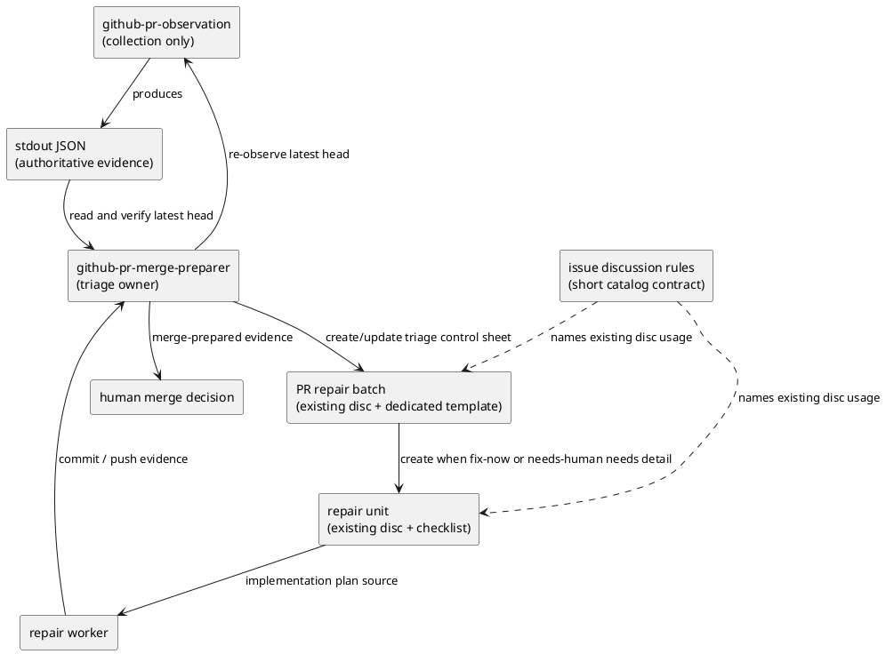
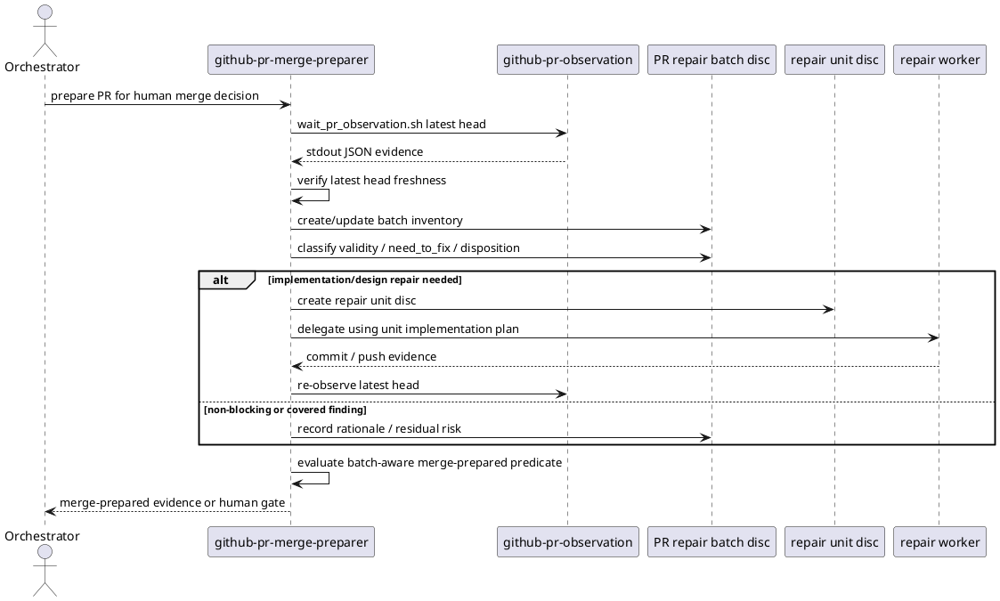

# iss-00178 Review Feedback Triage — 設計（どう実現するか）

## 親図（Diagram）参照

- Epic 図:
  - `epic-00067` は installed agent-tooling assets の source-of-truth 整理を扱う。provider-side `src/spec_dock/assets/install_root/` を正本とし、dogfooding `.agents/` は確認面として扱う。
- Initiative 図:
  - `init-local-00003` は architecture maintenance / hardening の文脈で、agent workflow と shipped scaffold の整合を保つ。
- 再利用する決定:
  - agent-tooling assets は `src/spec_dock/assets/install_root/` を正本とする。
  - `spec-dock/` と `.agents/` は dogfooding / installed-copy 確認対象であり、実装正本ではない。
  - discussion artifact は canonical docs への直接 authority ではなく、採用は `report.md` Evidence Adoption Ledger と canonical docs への再記述で成立する。

## 目的・制約

- 目的:
  - `github-pr-merge-preparer` に PR Repair Triage Gate を追加し、PR observation 後の複数 finding / failure を修正前に batch と repair unit へ整理する。
  - PR repair batch は existing `disc` だが、PR repair batch 専用 template を使う control sheet とする。
  - repair unit は existing `disc` とし、必須 checklist で補強する。
- 必須 / 禁止:
  - 必須: observation 後、fix delegation 前に batch triage を通す。
  - 必須: `github-pr-observation` は collection-only boundary を維持する。
  - 禁止: runtime `new doc --template`、first-class doc type、runtime template catalog、自動分類 runtime、CI log parser の追加。
- 非交渉制約:
  - stdout JSON は observation authoritative evidence であり、risk / disposition / grouping は `github-pr-merge-preparer` 側の判断である。
  - merge は人間 action のまま残す。
- 前提:
  - `github-pr-observation` は current trigger boundary の review body / selected review comment body を final stdout JSON に含める。
  - `github-pr-merge-preparer` は stdout JSON を読み、latest head SHA freshness を確認できる。

## 既存実装 / 規約の理解

- 参照した実装 / docs:
  - `src/spec_dock/assets/install_root/.agents/skills/github-pr-merge-preparer/SKILL.md`
  - `src/spec_dock/assets/install_root/.agents/skills/github-pr-observation/SKILL.md`
  - `.agents/skills/github-pr-merge-preparer/SKILL.md`
  - `.agents/skills/github-pr-observation/SKILL.md`
  - `src/spec_dock/assets/spec_dock/docs/rules/issue/discussions.md`
  - `spec-dock/docs/rules/issue/discussions.md`
  - `spec-dock/templates/discussions/disc.md`
  - `src/spec_dock/assets/spec_dock/scripts/spec_dock_runtime/commands/new.py`
  - `src/spec_dock/assets/spec_dock/scripts/spec_dock_runtime/application/create_node.py`
- 現状理解:
  - `github-pr-merge-preparer` は observation と repair delegation の間に coarse classification を持つが、batch inventory / validity / need-to-fix / repair unit grouping を明示する gate は持たない。
  - `github-pr-observation` は deterministic trigger と evidence collection の境界を持ち、判断責務を持たない。
  - `new doc` runtime は `--template` option を持たず、`disc` は汎用 synthesis template を読む。
  - provider-side skill/docs と dogfooding copy は現在一致している。
- 採用するパターン:
  - provider-side source first。
  - dogfooding copy は同期/確認対象。
  - full operational template は実行主体である `github-pr-merge-preparer` skill 配下の skill-local template として置く。
  - `discussions.md` には catalog 上の短い契約だけ置く。
- 採用しないもの:
  - runtime template registry。
  - new doc type。
  - observation script の JSON schema / GitHub API collection logic 変更。
- 影響範囲:
  - agent skill guidance。
  - issue discussion rules guidance。
  - dogfooding installed-copy parity。
  - runtime command behavior は影響範囲外。

## 採用方針 / トレードオフ

- 論点: PR repair batch 専用 template の置き場所
  - 選択肢:
    - `github-pr-merge-preparer` skill 配下に skill-local template file を置く。
    - `github-pr-merge-preparer` skill 本文に full skeleton を直接置く。
    - `docs/rules/issue/discussions.md` に full template を置く。
    - runtime `new doc --template` で生成する。
  - 決定:
    - full template は `src/spec_dock/assets/install_root/.agents/skills/github-pr-merge-preparer/templates/pr-repair-batch.md` に置く。
    - `github-pr-merge-preparer/SKILL.md` はその template を PR repair batch の正本として参照し、workflow と checklist を説明する。
    - `discussions.md` には「PR repair batch は existing `disc` だが専用 template を使い、詳細は `github-pr-merge-preparer` に従う」という短い契約だけ置く。
  - 理由:
    - batch を実際に作成・運用する主体は `github-pr-merge-preparer` である。
    - skill 本文に長大 skeleton を埋め込むより、template file と workflow guidance を分けた方が転記漏れを減らせる。
    - discussion rules を長大な workflow manual にしない。
    - runtime contract 固定前に pilot 運用で template を調整できる。

- 論点: repair unit artifact
  - 選択肢:
    - new doc type を追加する。
    - existing `disc` を使い、skill checklist で補強する。
  - 決定:
    - existing `disc` を使い、`source_batch` / `unit_id` / `covered_ids` / analysis / design / plan / validation / evidence checklist で補強する。
  - 理由:
    - repair unit は synthesis / proposal / implementation plan の detail artifact であり、`disc` の意味論に収まる。

- 論点: observation と judgment の境界
  - 決定:
    - `github-pr-observation` には classification / disposition / grouping を持たせない。
  - 理由:
    - collection script に judgment を持たせると stdout evidence と orchestrator judgment が混ざる。

## 依存関係分析

- module 依存:
  - `github-pr-merge-preparer` depends on `github-pr-observation` stdout JSON。
  - `github-pr-observation` must not depend on `github-pr-merge-preparer` vocabulary。
  - discussion rules refer to skill guidance, but do not duplicate the full PR repair batch template。
- file 依存:
  - `src/spec_dock/assets/install_root/.agents/skills/github-pr-merge-preparer/SKILL.md`
    - 主変更点。PR Repair Triage Gate、template 参照、repair unit checklist、merge-prepared predicate を持つ。
  - `src/spec_dock/assets/install_root/.agents/skills/github-pr-merge-preparer/templates/pr-repair-batch.md`
    - 主変更点。PR repair batch 専用 template の正本を持つ。
  - `src/spec_dock/assets/install_root/.agents/skills/github-pr-observation/SKILL.md`
    - collection-only boundary の短い明記だけを行う。
  - `src/spec_dock/assets/spec_dock/docs/rules/issue/discussions.md`
    - PR repair batch/unit が existing `disc` であり、batch は専用 template を使う短い catalog contract を追加する。
  - `.agents/skills/...` と `spec-dock/docs/rules/issue/discussions.md`
    - dogfooding confirmation / sync target。
- 上流 / 前提:
  - fresh-pass 済み `requirement.md`。
  - `discussions/20260610t031332z-disc-pr-repair-batch-dedicated-sheet-analysis.md`。
  - `discussions/20260610t032530z-disc-system-architect-design-draft.md`。
- 下流 / 依存先:
  - `plan.md` は provider-side skill update、docs rule update、dogfooding parity check、runtime unchanged confirmation の順で実装 step を組む。
- 実装起点:
  - まず `github-pr-merge-preparer` skill の contract を固定する。
  - 次に observation boundary note と discussion rules contract を合わせる。
- 順序への影響:
  - `github-pr-merge-preparer` の skill-local template と workflow contract が最初に固まらないと、discussion rules の参照先と plan の inspect criteria が不安定になる。

## モジュール依存図（Module Dependency Diagram）

- タイトル:
  - PR observation evidence から repair triage / repair unit / human merge decision へ進む責務境界
- 答える問い:
  - `github-pr-observation`、`github-pr-merge-preparer`、batch `disc`、repair unit `disc`、repair worker の依存方向と責務境界はどこか。
- 範囲:
  - agent skill workflow、discussion artifact contract、human merge decision handoff。
- 含めない詳細:
  - GitHub API call graph、stdout JSON schema の全フィールド、CI log parsing、runtime `new doc` internals。
- 更新条件:
  - observation と judgment の責務境界、batch / unit artifact contract、repair worker handoff、merge-prepared predicate が変わるとき。



## ローカル図の差分（Local Diagram Delta）

- 変更する境界 / 責務 / 相互作用:
  - `github-pr-merge-preparer`: observation result の利用後、repair delegation 前に PR Repair Triage Gate を挿入する。
  - `github-pr-observation`: collection-only boundary を維持し、judgment は持たない。
  - discussion rules: batch / unit の catalog contract を短く案内する。

## インターフェース契約

- PR Repair Batch template:
  - source:
    - provider: `src/spec_dock/assets/install_root/.agents/skills/github-pr-merge-preparer/templates/pr-repair-batch.md`
    - dogfooding copy: `.agents/skills/github-pr-merge-preparer/templates/pr-repair-batch.md`
  - file existence:
    - prose-only skeleton in `SKILL.md` is insufficient. The provider template file must exist and contain the operational batch control sheet structure.
  - sections:
    - `PR / Observation Metadata`
    - `Batch Purpose`
    - `Concern Catalog`
    - `Inventory`
    - `Classification Values`
    - `Per-Concern Analysis`
    - `Repair Queue`
    - `Unit Discussion Plan`
    - `Stop Conditions`
    - `Merge-Prepared Gate`
  - inventory columns:
    - `ID`
    - `source_type`
    - `concern`
    - `evidence`
    - `summary`
    - `validity`
    - `risk_class`
    - `need_to_fix`
    - `disposition`
    - `repair_unit`
    - `status`
  - classification values:
    - `validity`: `valid` / `partially-valid` / `false-positive` / `duplicate` / `unknown`
    - `risk_class`: `blocking` / `material-follow-up` / `minor` / `false-positive` / `duplicate`
    - `need_to_fix`: `yes` / `no` / `follow-up` / `human-decision`
    - `disposition`: `fix-now` / `follow-up` / `no-action` / `covered-by` / `needs-human`
    - `status`: `untriaged` / `triaged` / `unit-needed` / `unit-created` / `implemented` / `reobserved-pass` / `blocked`

- Repair Unit `disc` checklist:
  - `source_batch`
  - `unit_id`
  - `covered_ids`
  - `source_links`
  - `failure_class`
  - `risk_class`
  - `disposition`
  - `Validity Analysis`
  - `Need-To-Fix Decision`
  - `Root Cause`
  - `Options Considered`
  - `Recommended Design`
  - `Implementation Plan`
  - `Validation Plan`
  - `Implementation Result`
  - `Commit Evidence`
  - `Re-observation Result`
  - `Residual Risk / Follow-up`

- Merge-prepared additional predicate:
  - no required check failure remains.
  - no non-required check failure remains unless the check is known optional or the user explicitly waived it; waived or optional non-required failures are reported as residual risk.
  - no `untriaged` inventory item remains.
  - no unresolved `needs-human` item remains.
  - no `blocking` item with incomplete `fix-now` repair unit remains.
  - every `follow-up`, `no-action`, `covered-by`, `duplicate`, or `false-positive` has rationale and residual risk where relevant.
  - `review-clean: no` may coexist with `merge-prepared: yes` when remaining findings are triaged and non-blocking.

## シーケンス差分（Sequence Delta）

- タイトル:
  - PR Repair Triage Gate を挿入した PR merge preparation sequence
- 答える問い:
  - observation 後、fix delegation 前にどの順序で batch triage、repair unit 作成、worker handoff、re-observation、merge-prepared 判定を行うか。
- 範囲:
  - `github-pr-merge-preparer` の orchestration sequence と artifact handoff。
- 含めない詳細:
  - shell script 内部処理、GitHub API pagination、review body extraction、repair worker 内部の具体実装。
- 更新条件:
  - PR Repair Triage Gate の位置、repair unit 作成条件、worker handoff、re-observation loop、merge-prepared 条件が変わるとき。



## ドメインモデル差分

- 新しい runtime domain model は追加しない。
- workflow vocabulary と artifact contract のみ追加する。
- domain-like terms:
  - `PR Repair Triage Gate`
  - `PR repair batch`
  - `repair unit`
  - `review-clean`
  - `merge-prepared`

## ディレクトリ / ファイル変更計画

```text
.
|-- src/spec_dock/assets/install_root/.agents/skills/
|   |-- github-pr-merge-preparer/
|   |   |-- SKILL.md
|   |   |   # 変更: PR Repair Triage Gate、batch template 参照、
|   |   |   #       repair unit checklist、batch-aware merge-prepared predicate、
|   |   |   #       response checklist additions
|   |   `-- templates/
|   |       `-- pr-repair-batch.md
|   |           # 追加: PR repair batch 専用 template 正本
|   `-- github-pr-observation/
|       `-- SKILL.md
|           # 変更: collection-only boundary clarification
|-- src/spec_dock/assets/spec_dock/docs/rules/issue/
|   `-- discussions.md
|       # 変更: PR repair batch/unit は existing disc であり、
|       #       詳細は github-pr-merge-preparer に従う短い契約
|-- .agents/skills/
|   |-- github-pr-merge-preparer/
|   |   |-- SKILL.md
|   |   `-- templates/pr-repair-batch.md
|   `-- github-pr-observation/SKILL.md
|       # dogfooding confirmation/sync target
`-- spec-dock/docs/rules/issue/
    `-- discussions.md
        # dogfooding confirmation/sync target
```

Forbidden:

- `src/spec_dock/assets/spec_dock/scripts/spec_dock_runtime/**`
- `src/spec_dock/assets/spec_dock/templates/**`
- new discussion doc type
- runtime `--template` parser / command

## 要件 → 設計マッピング

- AC-001 -> `github-pr-merge-preparer` workflow に PR Repair Triage Gate を追加する。
- AC-002 -> `github-pr-merge-preparer` skill-local template として PR repair batch 専用 template を置き、skill から参照する。
- AC-003 -> batch interface に classification vocabulary を固定する。
- AC-004 -> repair unit `disc` checklist と worker handoff contract を追加する。
- AC-005 -> batch template に non-fix disposition rationale と residual risk を要求する。
- AC-006 -> merge-prepared additional predicate と response checklist を追加する。
- AC-007 -> `github-pr-observation` collection-only boundary clarification を追加する。
- AC-008 -> skill-local template 以外の runtime templates / doc type に変更を加えない design guard を置く。
- EC-001 -> timeout / observation limit は batch inventory item として扱い、resume metadata を証跡化する。
- EC-002 -> `Concern Catalog` / `Per-Concern Analysis` / `Repair Queue` で same root cause を unit grouping する。
- EC-003 -> `validity=false-positive` または `risk_class=false-positive`、`disposition=no-action` または `covered-by`、および false-positive / stale / already-addressed rationale を batch に残す。
- EC-004 -> `follow-up` / `needs-human` と stop condition で scope expansion を止める。
- EC-005 -> fix loop limits と batch status で repeated failure class を human gate にする。

## テスト戦略

- 単体:
  - runtime code を変更しないため、新規 runtime unit test は原則不要。
  - 実装が runtime に触れた場合は design scope 逸脱として plan amendment に戻す。
- 統合:
  - provider-side と dogfooding copy の一致確認を行う。
  - supported update/sync path を使う場合は、そのコマンド結果を `report.md` に記録する。
- inspect-only:
  - `github-pr-merge-preparer/SKILL.md` に PR Repair Triage Gate、batch template 参照、repair unit checklist、batch-aware merge-prepared predicate があること。
  - `github-pr-merge-preparer/templates/pr-repair-batch.md` に PR repair batch 専用 template の required sections / inventory / classification values があること。
  - `github-pr-observation/SKILL.md` に collection-only boundary が残っていること。
  - `docs/rules/issue/discussions.md` が短い catalog contract に留まり、full template を重複していないこと。
  - `git diff -- src/spec_dock/assets/spec_dock/scripts/spec_dock_runtime` が空であること。
  - `git diff --check` が pass すること。

## 要件 / 例外 -> 検証マッピング

- AC-001 -> `rg -n "PR Repair Triage Gate|fix delegation" src/spec_dock/assets/install_root/.agents/skills/github-pr-merge-preparer/SKILL.md`
- AC-002 -> `test -f src/spec_dock/assets/install_root/.agents/skills/github-pr-merge-preparer/templates/pr-repair-batch.md` and `rg -n "PR repair batch|Concern Catalog|Inventory|Unit Discussion Plan|Merge-Prepared Gate" ...github-pr-merge-preparer/templates/pr-repair-batch.md`
- AC-003 -> `rg -n "validity|risk_class|need_to_fix|disposition|repair_unit|status" ...github-pr-merge-preparer/SKILL.md`
- AC-004 -> `rg -n "repair unit|source_batch|covered_ids|Implementation Plan|Re-observation Result" ...github-pr-merge-preparer/SKILL.md`
- AC-005 -> `rg -n "follow-up|no-action|covered-by|false-positive|residual risk" ...github-pr-merge-preparer/SKILL.md`
- AC-006 -> `rg -n "review-clean|merge-prepared|untriaged|needs-human" ...github-pr-merge-preparer/SKILL.md`
- AC-007 -> `rg -n "classification|disposition|repair unit grouping|collection" ...github-pr-observation/SKILL.md`
- AC-008 -> `git diff -- src/spec_dock/assets/spec_dock/scripts/spec_dock_runtime src/spec_dock/assets/spec_dock/templates`
- EC-001..EC-005 -> `github-pr-merge-preparer/SKILL.md` と `templates/pr-repair-batch.md` の Stop Conditions / batch template / loop limits を inspection。

## リスク / 移行 / ロールバック

- リスク:
  - skill-local template と skill guidance が drift する。
    - 対策: skill は template path を明示し、検証で template sections と skill reference の両方を確認する。
  - agents が batch artifact を省略して raw finding を worker に渡す。
    - 対策: PR Repair Triage Gate を fix delegation 前の必須 gate として明記する。
  - `github-pr-observation` に judgment language が混ざる。
    - 対策: collection-only boundary を明記し、classification は `github-pr-merge-preparer` に置く。
  - dogfooding copy が provider source と drift する。
    - 対策: provider-side first、dogfooding parity check。
- 移行:
  - 既存 artifact / runtime migration は不要。既存 `disc` catalog を使う。
- ロールバック:
  - provider-side skill/docs 変更を revert し、dogfooding copy を再同期または差分確認する。runtime migration rollback は不要。

## 未確定事項

- なし。
