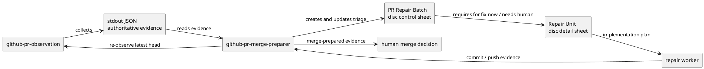

# 20260610t032530z-disc System Architect Design Draft

## 1. Requirement Coverage

この draft は `iss-00178 Review Feedback Triage` の design 採用候補である。Requirement は fresh pass 済みとして渡されており、本 draft は canonical `design.md` へ main orchestrator が再記述するための evidence に留める。

要件 coverage:

- AC-001: `github-pr-merge-preparer` の observation 後、fix delegation 前に PR Repair Triage Gate を追加する。
- AC-002: PR repair batch は既存 `disc` として作成し、専用 structured skeleton を skill 内に持つ。
- AC-003: batch inventory に `validity`、`risk_class`、`need_to_fix`、`disposition`、`repair_unit`、`status` を持たせ、妥当性と修正必要性を分離する。
- AC-004: `fix-now` / `needs-human` で実装修正・設計判断が必要なものは repair unit `disc` に渡し、repair worker は raw finding ではなく unit の plan を根拠にする。
- AC-005: `follow-up` / `no-action` / `covered-by` / `duplicate` / `false-positive` は batch 内 rationale で閉じられる。
- AC-006: `merge-prepared` 判定に batch triage 完了状態を加え、`review-clean` と区別する。
- AC-007: `github-pr-observation` は evidence collection boundary を維持し、risk / disposition / grouping を持たない。
- AC-008: first-class doc type、runtime `new doc --template`、自動分類 runtime、CI log parser は追加しない。

Requirement gap:

- なし。設計に必要な scope / non-scope / vocabulary / acceptance criteria は requirement に十分固定されている。

## 2. Existing Context Findings

既存 context:

- `src/spec_dock/assets/install_root/.agents/skills/...` は epic-00067 の provider-side source of truth である。
- dogfooding `.agents/skills/...` は installed layout の確認面であり、通常の実装 source of truth ではない。
- 現時点で provider-side skill と dogfooding skill は `cmp` で一致していた。
- `github-pr-merge-preparer` は PR 作成/発見、`github-pr-observation` 呼び出し、coarse failure classification、bounded repair delegation、re-monitor、`merge-prepared` 判定を持つ。
- 現行 `github-pr-merge-preparer` は observation 後に複数 finding / failure を inventory 化し、妥当性、修正必要性、repair unit grouping を明示する gate を持っていない。
- `github-pr-observation` は fixed `@codex review` trigger と PR evidence collection を担い、stdout JSON を authoritative evidence とする。
- `github-pr-observation` は collection-only boundary を既に強く持っており、判断責務を追加すると既存 contract を壊す。
- `docs/rules/issue/discussions.md` は discussion catalog と authority rule を説明する軽量 reference であり、長大な skeleton を置く場所としては重い。
- runtime `new doc` の template variant は現行 scope 外であり、追加すると parser、application template resolution、provider template、docs、tests まで広がる。

## 3. Design Decisions

### D-001: Source of Truth

変更対象の正本は provider-side の次の skill / docs とする。

- `src/spec_dock/assets/install_root/.agents/skills/github-pr-merge-preparer/SKILL.md`
- `src/spec_dock/assets/install_root/.agents/skills/github-pr-observation/SKILL.md`
- `src/spec_dock/assets/spec_dock/docs/rules/issue/discussions.md`

dogfooding copy は実装 source ではなく、provider-side 変更後の確認/同期対象とする。実装計画では provider-side 変更後に dogfooding copy との一致を確認し、必要なら supported update/sync path で反映する。

### D-002: PR Repair Triage Gate

`github-pr-merge-preparer` の workflow に、observation result freshness check の後、bounded repair delegation の前に PR Repair Triage Gate を入れる。

Gate の責務:

- latest head SHA と observation result の一致確認。
- review finding、CI/check failure、merge blocker、observation limitation の全件 inventory 化。
- item ごとの `validity` と `need_to_fix` の分離判断。
- `risk_class`、`disposition`、`repair_unit`、`status` の付与。
- concern 単位の grouping と repair unit 作成判断。
- batch 完了条件と stop condition の確認。

### D-003: Batch Dedicated Skeleton Placement

PR repair batch の full skeleton は `github-pr-merge-preparer` skill に置く。理由は、batch を作成して運用する主体が `github-pr-merge-preparer` workflow であり、実行時に agent が読む必要のある contract だからである。

`docs/rules/issue/discussions.md` には短い catalog contract だけを追記する。長大 skeleton は置かない。

短い catalog contract の内容:

- PR repair batch と PR repair unit は既存 `disc` として作成する。
- batch は `github-pr-merge-preparer` の dedicated skeleton に従う。
- unit は `github-pr-merge-preparer` の repair unit checklist に従う。
- canonical 採用は通常の discussion evidence rule に従い、discussion 自体は accepted authority を主張しない。

### D-004: Repair Unit `disc` Checklist

repair unit は新 doc type ではなく既存 `disc` とする。ただし `github-pr-merge-preparer` skill に必須 checklist を置く。

必須 checklist:

- `source_batch`
- `unit_id`
- `covered_ids`
- `source_links`
- `failure_class`
- `risk_class`
- `disposition`
- `Validity Analysis`
- `Need-To-Fix Decision`
- `Root Cause`
- `Options Considered`
- `Recommended Design`
- `Implementation Plan`
- `Validation Plan`
- `Implementation Result`
- `Commit Evidence`
- `Re-observation Result`
- `Residual Risk / Follow-up`

repair worker への handoff contract:

- repair worker は raw finding ではなく repair unit `disc` の `Implementation Plan` を source of truth とする。
- plan 逸脱、追加 scope、同一 failure 再発、曖昧な review intent は human gate へ戻す。

### D-005: Observation Collection-Only Boundary

`github-pr-observation` は collection-only boundary を維持する。設計上、ここに risk classification、disposition、repair unit grouping を追加しない。

実装で追加する場合も、許容されるのは「この skill は classification / disposition / grouping を行わない」という境界説明の明記までに留める。script、JSON schema、GitHub API collection logic は変更しない。

### D-006: Runtime `new doc --template` は変更しない

`new doc disc --template pr-repair-batch` や `--template pr-repair-unit` は今回実装しない。

理由:

- Requirement の対象外である。
- runtime scope が広く、docs-only / skill-guidance issue から逸脱する。
- pilot 前に template registry や validation contract を固定すると、運用で skeleton を調整しづらい。

将来昇格条件:

- agent が skeleton 転記を頻繁に誤る。
- batch 構造を `spec-dock validate` で機械検証したい。
- CLI 生成が workflow 成功条件になる。
- pilot で batch / unit skeleton が安定する。

## 4. Alternatives Considered

### Option A: full skeleton を discussion rules に置く

- Pros:
  - discussion catalog だけで artifact 構造を参照できる。
- Cons:
  - `docs/rules/issue/discussions.md` が catalog ではなく workflow manual になり重くなる。
  - 実際に batch を作る agent が読むべき詳細が skill から離れる。
  - skill と docs の二重正本化が起きやすい。
- Decision:
  - 不採用。discussion rules には短い契約だけを置く。

### Option B: runtime `new doc --template` を追加する

- Pros:
  - deterministic に dedicated skeleton を生成できる。
  - 将来 validation と相性がよい。
- Cons:
  - parser / application / templates / docs / tests への変更が必要。
  - 今回の acceptance は skill guidance / docs inspection で満たせる。
  - initial pilot としては不可逆寄りの runtime contract 固定が早い。
- Decision:
  - 今回は不採用。follow-up 候補に留める。

### Option C: `github-pr-observation` に classification を持たせる

- Pros:
  - observation result から直接 triage data を得られる。
- Cons:
  - collection script が judgment を持ち、既存の safe boundary を壊す。
  - stdout JSON の authoritative evidence と orchestrator judgment が混ざる。
  - false positive / follow-up / no-action の人間判断を script 側へ押し込む。
- Decision:
  - 不採用。classification は `github-pr-merge-preparer` の PR Repair Triage Gate が担う。

### Option D: raw finding ごとに repair unit を作る

- Pros:
  - finding と unit の対応が単純。
- Cons:
  - duplicate / covered-by / false-positive / minor にまで重い artifact を要求する。
  - 同じ root cause の CI failure と review finding を分断する。
- Decision:
  - 不採用。batch inventory と concern grouping で repair unit を必要な単位に束ねる。

## 5. Boundary / Contract Model



Contract:

- `github-pr-observation`: deterministic trigger plus evidence collection only.
- stdout JSON: authoritative observation evidence.
- `github-pr-merge-preparer`: PR delivery coordinator plus triage gate owner.
- PR repair batch `disc`: one observation batch / repair loop control sheet.
- repair unit `disc`: one root cause / repair concern detail sheet.
- repair worker: implementation, tests, commit, push evidence for a bounded unit.
- human: merge remains human action; merge-prepared is evidence, not merge authority.

## 6. Dependency Analysis

Primary dependency direction:

```text
requirement.md
  -> github-pr-merge-preparer skill design
  -> discussion rules short catalog contract
  -> optional github-pr-observation boundary note
  -> dogfooding parity verification
```

Dependency details:

- `github-pr-merge-preparer` depends on `github-pr-observation` output, but `github-pr-observation` must not depend on merge-preparer triage vocabulary.
- batch and unit skeletons depend on existing `disc` authority semantics and naming rules.
- discussion rules depend on skill skeleton only by reference; they must not duplicate full skeleton details.
- dogfooding `.agents` depends on provider-side `install_root` through update/sync behavior; direct editing dogfooding first would violate epic-00067 source-of-truth.
- runtime `new doc` remains independent and unchanged.

Implementation starting point:

1. Update provider-side `github-pr-merge-preparer` skill with gate, skeleton, checklist, merge-prepared additions.
2. Add provider-side `github-pr-observation` boundary note only if reviewer requires explicit AC-007 text.
3. Add short provider-side discussion rules contract.
4. Refresh or verify dogfooding copies according to established update/sync path.

## 7. Source of Record

Source of record for future implementation:

- Provider skill source:
  - `src/spec_dock/assets/install_root/.agents/skills/github-pr-merge-preparer/SKILL.md`
  - `src/spec_dock/assets/install_root/.agents/skills/github-pr-observation/SKILL.md`
- Provider scaffold docs source:
  - `src/spec_dock/assets/spec_dock/docs/rules/issue/discussions.md`
- Dogfooding confirmation targets:
  - `.agents/skills/github-pr-merge-preparer/SKILL.md`
  - `.agents/skills/github-pr-observation/SKILL.md`
  - `spec-dock/docs/rules/issue/discussions.md`
- Canonical spec targets owned by main orchestrator:
  - `spec-dock/active/issue/design.md`
  - `spec-dock/active/issue/plan.md`
  - `spec-dock/active/issue/report.md`

Current evidence:

- Provider and dogfooding `github-pr-merge-preparer` skill matched by `cmp`.
- Provider and dogfooding `github-pr-observation` skill matched by `cmp`.
- Provider and dogfooding `docs/rules/issue/discussions.md` content matched by inspection.

## 8. Data Flow / Domain Model / Interface Contract

### Data Flow

1. `github-pr-merge-preparer` obtains PR metadata and latest head SHA.
2. `github-pr-observation` produces stdout JSON for that head SHA and trigger boundary.
3. `github-pr-merge-preparer` verifies freshness.
4. `github-pr-merge-preparer` creates or updates a PR repair batch `disc`.
5. Batch inventory records each item:
   - review finding
   - CI/check failure
   - merge blocker
   - observation limitation
6. Batch triage assigns classification vocabulary.
7. `fix-now` / `needs-human` items requiring implementation/design are grouped into repair units.
8. repair worker receives repair unit `disc`.
9. After commit / push, `github-pr-merge-preparer` obtains latest head SHA and re-runs observation.
10. `merge-prepared` is reported only after CI/review/merge blocker evidence and batch triage gates are satisfied.

### Batch Interface

Batch skeleton sections:

- `PR / Observation Metadata`
- `Batch Purpose`
- `Concern Catalog`
- `Inventory`
- `Classification Values`
- `Per-Concern Analysis`
- `Repair Queue`
- `Unit Discussion Plan`
- `Stop Conditions`
- `Merge-Prepared Gate`

Inventory columns:

- `ID`
- `source_type`
- `concern`
- `evidence`
- `summary`
- `validity`
- `risk_class`
- `need_to_fix`
- `disposition`
- `repair_unit`
- `status`

Classification values:

- `validity`: `valid` / `partially-valid` / `false-positive` / `duplicate` / `unknown`
- `risk_class`: `blocking` / `material-follow-up` / `minor` / `false-positive` / `duplicate`
- `need_to_fix`: `yes` / `no` / `follow-up` / `human-decision`
- `disposition`: `fix-now` / `follow-up` / `no-action` / `covered-by` / `needs-human`
- `status`: `untriaged` / `triaged` / `unit-needed` / `unit-created` / `implemented` / `reobserved-pass` / `blocked`

### Merge-Prepared Interface

Existing predicate remains necessary:

- PR open.
- observation for latest head SHA.
- required checks clean.
- non-required checks either clean, optional, or explicitly waived.
- no visible merge conflict or equivalent blocker.
- review-thread unresolved state known or explicitly disclosed/waived.

Additional batch predicate:

- no `untriaged` inventory item remains.
- no unresolved `needs-human` item remains.
- no `blocking` item with incomplete `fix-now` repair unit remains.
- every `follow-up`, `no-action`, `covered-by`, `duplicate`, or `false-positive` has rationale and residual risk where relevant.
- `review-clean: no` can still coexist with `merge-prepared: yes` when remaining findings are triaged and non-blocking.

## 9. File / Module Change Plan

Expected implementation diff:

```text
src/spec_dock/assets/install_root/.agents/skills/
|-- github-pr-merge-preparer/
|   `-- SKILL.md
|       change: add PR Repair Triage Gate, batch skeleton, repair unit checklist,
|               batch-aware merge-prepared predicate, response checklist additions
`-- github-pr-observation/
    `-- SKILL.md
        change: optional short boundary clarification that classification,
                disposition, and repair unit grouping are out of scope

src/spec_dock/assets/spec_dock/docs/rules/issue/
`-- discussions.md
    change: add short contract that PR repair batch/unit are disc artifacts
            governed by github-pr-merge-preparer skeleton/checklist

.agents/skills/
|-- github-pr-merge-preparer/SKILL.md
`-- github-pr-observation/SKILL.md
    confirmation/sync target: should match provider-side installed asset after update

spec-dock/docs/rules/issue/
`-- discussions.md
    confirmation/sync target: should match provider-side scaffold docs after update
```

Forbidden implementation diff:

- No `spec_dock_runtime` parser / command / application changes.
- No new discussion doc type.
- No `--template` option.
- No CI log parser or GitHub judgment runtime.
- No test fixture churn unrelated to docs/skill inspection.
- No GitHub state mutation.

## 10. Migration / Compatibility / Rollback

Migration:

- Existing discussion catalog remains compatible because PR repair batch and unit use existing `disc`.
- Existing `new doc disc` command remains the creation path.
- Existing `github-pr-observation` script users remain compatible because stdout JSON and script contracts do not change.
- Existing `github-pr-merge-preparer` users receive additional gate requirements before repair delegation and merge-prepared reporting.

Compatibility:

- Prior `disc` artifacts remain valid; PR repair dedicated skeleton applies only to this workflow.
- Dogfooding installed copies should be refreshed or verified after provider-side changes; direct dogfooding-only edits are not the source of record.
- `review-clean` semantics remain available as an observation/review cleanliness descriptor, but no longer define merge-prepared by themselves.

Rollback:

- Revert provider-side skill/docs changes.
- Re-run or verify dogfooding sync to remove installed-copy drift.
- No runtime migration rollback is needed because runtime behavior is unchanged.

## 11. Observability

Observable outcomes:

- Inspecting `github-pr-merge-preparer/SKILL.md` shows:
  - PR Repair Triage Gate after observation and before fix delegation.
  - PR repair batch dedicated skeleton.
  - repair unit checklist.
  - batch-aware merge-prepared predicate.
  - response checklist that reports `review-clean` separately from `merge-prepared`.
- Inspecting `github-pr-observation/SKILL.md` shows collection-only boundary and no risk/disposition/grouping responsibility.
- Inspecting discussion rules shows only a short catalog contract, not a copied full skeleton.
- Git diff shows no runtime `new doc` changes.
- Provider and dogfooding copies either match or the implementation report explains the supported sync/update step used to make them match.

Report evidence to request from implementation:

- changed file list.
- skill/docs inspection summary mapped to AC IDs.
- provider vs dogfooding copy comparison.
- runtime unchanged confirmation.
- any intentional non-sync or drift rationale.

## 12. Test Strategy

This issue is primarily docs/skill guidance, so the default evidence level is inspect-only unless implementation changes broaden scope.

Minimum verification:

- Inspect `src/spec_dock/assets/install_root/.agents/skills/github-pr-merge-preparer/SKILL.md` for AC-001 through AC-006.
- Inspect `src/spec_dock/assets/install_root/.agents/skills/github-pr-observation/SKILL.md` for AC-007.
- Inspect `src/spec_dock/assets/spec_dock/docs/rules/issue/discussions.md` for the short PR repair batch/unit `disc` contract.
- Compare provider-side and dogfooding skill copies:
  - `cmp -s src/spec_dock/assets/install_root/.agents/skills/github-pr-merge-preparer/SKILL.md .agents/skills/github-pr-merge-preparer/SKILL.md`
  - `cmp -s src/spec_dock/assets/install_root/.agents/skills/github-pr-observation/SKILL.md .agents/skills/github-pr-observation/SKILL.md`
- Compare provider-side and dogfooding discussion rules when implementation updates both sides.
- Confirm runtime untouched:
  - `git diff -- src/spec_dock/assets/spec_dock/scripts/spec_dock_runtime`
  - no changes to `commands/new.py`, `application/create_node.py`, templates, or parser for `--template`.
- Run formatting/diff hygiene:
  - `git diff --check`

Optional verification if implementer updates dogfooding via supported tooling:

- `./spec-dock/scripts/spec-dock validate`
- `./spec-dock/scripts/spec-dock sync --no-github`

No new automated runtime tests are required if implementation remains docs/skill-only. If runtime `new doc` changes appear, the implementation has left the approved design and must return to design/plan amendment.

## 13. ADR Candidates

ADR candidate: no.

Reason:

- The decision is local to `iss-00178` skill/docs workflow guidance.
- It preserves existing epic-00067 source-of-truth and discussion semantics rather than introducing a new durable architecture boundary.
- The runtime `--template` decision is explicitly deferred and should become an ADR or separate design only if it becomes a stable cross-workflow contract.

Potential future ADR:

- If PR repair batch becomes first-class template/runtime/validation behavior across SpecDock, record an ADR for template variant authority and validation boundaries.

## 14. Risks

- Risk: full skeleton in skill becomes too long.
  - Mitigation: keep only operational skeleton and checklist in skill; keep discussion rules short.
- Risk: agents skip batch artifact and delegate raw findings.
  - Mitigation: make PR Repair Triage Gate mandatory before fix delegation and make response checklist include batch state.
- Risk: `github-pr-observation` starts accumulating judgment language.
  - Mitigation: AC-007 inspection must verify collection-only boundary.
- Risk: dogfooding copy drifts from provider source.
  - Mitigation: provider-side source first, dogfooding parity check after update/sync.
- Risk: docs-only implementation lacks automated tests.
  - Mitigation: explicit inspect-only closure with AC mapping, `cmp`, and runtime unchanged diff confirmation.

## 15. Requirement Clarification Requests

なし。

The requirement already fixes:

- batch uses existing `disc` with dedicated skeleton.
- repair unit uses existing `disc` with checklist.
- full skeleton belongs in skill guidance, while discussion rules should stay short.
- runtime `new doc --template` is out of scope.
- `github-pr-observation` remains evidence collection only.

## 16. Integration Notes for Main Orchestrator

Recommended canonical `design.md` adoption:

- Use sections D-001 through D-006 as the design decisions.
- Use sections 5, 8, and 9 for contract, data flow, and file change plan.
- Use section 12 as the test strategy.
- Preserve the distinction between provider-side source of truth and dogfooding confirmation target.
- Do not promote this draft directly; integrate selected content into canonical `design.md`, record adoption in `report.md`, and run fresh `spec-reviewer`.

Plan handoff hints:

- Step 1 should update provider-side `github-pr-merge-preparer` only.
- Step 2 should add the observation boundary note only if needed for AC-007 clarity.
- Step 3 should add the short provider-side discussion rules contract.
- Step 4 should refresh/verify dogfooding parity and runtime unchanged state.
- Each step should be docs/skill inspect-only unless implementation unexpectedly touches runtime.

Leaf evidence used:

- none. No delegated leaf agent was invoked.

Forbidden actions avoided:

- No canonical docs edited.
- No implementation files edited.
- No tests edited.
- No package/config edited.
- No GitHub state mutated.
- No runtime `new doc --template` design adopted.
- No reviewer pass, phase promotion, implementation readiness, or final authority claimed.

No canonical edit, final authority, promotion, reviewer-pass, or user-dialogue ownership is claimed.

## unresolved design risks

なし
