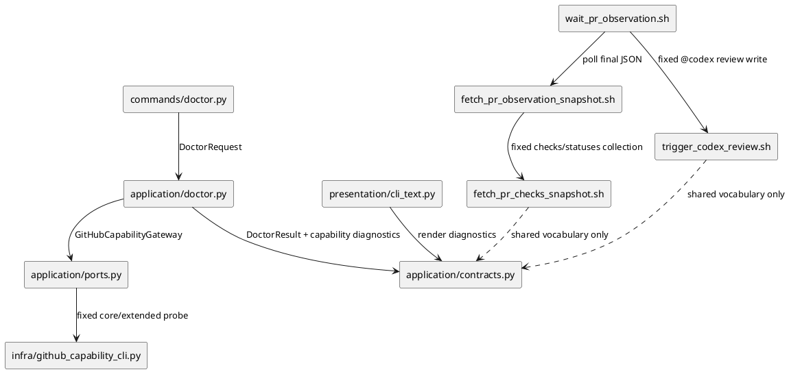
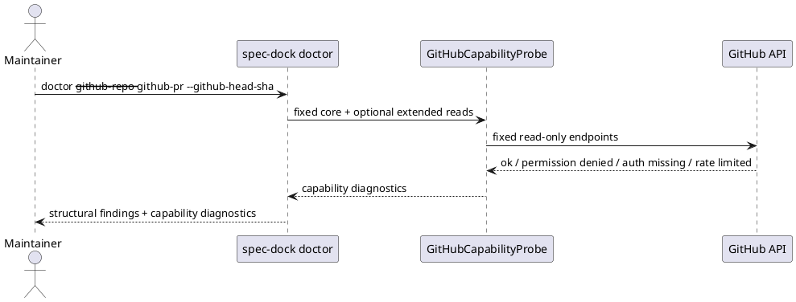
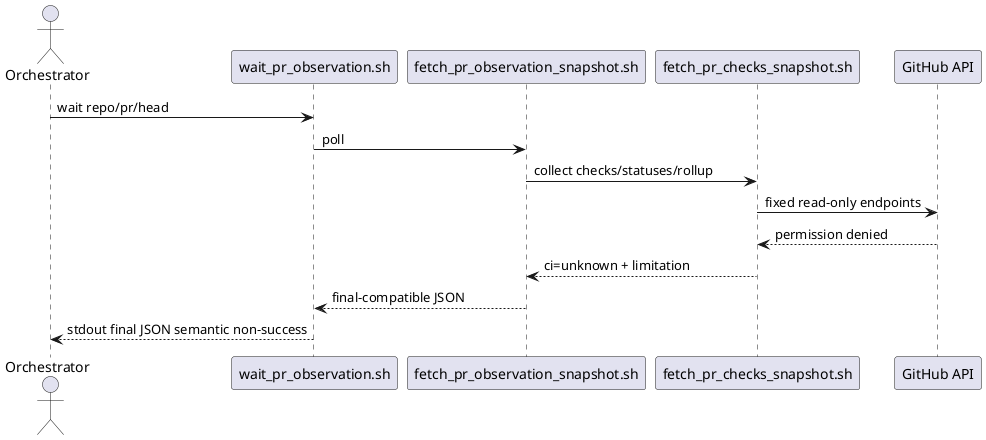

# iss-00180 Github Token Capability Preflight — 設計（どう実現するか）

## 親図（Diagram）参照
- Epic 図:
  - `epic-00067` は provider-side `install_root` と dogfooding mirror の parity、agent-tooling assets の source-of-truth、managed install shape を固定する。
- 再利用する決定:
  - `github-pr-observation` は PR observation の primary result を stdout final JSON に置く。
  - `github-pr-observation` の scripts は caller-provided endpoint / method / raw `gh` args を受け付けない fixed contract を維持する。
  - `doctor` は repo-local runtime diagnosis command として structural findings / warnings を返す。

## 目的・制約
- 目的:
  - GitHub token capability を fixed probe として分類し、`doctor` と PR observation の両 surface で同じ語彙を使って表示する。
  - `GH_TOKEN` 優先 token の権限不足を、secret を出さずに token source / capability / failing API / next action として観測できるようにする。
- 必須:
  - Core probe は repository metadata / PR read / check-runs / commit statuses / `statusCheckRollup` に限定する。
  - Doctor optional extended checks は `actions_read` と `issue_comments_read` に限定する。
  - Fixed `@codex review` trigger write failure / success は doctor では扱わず、PR observation final JSON だけで扱う。
  - Process exit と semantic status を分離する。
- 禁止:
  - arbitrary GitHub API checker 化。
  - token value / hosts.yml secret / private payload 出力。
  - doctor standalone probe による write operation。
  - PR observation の permission limitation を merge-prepared evidence として扱うこと。
- 非交渉制約:
  - stdout final JSON は PR observation の authority であり、stderr progress は authority ではない。
  - No-target doctor は PR core probe を permission failure として扱わない。

## 既存実装 / 規約の理解
- 参照した実装 / docs:
  - `src/spec_dock/assets/spec_dock/scripts/spec_dock_runtime/application/contracts.py`
  - `src/spec_dock/assets/spec_dock/scripts/spec_dock_runtime/application/doctor.py`
  - `src/spec_dock/assets/spec_dock/scripts/spec_dock_runtime/commands/doctor.py`
  - `src/spec_dock/assets/spec_dock/scripts/spec_dock_runtime/presentation/cli_text.py`
  - `src/spec_dock/assets/install_root/.agents/skills/github-pr-observation/scripts/lib/fetch_pr_checks_snapshot.sh`
  - `src/spec_dock/assets/install_root/.agents/skills/github-pr-observation/scripts/fetch_pr_observation_snapshot.sh`
  - `src/spec_dock/assets/install_root/.agents/skills/github-pr-observation/scripts/wait_pr_observation.sh`
- 現状理解:
  - `DoctorFinding.code` は structural finding 用の Literal に閉じており、`DoctorResult.ok=False` は command exit 1 へつながる。
  - Existing `doctor` command は引数なしで structural diagnosis を実行する。
  - Checks collector は `gh api repos/<repo>/commits/<sha>/check-runs --paginate`、commit `status`、`gh pr view --json mergeStateStatus,statusCheckRollup` を固定実行し、failure を `limitations[]` に入れる。
  - Checks collector の GitHub API failure は現在 `github_api_collection_failed` / `pr_required_check_state_unavailable` などの generic limitation であり、permission denied を token capability issue としては分類しない。
- 採用するパターン:
  - Runtime 側は domain/application contract を dataclass で明示し、presentation が CLI text に変換する。
  - Agent-tooling script 側は Python-in-shell の fixed contract を維持し、stdout JSON に machine-readable limitations を返す。
- 採用しないもの:
  - Raw `gh` args passthrough。
  - GitHub write preflight。
  - Token secret introspection。

## 採用方針 / トレードオフ
- 論点:
  - `doctor` と PR observation の両方で同じ分類語彙を使いつつ、実装境界は runtime Python と shell script に分かれる。
- 決定:
  - Shared classification vocabulary を固定し、runtime Python と PR observation scripts が同じ code / status names を使う。
  - Runtime package と installed agent script の間に import dependency は作らない。Shell script から runtime Python module を import すると consumer repo / packaged install / dogfooding mirror の実行前提が複雑になるため。
  - `doctor` は GitHub capability diagnostic を structural `DoctorFinding` と分ける。Capability finding だけでは doctor process を exit 1 にしない。
  - PR observation は process exit 0 + final JSON semantic non-success を維持する。Usage error / malformed input / JSON construction failure は non-zero。
- Status policy:
  - 新しい top-level normalized status `permission_denied` は導入しない。
  - Checks / statuses / `statusCheckRollup` の read permission failure は `normalized_status="unknown"`、`overall_status="unknown"`、`recommended_next_action="fix_github_token_permissions"` とし、`limitations[].code="github_token_permission_denied"` で表す。
  - Fixed `@codex review` trigger comment write の permission failure は core read failure と分け、`normalized_status="human_gate"`、`overall_status="human_gate"`、`recommended_next_action="fix_github_token_permissions"` とし、`capability="trigger_comment_write"` の limitation で表す。
  - これにより existing callers の status enum を広げずに、permission issue を machine-readable にできる。

## Capability Result Model
- 共通 capability code:
  - `repo_metadata_read`
  - `pull_request_read`
  - `check_runs_read`
  - `commit_statuses_read`
  - `status_check_rollup_read`
  - `actions_read`
  - `issue_comments_read`
  - `trigger_comment_write`
- 共通 status:
  - `ok`
  - `permission_denied`
  - `auth_missing`
  - `rate_limited`
  - `target_unavailable`
  - `transient_unknown`
  - `schema_unavailable`
  - `skipped`
- 共通 limitation / diagnostic fields:
  - `code`
  - `capability`
  - `status`
  - `token_source`
  - `api`
  - `severity`
  - `message`
  - `recommended_next_action`
  - `secret_redacted`
  - `stderr_sha256`
- Token source:
  - `GH_TOKEN`
  - `gh_saved_auth`
  - `unknown`
- Secret policy:
  - token value は保持しない。
  - stderr 全文は出さず hash だけを出す。ユーザー向け message は sanitizer 後の分類文にする。

## 依存関係分析
- module 依存:
  - Runtime doctor:
    - `commands/doctor.py` -> `application.doctor` -> `application.ports.GitHubCapabilityGateway` -> `infra.github_capability_cli` -> `presentation.cli_text`
    - 新しい capability diagnostics は `application.contracts` に追加し、`application/ports.py` に fixed probe 用の Protocol を追加する。
    - `cli/bootstrap.py` が infra adapter を `Ports.github_capability_gateway` として注入し、tests は fake gateway を注入する。
  - PR observation:
    - `fetch_pr_observation_snapshot.sh` -> `lib/fetch_pr_checks_snapshot.sh`
    - `wait_pr_observation.sh` は snapshot payload の limitations / normalized status / recommended next action を集約する。
- file 依存:
  - Provider source:
    - `src/spec_dock/assets/spec_dock/scripts/spec_dock_runtime/application/contracts.py`
    - `src/spec_dock/assets/spec_dock/scripts/spec_dock_runtime/application/doctor.py`
    - `src/spec_dock/assets/spec_dock/scripts/spec_dock_runtime/commands/doctor.py`
    - `src/spec_dock/assets/spec_dock/scripts/spec_dock_runtime/presentation/cli_text.py`
    - `src/spec_dock/assets/install_root/.agents/skills/github-pr-observation/scripts/lib/fetch_pr_checks_snapshot.sh`
    - `src/spec_dock/assets/install_root/.agents/skills/github-pr-observation/scripts/fetch_pr_observation_snapshot.sh`
    - `src/spec_dock/assets/install_root/.agents/skills/github-pr-observation/scripts/wait_pr_observation.sh`
    - `src/spec_dock/assets/install_root/.agents/skills/github-pr-observation/SKILL.md`
  - Dogfooding mirror:
    - `.agents/skills/github-pr-observation/...`
    - `spec-dock/scripts/spec_dock_runtime/...`
  - Tests:
    - `tests/cli_runtime/test_runtime_doctor_s04.py`
    - `tests/unit/infra/test_init_update.py`
- 実装起点:
  - Classification helper / result model を先に固定し、doctor と PR observation の両方が同じ limitation code を出すようにする。
- 順序への影響:
  - S01: runtime doctor capability diagnostic model。
  - S02: PR observation checks/trigger limitation classification。
  - S03: docs / skill guidance / parity。

## モジュール依存図（Module Dependency Diagram）


## インターフェース契約
- `DoctorRequest`:
  - Keep default no-arg structural diagnosis valid.
  - Add optional GitHub PR probe target fields or equivalent command arguments:
    - `github_repo`
    - `github_pr`
    - `github_head_sha`
  - If target fields are absent, PR core probe is `target_unavailable` / `skipped`.
- `DoctorResult`:
  - Add `github_capability_diagnostics` separate from structural `findings`.
  - `ok` continues to represent structural doctor success. Capability diagnostics alone do not make `ok=False`.
- `GitHubCapabilityGateway`:
  - Add a Protocol in `application/ports.py` and a nullable `github_capability_gateway` field on `Ports`.
  - The gateway accepts only typed target fields and fixed boolean switches for core / optional extended probe groups.
  - The default infra implementation lives in `infra/github_capability_cli.py` and shells out to fixed `gh` commands; it never accepts caller-provided endpoint / method / raw `gh` args.
  - When the gateway is unavailable, `doctor` returns skipped diagnostics rather than treating capability probe absence as structural failure.
- `doctor` command:
  - Add optional arguments only for fixed target fields. Do not accept raw API args.
  - Exit code remains based on structural `ok`.
- PR observation final JSON:
  - Keep existing final JSON shape.
  - Add limitation objects for permission failures:
    - `code="github_token_permission_denied"`
    - `capability`
    - `api`
    - `token_source`
    - `severity="blocking"`
    - `recommended_next_action="fix_github_token_permissions"`
    - `secret_redacted=true`
  - For read probe permission failure in `fetch_pr_checks_snapshot.sh`:
    - `ci.status="unknown"`
    - `ci.progress_status="unknown"`
    - `normalized_status="unknown"`
    - `overall_status="unknown"`
    - `recommended_next_action="fix_github_token_permissions"`
    - `observation_complete=false`
    - `limitations[].code="github_token_permission_denied"`
  - For fixed trigger comment write permission failure in `wait_pr_observation.sh`:
    - `normalized_status="human_gate"`
    - `overall_status="human_gate"`
    - `recommended_next_action="fix_github_token_permissions"`
    - `limitations[].code="github_token_permission_denied"`
    - `limitations[].capability="trigger_comment_write"`
  - Malformed input / script misuse / final JSON construction failure remains non-zero process exit and is not encoded as GitHub token capability limitation.

## シーケンス差分




## ディレクトリ / ファイル変更計画
```text
.
|-- src/spec_dock/assets/spec_dock/scripts/spec_dock_runtime/
|   |-- application/
|   |   |-- contracts.py        # 変更: doctor capability diagnostic model
|   |   |-- ports.py            # 変更: GitHubCapabilityGateway Protocol / Ports field
|   |   `-- doctor.py           # 変更: fixed GitHub probe orchestration
|   |-- commands/
|   |   `-- doctor.py           # 変更: optional fixed probe target arguments
|   |-- cli/
|   |   `-- bootstrap.py        # 変更: infra gateway injection
|   |-- infra/
|   |   `-- github_capability_cli.py # 追加: fixed gh probe adapter
|   `-- presentation/
|       `-- cli_text.py         # 変更: capability diagnostics rendering
|-- src/spec_dock/assets/install_root/.agents/skills/github-pr-observation/
|   |-- SKILL.md                # 変更: permission limitation guidance
|   `-- scripts/
|       |-- fetch_pr_observation_snapshot.sh
|       |-- wait_pr_observation.sh
|       |-- trigger_codex_review.sh
|       `-- lib/
|           `-- fetch_pr_checks_snapshot.sh
|-- spec-dock/scripts/spec_dock_runtime/... # dogfooding mirror refresh / parity check
|-- .agents/skills/github-pr-observation/... # dogfooding mirror refresh / parity check
|-- tests/cli_runtime/test_runtime_doctor_s04.py
`-- tests/unit/infra/test_init_update.py
```

## 要件 → 設計マッピング
- AC-001 -> `DoctorRequest` optional target fields、capability diagnostics render。
- AC-001b -> no-target `target_unavailable` / `skipped` diagnostic。
- AC-002 -> checks collector permission classification + snapshot/wait propagation。
- AC-003 -> trigger script / wait trigger failure limitation separated from core read failure。
- AC-004 -> secret redaction, stderr hash, no token value output assertions。
- AC-005 -> fixed argument validation and no raw endpoint / method / jq / header surface。
- AC-006 -> usage / malformed / JSON failure remains command/runtime error.
- AC-007 -> doctor optional extended checks limited to `actions_read` and `issue_comments_read`.
- EC-001 -> token source `gh_saved_auth` / `unknown` fallback.
- EC-002 -> `auth_missing` classification.
- EC-003 -> `rate_limited` / `transient_unknown` / `schema_unavailable`.
- EC-004 -> per-capability result model.
- EC-005 -> optional extended result does not affect core.

## テスト戦略
- 単体 / runtime:
  - `tests/cli_runtime/test_runtime_doctor_s04.py` で `doctor` targetless skipped diagnostic、permission denied diagnostic、optional extended separated render、exit code semantics を確認する。
  - Ports / stub adapter を使い、live GitHub API に依存しない。
- Script / installed asset:
  - `tests/unit/infra/test_init_update.py` の existing PR observation stub harness に permission denied stderr / exit code fixture を追加する。
  - `fetch_pr_checks_snapshot.sh` が permission denied を `github_token_permission_denied` limitation に分類することを確認する。
  - `wait_pr_observation.sh` が final JSON semantic non-success と recommended action を維持することを確認する。
- Parity:
  - provider-side `install_root` と dogfooding `.agents` mirror、provider runtime と dogfooding `spec-dock/scripts/spec_dock_runtime` の必要差分を確認する。
- Security:
  - output に token-like value が含まれない forbidden-token assertion を置く。
  - raw stderr は hash 化され、secret-bearing stderr body を JSON / CLI text に出さない。

## リスク / 移行 / ロールバック
- リスク:
  - `doctor` の `ok` と capability diagnostics を分離するため、既存 doctor result semantics を読み違える caller があると混乱する。
  - Script 側と runtime 側で vocabulary が drift すると、agent が limitation を正しく解釈できない。
  - GitHub CLI / API の error text は変わり得るため、permission classification は exact text だけに依存しすぎない。
- 移行:
  - Existing `doctor` no-arg behavior は structural diagnosis として維持する。
  - Existing PR observation JSON fields は維持し、limitation object を追加する additive change とする。
- ロールバック:
  - Capability diagnostics と limitation classification は additive なので、問題があれば new diagnostic fields / new limitation code の追加分を戻す。

## 未確定事項
- なし:
  - Requirement reviewer の指摘により target resolution、optional extended set、trigger write surface は requirement で確定済み。
