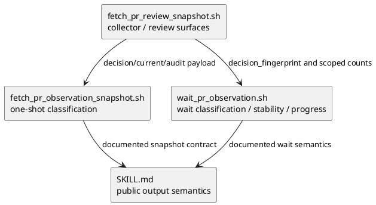
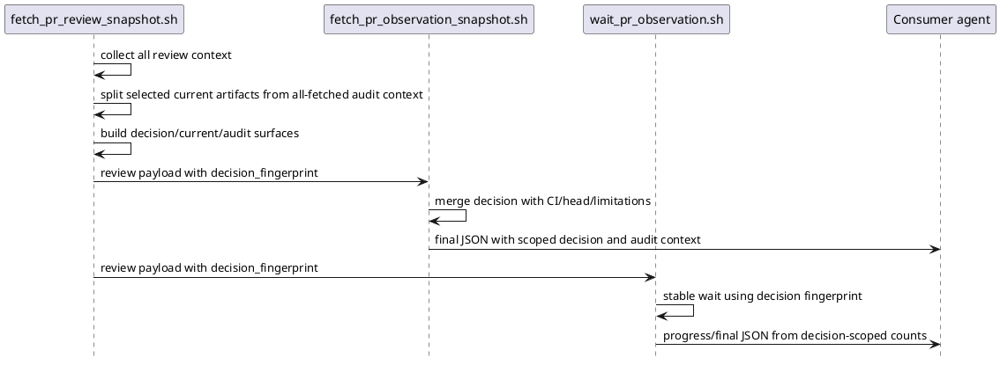

# iss-00182 Limit PR observation final status to current trigger boundary — 設計

## 目的・制約

### 目的

`github-pr-observation` の final decision を current trigger / resume boundary の selected artifacts に限定し、historical / all-fetched context を audit 用として分離する。

### 非交渉制約

- 実装 source-of-truth は `src/spec_dock/assets/install_root/` 配下の shipped assets。
- `spec-dock/` dogfooding workspace は確認対象であり、主要実装先ではない。
- `fallback_issue_comment` は top-level pass / complete へ昇格しない。
- 既存 debug context は原則 additive migration で残す。

## 既存実装 / 規約の理解

### 参照した実装 / docs

- `spec-dock/active/issue/requirement.md`
- `spec-dock/active/issue/discussions/20260612t012333z-research-pr-observation-final-output-boundary-analysis.md`
- `spec-dock/active/issue/discussions/20260612t014627z-interview-fallback-issue-comment-decision-boundary.md`
- `spec-dock/active/issue/discussions/20260612t015200z-draft-design-pr-observation-boundary.md`
- `spec-dock/active/epic/requirement.md`
- `spec-dock/active/epic/design.md`
- `src/spec_dock/assets/install_root/.agents/skills/github-pr-observation/scripts/lib/fetch_pr_review_snapshot.sh`
- `src/spec_dock/assets/install_root/.agents/skills/github-pr-observation/scripts/fetch_pr_observation_snapshot.sh`
- `src/spec_dock/assets/install_root/.agents/skills/github-pr-observation/scripts/wait_pr_observation.sh`
- `src/spec_dock/assets/install_root/.agents/skills/github-pr-observation/SKILL.md`

### 現状理解

- `fetch_pr_review_snapshot.sh` は current boundary の selected review ids / selected review comment ids / selected review thread ids を既に計算している。
- `codex_review.collection_summary.review_threads` は selected / current boundary の thread state を持つ。
- `fetch_pr_observation_snapshot.sh` と `wait_pr_observation.sh` は `completion_signal == "fallback_issue_comment"` を `human_gate` / `wait_or_resume` として分類している。
- 一方で `review.threads` は all-fetched thread を含み、`review.threads.unresolved` は historical unresolved count を含む。
- `review.codex_authored` も all-fetched Codex-authored signals を含む。
- 現行 fingerprint は historical / all-fetched context を含み得るため、wait stability に historical-only change が混ざる可能性がある。

## 採用方針 / トレードオフ

### 採用方針

三つの surface を分離する。

- `decision`: final classification の authoritative input。current trigger / resume boundary の selected artifacts のみ。
- `review.current`: current boundary の review artifacts。decision の説明に使う。
- `review.audit`: all-fetched / historical context。debug と traceability 用で final decision には使わない。

既存互換のため、`review.threads`、`review.signals`、`review.codex_authored` は削除しない。残す場合は `scope: "all_fetched"` または sibling metadata で non-authoritative と分かるようにする。

### Option C の反映

`fallback_issue_comment` は top-level を pass / complete にしない。

- top-level `status` / `overall_status` / `normalized_status`: `human_gate`
- `recommended_next_action`: `wait_or_resume`
- `observation_complete`: `false`

ただし current boundary の fallback issue comment が問題なしを示す場合は、`decision.fallback_pass_candidate` を出す。

```json
{
  "decision": {
    "completion_signal": "fallback_issue_comment",
    "status": "human_gate",
    "status_reason": "fallback_issue_comment_low_confidence",
    "recommended_next_action": "wait_or_resume",
    "fallback_pass_candidate": {
      "present": true,
      "source": "issue_comment",
      "source_ids": [4683116317],
      "reason": "current_boundary_no_major_issues_comment",
      "promotes_top_level_status": false
    }
  }
}
```

同じ情報を `codex_review.lifecycle.fallback_pass_candidate` に mirror してもよいが、canonical source は `decision.fallback_pass_candidate` とする。

### トレードオフ

- legacy fields を残すと payload は大きくなるが、debug tooling の互換性を維持できる。
- `fallback_pass_candidate` の本文判定は false positive を避けるため narrow phrase whitelist に限定する。これは top-level status を昇格しないため、見逃しは利便性低下に留まりやすい。
- top-level fingerprint を即 `decision_fingerprint` に変えると既存 consumer の期待とずれる可能性があるため、少なくとも `decision_fingerprint` を明示し、wait stability は decision fingerprint を使う。

## インターフェース契約

### decision surface

`decision` は final decision-facing contract とする。

```json
{
  "decision": {
    "scope": "current_trigger_boundary",
    "trigger": {
      "source": "explicit",
      "comment_id": 4683116317,
      "created_at": "2026-06-11T17:16:48Z"
    },
    "status": "human_gate",
    "status_reason": "fallback_issue_comment_low_confidence",
    "recommended_next_action": "wait_or_resume",
    "observation_complete": false,
    "selected_review_ids": [],
    "selected_review_comment_ids": [],
    "selected_review_thread_ids": [],
    "selected_unresolved_thread_ids": [],
    "selected_unresolved_count": 0,
    "completion_signal": "fallback_issue_comment",
    "confidence": "low",
    "fallback_pass_candidate": {
      "present": true,
      "source": "issue_comment",
      "source_ids": [4683116317],
      "reason": "current_boundary_no_major_issues_comment",
      "promotes_top_level_status": false
    },
    "fingerprint": "<decision_fingerprint>"
  }
}
```

`decision.scope` は explicit trigger がある場合 `current_trigger_boundary`、inferred trigger の場合は `inferred_current_boundary` とする。

`decision.trigger` は decision boundary identity の正本であり、`decision_fingerprint` の入力に含める。

- `source`: `explicit` / `inferred`
- `comment_id`: explicit trigger comment id。inferred の場合は `null`。
- `created_at`: trigger boundary timestamp。resume 時は resume が継続対象にした trigger timestamp。
- `resume_source`: resume 由来の場合のみ、resume snapshot / previous observation などの出所を表す optional field。

同じ PR head と同じ selected ids であっても、trigger / resume boundary が変われば別 decision として扱う。

### status_reason taxonomy

`decision.status_reason` は final decision の主因を一つに正規化して持つ。複数原因がある場合は `decision.secondary_reasons` に追加してよい。

Canonical values:

- `current_selected_unresolved_thread`
  - current boundary の selected review thread に unresolved がある。
  - top-level: `human_gate`
  - recommended action: `address_review_feedback`
- `current_selected_changes_requested`
  - current boundary の selected review / review comment が changes requested 相当を示す。
  - top-level: `human_gate`
  - recommended action: `address_review_feedback`
- `fallback_issue_comment_low_confidence`
  - current boundary に fallback issue comment はあるが、submitted PR review ではない。
  - top-level: `human_gate`
  - recommended action: `wait_or_resume`
- `missing_current_completion_signal`
  - current boundary の review completion signal がない。
  - top-level: `unknown` または `running` / `human_gate` の安全側。既存 lifecycle と CI 状態に従う。
  - recommended action: `wait_or_resume` または `human_gate`
- `blocking_limitation`
  - GitHub 権限不足など、collector が判断不能な blocking limitation を持つ。
  - top-level: `human_gate` または `unknown`
  - recommended action: limitation の種類に応じた human action。
- `stale_head`
  - expected head SHA と current head SHA が一致しない。
  - top-level: `stale_head`
  - recommended action: expected head 更新または再観測。
- `ci_failed`
  - CI / checks が failed。
  - top-level: `failed`
  - recommended action: `fix_ci`
- `ci_pending`
  - CI / checks が pending / running。
  - top-level: `running`
  - recommended action: `wait`
- `passed`
  - CI passed、head matched、blocking limitations なし、current selected blockers なし、submitted PR review 等の primary completion source が pass 相当。
  - top-level: `passed`
  - recommended action: merge preparation へ進める。

`fallback_pass_candidate.present == true` は `status_reason` を `passed` に変えない。Option C では `status_reason=fallback_issue_comment_low_confidence` の補助情報として扱う。

### review.current surface

`review.current` は decision の説明に使う current boundary context とする。

```json
{
  "review": {
    "current": {
      "scope": "current_trigger_boundary",
      "signals": [],
      "codex_authored": [],
      "selected_reviews": [],
      "selected_review_comments": [],
      "selected_thread_ids": [],
      "selected_unresolved_thread_ids": []
    }
  }
}
```

### review.audit surface

`review.audit` は all-fetched / historical context とする。

```json
{
  "review": {
    "audit": {
      "scope": "all_fetched",
      "decision_authoritative": false,
      "signals": [],
      "codex_authored": [],
      "threads": {},
      "fingerprint": "<audit_fingerprint>"
    }
  }
}
```

### legacy field compatibility

既存 `review.threads`、`review.signals`、`review.codex_authored` を残す場合は、以下のどちらかで scope を明示する。

- object field に変えて `scope` / `decision_authoritative` を持たせる。
- list 形状を維持し、sibling metadata を追加する。
  - `review.threads_scope: "all_fetched"`
  - `review.threads_decision_authoritative: false`
  - `review.codex_authored_scope: "all_fetched"`
  - `review.codex_authored_decision_authoritative: false`

list 形状の既存互換が重要な場合は sibling metadata を優先する。

## fingerprint 設計

- `decision_fingerprint`
  - final decision に影響する current-boundary artifacts のみ。
  - wait stability と same-fingerprint count に使う。
  - trigger boundary identity、head / CI / blocking limitations / decision lifecycle / selected ids / selected unresolved ids / fallback candidate state を含む。
  - `decision.trigger.source`、`decision.trigger.comment_id`、`decision.trigger.created_at` は必須入力とする。
- `audit_fingerprint`
  - all-fetched historical context を含む debug fingerprint。
  - historical-only update で変化してよい。
- top-level `fingerprint`
  - `decision_fingerprint` の alias にすることを目標とする。
  - 互換リスクが高い場合でも、`wait_pr_observation.sh` は `decision_fingerprint` を優先して使う。

## 依存関係分析

### module / file 依存

1. `fetch_pr_review_snapshot.sh`
   - selected/current/audit payload と review collector fingerprints の起点。
   - downstream の snapshot / wait はこの decision surface を読む。
2. `fetch_pr_observation_snapshot.sh`
   - one-shot final JSON の top-level classification。
   - review collector の decision surface と CI/head/limitations を統合する。
3. `wait_pr_observation.sh`
   - wait-loop classification、semantic fingerprint、progress rendering。
   - decision fingerprint と decision/current counts を使う。
4. `SKILL.md`
   - shipped skill の output semantics。
   - downstream agent が authoritative surface を誤読しないための public contract。

### 実装順序への影響

review collector の output contract が上流であり、先に固定する。次に one-shot snapshot、wait loop、最後に docs semantics を更新する。

## モジュール依存図



## シーケンス差分



## ディレクトリ / ファイル変更計画

```text
.
|-- src/spec_dock/assets/install_root/.agents/skills/github-pr-observation/
|   |-- scripts/
|   |   |-- lib/
|   |   |   `-- fetch_pr_review_snapshot.sh       # 変更: decision/current/audit surfaces, fallback candidate, fingerprints
|   |   |-- fetch_pr_observation_snapshot.sh      # 変更: decision surface based classification and fingerprint source
|   |   `-- wait_pr_observation.sh                # 変更: decision fingerprint stability and decision-scoped progress
|   `-- SKILL.md                                  # 変更: output boundary / fallback / fingerprint semantics
`-- tests/
    `-- <既存の github-pr-observation script tests> # 変更/追加: snapshot/wait output contract regression
```

実装時に既存 test location を確認し、既存の script / skill test pattern に合わせる。

## 要件 → 設計マッピング

- AC-001 -> `decision` と `review.audit` の分離、legacy all-fetched field の scope 明示、decision fingerprint。
- AC-002 -> `decision.selected_unresolved_thread_ids` / `decision.selected_unresolved_count` と status reason。
- AC-003 -> Option C top-level classification 維持。
- AC-004 -> `decision.fallback_pass_candidate`。
- AC-005 -> `decision_fingerprint` / `audit_fingerprint` 分離、wait stability の decision fingerprint 使用。
- AC-006 -> `SKILL.md` の output semantics 更新。
- EC-001 -> `decision.scope` と inferred boundary limitation / confidence metadata。
- EC-002 -> missing completion signal の safe-side status reason。
- EC-003 -> selected current thread と audit historical thread の併存。
- EC-004 -> additive compatibility と legacy field scope metadata。

## テスト戦略

- collector payload test:
  - historical unresolved thread before trigger と current fallback issue comment がある fixture で、`decision.selected_unresolved_count == 0`、audit 側には historical thread が残ることを確認する。
- snapshot classification test:
  - CI passed / head matched / limitations empty / selected unresolved 0 / fallback no-major-issues comment のケースで、top-level は `human_gate` / `wait_or_resume`、`fallback_pass_candidate.present == true` になることを確認する。
- current unresolved test:
  - current selected unresolved thread があるケースで、top-level が feedback 対応の human gate になり selected ids が decision に出ることを確認する。
- fingerprint test:
  - historical-only thread update で `decision_fingerprint` は変化せず、`audit_fingerprint` は変化し得ることを確認する。
- wait progress test:
  - `wait_pr_observation.sh` の same fingerprint 判定と progress count が decision-scoped count を使うことを確認する。
- docs/spec review:
  - `SKILL.md` が final decision、current、audit、fallback、fingerprint の意味を説明していることを spec-reviewer で確認する。

## リスク / 移行 / ロールバック

- 互換リスク:
  - `review.codex_authored` を list から object に変えると consumer breakage の可能性がある。必要なら sibling metadata 方式を優先する。
- 誤判定リスク:
  - `fallback_pass_candidate` の本文判定は narrow phrase whitelist に限定し、top-level status を昇格しない。
- wait 挙動リスク:
  - `decision_fingerprint` への切り替えで historical-only update による reset がなくなる。これは AC-005 の意図だが、debug 用に `audit_fingerprint` を残す。
- rollback:
  - 新 surface は additive に残しつつ、top-level classification の参照先だけ旧 field へ戻すことは可能。ただし AC-001 / AC-005 は未達になるため、rollback は一時対応に限定する。

## ADR 候補

現時点では ADR は不要。

将来 `fallback_issue_comment` を top-level pass 相当に昇格する場合は、「submitted PR review を primary completion source とし、issue comment は fallback evidence に留めるか」を ADR 候補にする。

## 未確定事項

- なし。
  - `fallback_issue_comment` は Option C として採用済み。
  - `fallback_pass_candidate` の最終 field placement は `decision` を canonical とし、必要なら `codex_review.lifecycle` へ mirror する。
