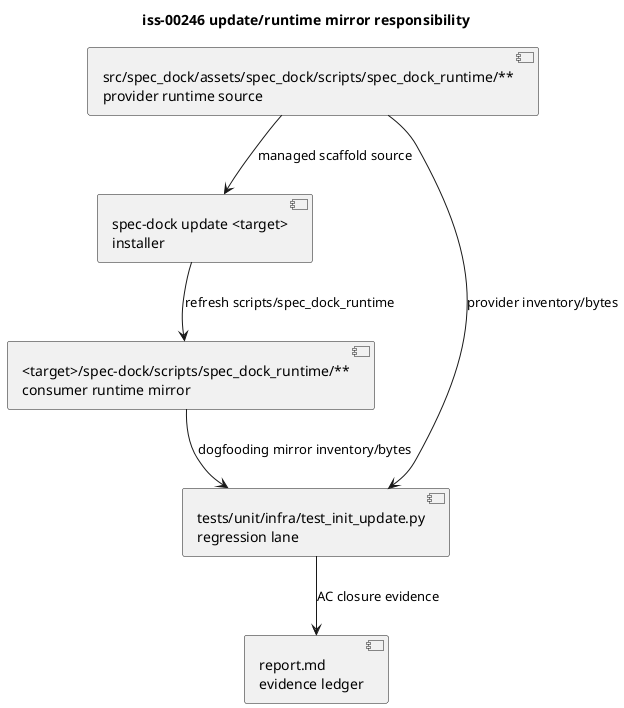

# iss-00246 Dogfooding Update Runtime Mirror Sync — Issue 設計書

## 1. 等級

この Issue は `standard` として扱う。

- public CLI command 名や引数を追加しない。
- workspace layout の新規移行は行わない。
- 変更対象は installer/update の既存契約、package asset inclusion、dogfooding parity test の範囲に閉じる。
- ただし `spec-dock update` の observable behavior と shipped scaffold に関わるため、実装中に update contract 自体を変える必要が出た場合は `strict` へ引き上げる。

## 2. 設計意図

Issue #246 の本質は、provider runtime と dogfooding mirror の drift が、operator には `spec-dock update` 成功として見えてしまった点にある。したがって本 Issue の設計は、単純な manual sync ではなく、次の二重保証を置く。

- `[N]` update 経路は managed scaffold の `scripts/spec_dock_runtime/**` を provider 正本から更新できる。
- `[N]` checked-in dogfooding mirror parity は runtime tree 全体を対象にし、subset map から漏れた file を成功扱いにしない。
- `[N]` generated cache は update/parity の対象外にする。
- `[P]` 現行 installer が既に runtime を同期している場合、production code は変更せず test/parity coverage の hardening を Issue 完了条件とする。

## 3. 正本と根拠

| 種別 | パス・識別子 | この Issue への意味 |
|---|---|---|
| Issue requirement | `spec-dock/active/issue/requirement.md` | RQ-001 から RQ-006、AC-001 から AC-006 を固定する |
| GitHub Issue | `#246` | local checkout update 成功後も runtime mirror drift が残った観測元 |
| prior research | `spec-dock/initiatives/init-local-00003-architecture-maintenance-and-hardening/epics/epic-00224-dynamic-workflow-resource-allocation/issues/iss-00244-simplify-issue-execution-guidance-into-plan-centric-preflight-validation/discussions/20260627t154455z-research-dogfooding-runtime-update-drift-finding.md` | provider/dogfood `workflow.py` drift と manual sync で guidance が戻った証跡 |
| provider runtime | `src/spec_dock/assets/spec_dock/scripts/spec_dock_runtime/**` | runtime asset の正本 |
| dogfooding mirror | `spec-dock/scripts/spec_dock_runtime/**` | dogfooding consumer 側の mirror |
| installer | `src/spec_dock/cli.py` | `spec-dock update <target>` の managed scaffold 同期責務 |
| package data | `pyproject.toml` | local/package 経路で runtime asset が配布物に含まれるかの責務 |
| existing tests | `tests/unit/infra/test_init_update.py` | update preservation と checked-in dogfooding parity の既存検証面 |

## 4. Requirement-to-Design Traceability

| 要件 | 設計ID | 設計上の扱い |
|---|---|---|
| RQ-001 / AC-001 | DES-001 | stale runtime file を `spec-dock update` が provider bytes へ戻す update contract をテストで固定する |
| RQ-002 / AC-002 / AC-004 | DES-002 | dogfooding runtime parity を inventory-driven にし、generated cache を除く runtime tree 全体を対象にする |
| RQ-003 / AC-003 | DES-003 | update hardening は initiatives/user-authored data/unmanaged files preservation を壊さない |
| RQ-005 / AC-005 | DES-004 | local checkout/package 由来の installer 経路で runtime asset inclusion と update を smoke する |
| RQ-006 / AC-006 | DES-005 | root cause を report に記録し、code no-op でも検証根拠を残す |

## 5. Current State

### 5.1 観測済み事実

- `uvx --from . spec-dock update .` は `spec-dock: ok (update)` を返した観測がある。
- その直後、dogfooding `./spec-dock/scripts/spec-dock guidance issue-execution` は旧 runtime behavior を返した。
- provider 側 `application/workflow.py` と dogfooding mirror 側 `application/workflow.py` に内容差分があった。
- provider runtime を dogfooding mirror へ手動同期すると guidance は期待状態へ戻った。
- 現在の local tree では `src/spec_dock/assets/spec_dock/scripts/spec_dock_runtime` と `spec-dock/scripts/spec_dock_runtime` の通常 file 差分は確認されず、`__pycache__` 差分のみが観測されている。

### 5.2 現行構造

| 対象 | 現在の責務 |
|---|---|
| `src/spec_dock/assets/spec_dock/scripts/spec_dock_runtime/**` | provider-side shipped runtime asset source |
| `spec-dock/scripts/spec_dock_runtime/**` | checked-in dogfooding consumer mirror |
| `src/spec_dock/cli.py` | installer `init` / `update` entrypoint。managed scaffold dirs を target へ同期する |
| `pyproject.toml` | package data inclusion |
| `tests/unit/infra/test_init_update.py` | installer/update/preservation/parity regression lane |

## 6. Target Design Delta

| 設計ID | 種別 | 現在 | 目標 | 固定度 |
|---|---|---|---|---|
| DES-001 | behavior | runtime mirror refresh の regression が十分に固定されていない | stale runtime file を update が provider bytes へ戻すことを focused test で固定する | `[N]` |
| DES-002 | verification | checked-in dogfooding parity が subset map に依存し、新規 runtime file 漏れを見逃しうる | provider runtime inventory から parity 対象を導出し、cache を除く全 file を比較する | `[N]` |
| DES-003 | compatibility | runtime update hardening が existing preservation tests と分離している | initiatives/user-authored data/unmanaged file preservation と同時に regression しないことを確認する | `[N]` |
| DES-004 | packaging | local checkout/package 経路の runtime inclusion が Issue #246 観測に対して明確でない | isolated/package-like smoke で runtime asset inclusion と update を確認する | `[P]` |
| DES-005 | evidence | root cause が report に残らない可能性がある | code change/no-op を問わず、調査結果と AC closure を report に記録する | `[N]` |

## 7. Update Flow

### 7.1 Normal update semantics

`spec-dock update <target>` は target repository の managed scaffold under `spec-dock/{docs,templates,scripts,system}` を provider asset から更新する。runtime mirror は `scripts` managed directory の一部なので、`scripts/spec_dock_runtime/**` も同じ update 契約に含める。

### 7.2 Parity semantics

checked-in dogfooding mirror parity は file list を手書き subset で固定しない。provider runtime tree から比較対象を列挙し、次を除外する。

- directory: `__pycache__`
- file suffix: `.pyc`, `.pyo`
- その他、既存 ignore helper が明示的に generated artifact と扱う file

consumer mirror に provider 側の対象 file が欠落している場合、または byte content が異なる場合は fail とする。consumer mirror 側の余分な runtime source file も、正当な理由がない限り drift として fail とする。

## 8. 実装上の判断自由度

実装担当者は、AC を満たす限り次を選択してよい。

- parity helper を既存 subset map の置換にするか、追加 test として導入するか。
- package/local smoke を既存 helper に載せるか、新しい focused helper として分離するか。
- installer behavior がすでに正しい場合、production code を no-op にするか、診断/コメント程度の最小改善に留めるか。

ただし、次は変更しない。

- `spec-dock update` の command name / required arguments
- dogfooding workspace layout
- `spec-dock/initiatives/**` preservation contract
- live GitHub network に依存する test strategy

## 9. リスクと対策

| リスク | 影響 | 対策 |
|---|---|---|
| local checkout 経路と package 経路の挙動差 | Issue #246 の再現性が曖昧になる | isolated package-like smoke を追加し、report に経路を明記する |
| parity test が generated cache を拾う | false positive/false negative | cache ignore rule を明示して test helper に集約する |
| update hardening が user-authored data を消す | dogfooding data loss | existing preservation test を維持し、必要なら runtime refresh test 内でも marker preservation を確認する |
| 現行 code が既に Green | root cause が未記録のまま終わる | code no-op の場合も root cause distinction と test coverage hardening を report に残す |

## 10. Plan Handoff

`plan.md` は次の順序で実行する。

1. stale runtime file が `spec-dock update` で provider bytes に戻る characterization/regression test を追加する。
2. checked-in dogfooding runtime parity を inventory-driven にする。
3. package/local checkout 由来 update smoke を追加または既存 helper で強化する。
4. Red が production defect を示した場合だけ installer/package-data を最小修正する。
5. final gate で `validate`、focused pytest、diff/status、report evidence を確認する。

ユーザー確認が必要な open question は現時点でない。
