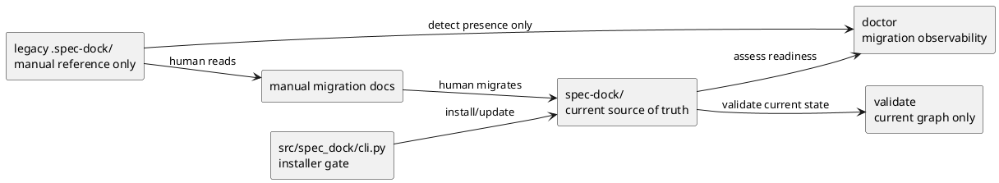
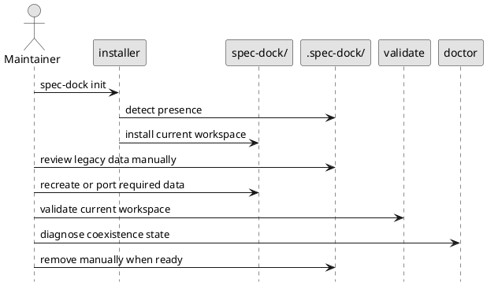

# epic-00077 Legacy hidden workspace coexistence and migration — 設計（HOW）

## 全体像
- target boundary:
  - installer は `spec-dock/` を legacy `.spec-dock/` と共存 install できる
  - runtime は current `spec-dock/` だけを読む
  - migration は manual/documented flow として明示する
  - cleanup は `doctor`/`validate` で readiness を確認した後に human が実行する
- impacted area:
  - provider installer entrypoint `src/spec_dock/cli.py`
  - runtime observability `doctor` / `validate`
  - installer/runtime docs
  - installer/runtime tests
- rollout posture:
  - backward compatibility を装った rename は廃止する
  - coexistence は一時状態であり、long-term dual data support は導入しない

### UML（推奨: module / context）

## 契約
### Data boundary
- SoR:
  - current workspace data の正本は `spec-dock/` のみ
  - legacy `.spec-dock/` は current runtime が parse/import する SoR ではない
- detection only boundary:
  - installer/runtime は legacy `.spec-dock/` の存在を診断対象として見てよい
  - legacy contents を current `spec-dock/` graph と混ぜてはならない
- consistency model:
  - install:
    - `.spec-dock/` が存在しても `spec-dock/` 未存在なら current scaffold を作成する
  - require-current:
    - `spec-dock/` が未存在なら current workspace missing とみなし、legacy があっても substitute しない
  - validate:
    - `spec-dock/` の tree/artifact/graph のみを評価する
  - doctor:
    - current workspace validity と legacy coexistence state を組み合わせて message/warning/finding を出す

## データモデル
- model changes:
  - persistent schema 追加は不要
  - migration state は filesystem presence と command diagnostics で観測する
- invariants:
  - `spec-dock/` が current workspace identifier である
  - `.spec-dock/` を rename して current workspace に見せかけない
  - `.spec-dock/` が存在しても auto-delete しない
  - `validate` pass は current `spec-dock/` の整合を意味し、legacy cleanup 完了そのものは意味しない
  - `doctor` は coexistence cleanup pending を warning/finding で表現できる

## 主要フロー
- Flow-A install with legacy coexistence:
  1. installer が `target_root/spec-dock/` と `target_root/.spec-dock/` の存在を確認する
  2. `spec-dock/` が未存在なら、legacy `.spec-dock/` の存在にかかわらず current scaffold install を継続する
  3. install は `spec-dock/` だけに書き込み、legacy `.spec-dock/` は変更しない
- Flow-B require current workspace:
  1. runtime が current `spec-dock/` の存在を確認する
  2. current workspace がなければ error にする
  3. legacy `.spec-dock/` が存在しても rename は要求せず、`spec-dock init` と manual migration を案内する
- Flow-C manual migration and readiness:
  1. maintainer が legacy `.spec-dock/` の内容を参照し、必要な spec data を current `spec-dock/` に manual で再作成または移し替える
  2. `./spec-dock/scripts/spec-dock validate` で current workspace の整合を確認する
  3. `./spec-dock/scripts/spec-dock doctor` で legacy coexistence state と cleanup readiness を確認する
  4. maintainer が `.spec-dock/` を manual で削除する

### UML（任意: sequence / flow）

## 失敗設計
- failure mode:
  - `spec-dock/` missing + `.spec-dock/` present
  - coexistence state with invalid current workspace
  - maintainer expecting auto-migration
  - maintainer expecting validate to inspect legacy data
- failure policy:
  - installer:
    - rename request ではなく coexistence install を行う
  - require-current:
    - fail-fast し、manual migration guidance を返す
  - validate:
    - current workspace error を non-zero で返す
    - legacy `.spec-dock/` contents は validation source にしない
  - doctor:
    - `spec-dock/` absent + legacy present は install required finding
    - `spec-dock/` valid + legacy present は cleanup pending warning
    - `spec-dock/` valid + legacy absent は clean
- retry:
  - manual migration 後に validate/doctor を再実行する
- idempotency:
  - repeated install/update は `spec-dock/` のみを対象にする

## 移行戦略
- migration strategy:
  - phase-1:
    - `spec-dock/` を coexistence install する
  - phase-2:
    - legacy `.spec-dock/` から必要な data を human が manual に移す
  - phase-3:
    - `validate` と `doctor` で current readiness を確認する
  - phase-4:
    - human が legacy `.spec-dock/` を削除する
- explicitly rejected strategies:
  - auto-migration
  - dual-read fallback
  - background cleanup
  - force delete on install/update
- rollback:
  - implementation rollback は issue diff を戻す
  - runtime rollback でも rename guidance は復活させない

## 観測性 / セキュリティ
- observability:
  - `validate` success は current workspace integrity のみを示す
  - `doctor` は legacy coexistence state を actionable guidance として出す
  - expected operator-visible states:
    - `legacy_only`:
      - `.spec-dock/` exists, `spec-dock/` missing
      - `doctor` は non-ok finding を返し、`spec-dock init` と manual migration を案内する
    - `coexistence_pending_cleanup`:
      - both directories exist, current workspace validates
      - `doctor` は warning を返し、legacy removal is manual と案内する
    - `clean_current_only`:
      - `spec-dock/` exists, `.spec-dock/` absent, current validates
      - `doctor` は `ok (doctor) findings=0` を返す
- security:
  - legacy data を current data source と誤認して mutation しない

## テスト戦略
- Unit / focused CLI:
  - `_install_spec_dock()` coexistence install contract
  - `_require_specdock()` no-rename guidance contract
- Integration:
  - `tests/test_cli.py`
  - `tests/test_init_update.py`
  - coexistence install/update and no-touch-legacy assertions
- Runtime:
  - `tests/cli_runtime/test_validate.py`
  - `tests/cli_runtime/test_runtime_validate_s02.py`
  - `tests/cli_runtime/test_runtime_doctor_s04.py`
- E-AC mapping:
  - E-AC-001 -> installer coexistence tests
  - E-AC-002 -> require-current error guidance tests
  - E-AC-003 -> no-dual-read / no-auto-delete assertions
  - E-AC-004 -> doctor/validate observability tests
  - E-AC-005 -> spec review + docs diff review

## 関連 ADR
- なし:
  - 本 epic は architecture issue spec で contract を固定し、追加 ADR は現時点では要求しない

## 未確定事項
- なし:
  - auto-migration / dual-read / auto-delete を採用しないことは確定
