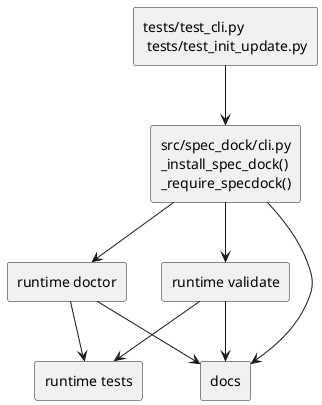
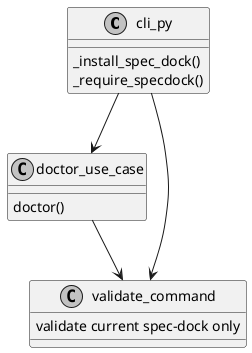

# iss-00078 Installer coexistence contract and migration flow — 設計（HOW）

## 目的・制約
- 目的:
  - installer gate と runtime observability を修正し、legacy `.spec-dock/` coexistence 下で truthfully 進められる migration contract を実装する。
  - rename guidance を廃止し、manual migration/manual cleanup を command/docs/tests で一貫させる。
- MUST / MUST NOT:
  - MUST:
    - `_install_spec_dock()` と `_require_specdock()` の behavior を明示された新契約へ変更する
    - `validate` は current `spec-dock/` のみを評価する
    - `doctor` は legacy coexistence state を actionable に返す
  - MUST NOT:
    - auto-migration engine を足さない
    - legacy/current dual-read を足さない
    - legacy auto-delete を足さない
- 非交渉制約:
  - `spec-dock/` が current SoR
  - `.spec-dock/` は detection/manual reference のみ
  - spec-reviewer pass を取得できるだけの decision-complete spec を維持する
- 前提:
  - legacy `.spec-dock/` format は current `spec-dock/` と互換ではない

## 既存実装 / 規約の理解
- 参照した実装 / docs:
  - `src/spec_dock/cli.py`
  - `src/spec_dock/assets/spec_dock/scripts/spec_dock_runtime/application/doctor.py`
  - `src/spec_dock/assets/spec_dock/scripts/spec_dock_runtime/presentation/cli_text.py`
  - `tests/test_cli.py`
  - `tests/test_init_update.py`
  - `tests/cli_runtime/test_validate.py`
  - `tests/cli_runtime/test_runtime_validate_s02.py`
  - `tests/cli_runtime/test_runtime_doctor_s04.py`
- 現状理解:
  - `_install_spec_dock()` は legacy `.spec-dock/` があるだけで install を止める
  - `_require_specdock()` は legacy を current substitute のように扱い、rename を案内する
  - runtime `doctor` / `validate` は active spec tree integrity を主に扱うが、legacy hidden workspace coexistence contract は未定義
- 採用するパターン:
  - installer は legacy-presence tolerant / current-only write にする
  - runtime は current-only read + legacy presence diagnosis に分離する
  - migration state は filesystem presence と command output で観測する
- 採用しないもの:
  - legacy tree parser
  - legacy-to-current automatic importer
  - compatibility shim
  - background cleanup
- 影響範囲:
  - provider installer
  - runtime doctor/validate
  - installer/runtime docs
  - installer/runtime regression tests

## 採用方針 / トレードオフ
- 論点:
  - legacy `.spec-dock/` を current runtime が参照して移行支援するか、完全に current boundary の外へ置くか
  - coexistence state を `doctor` error/finding にするか warning にするか
- 選択肢:
  - Option A:
    - dual-read で legacy/current の両方を見て migration を支援する
  - Option B:
    - current `spec-dock/` のみを SoR とし、legacy は診断対象に限定する
  - Option C:
    - install も引き続き legacy で reject する
- 決定:
  - Option B を採用する
  - installer reject-only の Option C は誤った rename guidance を残すため採用しない
  - coexistence state は current workspace が valid なら warning、current workspace 未 install なら finding とする
- 理由:
  - manual migration を前提にすると dual-read は false compatibility を生む
  - operator は coexistence 中でも current `spec-dock/` を使って前進する必要があるため、cleanup pending を fatal error にしない方が実運用に合う

## 依存関係分析
- upstream / prerequisite:
  - active epic requirement/design/plan に新 contract が固定されていること
- downstream / dependent:
  - installer docs wording
  - dogfooding/install regression
  - runtime doctor/validate messaging
- 実装起点:
  - installer gate tests を先に red にして、`src/spec_dock/cli.py` を最小変更する
  - その後 runtime doctor/validate observability を追加する
- sequencing implications:
  - `tests/test_cli.py` / `tests/test_init_update.py` を先に更新しないと install contract が曖昧になる
  - `doctor`/`validate` の state distinction は installer gate 修正後に入れる

### UML（必須: module / dependency）

## インターフェース契約
- API / function / protocol / data boundary:
  - `_install_spec_dock(target_root, force)`:
    - before:
      - legacy `.spec-dock/` only state で RuntimeError を投げる
    - after:
      - `spec-dock/` が未存在なら legacy `.spec-dock/` presence を無視して install を続行する
      - `spec-dock/` が存在し `force` が false なら既存どおり current workspace already exists error にする
      - write target は `spec-dock/` のみ
  - `_require_specdock(target_root)`:
    - before:
      - legacy `.spec-dock/` があると rename guidance を返す
    - after:
      - current `spec-dock/` がない場合は current workspace missing error を返す
      - legacy `.spec-dock/` がある場合は `spec-dock init` と manual migration を案内する
      - legacy path を返さない
  - `validate`:
    - current `spec-dock/` だけを検査する
    - legacy `.spec-dock/` contents は validation source にしない
  - `doctor`:
    - current `spec-dock/` と legacy `.spec-dock/` presence から migration state を判断する
    - representation:
      - `legacy_only_workspace` は `DoctorFinding.code` に新規 Literal `"legacy_only_workspace"` を追加して findings に載せる
      - `legacy_cleanup_pending` は `DoctorResult.warnings` に warning code 文字列 `"legacy_cleanup_pending"` を追加して表現する
      - `legacy_cleanup_pending` の人間向け guidance は CLI text layer で warning code を説明する stderr warning として出し、追加の finding は作らない
    - expected states:
      - `legacy_only_workspace`:
        - condition:
          - `.spec-dock/` exists and `spec-dock/` missing
        - result:
          - non-ok finding with `DoctorFinding.code="legacy_only_workspace"`
          - guidance: install new `spec-dock/`, migrate manually, do not rename legacy
      - `legacy_cleanup_pending`:
        - condition:
          - both exist and current `spec-dock/` validates
        - result:
          - ok with warning code `legacy_cleanup_pending`
          - guidance: validate current state, then remove legacy manually when ready
      - `clean_current_workspace`:
        - condition:
          - `spec-dock/` exists, `.spec-dock/` absent, current validates
        - result:
          - ok with no warnings/findings

## クラス / インターフェース詳細設計（必要時）
- Class / Interface:
  - installer legacy detection branch in `src/spec_dock/cli.py`
- responsibility:
  - current workspace install/require behavior を coexistence contract に合わせる
- collaboration:
  - install/update paths
  - docs/test wording assertions

- Class / Interface:
  - runtime doctor use case in `application/doctor.py`
- responsibility:
  - current graph validation resultに legacy presence diagnosis を重ねる
- collaboration:
  - `presentation/cli_text.py`
  - runtime doctor tests

### UML（任意: class / interface）

## 変更計画
- Add:
  - doctor migration state diagnosis
  - installer/runtime regression cases for coexistence contract
- Modify:
  - `src/spec_dock/cli.py`
  - `src/spec_dock/assets/spec_dock/scripts/spec_dock_runtime/application/contracts.py`
  - `src/spec_dock/assets/spec_dock/scripts/spec_dock_runtime/application/doctor.py`
  - `src/spec_dock/assets/spec_dock/scripts/spec_dock_runtime/presentation/cli_text.py`
  - installer/user-facing docs that currently imply rename or in-place substitution
  - `tests/test_cli.py`
  - `tests/test_init_update.py`
  - `tests/cli_runtime/test_validate.py`
  - `tests/cli_runtime/test_runtime_doctor_s04.py`
  - `tests/cli_runtime/test_runtime_validate_s02.py` if validate presentation/behavior assertions move
- Delete:
  - rename guidance text in installer paths
- Move/Rename:
  - なし
- Read only:
  - legacy `.spec-dock/` filesystem contents

## 要件 → 設計マッピング
- AC-001 -> `_install_spec_dock()` coexistence install contract + installer tests
- AC-002 -> `_require_specdock()` no-rename error contract + message assertions
- AC-003 -> current-only read/write boundary + no-auto-delete assertions
- AC-004 -> `validate` current-only contract + `doctor` cleanup pending warning contract
- AC-005 -> `doctor` legacy-only finding contract
- AC-006 -> issue plan review gates + final spec readiness
- EC-001 -> validate fail without legacy fallback
- EC-002 -> update/force does not delete legacy
- EC-003 -> doctor output distinguishes install required vs cleanup pending

## テスト戦略
- Unit / focused contract:
  - `tests/test_cli.py` に `_install_spec_dock()` / `_require_specdock()` 近傍の installer contract regression を追加または更新する
- Integration:
  - `tests/test_init_update.py` で init/update coexistence behavior を確認する
  - legacy directory untouched assertions を入れる
- Runtime:
  - `tests/cli_runtime/test_validate.py` で current-only validation と no-dual-read/no-auto-delete を確認する
  - `tests/cli_runtime/test_runtime_doctor_s04.py` で `DoctorFinding.code="legacy_only_workspace"` と warning code `legacy_cleanup_pending` を確認する
  - `tests/cli_runtime/test_runtime_validate_s02.py` で validate presentation が current-only semantics を維持することを確認する
- E2E / manual:
  - `./spec-dock/scripts/spec-dock validate`
  - `./spec-dock/scripts/spec-dock doctor`
- migration / rollback / feature flag if needed:
  - feature flag は導入しない
  - rollback は issue diff を戻すのみ

## 要件 / 例外 -> verification mapping
- AC-001 -> installer coexistence tests
- AC-002 -> current workspace missing guidance tests
- AC-003 -> update/init + runtime no-touch-legacy assertions
- AC-004 -> validate pass + doctor warning coexistence tests
- AC-005 -> doctor finding-code extension tests
- EC-001 -> validate failure without fallback tests
- EC-002 -> force/update non-delete tests
- EC-003 -> doctor finding/warning representation classification tests

## リスク / 移行 / ロールバック（必要時）
- risk:
  - doctor warning/finding の分類が曖昧だと operator が cleanup timing を誤る
  - docs wording だけ変わって runtime contract が追従しないと reviewer fail になる
  - installer tests だけ通って runtime tests が legacy fallback を許すと architecture contract が破れる
- migration:
  - manual migration guide は current spec/dogfooding docs に反映する
  - code は migration helper を持たない
- rollback:
  - rename guidance を戻す rollback は認めない
  - coexistence install や doctor state diagnosis の実装差分だけを戻す

## 未確定事項
- なし:
  - state distinction と no-dual-read/no-auto-delete は確定
