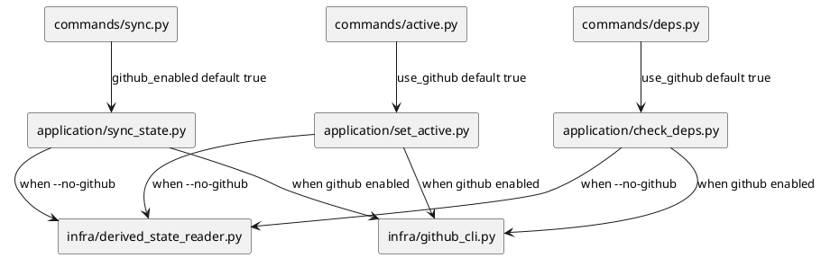
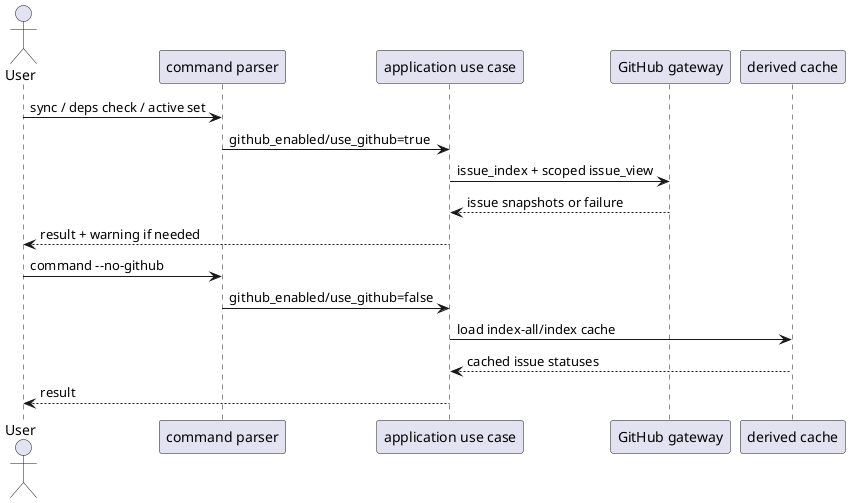

# iss-00091 Default Github State Commands — 設計（HOW）

## Parent Diagram References
- Epic diagrams:
  - `epic-00090/design.md` は scaffold 状態。issue 側で今回の runtime boundary を具体化する。
- Initiative diagrams:
  - `init-local-00003/design.md` の open-ended architecture initiative と generated artifact / source-of-truth boundary を参照する。
- reused decisions:
  - GitHub linkage mandatory identity は維持する。
  - GitHub issue state 取得は bulk-first path を維持する。
  - cache は GitHub disabled mode の fallback data source として扱う。

## 目的・制約
- 目的:
  - `sync` / `deps check` / `active set` の CLI default を GitHub enabled に反転する。
  - GitHub disabled mode は `--no-github` で明示選択する。
- MUST / MUST NOT:
  - `--github` は後方互換として残す。
  - `--github` と `--no-github` は同時指定不可にする。
  - `new ... --no-github` の rejected contract は変更しない。
  - `--offline` は導入しない。
- 非交渉制約:
  - application layer の bool request contract は維持する。
  - provider docs / dogfooding docs / installed skill mirror の parity を保つ。
- 前提:
  - command parser が request bool を組み立て、application layer は既存の `github_enabled` / `use_github` に従って GitHub fetch または cache path を選ぶ。

## 既存実装 / 規約の理解
- 参照した実装 / docs:
  - `commands/sync.py`: `--github` が `SyncRequest.github_enabled` に入る。
  - `commands/deps.py`: `--github` が `CheckDepsRequest.use_github` に入る。
  - `commands/active.py`: `--github` が `SetActiveRequest.use_github` に入る。
  - `application/sync_state.py`: GitHub enabled のとき `issue_gateway.issue_index(...)` を呼び、disabled のとき derived state reader の cache を使う。
  - `application/check_deps.py` / `application/set_active.py`: 同じ GitHub snapshot / cache status resolution を使う。
  - `commands/new.py`: `--no-github` は compatibility option だが rejected contract。
- 現状理解:
  - CLI default だけが GitHub disabled になっている。
  - application layer はすでに GitHub enabled / disabled の両 path を持つ。
- 採用するパターン:
  - CLI parser の mutually exclusive group で `--github` / `--no-github` を扱う。
  - args factory で `github_enabled = not no_github` を明示する。
  - `--github` は compatibility explicit true として受けるが、default と同じ値になる。
- 採用しないもの:
  - 共通 helper file の新設は行わない。対象3 command の差分が小さく、抽象化が仕様理解を難しくするため。
  - application request dataclass の field rename は行わない。
- 影響範囲:
  - CLI command parser / args factory
  - CLI runtime tests
  - docs / skill text and scaffold mirror assertions

## 採用方針 / トレードオフ
- 論点:
  - `--no-github` を read/state 系の成功 path として導入する一方、`new` 系では rejected contract として残す。
- 決定:
  - 状態取得系 command だけ `--no-github` を有効な opt-out にする。
  - local-only creation の復活は行わない。
- 理由:
  - ユーザーの意図は GitHub 連携の標準化であり、local-only identity の復活ではない。
  - 既存 `new` contract と矛盾しない最小変更にできる。

## 依存関係分析
- module dependency:
  - `commands/*` が request bool を作り、`application/*` が GitHub fetch / cache resolution を実行する。
  - `presentation` は結果表示のみで、default 反転の source of truth ではない。
- function dependency:
  - `_sync_args` -> `_run_sync` -> `SyncRequest.github_enabled` -> `sync_state.collect_sync_state`
  - `_deps_check_args` -> `_run_deps_check` -> `CheckDepsRequest.use_github` -> `check_deps`
  - `_active_set_args` -> `_run_active_set` -> `SetActiveRequest.use_github` -> `set_active`
- file dependency:
  - CLI parser changes unblock test updates.
  - Runtime docs updates depend on final user-facing command contract.
  - Scaffold mirror tests depend on docs / skill text updates.
- upstream / prerequisite:
  - `commands/sync.py`, `commands/deps.py`, `commands/active.py`
- downstream / dependent:
  - `tests/cli_runtime/test_sync.py`, `tests/cli_runtime/test_deps.py`, `tests/cli_runtime/test_active.py`
  - `tests/test_init_update.py`
  - `src/spec_dock/assets/spec_dock/docs/*`, `spec-dock/docs/*`
  - `src/spec_dock/assets/install_root/.agents/skills/spec-dock-issue-execution/SKILL.md`, `.agents/skills/spec-dock-issue-execution/SKILL.md`
- sequencing implications:
  - plan は parser default -> tests -> docs/skill parity -> final validation の順にする。

## Module Dependency Diagram
- Title:
  - GitHub default state command boundary
- Question answered:
  - どの層が default 反転を所有し、どの層は既存 contract を維持するか
- Scope:
  - `sync` / `deps check` / `active set`
- Excluded details:
  - exhaustive argparse internals / full GitHub fetch call graph
- Update trigger:
  - request field、default ownership、GitHub fetch/cache resolution の責務境界が変わるとき

### UML（module dependency / package dependency delta）


## インターフェース契約
- `sync`:
  - `sync`: GitHub enabled。
  - `sync --github`: GitHub enabled。後方互換。
  - `sync --no-github`: GitHub disabled。cache path。
  - `sync --github --no-github`: argparse error。
- `deps check`:
  - `deps check <target>`: GitHub enabled。
  - `deps check <target> --github`: GitHub enabled。後方互換。
  - `deps check <target> --no-github`: GitHub disabled。cache path。
  - `deps check <target> --github --no-github`: argparse error。
- `active set`:
  - `active set <target>`: GitHub enabled deps guard。
  - `active set <target> --github`: GitHub enabled deps guard。後方互換。
  - `active set <target> --no-github`: GitHub disabled cache/local deps guard。
  - `active set <target> --github --no-github`: argparse error。
- `new`:
  - `new ... --no-github`: rejected contract を維持する。

## Sequence Delta
- changed interaction:
  - CLI default path が cache read ではなく GitHub fetch を通る。
- retry / transaction / external API / queue:
  - Retry は導入しない。
  - GitHub fetch failure の warning / unknown behavior は現行維持。
- UML:


## ディレクトリ / ファイル変更計画
```text
.
|-- src/spec_dock/assets/spec_dock/scripts/spec_dock_runtime/commands/
|   |-- sync.py      # Modify: GitHub default, add --no-github, keep --github compatibility
|   |-- deps.py      # Modify: same for deps check
|   `-- active.py    # Modify: same for active set deps guard
|-- src/spec_dock/assets/spec_dock/docs/
|   |-- reference_github.md  # Modify: default GitHub state command docs
|   `-- workflow_issue.md    # Modify: issue execution command examples
|-- spec-dock/docs/
|   |-- reference_github.md  # Mirror update
|   `-- workflow_issue.md    # Mirror update
|-- src/spec_dock/assets/install_root/.agents/skills/
|   `-- spec-dock-issue-execution/SKILL.md  # Modify: installed skill reminder
|-- .agents/skills/
|   `-- spec-dock-issue-execution/SKILL.md  # Mirror update
`-- tests/
    |-- cli_runtime/
    |   |-- test_sync.py    # Modify/add default and --no-github cases
    |   |-- test_deps.py    # Modify/add default and --no-github cases
    |   |-- test_active.py  # Modify/add default and --no-github cases
    |   `-- test_new.py     # Preserve rejected --no-github cases
    `-- test_init_update.py # Modify scaffold/docs/skill assertions
```

## 要件 → 設計マッピング
- AC-001 -> `commands/sync.py` default true + sync tests
- AC-002 -> `commands/sync.py --no-github` + gh guard tests
- AC-003 -> `commands/deps.py` default true + deps tests
- AC-004 -> `commands/active.py` default true + active tests
- AC-005 -> compatibility `--github` tests
- AC-006 -> mutually exclusive argparse tests
- AC-007 -> existing `commands/new.py` behavior and tests preserved
- EC-001 -> application behavior unchanged + existing warning tests preserved
- EC-002 -> no-github cache tests

## テスト戦略
- Unit / command parser:
  - argparse mutually exclusive behavior for `--github` / `--no-github`.
  - args factory default bool values.
- CLI runtime:
  - `sync` default invokes gh stub.
  - `sync --no-github` does not invoke gh stub.
  - `deps check` default uses GitHub snapshots.
  - `deps check --no-github` uses cached status.
  - `active set` default uses GitHub deps guard.
  - `active set --no-github` uses cached deps guard.
- Docs/scaffold:
  - provider docs and installed skill assets contain updated default examples.
  - checked-in dogfooding docs and skill mirror match the intended command vocabulary.
- Regression:
  - `new ... --no-github` remains rejected.
  - `--github` compatibility remains accepted.

## リスク / 移行 / ロールバック
- リスク:
  - GitHub auth が壊れている workspace では、flag なしの state command が warning / unknown を出す頻度が増える。
  - 既存 tests の「without --github must not fetch GitHub」という前提が反転する。
- 緩和:
  - `--no-github` を明示 opt-out として提供し、docs に記載する。
  - Fetch failure policy は現行維持し、fatal 化しない。
- ロールバック:
  - CLI parser default を元に戻し、docs/tests の `--no-github` 契約を削除する。

## 未確定事項
- なし。
