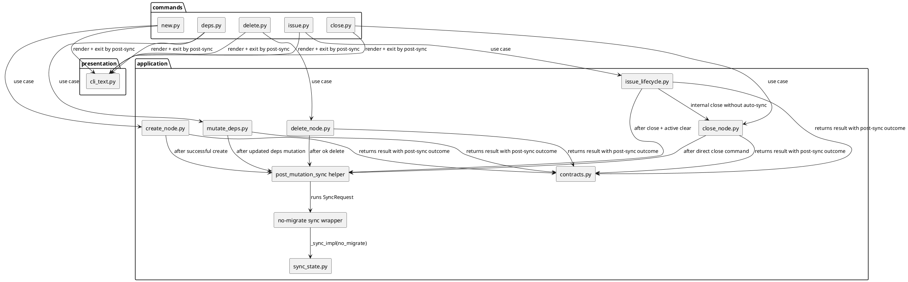
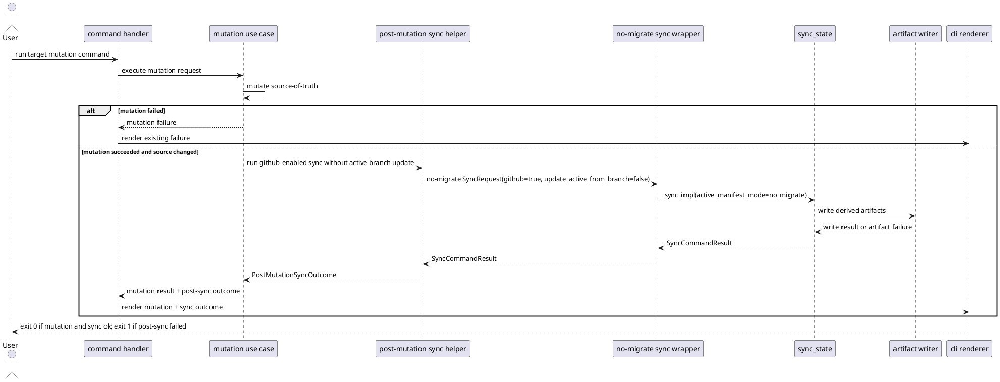
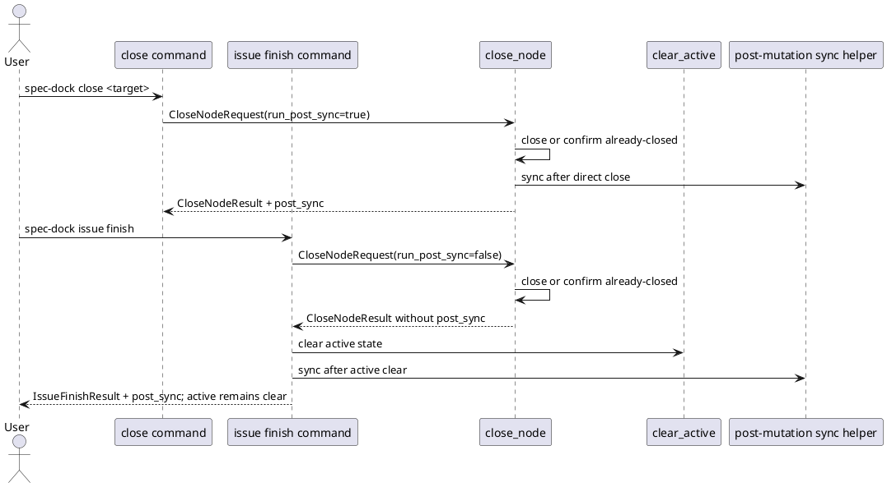

# iss-00093 Automatic Sync After State Mutations — 設計（HOW）

## 親 Diagram 参照
- Epic diagram:
  - `epic-00090` は scaffold 状態のため、Issue design が局所境界を固定する。
- Initiative diagram:
  - `init-local-00003 Architecture Maintenance and Hardening`
- 再利用する決定:
  - 既存の `sync_state.sync()` / `_sync_impl()` が `.agent/index*.json`、tree、deps projection、dashboard、PUML の生成責務を持つ。
  - `import_node.sync_after_import()` は mutation 後に sync を呼ぶ既存前例。ただし現在は `github_enabled=False` なので、この Issue の対象 mutation では GitHub enabled policy を別に固定する。

## 目的・制約
- 目的:
  - 対象 mutation が source-of-truth を変更した直後に、GitHub 状態取得を含む派生 artifact 更新を同じ command 結果として完了させる。
  - sync 失敗を mutation 成功と区別して表示し、古い `.agent` state を成功状態として扱わせない。
- 必須 / 禁止:
  - 必須: `new initiative/epic/issue`、`deps add/remove`、`delete`、`close`、`issue finish` の成功 path に post-mutation sync を接続する。
  - 必須: `issue finish` 後の active clear を post-mutation sync で復元しない。
  - 禁止: `--no-auto-sync` などの opt-out を追加しない。
  - 禁止: command handler が直接 artifact render/write を実装しない。
- 非交渉制約:
  - provider-side runtime under `src/spec_dock/assets/spec_dock/scripts/spec_dock_runtime/` を source of truth とする。
  - live GitHub に依存しない gh stub / port stub tests で検証する。
- 前提:
  - 通常の `new initiative/epic/issue` は GitHub issue linkage を持つ。
  - local-only 既存 node は GitHub fetch 対象外だが、sync graph のローカル投影には残す。

## 既存実装 / 規約の理解
- 参照した実装 / docs:
  - `application/sync_state.py`: `SyncRequest` を受け、GitHub 状態取得、active branch 推論、artifact 書き込み、failure contract を返す。
  - `application/create_node.py`: `create_node_core()` が node tree と `.meta.json` を作成する。
  - `application/mutate_deps.py`: `mutate_deps()` が `.meta.json.depends_on` を更新し、`updated` / `unchanged` を返す。
  - `application/delete_node.py`: `delete_node()` が remote close barrier、local tree delete、dependency scrub、active repair を扱う。
  - `application/close_node.py`: `close_node()` が linked GitHub issue の current state を確認し、already-closed も success として返す。
  - `application/issue_lifecycle.py`: `issue_finish()` が `close_node()` 後に `clear_active()` する。
  - `presentation/cli_text.py`: 各 command の human CLI 出力を集約する。
  - `commands/sync.py`: sync failure は `artifact_failure` があれば exit code 1 にする。
  - `workflow_issue.md`: `issue finish` は active clear を保証し、finish 後の通常 sync は branch-derived active restoration を起こし得ると明記している。
- 現状理解:
  - sync は既に GitHub enabled / disabled と active branch update 有無を `SyncRequest` で表現できる。
  - post-import sync は存在するが GitHub disabled かつ import 専用で、今回の mutation set には使い回せない。
  - mutation result 型は post-sync result を持たないため、command handler が sync failure に基づいて exit code を変えられない。
- 採用するパターン:
  - sync 実装は既存 `sync_state` に集約し、mutation use case は post-mutation sync helper を呼ぶだけにする。
  - CLI text は既存 renderer に post-sync summary を合成する。
- 採用しないもの:
  - file watcher。
  - mutation 前 preflight sync。
  - command handler による artifact direct write。
  - opt-out flag。
- 影響範囲:
  - runtime application contracts / mutation use cases / CLI rendering / command exit code / runtime tests。

## 採用方針 / トレードオフ
- 論点:
  - post-mutation sync を mutation use case 内で行うか、command handler で行うか。
- 選択肢:
  - A: command handler が mutation success 後に `use_cases.sync()` を呼ぶ。
  - B: mutation use case が post-mutation sync helper を呼び、result に sync outcome を含める。
- 決定:
  - B を採用する。
- 理由:
  - mutation 成功 / post-sync failure / partial state の関係は application-level outcome であり、command handler に分散させると JSON/text renderer や tests が command ごとにばらつく。
  - `delete` や `issue finish` は partial failure / active clear など application 固有の状態を持つため、sync policy を use case 側で近接させるほうが安全。
- 追加決定:
  - 対象 mutation の post-mutation sync request は `github_enabled=True`、`issue_limit=10000`、`force=False`、`update_active_from_branch=False` とする。
  - `update_active_from_branch=False` は全対象 mutation に適用する。目的は artifact refresh であり、active inference ではないため。これにより `issue finish` 後の active clear を維持する。
  - `deps add/remove` が `unchanged` の場合は source-of-truth が変わらないため post-mutation sync を skip し、CLI で更新済み扱いをしない。
  - post-mutation sync では、既存 sync が warning として扱う `gh_fetch_failed` と `gh_index_incomplete` を failure predicate に含める。対象 mutation 後の GitHub 状態取得が不完全な場合、artifact write が成功していても command exit code は `1` にする。
  - `close_node` は command から直接呼ばれる場合だけ post-mutation sync する。`issue_finish` から内部利用される close では post-mutation sync を抑止し、`clear_active()` 後に `issue_finish` が lifecycle-owned sync を1回だけ実行する。

## 依存関係分析
- module 依存:
  - `application/create_node.py`, `mutate_deps.py`, `delete_node.py`, `close_node.py`, `issue_lifecycle.py`
    - depends on: post-mutation sync helper
  - post-mutation sync helper
    - depends on: `application/sync_state.sync_after_mutation` or another public no-migrate wrapper around `_sync_impl(..., active_manifest_mode="no_migrate")`
  - `commands/*.py`
    - depends on: result `post_sync` outcome for exit code
  - `presentation/cli_text.py`
    - depends on: common post-sync summary renderer
- class / dataclass 依存:
  - `CreateNodeResult`, `MutateDepsResult`, `DeleteNodeResult`, `CloseNodeResult`, `IssueFinishResult` に optional post-sync outcome を追加する。
  - post-sync outcome は `PostMutationSyncOutcome` に固定する。対象 mutation result の `post_sync` は必ず `PostMutationSyncOutcome` を持つ。source-of-truth が変わらない `deps unchanged` のような場合も `sync_result=None` と `skipped_reason` を持つ outcome として表現し、`None` で分岐させない。
- function 依存:
  - mutation success path -> `sync_after_mutation(ports, preserve_active=True)` -> no-migrate capable sync boundary
  - command run -> renderer -> post-sync failure 判定 -> exit code
- file 依存:
  - application contracts を先に広げる。
  - sync helper を追加または `sync_state.py` に一般化する。
  - mutation use cases が helper を呼ぶ。
  - CLI render / command exit code が outcome を表示・反映する。
- 上流 / 前提:
  - requirement gate pass 済み。
  - existing sync behavior と failure wording。
- 下流 / 依存先:
  - plan step は contracts/helper -> local mutations -> destructive/GitHub lifecycle -> rendering/docs の順に組む。
- 実装起点:
  - dependency が少ない `application/contracts.py` と post-sync helper。
- 順序への影響:
  - `new` / `deps` は local source-of-truth mutation と artifact refresh の最小 slice。
  - `delete` / `close` / `issue finish` は failure / active state を含むため後続 slice。

## Module Dependency Diagram
- タイトル:
  - Post-mutation sync dependency delta
- 答える問い:
  - mutation use case、sync engine、CLI renderer の依存方向をどう固定するか。
- 範囲:
  - runtime application / command / presentation の変更差分。
- 含めない詳細:
  - 全 command registry、全 sync rendering、GitHub CLI adapter internals。
- 更新条件:
  - post-sync outcome の置き場、mutation 対象 command、active update policy が変わるとき。

### UML（module dependency delta）


## Local Diagram Delta（必要時）
- 変更する境界 / 責務 / 相互作用:
  - `sync_state.py` remains the artifact generation boundary.
  - New helper owns post-mutation sync policy: GitHub enabled, no branch active update, no opt-out.
  - Mutation use cases own whether sync is run, skipped, or failure-propagated.

## インターフェース契約
- `PostMutationSyncOutcome`:
  - `sync_result`: `SyncCommandResult | None`
  - `skipped_reason`: `str | None`
  - `exception_reason`: `str | None`
  - `failed`: `exception_reason is not None`、`sync_result.artifact_failure is not None`、または `sync_result.state.warnings` に post-mutation fatal warning が含まれる場合に `true`
  - `fatal_warning_codes`: `["gh_fetch_failed", "gh_index_incomplete"]`
  - `warnings`: sync warnings plus post-sync-specific warning codes
  - `guidance`: recovery guidance lines for CLI / JSON payload
- Result 型:
  - `CreateNodeResult.post_sync`
  - `MutateDepsResult.post_sync`
  - `DeleteNodeResult.post_sync`
  - `CloseNodeResult.post_sync`
  - `IssueFinishResult.post_sync`
  - `ImportNodeResult.post_import_sync` は既存互換のためこの Issue では名前変更しない。
- Helper contract:
  - Request policy:
    - `github_enabled=True`
    - `issue_limit=10000`
    - `force=False`
    - `update_active_from_branch=False`
    - `active_manifest_mode="no_migrate"` 相当
    - helper は既存 `sync_state.sync()` を直接呼ばない。`sync_state.sync()` は `active_manifest_mode="migrate"` の public command 用 wrapper なので、post-mutation sync 用に `sync_after_mutation()` などの no-migrate public wrapper を追加して使う。
  - Failure:
    - helper は mutation 成功後に呼ばれるため、`sync_state.sync()` / `_sync_impl()` が `SyncCommandResult` を返さず例外を投げた場合も捕捉し、`PostMutationSyncOutcome(sync_result=None, exception_reason=str(error), failed=True, guidance=[...])` として返す。mutation 本体の成功は取り消さない。
    - sync が `artifact_failure` を返した場合、mutation result には mutation success と sync failure の両方を保持する。
    - sync の `state.warnings` に `gh_fetch_failed` または `gh_index_incomplete` が含まれる場合、post-mutation sync failure として扱う。これは requirement の「GitHub issue の最新状態取得」を満たせなかった状態であり、通常の manual `sync` warning とは別に command failure へ昇格する。
    - command exit code は post-sync failure があれば `1`。
    - renderer は `mutation succeeded; auto-sync failed; artifacts may be stale or partially written; run ./spec-dock/scripts/spec-dock sync` 相当の guidance を出す。
- CLI contract:
  - success:
    - 既存の `spec-dock: ok (...)` line は維持する。
    - post-sync success は additional line または warning-safe summary として表示する。
  - failure:
    - stdout は mutation success line を残してよい。
    - stderr に auto-sync failure と recovery guidance を出す。
    - exit code は `1`。
- JSON delete:
  - `delete --json` は post-sync outcome を JSON payload に含める。
  - post-sync failure 時も JSON と exit code で failure を観測可能にする。
- Close / finish composition:
  - `CloseNodeRequest` または close use case 内部 API に `run_post_sync` 相当の policy を追加する。
  - `close` command path は `run_post_sync=True` で、close/already-closed success 後に post-mutation sync する。
  - `issue_finish` は internal close を `run_post_sync=False` で呼び、`clear_active()` success 後に `IssueFinishResult.post_sync` を1回だけ作る。
  - internal close が失敗した場合、active clear も post-sync も実行しない。既存 failure guidance を維持する。
  - internal close が成功し、`clear_active()` が失敗した場合、既存の `_finish_active_clear_failure_guidance` を維持して command は failure にする。この状態では lifecycle mutation が完了していないため post-mutation sync は実行しない。guidance には GitHub issue が closed/already-closed の可能性と active recovery が必要であることを示し、古い派生 state が残り得ることを明示する。

## Sequence Delta
- 変更する相互作用:
  - 対象 mutation success 後に post-mutation sync を追加する。
- retry / transaction / external API / queue:
  - retry は追加しない。
  - mutation と artifact write は atomic transaction ではない。mutation success 後に sync failure が起きた場合は partial/stale risk として露出する。
  - GitHub fetch は sync の既存 GitHub gateway / gh stub boundary を使う。

### UML


### Close / issue finish sequence delta


## Domain Model Delta
- aggregate / entity / value object 変更:
  - N/A: domain model 自体は変えない。
- domain event / policy / specification 変更:
  - application policy として `target mutation success implies post-mutation sync` を追加する。
- 不変条件の変更:
  - `issue finish` が成功した後は active clear が維持される。
  - post-mutation sync は branch-derived active restoration を行わない。
  - `issue_finish` path では post-mutation sync は active clear 後に1回だけ実行される。
- UML:
  - N/A: domain entity ではなく application workflow policy の変更であり、Sequence Delta で十分。

## クラス / インターフェース詳細設計
- Interface:
  - post-mutation sync helper
- 責務:
  - sync request policy を一箇所に固定する。
  - skip reason と sync result を統一形式で返す。
- 連携:
  - mutation use cases から呼ばれる。
  - presentation renderer は result 型の post-sync outcome を読む。
- UML:
  - N/A: dataclass と helper の詳細 shape は実装時に既存 contracts に合わせる。module dependency diagram と interface contract で十分。

## ディレクトリ / ファイル変更計画
```text
src/spec_dock/assets/spec_dock/scripts/spec_dock_runtime/
|-- application/
|   |-- contracts.py                 # Modify: mutation result に post-sync outcome を追加
|   |-- sync_state.py                # Modify: post-mutation sync helper を追加または既存 sync_after_import を一般化
|   |-- create_node.py               # Modify: create success 後に post-mutation sync
|   |-- mutate_deps.py               # Modify: updated path 後に post-mutation sync; unchanged は skip
|   |-- delete_node.py               # Modify: ok delete 後に post-mutation sync
|   |-- close_node.py                # Modify: direct close は post-sync; issue_finish internal close は sync 抑止
|   `-- issue_lifecycle.py           # Modify: close + active clear 後に lifecycle-owned post-sync, active clear 維持
|-- commands/
|   |-- new.py                       # Modify: post-sync failure を exit code に反映
|   |-- deps.py                      # Modify: post-sync failure を exit code に反映
|   |-- delete.py                    # Modify: ok + post-sync failure を exit code に反映
|   |-- close.py                     # Modify: post-sync failure を exit code に反映
|   `-- issue.py                     # Modify: finish post-sync failure を exit code に反映
`-- presentation/
    `-- cli_text.py                  # Modify: common post-sync success/failure summary, delete JSON payload

src/spec_dock/assets/spec_dock/docs/
`-- workflow_issue.md                # Modify: issue finish が active clear 後に lifecycle-owned sync する新契約へ更新

spec-dock/docs/
`-- workflow_issue.md                # Refresh/inspect: dogfooding workspace の workflow guidance が provider docs と矛盾しないことを確認

tests/
|-- cli_runtime/
|   |-- test_new.py                  # Modify/Add: new initiative/epic/issue auto-sync
|   |-- test_deps.py                 # Modify/Add: deps updated sync, unchanged skip
|   |-- test_delete.py               # Modify/Add: delete auto-sync and projection cleanup
|   |-- test_close.py                # Modify/Add: close / already-closed auto-sync with GitHub status
|   `-- test_issue_lifecycle.py      # Add/Modify: issue finish active clear preserved after auto-sync
`-- presentation_runtime/
    `-- test_runtime_sync_s07.py     # Modify only if shared sync failure wording changes
```

## 要件 → 設計マッピング
- AC-001 -> `create_node.py` post-sync for initiative + `commands/new.py` exit/render + `test_new.py`
- AC-002 -> `create_node.py` post-sync for epic + `commands/new.py` exit/render + `test_new.py`
- AC-003 -> `create_node.py` post-sync for issue + `commands/new.py` exit/render + `test_new.py`
- AC-004 -> `mutate_deps.py` updated path post-sync + unchanged skip contract + `test_deps.py`
- AC-005 -> `delete_node.py` ok path post-sync + delete projection cleanup + `test_delete.py`
- AC-006 -> direct `close_node.py` post-sync and `issue_lifecycle.py` lifecycle-owned post-sync after active clear + `test_close.py` / `test_issue_lifecycle.py`
- AC-007 -> shared post-sync outcome + command exit code/rendering + artifact/GitHub failure tests; includes `gh_fetch_failed` / `gh_index_incomplete` fatal warning predicate
- AC-008 -> no parser option changes; help/parser tests confirm no opt-out
- Docs -> `workflow_issue.md` の `issue finish` guidance を、manual sync 前提から lifecycle-owned post-sync 前提へ更新する。provider docs を正本として更新し、dogfooding workspace 側も refresh または差分確認する。
- EC-001 -> mutation failure path returns before post-sync helper
- EC-002 -> `MutateDepsResult.result == "unchanged"` skips post-sync
- EC-003 -> artifact write failure remains visible as stale/partial risk
- EC-004 -> GitHub fetch warning codes are promoted to post-mutation failure and produce non-zero
- EC-005 -> post-mutation sync uses `update_active_from_branch=False`

## テスト戦略
- 単体:
  - post-mutation sync helper request policy uses GitHub enabled and disables active branch update.
  - renderer summarizes post-sync success/failure consistently.
- 統合:
  - CLI runtime tests for each target command using temp repo and gh stubs.
  - Assert generated artifacts include / exclude created or deleted nodes without manual `sync`.
  - Assert deps projection updates after `deps add/remove`.
- Negative:
  - mutation preflight/write failure does not call post-sync.
  - sync raises after mutation success, then command returns non-zero with mutation success and recovery guidance visible.
  - sync artifact failure after mutation returns non-zero and recovery guidance.
  - GitHub fetch failure or incomplete GitHub index after mutation returns non-zero and mutation success is still visible.
  - `deps add` duplicate edge returns unchanged and skips post-sync.
- Active lifecycle:
  - `issue finish` on issue branch clears `.agent/active.json` / active symlink and does not restore active from branch.
  - already-closed issue finish follows the same post-sync and active clear contract.
  - `issue finish` does not run direct-close post-sync before active clear.
  - close success followed by active clear failure returns existing finish failure guidance, skips post-sync, and notes stale derived state risk.
- Migration / rollback / feature flag:
  - No migration and no feature flag.
  - Rollback is removing post-sync calls and result fields, returning to manual sync behavior.

## 要件 / 例外 -> verification mapping
- AC-001: runtime CLI creates initiative, then reads `.agent/index-all.json` / dashboard without manual sync.
- AC-002: runtime CLI creates epic, then reads `.agent/index-all.json` / dashboard without manual sync.
- AC-003: runtime CLI creates issue, then reads `.agent/index-all.json` / dashboard without manual sync.
- AC-004: runtime CLI deps add/remove, then reads `.agent/deps-issues.json` / `deps-issues.puml`.
- AC-005: runtime CLI delete, then verifies removed node absent from index/dashboard/deps projection.
- AC-006: gh stub close and already-closed paths, then verifies status projection and active clear for finish.
- AC-007: artifact writer / gh stub failure tests assert non-zero and guidance.
- AC-008: parser/help tests assert no opt-out flag.
- EC-001: use case tests or command tests assert sync helper not invoked on mutation failure.
- EC-002: duplicate deps add test asserts unchanged and no post-sync success claim.
- EC-003: failure injection around artifact writer and sync exceptions.
- EC-004: gh stub raises fetch failure or returns incomplete index; post-mutation failure predicate marks command non-zero.
- EC-005: issue branch finish test asserts active clear survives post-sync.

## リスク / 移行 / ロールバック
- リスク:
  - Commands become slower because each target mutation refreshes GitHub-backed artifacts.
  - Non-zero exit after mutation success can surprise callers; output must explicitly say mutation succeeded and sync failed.
  - `delete --json` consumers may need to handle post-sync outcome in payload.
  - Existing tests that expect exact stdout may need updates.
- 移行:
  - No data migration.
  - Existing manual `sync` remains valid recovery command.
- ロールバック:
  - Remove post-sync calls and post-sync result fields. Source-of-truth mutation behavior remains independent.

## 未確定事項
- なし。
