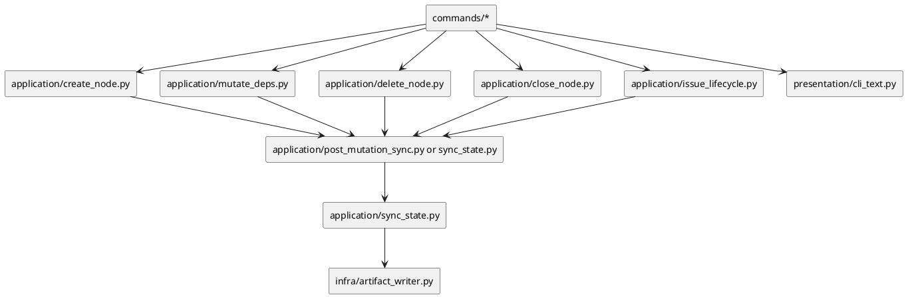

# iss-00093 Automatic Sync After State Mutations — 設計（HOW）

## 親 Diagram 参照
- Epic:
  - `epic-00090-github-default-sync-contract`
- Initiative:
  - `init-local-00003-architecture-maintenance-and-hardening`
- 再利用する決定:
  - `import_node` の post-import sync は、mutation 後に `sync_after_import` を呼ぶ既存前例として扱う。

## 目的・制約
- 目的:
  - mutation 成功後に derived artifact を自動更新し、手動 sync 忘れを通常経路から取り除く。
- 必須 / 禁止:
  - 必須: 共通 post-mutation sync helper を application 層に置く。
  - 禁止: command handler ごとに artifact rendering を直接呼ばない。
- 非交渉制約:
  - sync failure は観測可能にする。
  - provider-side runtime を先に変更し、dogfooding workspace は検証対象として扱う。

## 既存実装 / 規約の理解
- 参照した実装:
  - `application/sync_state.py`: sync の状態収集、artifact render/write、failure contract。
  - `application/import_node.py`: `sync_after_import` を呼ぶ既存 post-mutation 例。
  - `application/create_node.py`: `new` 系の source-of-truth 作成。
  - `application/mutate_deps.py`: `.meta.json.depends_on` mutation。
  - `application/delete_node.py`: node 削除と依存 scrub。
  - `application/close_node.py` / `application/issue_lifecycle.py`: GitHub issue close と active clear。
- 現状理解:
  - `sync` は derived artifact を生成する単一責務を持つ。
  - `new` / `deps` / `delete` / `close` は成功後 sync result を result object に持たない。
- 採用するパターン:
  - `sync_after_import` を一般化し、mutation type ごとの sync request policy を application 層で選ぶ。
- 採用しないもの:
  - file watcher。
  - command text だけでユーザーに手動 sync を促す対応。

## 採用方針 / トレードオフ
- 論点:
  - mutation 本体が成功したあとに sync が失敗した場合、CLI を成功扱いにするか。
- 決定:
  - 実装時に既存 import command の behavior を基準にする。少なくとも result object と CLI text で `artifact_failure` を表示し、stale / partial risk を隠さない。
- 理由:
  - silent stale がこの Issue の主要バグクラスなので、成功に見える失敗を避ける必要がある。

## 依存関係分析
- module 依存:
  - mutation use cases -> post-mutation sync helper -> `sync_state._sync_impl`
  - command renderers -> mutation result with post-sync summary
- file 依存:
  - `application/contracts.py`: result 型に post-sync 情報を追加する可能性。
  - `application/sync_state.py`: `sync_after_import` の一般化。
  - `presentation/cli_text.py`: post-sync result の表示。
  - `tests/cli_runtime/*`: command-level regression。
  - `tests/presentation_runtime/test_runtime_sync_s07.py`: sync failure contract の補強が必要な場合。
- 実装起点:
  - 共通 helper と contract を先に固定し、`new` と `deps` の小さい mutation から適用する。
- 順序への影響:
  - `close` / `issue finish` は GitHub enabled policy の判断があるため、local mutation より後に扱う。

## Module Dependency Diagram


## インターフェース契約
- Post-mutation sync helper:
  - 入力: `ports`, mutation kind, GitHub enabled policy, active branch update policy。
  - 出力: `SyncCommandResult` または sync skipped reason。
- Mutation result:
  - `post_sync` 相当の任意フィールドを追加し、CLI renderer が success / skipped / artifact failure を表示できるようにする。
- CLI:
  - mutation 成功時に sync artifact の更新結果を短く表示する。
  - post-sync failure 時は手動 `./spec-dock/scripts/spec-dock sync` guidance を表示する。

## Domain Model Delta
- 新しい domain model は不要。
- application contract の result 型だけを拡張する可能性が高い。

## ディレクトリ / ファイル変更計画
```text
src/spec_dock/assets/spec_dock/scripts/spec_dock_runtime/
|-- application/
|   |-- sync_state.py              # 変更: sync_after_import の一般化または helper 追加
|   |-- create_node.py             # 変更: new 後 post-sync
|   |-- mutate_deps.py             # 変更: updated mutation 後 post-sync
|   |-- delete_node.py             # 変更: successful delete 後 post-sync
|   |-- close_node.py              # 変更: close 後 post-sync policy
|   |-- issue_lifecycle.py         # 変更: finish 後 post-sync policy
|   `-- contracts.py               # 変更: post-sync result を表現
|-- presentation/
|   `-- cli_text.py                # 変更: post-sync summary / failure guidance
`-- tests/
    `-- cli_runtime/               # 変更: new/deps/delete/close/finish の artifact 更新 regression
```

## 要件 → 設計マッピング
- AC-001 -> `create_node` に post-mutation sync を適用し、`new` CLI test で artifact 更新を確認する。
- AC-002 -> `mutate_deps` の updated path に post-mutation sync を適用する。
- AC-003 -> `close_node` / `issue_lifecycle.issue_finish` の sync policy を固定して regression を追加する。
- AC-004 -> post-sync failure を result / CLI に露出する。
- EC-001 -> mutation failure path では post-sync helper が呼ばれない test を追加する。
- EC-002 -> `unchanged` path の sync skip contract を明示する。

## テスト戦略
- 単体:
  - post-mutation sync helper の request policy と failure propagation。
- 統合:
  - runtime CLI で `new issue` 後に `.agent/index-all.json` が更新される。
  - runtime CLI で `deps add/remove` 後に `.agent/deps-issues.json` と PUML が更新される。
  - close / finish は gh stub で状態反映と failure path を確認する。
- negative:
  - artifact writer failure 時に stale guidance と non-silent failure が返る。
  - mutation failure 時に sync が走らない。

## リスク / 移行 / ロールバック
- リスク:
  - mutation 後 sync により CLI 実行時間と GitHub 呼び出し回数が増える可能性。
  - post-sync failure を non-zero にすると、mutation 本体は成功しているのに command が失敗したように見える可能性。
- ロールバック:
  - 共通 helper を無効化すれば従来の手動 sync モデルに戻せるよう、mutation 本体の成功処理とは分離する。

## 未確定事項
- Q-001:
  - `close` / `issue finish` の post-sync は `github_enabled=True` を使うか。
  - 実装前に既存 `sync` default contract と gh stub test を見て決める。
