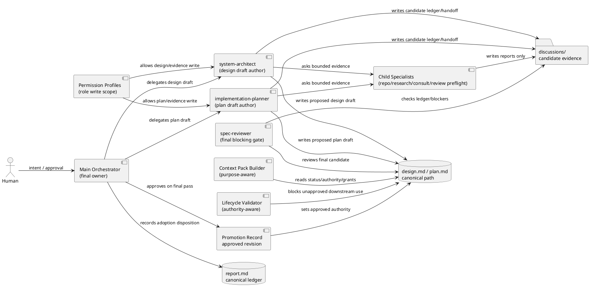
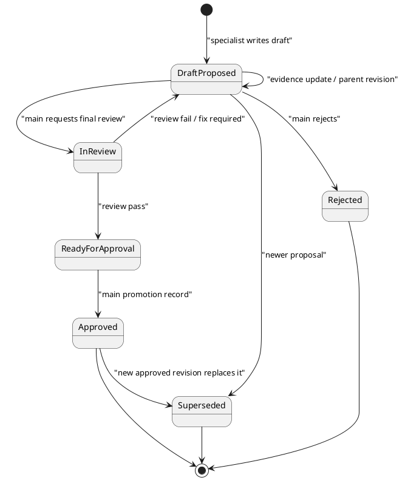

# epic-00112 Delegated Authoring Architecture for Spec Workflow — 設計（HOW）

## 全体像

この Epic の v1 設計は、v0 の「delegated draft evidence を discussions に残し、main orchestrator が canonical artifact へ統合する」方式を、authority-aware な「delegated draft canonical authoring」へ拡張する。

ただし canonical path に draft を置くことは強い authority signal を生む。そのため、`design.md` / `plan.md` を専門 author が更新できるようにする前に、次の構造を導入する。

- artifact metadata:
  - `status`
  - `authority`
  - `grants`
  - `approval`
  - source revision / dependency revision
- authority-aware context-pack:
  - review / planning / implementation / issue-ready / finish / phase-completion の purpose ごとに proposed と approved を分離する。
- lifecycle / validation gate:
  - implementation start、issue ready、issue finish、phase completion は `authority: approved` かつ該当 `grants.*: true` の artifact だけを受け付ける。
- evidence adoption ledger:
  - child specialist output の採用 / 部分採用 / 棄却 / 保留を trace する。
- role-specific write boundary:
  - Permission Profile と diff gate で、authoring role ごとの編集可能 artifact を制限する。

## Architecture Decisions

- AD-001 Canonical path is location, not authority:
  - `design.md` / `plan.md` は最新統合案の所在地である。
  - downstream の実装・完了判断の権威は `authority: approved` と promotion record によって成立する。
- AD-002 Status and authority are separate:
  - `status` は作業状態、`authority` は意思決定上の拘束力、`grants` は downstream action の許可を表す。
  - `status: draft` だけを safety boundary として扱わない。
- AD-003 Specialist authors draft, orchestrator approves:
  - `system-architect` は `design.md` draft author。
  - `implementation-planner` は `plan.md` draft author。
  - main orchestrator は approval / promotion / final ownership の owner。
- AD-004 Child specialists are evidence producers:
  - depth=2 は許可するが、child は leaf-only evidence / report producer とする。
  - child は canonical artifact、promotion、final reviewer verdict を変更しない。
- AD-005 Permission Profile is a guard, not the only control:
  - Codex Permission Profile を role-specific write scope に使う。
  - ただし Desktop / CLI 差分や direct file write の不安定性を前提に、validation / diff gate / lifecycle gate でも補強する。
- AD-006 Backward-compatible amendment:
  - 完了済み `iss-00113`..`iss-00118` は v0 として保持する。
  - v1 は追加 issue で積み上げる。

## Component / Module View

- Title:
  - Authority-aware delegated draft authoring boundary
- Question answered:
  - Which components own draft authoring, evidence, authority, context packaging, lifecycle blocking, and promotion?
- Scope:
  - Authoring workflow docs, role skills, Codex host adapters, runtime validation/context-pack surfaces, report evidence, dogfooding workspace.
- Excluded details:
  - Issue-local implementation steps, full Codex host implementation, `.github/agents`.
- Update trigger:
  - Authority state model、context-pack purpose、Permission Profile behavior、delegation graph、promotion gate が変わるとき。



## Authority Model

### Artifact metadata

`design.md` / `plan.md` は、canonical path にある場合でも、frontmatter または machine-readable metadata に次を持つ。

```yaml
schema: spec-dock.artifact.v1
artifact: design
spec_id: epic-00112
status: draft
authority: proposed
canonical_role: latest_proposal
owner_role: main-orchestrator
draft_author_role: system-architect
promotion_required_by: main-orchestrator
grants:
  review_input: true
  planning_input: true
  design_baseline: false
  implementation_start: false
  issue_ready: false
  issue_finish: false
  phase_completion: false
source_discussions: []
evidence_ledger: report.md#evidence-adoption-ledger
candidate_evidence: discussions/delegated-authoring/<task-id>/
source_revisions:
  requirement_revision: "<approved-requirement-revision>"
  requirement_authority: approved
stale_if:
  requirement_revision_changes: true
  authority_record_changes: true
approval:
  approved_by: null
  approved_at: null
  approved_revision: null
  promotion_record: null
```

`plan.md` は、approved design revision への依存も持つ。

```yaml
depends_on:
  requirement_revision: "<approved-requirement-revision>"
  requirement_authority: approved
  design_revision: "<approved-design-revision>"
  design_authority: approved
```

### Promotion record contract

Promotion record の正本位置は、対象 scope の `report.md` 内 `Spec Authoring Gate` の promotion entry とする。artifact metadata の `approval.promotion_record` は、この `report.md` entry の stable anchor または entry id を指す。

補助的に `discussions/promotions/<timestamp>-<artifact>-promotion.md` を作成してよいが、それは詳細添付であり正本ではない。詳細添付を使う場合も、`report.md` の promotion entry が attachment path、artifact revision、reviewer verdict、approved grants を要約し、validator / context-pack / lifecycle gate は `report.md` entry を primary source として読む。

Promotion record は最低限次を持つ。

```yaml
promotion_id: "<scope-artifact-timestamp>"
scope_id: "epic-00112"
artifact: design | plan
artifact_path: "design.md"
from_status: ready_for_approval
from_authority: proposed
to_status: approved
to_authority: approved
approved_grants:
  review_input: true
  planning_input: true
  design_baseline: true
  implementation_start: true
  issue_ready: true
  issue_finish: true
  phase_completion: true
approved_revision: "<promotion-candidate-hash>"
approved_content_hash: "<promotion-candidate-hash>"
post_promotion_document_revision: "<doc-revision-after-approval-metadata>"
source_revisions:
  requirement_revision: "<approved-requirement-revision>"
  design_revision: "<approved-design-revision-or-null>"
final_reviewer:
  reviewer_role: spec-reviewer
  review_status: pass
  reviewed_revision: "<candidate-document-revision>"
  reviewed_content_hash: "<promotion-candidate-hash>"
  review_record: "<report-or-discussion-path>"
approver:
  role: main-orchestrator
  approved_at: "<timestamp>"
ledger_blockers_remaining: 0
```

Verification rule:

- `approved_content_hash` は promotion candidate hash とする。
- promotion candidate hash は、approval / promotion metadata fields を除外し、artifact body、normative non-approval frontmatter fields、source revision references、そして promotion 後に付与される complete `approved_grants` set を含めて計算する。
- final reviewer は、この promotion candidate hash を review target として受け取り、`reviewed_content_hash` に同じ値を記録する。
- `approval.approved_revision` は `approved_content_hash` と同じ promotion candidate hash を指す。document file 全体の post-promotion revision や任意の doc revision を値にしてはならない。
- final reviewer の `reviewed_content_hash` は `approved_content_hash` と一致する。
- `post_promotion_document_revision` は approval metadata 書き込み後の document revision を監査用に記録するが、reviewer pass 判定には使わない。
- `approved_grants` は authoritative grants key set をすべて含む。key set は `review_input`, `planning_input`, `design_baseline`, `implementation_start`, `issue_ready`, `issue_finish`, `phase_completion` で固定する。
- `approved_grants` と artifact metadata の `grants` は exact match とする。subset match は不可。
- plan promotion では referenced `design_revision` が approved promotion record を持つ。
- promotion record が欠落、stale、revision mismatch の場合、artifact は `authority: approved` として扱わない。

### Requirement authority source

Requirement は専門 author へ委譲しないが、v1 の prerequisite gate では requirement も authority-aware に扱う。

- Requirement authority source は、対象 scope の `report.md` 内 `Spec Authoring Gate` requirement promotion entry とする。
- 既存 v0/v1 移行中に `authority` metadata がない requirement は、fresh `spec-reviewer` pass と main orchestrator の promotion evidence が `report.md` にある場合だけ `requirement_authority: approved` として扱える。
- 新規 v1 artifact では `requirement.md` も `authority: approved`、approved content hash、promotion record reference を持つ。
- `system-architect` の design draft task manifest は `input_revisions.requirement_revision` として approved requirement content hash を記録する。
- `implementation-planner` の plan draft task manifest は approved requirement content hash と approved design content hash の両方を記録する。
- Requirement promotion record が欠落、stale、reviewer verdict mismatch、content hash mismatch の場合、canonical `design.md` draft write は禁止し、discussions/proposal evidence に fallback する。

### State whitelist

| status | authority | 意味 | downstream authority |
|---|---|---|---|
| draft | proposed | authoring agent の作業中 draft | review / planning input only |
| in_review | proposed | final review 前の候補 | review input only |
| ready_for_approval | proposed | author 側完了、main approval 待ち | review input only |
| approved | approved | main promotion 済み | implementation / issue ready / issue finish / phase completion allowed |
| archived | superseded | 旧版 | no downstream authority |
| archived | rejected | 棄却版 | no downstream authority |

validator は whitelist 外の組み合わせを fail にする。

## Role / Permission Boundary

| Role | Writable target | May read | Must not write | Authority |
|---|---|---|---|---|
| main orchestrator | all canonical specs, scope-local `report.md`, promotion record, canonical Evidence Adoption Ledger | repo/workflow/evidence | destructive changes without user approval | final owner |
| system-architect | exact target `design.md` draft when `authority: proposed`, own candidate evidence, own discussions | requirement, approved design context, repo docs/code as needed | requirement, plan, implementation code, promotion record, scope-local `report.md` canonical Evidence Adoption Ledger | draft author only |
| implementation-planner | exact target `plan.md` draft when `authority: proposed`, own candidate evidence, own discussions | approved requirement/design, repo docs/code as needed | requirement, `design.md` body/metadata/approval fields, implementation code, promotion record, scope-local `report.md` canonical Evidence Adoption Ledger | draft author only |
| child specialist | own evidence report only | scoped inputs | canonical specs, promotion record, implementation code | evidence only |
| spec-reviewer preflight | review report only | draft/evidence | canonical specs | advisory only |
| spec-reviewer final | review verdict only | final candidate/evidence | canonical specs | blocking review gate |

### Permission Profile design

CLI-first の検証を前提に、agent ごとに named permission profile を用意する。

- `system_architect_design_draft`:
  - workspace read
  - exact target `design.md` write, or design draft directory write when fallback is explicitly selected
  - own candidate evidence / scoped discussions write
  - scope-local `report.md` canonical Evidence Adoption Ledger deny write
  - requirement / plan / implementation directories read-only or deny write
- `implementation_planner_plan_draft`:
  - workspace read
  - exact target `plan.md` write, or plan draft directory write when fallback is explicitly selected
  - own candidate evidence / scoped discussions write
  - scope-local `report.md` canonical Evidence Adoption Ledger deny write
  - requirement / design approval fields / implementation directories read-only or deny write
- `child_specialist_evidence_only`:
  - workspace read
  - scoped evidence report write
  - canonical specs deny write

単一ファイル write が host / OS sandbox の都合で不安定な場合は、専用 draft/evidence directory write + promotion-time copy/merge の fallback を使う。fallback で書かれる `discussions/...` は candidate evidence only であり、canonical adoption ledger や approval / promotion record の代替にはしない。

### Write-scoped task manifest

Permission Profile、diff gate、lifecycle validator は同じ task manifest を参照する。active symlink ではなく resolved path を記録し、許可 path と禁止 path の判定を曖昧にしない。

```yaml
task_id: "<scope-phase-role-timestamp>"
scope_id: "epic-00112"
role: system-architect | implementation-planner
phase: design | plan
mode: write-scoped-draft
resolved_canonical_target: "/abs/path/to/design.md"
input_revisions:
  requirement_revision: "<approved-requirement-revision>"
  design_revision: "<approved-design-revision-or-null>"
stale_if:
  requirement_revision_changes: true
  design_revision_changes: true
  promotion_record_changes: true
  evidence_ledger_blocker_added: true
allowed_write_paths:
  - "/abs/path/to/design.md"
  - "/abs/path/to/discussions/delegated-authoring/<task-id>/candidate-ledger.md"
  - "/abs/path/to/discussions/delegated-authoring/<task-id>/handoff.md"
  - "/abs/path/to/discussions/delegated-authoring/<task-id>/<task-evidence>.md"
forbidden_write_paths:
  - "/abs/path/to/requirement.md"
  - "/abs/path/to/plan.md"
  - "/abs/path/to/report.md"
  - "/abs/path/to/report.md#spec-authoring-gate"
  - "/abs/path/to/report.md#evidence-adoption-ledger"
  - "/abs/path/to/discussions/promotions"
  - "/abs/path/to/src"
deny_by_default: true
permission_profile: "system_architect_design_draft"
probe_result:
  allowed_write_probe: pass | fail | not_run
  forbidden_write_probe: pass | fail | not_run
fallback:
  if_probe_fails_open: "disable write-scoped delegation"
  if_probe_fails_closed: "use v0 discussions proposal path or directory-write fallback"
invalidation_conditions:
  - "any input_revisions value no longer matches the current approved promotion record"
  - "the artifact authority metadata no longer matches the promotion record referenced by input_revisions"
  - "a blocking scope-local report.md Evidence Adoption Ledger entry is added after draft generation"
  - "the resolved canonical target changes or active symlink resolves to a different path"
  - "permission probe result changes from pass to fail or cannot be reproduced"
output_contract:
  status: draft
  authority: proposed
  required_metadata: true
```

`implementation-planner` の manifest では `resolved_canonical_target` は `plan.md` になり、`design.md` は `forbidden_write_paths` に含める。

All non-allowlisted paths are denied by construction. `report.md` promotion entries, scope-local `report.md` Evidence Adoption Ledger, and `discussions/promotions/` attachments are explicitly forbidden to delegated authoring roles. Delegated authoring roles may write only candidate evidence / candidate ledger / handoff files under their own `discussions/delegated-authoring/<task-id>/` directory.

Stale detection rule:

- Draft generation records `input_revisions` and `stale_if`.
- Validation recomputes current approved requirement/design promotion records before review, context-pack inclusion, and promotion.
- If any recorded input revision differs from the current approved revision, the proposed draft becomes `stale` and cannot be used for promotion.
- If only non-authoritative discussions changed, the draft is not automatically stale unless the scope-local `report.md` Evidence Adoption Ledger adds a blocking entry.
- A stale draft may be regenerated or explicitly reconciled by the same authoring role; reconciliation creates a new task manifest or records a new source revision snapshot.

## Evidence Adoption Ledger

Canonical Evidence Adoption Ledger は scope-local `report.md` に置く。`discussions/...` 配下の `candidate-ledger.md` や handoff は delegated author / child specialist の candidate evidence only であり、adoption disposition の正本ではない。

Supersession note: 旧案の `discussions/evidence-adoption-ledger.md` は v0 / proposal-era の例として superseded とする。v1 以降、canonical ledger は `report.md#evidence-adoption-ledger`、delegated author が書ける補助 artifact は `discussions/delegated-authoring/<task-id>/{candidate-ledger.md,handoff.md,...}` とする。

`report.md` の canonical ledger entry 例:

```md
### EAD-0001

- source:
- contributor_role:
- claim:
- disposition: adopted | partially_adopted | rejected | deferred | superseded
- target_artifact:
- target_section:
- rationale:
- evidence_strength: direct_repo_evidence | external_primary_source | inference | assumption
- adopted_by:
- reviewed_by:
- blocking: false
```

不変条件:

- child output / delegated author candidate evidence は scope-local `report.md` の canonical ledger entry なしに canonical draft へ反映しない。
- `blocking: true` の unresolved item がある artifact は `authority: approved` に昇格できない。
- rejected / deferred evidence は本文に混ぜず、必要なら rationale だけを残す。

## Delegation Graph

許可:

- `system-architect -> repo-analyst`
- `system-architect -> researcher`
- `system-architect -> consultant`
- `system-architect -> deep-consultant`
- `system-architect -> spec-reviewer` as preflight only
- `implementation-planner -> repo-analyst`
- `implementation-planner -> researcher`
- `implementation-planner -> consultant`
- `implementation-planner -> deep-consultant`
- `implementation-planner -> spec-reviewer` as preflight only

禁止:

- child -> child
- child -> canonical artifact edit
- child -> final review / promotion
- authoring parent -> `dev-coder` as child for spec authoring
- `system-architect -> implementation-planner` and `implementation-planner -> system-architect` as child role

推奨 cap:

- max depth: 2
- child は leaf-only
- 1 parent pass の child call: 通常 3 まで
- 1 artifact の child call: 通常 6 まで
- deep-consultant: 1 artifact あたり原則 1 回
- preflight review loop: 2 回まで
- parent draft iteration: 3 回までで main handoff

## 主要フロー

### Flow-A: Design draft canonical authoring

1. Main confirms requirement is approved and records the approved requirement revision.
   - If requirement is only review-ready or under review, canonical `design.md` write is not allowed; the authoring work must remain in discussions/proposal evidence until requirement approval.
2. Main creates delegation invocation contract for `system-architect`.
3. `system-architect` optionally requests bounded child evidence.
4. Child specialists write evidence reports only.
5. `system-architect` updates candidate ledger / handoff evidence only.
6. `system-architect` writes `design.md` as `status: draft` / `authority: proposed`.
7. Main records the canonical Evidence Adoption Ledger disposition in scope-local `report.md`.
8. Main reviews draft, fixes if needed, and requests final `spec-reviewer`.
9. On pass, Main writes promotion record and promotes `status: approved` / `authority: approved`.

### Flow-B: Plan draft canonical authoring

1. Main confirms requirement and design are approved.
2. Main creates delegation invocation contract for `implementation-planner`.
3. `implementation-planner` optionally requests bounded child evidence.
4. Child specialists write evidence reports only.
5. `implementation-planner` updates candidate ledger / handoff evidence only.
6. `implementation-planner` writes `plan.md` as `status: draft` / `authority: proposed`, depending on approved design revision.
7. Main records the canonical Evidence Adoption Ledger disposition in scope-local `report.md`.
8. Main reviews draft, fixes if needed, and requests final `spec-reviewer`.
9. On pass, Main writes promotion record and promotes `status: approved` / `authority: approved`.

### Flow-C: Downstream context generation

1. Caller requests context-pack with purpose.
2. Context pack builder reads artifact metadata.
3. If purpose is review/planning, proposed artifacts may be included with non-authoritative labeling.
4. If purpose is implementation/issue-ready/finish/phase-completion, only approved artifacts with matching promotion records and required `grants.*: true` are included.
5. Missing approved artifact blocks downstream handoff.

## State / Activity



Promotion guard:

- `ReadyForApproval -> Approved` は main orchestrator だけが実行できる。
- `approval.approved_revision` は promotion candidate hash と一致する必要がある。approval metadata 書き込み後の document revision とは比較しない。
- plan approval は referenced design revision が approved であることを要求する。

## Context-pack / Lifecycle Contract

| Purpose | Proposed artifact | Approved artifact | Missing approved |
|---|---|---|---|
| research | include as non-authoritative | include as authoritative | warn |
| review | include as review target | include as baseline | block if review expects final |
| planning | include design as proposed input only | include as authoritative baseline | block for final plan approval |
| implementation | exclude from authoritative section | include only approved plan/design with `grants.implementation_start: true` | block |
| issue_ready | exclude | include approved plan/design + promotion record with `grants.issue_ready: true` | block |
| finish | exclude | include approved plan/design + promotion record with `grants.issue_finish: true` | block |
| phase_completion | exclude | include approved artifacts + final reviewer evidence + `grants.phase_completion: true` | block |

## 失敗設計

| Failure mode | Expected verdict | Allowed next action | Promotion eligibility |
|---|---|---|---|
| missing `authority` metadata | validation fail | add metadata / migrate artifact | no |
| invalid state combination | validation fail | fix state or archive artifact | no |
| `authority: proposed` used for implementation | lifecycle block | run final review / promotion | no |
| approved artifact lacks required grant | lifecycle block | fix promotion/grants and rerun promotion validation | no |
| promotion record revision mismatch | lifecycle block | re-review current artifact and create new promotion record | no |
| missing approved design revision for plan | plan gate fail | approve design first | no |
| input revision changed after draft generation | stale | regenerate draft or reconcile with new source revisions | no |
| unresolved blocking ledger item | promotion block | resolve / reject / defer with rationale | no |
| child edits canonical artifact | delegation violation | reject output, record incident | no |
| depth=3 attempt | delegation violation | stop child, reduce graph | no |
| Permission Profile write probe fails open | security fail | disable write-scoped delegation | no |
| Permission Profile write probe fails closed | operational fallback | use directory fallback or v0 proposal path | no until resolved |
| stale proposed artifact | stale | regenerate or reconcile | no |
| preflight pass used as final pass | reviewer gate fail | run fresh final reviewer | no |

## Provider-first Rollout Contract

E-RQ-010 の正本は provider-side source of truth である。plan slicing は必ず provider path を起点にし、dogfooding workspace は validation / parity surface として扱う。

| Surface | Provider source of truth | Dogfooding / consumer validation | Notes |
|---|---|---|---|
| workflow / phase docs | `src/spec_dock/assets/spec_dock/docs/` | `spec-dock/docs/` | provider を編集し、update / sync / diff で consumer 側を確認する |
| report templates / active-none scaffolds | `src/spec_dock/assets/spec_dock/templates/`, `src/spec_dock/assets/spec_dock/system/active-none/` | `spec-dock/templates/`, `spec-dock/system/active-none/` | promotion record / evidence sections の scaffold parity を見る |
| role skills | `src/spec_dock/assets/install_root/.agents/skills/` | `.agents/skills/` | system-architect / implementation-planner / child-specialist instructions の正本 |
| Codex host adapters | `src/spec_dock/assets/install_root/.codex/agents/` | `.codex/agents/` | thin adapter。host callability は probe 結果で verified / fallback を分ける |
| runtime gates | `src/spec_dock/assets/spec_dock/scripts/spec_dock_runtime/` | `spec-dock/scripts/spec_dock_runtime/` | context-pack / lifecycle / validation / active-store など shipped runtime の正本 |
| tests | `tests/` | generated temp workspaces / local dogfooding workspace | provider behavior と managed asset parity を検証する |

Sequencing rule:

1. Provider source を変更する。
2. Provider-targeted tests または content assertions を追加・更新する。
3. Dogfooding workspace を update / sync / targeted copy で確認する。
4. Provider / consumer に意図しない drift がないことを記録する。
5. Dogfooding-only evidence issue を除き、consumer copy だけを先に編集して完了扱いにしない。

Plan issue は、各 issue ごとに provider source、dogfooding validation surface、test surface、rollback / fallback を明記する。

## 移行戦略

- Phase 0:
  - Keep v0 `iss-00113`..`iss-00118` as completed history.
- Phase 1:
  - Add artifact authority metadata and validator.
- Phase 2:
  - Add authority-aware context-pack / lifecycle gates.
- Phase 3:
  - Add evidence adoption ledger and bounded depth=2 policy.
- Phase 4:
  - Verify Permission Profile profiles and host adapter behavior.
- Phase 5:
  - Enable controlled draft canonical authoring dogfooding.

Rollback:

- If authority-aware validation fails operationally, return to v0 discussions/proposal path.
- If Permission Profile cannot enforce role-specific writes, keep specialist roles read-only and use main orchestrator integration.
- If context-pack purpose separation is incomplete, block implementation handoff from proposed artifacts.

## 観測性 / セキュリティ

- Observability:
  - report records each delegated authoring invocation, child evidence, ledger dispositions, final reviewer verdict, promotion record, and fallback path.
  - dogfooding records draft count, child call count, adopted/rejected evidence count, review findings, stale events, permission probe results, and context-pack block events.
- Security:
  - `.env*`, credentials, GitHub mutation, destructive commands, implementation code edit are outside delegated author permissions.
  - Permission Profile is verified with positive and negative write probes before use.
  - Desktop App behavior is not assumed equivalent to CLI without probe evidence.

## テスト戦略

- Schema / validator tests:
  - missing authority metadata fails.
  - invalid status/authority combination fails.
  - proposed artifact cannot pass implementation / issue ready / issue finish / phase completion gate.
  - plan approval fails when referenced design revision is not approved.
- Context-pack tests:
  - review purpose includes proposed artifact as non-authoritative.
  - implementation purpose excludes proposed artifact from authoritative inputs.
  - issue-ready purpose requires approved plan/design and `grants.issue_ready: true`.
  - finish purpose requires approved promotion record and `grants.issue_finish: true`.
  - phase-completion purpose requires approved artifacts, final reviewer evidence, and `grants.phase_completion: true`.
- Permission tests:
  - `system-architect` can write only design draft / candidate evidence path.
  - `implementation-planner` can write only plan draft / candidate evidence path.
  - child specialist cannot write canonical artifact.
  - failed probe disables write-scoped authoring.
- Delegation tests:
  - depth=2 allowed graph passes.
  - depth=3 and implementation child delegation fail.
  - child output without ledger disposition blocks promotion.
- Review tests:
  - preflight pass is not accepted as final pass.
  - final reviewer must see artifact + scope-local `report.md` Evidence Adoption Ledger + promotion candidate.

## 要件 → 設計マッピング

| Requirement | Design element |
|---|---|
| E-RQ-001 | Role / Permission Boundary, Promotion guard |
| E-RQ-002 | Flow-A, Flow-B, Permission Profile design |
| E-RQ-003 | Authority Model, State whitelist |
| E-RQ-004 | Promotion guard, Review tests |
| E-RQ-005 | Context-pack / Lifecycle Contract |
| E-RQ-006 | Evidence Adoption Ledger |
| E-RQ-007 | Delegation Graph |
| E-RQ-008 | Permission Profile design, Permission tests |
| E-RQ-009 | Review tests, Role / Permission Boundary |
| E-RQ-010 | Migration strategy, Provider-first rollout |
| E-RQ-011 | Migration strategy, Plan amendment policy |
| E-RQ-012 | Failure design |

## 関連 ADR

現時点では Epic design に固定する。後続で write-scoped draft authoring が複数 Epic にまたがる標準運用になる場合は、`canonical path is not authority` と `authority-aware context-pack` を ADR 化する。

## 未確定事項

- なし:
  - v1 の目標状態は authority-aware delegated draft canonical authoring とする。
  - Permission Profile 検証と authority-aware gate が揃うまでは、write-scoped draft authoring を有効化しない。
