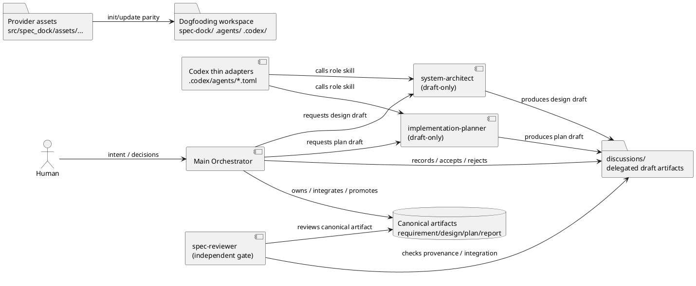
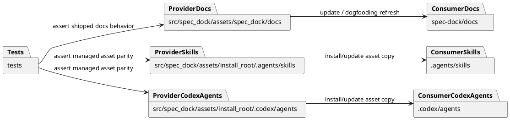
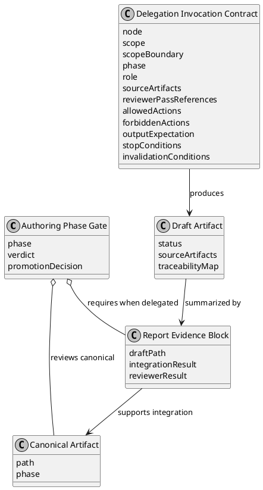
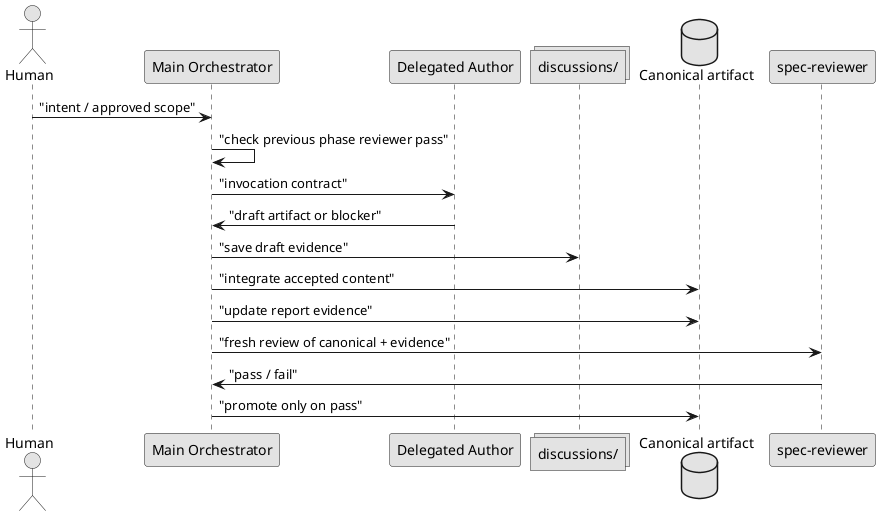
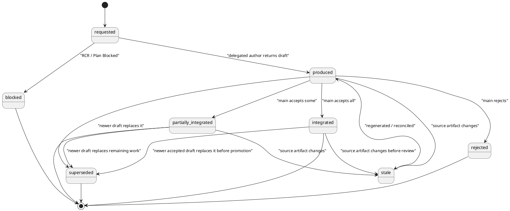

# epic-00112 Delegated Authoring Architecture for Spec Workflow — 設計（HOW）

## 全体像
- 対象境界:
  - Spec authoring workflow の design / plan draft 作成を draft-only delegated authoring として拡張する。
  - Requirement authoring、canonical artifact integration、phase promotion、report evidence、fresh `spec-reviewer` gate は main orchestrator が所有する。
  - 初期 Epic は docs / role skills / thin Codex host adapter / dogfooding evidence までを対象にし、runtime validation や write-capable delegation は扱わない。
- 影響領域:
  - Provider-side shipped workflow docs: `src/spec_dock/assets/spec_dock/docs/`
  - Provider-side shipped report templates: `src/spec_dock/assets/spec_dock/templates/{initiative,epic,issue}/report.md`
  - Provider-side active-none report scaffolds: `src/spec_dock/assets/spec_dock/system/active-none/{initiative,epic,issue}/report.md`
  - Provider-side shipped agent tooling: `src/spec_dock/assets/install_root/.agents/skills/`, `src/spec_dock/assets/install_root/.codex/agents/`
  - Dogfooding consumer workspace: `spec-dock/docs/`, `spec-dock/templates/{initiative,epic,issue}/report.md`, `spec-dock/system/active-none/{initiative,epic,issue}/report.md`, `.agents/`, `.codex/`
  - Asset parity tests and init/update behavior.
- 既存関係:
  - Existing authoring workflow already requires fresh `spec-reviewer` pass for phase promotion.
  - Existing issue execution workflow already defines implementation delegation gate, but authoring delegation needs a separate artifact ownership and evidence contract.
- 参照する親 diagram:
  - `init-local-00003` high-level context treats architecture epics as contract hardening units; this Epic is one such contract hardening unit.

## Architecture Decisions
- AD-001 Draft evidence, not authority:
  - Delegated authoring roles produce auditable draft evidence only.
  - Canonical authority remains `requirement.md` / `design.md` / `plan.md` after main orchestrator integration and fresh `spec-reviewer` pass.
- AD-002 Requirement remains human/orchestrator-owned:
  - `system-architect` and `implementation-planner` must not own or mutate requirement scope.
- AD-003 Role skill is canonical, host adapter is thin:
  - Full role behavior lives in `spec-dock-system-architect` / `spec-dock-implementation-planner` skills.
  - `.codex/agents/*.toml` only provides callable host entrypoints and points at the role skill authority.
- AD-004 Structured Markdown before runtime schema:
  - Draft artifacts and report evidence use required Markdown sections in v0.
  - Runtime validation / JSON schema are deferred.
- AD-005 Provider-first:
  - Shipped docs/skills/adapters are changed under `src/spec_dock/assets/...` first.
  - Dogfooding consumer copies are refreshed or inspected as validation outputs.

## Component / Module View
- タイトル:
  - Delegated authoring ownership and artifact boundary
- 答える問い:
  - Which component owns canonical docs, draft evidence, review, and host entrypoints?
- 範囲:
  - Authoring workflow docs, role skills, Codex host adapters, report evidence, dogfooding workspace.
- 含めない詳細:
  - Individual issue implementation steps, runtime enforcement internals, future write-capable guard implementation.
- 更新条件:
  - Role ownership, draft lifecycle, host adapter boundary, or provider/consumer source-of-truth changes.

### UML（component / module）


## Package Dependency
- タイトル:
  - Provider-first shipped asset dependency
- 答える問い:
  - Where should changes be made, and how do they flow into dogfooding?
- 範囲:
  - Provider docs, install_root assets, generated/dogfooding workspace, tests.
- 含めない詳細:
  - Full installer call graph.
- 更新条件:
  - Asset placement or installer copy contract changes.

### UML（package dependency）


## Domain Model（authoring domain）
- ユビキタス言語:
  - Canonical artifact: phase promotion の対象となる `requirement.md` / `design.md` / `plan.md` / `report.md`。
  - Delegated draft artifact: delegated author が返した draft evidence。authority ではない。
  - Main orchestrator: canonical integration と phase promotion の owner。
  - Delegated author: `system-architect` / `implementation-planner`。draft-only role。
  - Reviewer: independent gate。draft producer ではない。
- 集約ルート:
  - Authoring Phase Gate:
    - Inputs: source canonical artifacts, draft evidence, report evidence, reviewer verdict.
    - Invariant: fresh `spec-reviewer` pass なしに promotion しない。
- エンティティ / 値オブジェクト:
  - Delegation Invocation Contract:
    - node, scope, scope boundary, phase, role, artifact, consent, source artifacts, reviewer pass references, allowed actions, forbidden actions, output expectation, stop conditions, invalidation conditions.
  - Draft Artifact:
    - status, source artifacts, source snapshot, traceability map, blockers, integration notes.
  - Report Evidence Block:
    - role, phase, scope, draft path, integration result, reviewer result, promotion decision.
- ドメインイベント / ポリシー / 仕様:
  - DraftProduced
  - DraftIntegrated
  - DraftRejected
  - DraftMarkedStale
  - RequirementClarificationRequested
  - PlanBlocked
  - PhasePromotionPassed
- 不変条件:
  - Delegated author must not mutate previous-phase artifacts.
  - Delegated draft must not replace reviewer pass.
  - Stale / rejected / superseded / blocked draft must not be promotion evidence.
  - Role unavailable does not block manual authoring.

### UML（domain model）
- Title:
  - Delegated authoring evidence model
- Question answered:
  - Which authoring-domain objects connect invocation, draft, evidence, canonical artifact, and phase gate?
- Scope:
  - Logical contract objects only.
- Excluded details:
  - Persistence schema, runtime validation implementation, full skill prompt text.
- Update trigger:
  - Draft artifact metadata, report evidence fields, or phase gate ownership changes.



## 契約
### Ownership Matrix
| Capability | Main orchestrator | Human | system-architect | implementation-planner | spec-reviewer |
| --- | --- | --- | --- | --- | --- |
| Own user dialogue | Yes | Participates | No | No | No |
| Own `requirement.md` | Yes | Yes | No | No | Review only |
| Draft `design.md` | Yes | No | Draft-only | No | No |
| Draft `plan.md` | Yes | No | No | Draft-only | No |
| Edit canonical artifacts | Yes | No | No | No | No |
| Integrate delegated draft | Yes | No | No | No | No |
| Promote phase | With fresh reviewer pass | No | No | No | No |
| Review artifact | No | No | No | No | Yes |
| Edit implementation code | Out of scope | Out of scope | Forbidden | Forbidden | Forbidden |
| Mutate GitHub issue | Out of scope | Out of scope | Forbidden | Forbidden | Forbidden |

### Delegation Invocation Contract
```md
## Delegation Invocation Contract

- node_type:
- node_id:
- scope:
- scope_boundary:
- phase: design | plan
- role: system-architect | implementation-planner
- target_artifact: design.md | plan.md
- authoring_mode: draft-only
- source_artifacts:
- reviewer_pass_references:
- allowed_actions:
- forbidden_actions:
- output_expectation:
- stop_conditions:
- invalidation_conditions:
```

### Draft Artifact Contract
```md
# Delegated {Design|Plan} Draft

## Metadata
- node_type:
- node_id:
- phase:
- role:
- authoring_mode: draft-only
- status: requested | produced | integrated | partially_integrated | rejected | superseded | blocked | stale
- created_at:
- source_artifacts:
- source_snapshot:
- consent_reference:

## Invocation Contract
## Traceability Map
## Blockers / Clarification Requests
## Integration Notes
```

### Delegated Design Draft Required Output
```md
## Requirement Coverage
## Existing Context Findings
## Design Decisions
## Alternatives Considered
## Boundary / Contract Model
## Dependency Analysis
## Source of Record
## Data Flow / Domain Model / Interface Contract
## File / Module Change Plan
## Migration / Compatibility / Rollback
## Observability
## Test Strategy
## ADR Candidates
## Risks
## Requirement Clarification Requests
## Integration Notes for Main Orchestrator
```

### Delegated Plan Draft Required Output
```md
## Plan Summary
## Requirement / Design Traceability
## Milestones
## Dependency-Derived Execution Order
## Issue / Step Slicing
## Test Strategy Mapping
## Review Gates
## Rollback / Compatibility
## Docs Impact
## Final Quality Gate
## Plan Blockers
## Integration Notes for Main Orchestrator
```

### Report Evidence Contract
The v0 report evidence contract is carried in workflow docs and copied into shipped report templates/scaffolds so new nodes and active-none placeholders expose the expected evidence shape. Required provider surfaces:

- `src/spec_dock/assets/spec_dock/templates/initiative/report.md`
- `src/spec_dock/assets/spec_dock/templates/epic/report.md`
- `src/spec_dock/assets/spec_dock/templates/issue/report.md`
- `src/spec_dock/assets/spec_dock/system/active-none/initiative/report.md`
- `src/spec_dock/assets/spec_dock/system/active-none/epic/report.md`
- `src/spec_dock/assets/spec_dock/system/active-none/issue/report.md`

Required dogfooding parity surfaces:

- `spec-dock/templates/initiative/report.md`
- `spec-dock/templates/epic/report.md`
- `spec-dock/templates/issue/report.md`
- `spec-dock/system/active-none/initiative/report.md`
- `spec-dock/system/active-none/epic/report.md`
- `spec-dock/system/active-none/issue/report.md`

```md
## {Design|Plan} Authoring Delegation

- role:
- phase:
- scope:
- consent:
- source artifacts:
- draft artifact path:
- status:
- integration result:
- rejected portions:
- blockers:
- reviewer result:
- promotion decision:
```

## データ境界
- 正本:
  - Workflow docs: `src/spec_dock/assets/spec_dock/docs/`
  - Role skills and host adapters: `src/spec_dock/assets/install_root/`
  - Dogfooding active docs: `spec-dock/active/...` for current planning evidence.
- 一貫性モデル:
  - Provider-first update followed by dogfooding refresh / parity inspection.
  - `spec-dock/` generated workspace is validation surface, not provider implementation source.

## データモデル
- model / table 変更:
  - Runtime persistence model changes are not included.
  - Markdown structured sections define v0 schema.
- 不変条件:
  - Required evidence fields must be present when delegated authoring is used.
  - Missing delegated evidence blocks promotion only when canonical artifact claims delegated authoring was used.

### UML（data model）
- N/A: Runtime persistence schema is out of scope; Markdown section contracts are listed above.

## 主要フロー
- Flow-A: Delegated design draft
  1. Main confirms active node and fresh requirement reviewer pass.
  2. Main records invocation contract for `system-architect`.
  3. `system-architect` reads permitted inputs and returns draft artifact or RCR.
  4. Main saves draft under `discussions/`.
  5. Main integrates accepted content into canonical `design.md`.
  6. Main records report evidence.
  7. Fresh `spec-reviewer` reviews canonical `design.md` and delegated evidence.
- Flow-B: Delegated plan draft
  1. Main confirms fresh requirement and design reviewer pass.
  2. Main records invocation contract for `implementation-planner`.
  3. `implementation-planner` returns plan draft or Plan Blocked.
  4. Main saves draft under `discussions/`.
  5. Main integrates accepted content into canonical `plan.md`.
  6. Main records report evidence.
  7. Fresh `spec-reviewer` reviews canonical `plan.md` and delegated evidence.

### UML（main sequence）
- Title:
  - Delegated authoring sequence
- Question answered:
  - How does a delegated draft move from invocation to canonical integration and reviewer gate?
- Scope:
  - Design and plan authoring delegation flow.
- Excluded details:
  - Individual role internal reasoning, implementation issue steps, runtime enforcement.
- Update trigger:
  - Invocation order, evidence write point, reviewer gate, or promotion decision changes.



## State / Activity
- State:
  - Draft lifecycle is central to this Epic.
- Activity:
  - N/A: Main sequence and state diagram cover the relevant workflow branches.

### UML（state）
- Title:
  - Delegated draft lifecycle
- Question answered:
  - Which draft states can or cannot support phase promotion?
- Scope:
  - Draft artifact status transitions from request through terminal states.
- Excluded details:
  - Canonical artifact lifecycle and issue execution states.
- Update trigger:
  - Draft statuses, stale/superseded handling, or evidence eligibility changes.



## 失敗設計
| Failure mode | Expected verdict | Allowed next action | Report evidence path | Promotion eligibility |
| --- | --- | --- | --- | --- |
| missing consent | delegated invocation skipped | Continue manual authoring or obtain consent | `Spec Authoring Gate.delegation consent` records none / not used | Manual path can pass |
| missing/stale previous reviewer pass | delegated invocation blocked | Rerun previous phase reviewer or return to previous phase | `{Design|Plan} Authoring Delegation.blockers` plus `Spec Authoring Gate.reviewer` | No |
| requirement gap during design | `Requirement Clarification Request` | Update requirement and rerun requirement gate | delegated design draft `Blockers / Clarification Requests`; report blockers | No |
| design gap during plan | `Plan Blocked` | Update design and rerun design gate | delegated plan draft `Plan Blockers`; report blockers | No |
| role unavailable | delegated path unavailable | Use manual authoring path or retry role later | `Spec Authoring Gate.delegation consent` / `{Design|Plan} Authoring Delegation.status=unavailable` | Manual path can pass |
| forbidden action attempt | draft rejected / violation recorded | Reject draft, do not integrate, optionally regenerate with stricter contract | `{Design|Plan} Authoring Delegation.rejected portions` and `blockers` | No |
| stale draft | draft marked stale | Reconcile source changes or regenerate draft | draft metadata `status=stale`; report status and next action | No until reconciled |
| superseded draft | draft marked superseded | Reference newer draft; keep old draft only as history | draft metadata `status=superseded`; report integration result points to newer draft | No |
| missing draft evidence when delegated use is claimed | gate incomplete/fail | Save evidence or remove delegated-use claim | `Spec Authoring Gate.verdict` and `{Design|Plan} Authoring Delegation.draft artifact path` | No |
| reviewer unavailable/denied/waived/provisional | existing gate non-pass | Rerun reviewer or record waiver without promotion pass | `Spec Authoring Gate.reviewer` and `verdict` | No automatic promotion |

- リトライ:
  - Reviewer fail: fix canonical artifact / evidence and rerun fresh reviewer.
  - RCR / Plan Blocked: return to previous phase and rerun the appropriate gate.
- 冪等性:
  - Re-running delegated draft generation creates a new draft artifact and supersedes older drafts by report evidence.
- 部分失敗:
  - Partially integrated drafts must record rejected portions and cannot hide unresolved blockers.

## 移行戦略
- 移行戦略:
  - Additive docs/skills/adapters change. Existing manual authoring path remains valid.
  - Initial rollout is draft-only; no runtime migration or persistence migration.
- 必要時の dual write/read:
  - None. Provider source is updated first, dogfooding workspace is refreshed/inspected.
- ロールバック:
  - Revert docs/skills/adapters by issue commit.
  - Since runtime behavior is not changed in v0, rollback is documentation/tooling asset rollback.

## 観測性 / セキュリティ
- 観測性:
  - `report.md` records phase gate evidence and delegated authoring evidence.
  - Dogfooding pilot records metrics: draft count, integration ratio, rejected reasons, traceability defects, gate violations, forbidden action attempts, reviewer findings, stale draft events, provider/consumer drift.
- ロール / 認可:
  - Delegated authoring roles are non-authoritative and draft-only.
  - `spec-reviewer` remains independent.
- 監査 / PII:
  - No secrets, credentials, browser history, or private data are needed.
  - Draft artifacts should include source paths and evidence, not hidden user data.

## テスト戦略
- 単体:
  - Role skill text checks where existing tests assert managed assets.
  - Markdown content assertions for required workflow / phase / evidence sections if local patterns exist.
- 統合:
  - Init/update asset parity tests for new skills and `.codex/agents` adapters.
  - Dogfooding workspace refresh / inspection to confirm provider source and consumer workspace alignment.
- E2E:
  - Dogfooding pilot: generate at least one design draft and one plan draft, integrate, record report evidence, and run fresh `spec-reviewer`.
- E-AC 対応:
  - E-AC-001 -> workflow docs ownership contract and reviewer pass evidence.
  - E-AC-002 -> role skill / adapter forbidden action text.
  - E-AC-003 -> draft artifact lifecycle and metadata.
  - E-AC-004 -> delegated design draft pilot.
  - E-AC-005 -> delegated plan draft pilot.
  - E-AC-006 -> reviewer criteria for delegated evidence.
  - E-AC-007 -> provider/consumer parity tests or evidence.
  - E-AC-008 -> dogfooding pilot metrics and defer decision.
  - E-AC-009 -> failure mode table and evidence path.

## 関連 ADR
- Not required for v0:
  - This Epic fixes workflow/tooling contracts and defers write-capable delegation. ADR can be introduced later if write-capable delegation or runtime enforcement becomes a durable cross-epic policy.

## 未確定事項
- なし:
  - `.codex/agents` is in scope as thin adapter.
  - `.github/agents` / Copilot agent support is non-scope.
  - Runtime validation and write-capable delegation are deferred.
