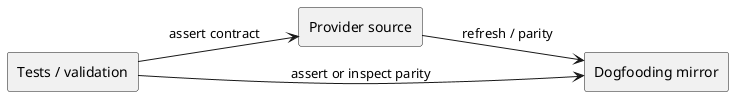

# iss-00116 Delegated Authoring Phase Gates — 設計（HOW）

## 親 Diagram 参照
- Epic diagram:
  - `epic-00112/design.md` の component/module、provider dependency、draft lifecycle を参照する。
- 再利用する決定:
  - AD-001 Draft evidence, not authority。
  - AD-003 Role skill is canonical, host adapter is thin。
  - AD-005 Provider-first。

## 目的・制約
- 目的:
  - phase_design / phase_plan / phase_plan_epic / phase_plan_issue に delegated authoring gates と reviewer criteria を組み込む。
- 必須 / 禁止:
  - 必須: `src/spec_dock/assets/spec_dock/docs/phase_design.md; phase_plan.md; phase_plan_epic.md; phase_plan_issue.md; dogfooding mirrors` を対象に、親 Epic の該当 contract を実装可能な形にする。
  - 禁止: write-capable delegation / runtime validation / `.github/agents` support の導入。
- 前提:
  - Depends on: iss-00113, iss-00114, iss-00115

## 既存実装 / 規約の理解
- 参照した実装 / docs:
  - `src/spec_dock/assets/spec_dock/docs/`
  - `src/spec_dock/assets/install_root/`
  - `spec-dock/docs/`, `.agents/`, `.codex/`
  - `tests/test_init_update.py`
- 現状理解:
  - provider assets が shipped source of truth。dogfooding workspace は検証面。
- 採用するパターン:
  - provider-first update、dogfooding parity inspection、fresh reviewer gate。
- 採用しないもの:
  - runtime enforcement first、host-specific long instruction duplication。
- 影響範囲:
  - src/spec_dock/assets/spec_dock/docs/phase_design.md; phase_plan.md; phase_plan_epic.md; phase_plan_issue.md; dogfooding mirrors

## 採用方針 / トレードオフ
- 論点:
  - docs/skill/template のどこに contract を置くか。
- 決定:
  - 正本 contract は provider assets に置き、dogfooding mirror は validation surface とする。
  - 実行時 enforcement より、v0 では Markdown contract + reviewer + tests/evidence を優先する。

## 依存関係分析
- file 依存:
  - 親 Epic requirement/design/plan に依存する。
  - この Issue の対象ファイルは後続 Issue の前提になる。
- 上流 / 前提:
  - iss-00113, iss-00114, iss-00115
- 下流 / 依存先:
  - 後続 Issues as defined in `epic-00112/plan.md`。
- 実装起点:
  - Provider-side source of truth から開始する。
- 順序への影響:
  - provider update -> dogfooding mirror/parity -> tests/validate/sync -> report/review。

## Module Dependency Diagram
- タイトル:
  - Phase gates provider-to-consumer dependency
- 答える問い:
  - どの artifact を正本として変更し、どこで parity を確認するか。
- 範囲:
  - この Issue の docs / skills / adapters / templates surface。
- 含めない詳細:
  - exhaustive installer copy graph。
- 更新条件:
  - 対象ファイルや provider/consumer boundary が変わるとき。

### UML（module dependency / package dependency delta）


## インターフェース契約
- API / function / protocol / data boundary:
  - No public runtime API change unless explicitly discovered during implementation.
  - Contract surface is Markdown / skill / host adapter content.

## ディレクトリ / ファイル変更計画
```text
.
|-- src/spec_dock/assets/...   # 変更: provider-side source of truth for Phase gates
|-- spec-dock/...              # 変更/確認: dogfooding consumer parity
`-- tests/...                  # 変更/確認: managed asset or content assertion as needed
```

## 要件 → 設計マッピング
- AC-001 -> provider source of truth update and target file diff.
- AC-002 -> validate / sync / parity evidence.
- AC-003 -> final `spec-reviewer` pass.
- EC-001 -> documented uncertainty / approved no-op path.
- EC-002 -> provider/consumer parity handling.

## テスト戦略
- 単体:
  - Content checks where existing test patterns support them.
- 統合:
  - `python -m unittest discover -v` or targeted tests if blast radius is narrow.
  - `./spec-dock/scripts/spec-dock validate` and `sync`.
- E2E / manual:
  - Inspect provider/consumer diff and report evidence.

## 要件 / 例外 -> verification mapping
- AC-001 -> target file inspection / diff.
- AC-002 -> validate / sync output.
- AC-003 -> reviewer pass.
- EC-001 -> report evidence for no-op or uncertainty.
- EC-002 -> diff/parity evidence.

## リスク / 移行 / ロールバック
- リスク:
  - Provider and dogfooding mirror drift.
  - Over-scoping into runtime validation or write-capable delegation.
- ロールバック:
  - Revert this Issue's docs/skills/templates/adapters changes by commit.

## 未確定事項
- なし。


## Parent Epic Gate / Reviewer Criteria
- Delegated Design Authoring Gate must require:
  - fresh requirement reviewer pass
  - active node and scope confirmed
  - invocation contract with scope / boundary / invalidation conditions
  - allowed and forbidden actions
  - required design draft output contract
- Delegated Plan Authoring Gate must require:
  - fresh requirement and design reviewer pass
  - design dependency analysis / file-module plan / verification strategy
  - invocation contract with scope / boundary / invalidation conditions
  - required plan draft output contract
- Reviewer criteria must check:
  - delegated draft provenance
  - staleness / superseded handling
  - traceability to approved previous-phase artifacts
  - scope discipline and non-scope preservation
  - phase gate preservation
  - delegated draft is not reviewer pass
  - manual authoring remains valid when delegation is unavailable or skipped
- Required docs surface:
  - `phase_design.md`
  - `phase_plan.md`
  - `phase_plan_epic.md`
  - `phase_plan_issue.md`
