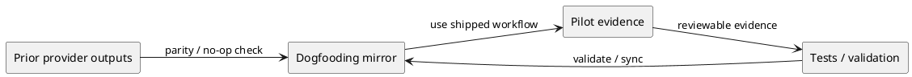

# iss-00118 Delegated Authoring Dogfooding Pilot — 設計（HOW）

## 親 Diagram 参照
- Epic diagram:
  - `epic-00112/design.md` の component/module、provider dependency、draft lifecycle を参照する。
- 再利用する決定:
  - AD-001 Draft evidence, not authority。
  - AD-003 Role skill is canonical, host adapter is thin。
  - AD-005 Provider-first。

## 目的・制約
- 目的:
  - shipped workflow / skills / adapters を dogfooding workspace で使い、draft-only delegated authoring の実地証跡を残す。
- 必須 / 禁止:
  - 必須: `spec-dock active docs and discussions; provider/consumer parity evidence; validate/sync outputs` を対象に、先行 Issue の contract を実際に使った pilot evidence を残す。
  - 禁止: write-capable delegation / runtime validation / `.github/agents` support の導入。
- 前提:
  - Depends on: iss-00113, iss-00114, iss-00115, iss-00116, iss-00117

## 既存実装 / 規約の理解
- 参照した実装 / docs:
  - `src/spec_dock/assets/spec_dock/docs/`
  - `src/spec_dock/assets/install_root/`
  - `spec-dock/docs/`, `.agents/`, `.codex/`
  - `tests/test_init_update.py`
- 現状理解:
  - provider assets が shipped source of truth。dogfooding workspace は検証面。
- 採用するパターン:
  - prior provider output inspection、dogfooding parity inspection、pilot artifacts、fresh reviewer gate。
- 採用しないもの:
  - runtime enforcement first、host-specific long instruction duplication。
- 影響範囲:
  - spec-dock active docs and discussions; provider/consumer parity evidence; validate/sync outputs

## 採用方針 / トレードオフ
- 論点:
  - docs/skill/template のどこに contract を置くか。
- 決定:
  - 正本 contract は先行 Issue が provider assets に置く。この Issue はそれを消費し、dogfooding mirror を validation surface とする。
  - 実行時 enforcement より、v0 では pilot artifacts + reviewer + validation evidence を優先する。

## 依存関係分析
- file 依存:
  - 親 Epic requirement/design/plan に依存する。
  - `iss-00113`..`iss-00117` の provider assets / skills / adapters / phase gates に依存する。
- 上流 / 前提:
  - iss-00113, iss-00114, iss-00115, iss-00116, iss-00117
- 下流 / 依存先:
  - 後続 Issues as defined in `epic-00112/plan.md`。
- 実装起点:
  - 先行 Issue の provider-side source of truth と dogfooding mirror の確認から開始する。
- 順序への影響:
  - prerequisite check -> dogfooding mirror/parity -> pilot drafts -> metrics/defer decision -> validate/sync -> report/review。

## Module Dependency Diagram
- タイトル:
  - Dogfooding pilot evidence dependency
- 答える問い:
  - どの先行 artifact を前提として使い、どこに pilot evidence を残すか。
- 範囲:
  - この Issue の docs / skills / adapters / templates surface。
- 含めない詳細:
  - exhaustive installer copy graph。
- 更新条件:
  - 対象ファイルや provider/consumer boundary が変わるとき。

### UML（module dependency / package dependency delta）


## インターフェース契約
- API / function / protocol / data boundary:
  - No public runtime API change unless explicitly discovered during implementation.
  - Contract surface is Markdown / skill / host adapter content.

## ディレクトリ / ファイル変更計画
```text
.
|-- src/spec_dock/assets/...   # 確認: prior provider outputs from iss-00113..iss-00117
|-- spec-dock/...              # 変更/確認: dogfooding pilot artifacts, report, parity evidence
`-- tests/...                  # 確認/変更: only if pilot reveals required assertion coverage
```

## 要件 → 設計マッピング
- AC-001 -> prerequisite ledger and approved no-op / uncertainty handling.
- AC-002 -> validate / sync / parity evidence.
- AC-003 -> final `spec-reviewer` pass.
- EC-001 -> documented uncertainty / approved no-op path.
- EC-002 -> provider/consumer parity handling.

## テスト戦略
- 単体:
  - Content checks where existing test patterns support them.
- 統合:
  - `python -m unittest discover -v` or targeted tests if blast radius is narrow.
  - `./spec-dock/scripts/spec-dock validate` and `sync`.
- E2E / manual:
  - Inspect provider/consumer diff and report evidence.

## 要件 / 例外 -> verification mapping
- AC-001 -> target file inspection / diff.
- AC-002 -> validate / sync output and parity evidence.
- AC-003 -> reviewer pass.
- EC-001 -> report evidence for no-op or uncertainty.
- EC-002 -> diff/parity evidence.

## リスク / 移行 / ロールバック
- リスク:
  - Provider and dogfooding mirror drift.
  - Over-scoping into runtime validation or write-capable delegation.
- ロールバック:
  - Revert this Issue's docs/skills/templates/adapters changes by commit.

## 未確定事項
- なし。


## Required Dogfooding Pilot Evidence
- Required artifacts:
  - at least one delegated design draft saved under `discussions/`
  - at least one delegated plan draft saved under `discussions/`
  - canonical integration evidence in `report.md`
  - fresh `spec-reviewer` result for the pilot artifacts and canonical integration
- Required pilot metrics:
  - draft count
  - integration ratio / integration cost
  - rejected reasons
  - traceability defects
  - scope creep or gate violations
  - forbidden action attempts
  - reviewer findings
  - stale draft events
  - provider/consumer drift
  - implementation deviation if implementation follows
- Required decision:
  - `write-capable delegation remains deferred` unless a later Epic / Issue explicitly approves it.
- Pilot must use shipped/documented workflow assets rather than ad hoc prompt-only delegation.
