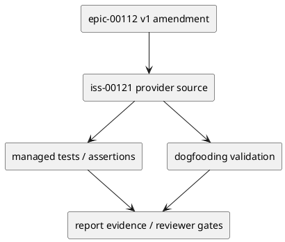

# iss-00121 Authority Aware Context Pack and Lifecycle Gates — 設計（どう実現するか）

## 目的・制約
- 目的: purpose-aware context-pack and lifecycle gates that prevent proposed artifacts from becoming implementation authority.
- 制約: v1 は additive amendment。v0 Issue 001〜006 / #113〜#118 は変更しない。
- 完了条件: E-RQ-003, E-RQ-005, E-RQ-012 / E-AC-002, E-AC-005 を、この Issue の provider change、dogfooding validation、tests、rollback/fallback evidence へ追跡できること。

## 既存実装 / 規約の理解
- Provider source of truth:
  - `src/spec_dock/assets/spec_dock/scripts/spec_dock_runtime/`
  - `src/spec_dock/assets/spec_dock/docs/workflow_issue.md`
  - `src/spec_dock/assets/spec_dock/docs/workflow_spec_authoring.md`
- Dogfooding validation surface:
  - `spec-dock/active/context-pack.md`
  - `spec-dock/.agent/active.json`
  - `spec-dock/scripts/spec_dock_runtime/`
  - `spec-dock/docs/`
- Runtime / docs / managed asset の変更は provider 側から始め、dogfooding workspace は同期・検証対象として扱う。

## 採用方針 / トレードオフ
- 採用: fail-closed、provider-first、additive rollout、fresh reviewer gate。
- 不採用: v0 完了証跡の再解釈、host behavior の未検証 claim、report-only durable decision。
- rollback / fallback: Disable authority-aware runtime handoff and continue v0 discussions proposal/manual integration path.

## 依存関係分析
- 上流:
  - epic-00112 v1 requirement/design/plan/report
  - v0 historical Issue #113〜#118 evidence
- 下流:
  - Later v1 Issues that depend on this contract must not start implementation until this Issue is reviewed and either complete or explicitly fallbacked.
- 実装順序への影響:
  - Provider contract -> tests/content assertions -> dogfooding parity -> final reviews.

## モジュール依存図


## インターフェース契約
- Provider artifacts define the durable contract.
- Dogfooding artifacts prove parity and execution evidence only.
- `report.md` records delegated draft evidence, reviewer verdicts, decision ledger entries, and fallback/rollback outcomes.

## ディレクトリ / ファイル変更計画
```text
src/spec_dock/assets/spec_dock/
|-- scripts/spec_dock_runtime/
|   |-- infra/active_store.py
|   |-- application/set_active.py
|   |-- application/sync_state.py
|   |-- application/validate_tree.py
|   |-- application/issue_lifecycle.py
|   |-- domain/validation.py
|   `-- presentation/json_state.py
`-- docs/
    |-- workflow_issue.md
    `-- workflow_spec_authoring.md

tests/
|-- cli_runtime/
|   |-- test_runtime_active_s05.py
|   `-- test_issue_lifecycle.py
|-- domain_runtime/
`-- presentation_runtime/

spec-dock/initiatives/init-local-00003-architecture-maintenance-and-hardening/epics/epic-00112-delegated-authoring-architecture/issues/iss-00121-authority-aware-context-pack-lifecycle-gates/
|-- report.md
`-- discussions/
```
- Runtime file names are the planned lock set; if implementation discovery proves a neighboring runtime file is the true owner, the executor must record the discovery and amend the plan before editing outside this tree.
- S90 is dogfooding inspection/report evidence only.

## 要件 → 設計マッピング
- AC-001 -> provider contract, dogfooding evidence, and reviewer gate for iss-00121.
- AC-002 -> provider contract, dogfooding evidence, and reviewer gate for iss-00121.
- AC-003 -> provider contract, dogfooding evidence, and reviewer gate for iss-00121.
- AC-004 -> provider contract, dogfooding evidence, and reviewer gate for iss-00121.

## テスト戦略
  - tests/cli_runtime/test_runtime_active_s05.py or neighboring active/context-pack tests
  - tests/cli_runtime/test_issue_lifecycle.py
  - tests/domain_runtime/ or validation tests for proposed/approved grants
- `./spec-dock/scripts/spec-dock validate` and `./spec-dock/scripts/spec-dock sync` evidence are recorded when relevant.
- Final review gates include `qa-reviewer`, issue-wide `code-reviewer`, and final `spec-reviewer` during execution.

## リスク / 移行 / ロールバック
- Risk: scope creep into adjacent v1 Issues. Mitigation: keep allowed paths and closes mapping issue-local.
- Risk: delegated/preflight evidence is mistaken for final authority. Mitigation: final reviewer and promotion remain separate.
- Rollback / fallback: Disable authority-aware runtime handoff and continue v0 discussions proposal/manual integration path.

## 未確定事項
- なし。Implementation-time discoveries must be recorded in `report.md` and promoted to design/plan/follow-up when durable.
