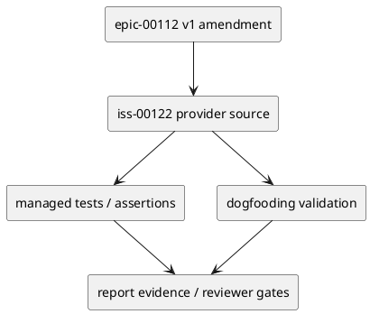

# iss-00122 Evidence Adoption Ledger and Bounded Depth2 Delegation — 設計（どう実現するか）

## 目的・制約
- 目的: evidence adoption ledger and bounded depth=2 delegation policy for child specialist outputs.
- 制約: v1 は additive amendment。v0 Issue 001〜006 / #113〜#118 は変更しない。
- 完了条件: E-RQ-006, E-RQ-007, E-RQ-009, E-RQ-012 / E-AC-006, E-AC-007, E-AC-009 を、この Issue の provider change、dogfooding validation、tests、rollback/fallback evidence へ追跡できること。

## 既存実装 / 規約の理解
- Provider source of truth:
  - `src/spec_dock/assets/spec_dock/docs/`
  - `src/spec_dock/assets/spec_dock/templates/`
  - `src/spec_dock/assets/install_root/.agents/skills/`
- Dogfooding validation surface:
  - `spec-dock/docs/`
  - `spec-dock/templates/`
  - `.agents/skills/`
  - `active scope report.md/discussions/`
- Runtime / docs / managed asset の変更は provider 側から始め、dogfooding workspace は同期・検証対象として扱う。

## 採用方針 / トレードオフ
- 採用: fail-closed、provider-first、additive rollout、fresh reviewer gate。
- 不採用: v0 完了証跡の再解釈、host behavior の未検証 claim、report-only durable decision。
- rollback / fallback: Keep child specialist use read-only and require main orchestrator to integrate evidence manually without depth=2 write delegation.

## 依存関係分析
- 上流:
  - epic-00112 v1 requirement/design/plan/report
  - v0 historical Issue #113〜#118 evidence
- 下流:
  - Later v1 Issues that depend on this contract must not start implementation until this Issue is reviewed and either complete or explicitly fallbacked.
- 実装順序への影響:
  - Provider contract -> tests/content assertions -> dogfooding parity -> final reviews.

## モジュール依存図


## インターフェース契約
- Provider artifacts define the durable contract.
- Dogfooding artifacts prove parity and execution evidence only.
- `report.md` records delegated draft evidence, reviewer verdicts, decision ledger entries, and fallback/rollback outcomes.

## ディレクトリ / ファイル変更計画
```text
src/spec_dock/assets/spec_dock/
|-- docs/
|   |-- workflow_spec_authoring.md
|   |-- phase_design.md
|   |-- phase_plan.md
|   |-- phase_plan_epic.md
|   `-- phase_plan_issue.md
|-- templates/
|   |-- initiative/report.md
|   |-- epic/report.md
|   |-- issue/report.md
`-- system/active-none/
    |-- initiative/report.md
    |-- epic/report.md
    `-- issue/report.md

src/spec_dock/assets/install_root/.agents/skills/
|-- spec-dock-system-architect/SKILL.md
|-- spec-dock-implementation-planner/SKILL.md
`-- spec-dock-epic-planning/SKILL.md

tests/
`-- test_init_update.py

spec-dock/initiatives/init-local-00003-architecture-maintenance-and-hardening/epics/epic-00112-delegated-authoring-architecture/issues/iss-00122-evidence-adoption-ledger-depth2-delegation/
|-- report.md
`-- discussions/
```
- S01 is docs/templates/report schema only and must not edit tests.
- S02 may update managed skill assets and `tests/test_init_update.py` assertions.
- S90 records dogfooding inspection only; provider parity checks belong to S01/S02 implementation evidence.

## 要件 → 設計マッピング
- AC-001 -> provider contract, dogfooding evidence, and reviewer gate for iss-00122.
- AC-002 -> provider contract, dogfooding evidence, and reviewer gate for iss-00122.
- AC-003 -> provider contract, dogfooding evidence, and reviewer gate for iss-00122.
- AC-004 -> provider contract, dogfooding evidence, and reviewer gate for iss-00122.

## テスト戦略
  - tests/test_init_update.py content assertions for ledger fields
  - managed asset assertions for allowed/forbidden graph and reviewer independence
- `./spec-dock/scripts/spec-dock validate` and `./spec-dock/scripts/spec-dock sync` evidence are recorded when relevant.
- Final review gates include `qa-reviewer`, issue-wide `code-reviewer`, and final `spec-reviewer` during execution.

## リスク / 移行 / ロールバック
- Risk: scope creep into adjacent v1 Issues. Mitigation: keep allowed paths and closes mapping issue-local.
- Risk: delegated/preflight evidence is mistaken for final authority. Mitigation: final reviewer and promotion remain separate.
- Rollback / fallback: Keep child specialist use read-only and require main orchestrator to integrate evidence manually without depth=2 write delegation.

## 未確定事項
- なし。Implementation-time discoveries must be recorded in `report.md` and promoted to design/plan/follow-up when durable.
