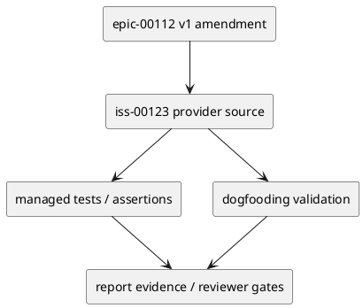

# iss-00123 Role Scoped Permission Profiles and Task Manifest Probes — 設計（どう実現するか）

## 目的・制約
- 目的: role-scoped Permission Profiles, task manifests, resolved path allowlists, probes, and fail-closed fallback policy.
- 制約: v1 は additive amendment。v0 Issue 001〜006 / #113〜#118 は変更しない。
- 完了条件: E-RQ-008, E-RQ-010, E-RQ-012 / E-AC-008, E-AC-011 を、この Issue の provider change、dogfooding validation、tests、rollback/fallback evidence へ追跡できること。

## 既存実装 / 規約の理解
- Provider source of truth:
  - `src/spec_dock/assets/install_root/.codex/agents/`
  - `src/spec_dock/assets/install_root/.codex/AGENTS.md`
  - `src/spec_dock/assets/spec_dock/docs/workflow_spec_authoring.md`
- Dogfooding validation surface:
  - `.codex/agents/`
  - `.codex/AGENTS.md`
  - `active issue/epic report probe evidence`
- Runtime / docs / managed asset の変更は provider 側から始め、dogfooding workspace は同期・検証対象として扱う。

## 採用方針 / トレードオフ
- 採用: fail-closed、provider-first、additive rollout、fresh reviewer gate。
- 不採用: v0 完了証跡の再解釈、host behavior の未検証 claim、report-only durable decision。
- rollback / fallback: Mark host profile unverified, disable write-scoped delegation, and use v0 proposal path or closed-safe directory fallback only when probes pass.

## 依存関係分析
- 上流:
  - epic-00112 v1 requirement/design/plan/report
  - v0 historical Issue #113〜#118 evidence
- 下流:
  - Later v1 Issues that depend on this contract must not start implementation until this Issue is reviewed and either complete or explicitly fallbacked.
- 実装順序への影響:
  - Provider contract -> tests/content assertions -> dogfooding parity -> final reviews.

## モジュール依存図


## インターフェース契約
- Provider artifacts define the durable contract.
- Dogfooding artifacts prove parity and execution evidence only.
- `report.md` records delegated draft evidence, reviewer verdicts, decision ledger entries, and fallback/rollback outcomes.

## ディレクトリ / ファイル変更計画
```text
src/spec_dock/assets/install_root/.codex/
|-- AGENTS.md
`-- agents/
    |-- system-architect.toml
    |-- implementation-planner.toml
    `-- dev-coder.toml

src/spec_dock/assets/spec_dock/docs/
`-- workflow_spec_authoring.md

tests/
`-- test_init_update.py

spec-dock/initiatives/init-local-00003-architecture-maintenance-and-hardening/epics/epic-00112-delegated-authoring-architecture/issues/iss-00123-role-scoped-permission-profiles-task-manifest/
|-- report.md
`-- discussions/
```
- S01 defines task manifest/profile contract in docs and `.codex/AGENTS.md`; tests are not edited under its spec-reviewer gate.
- S02 updates managed `.codex/agents` assets and assertions/probe evidence under code-reviewer gate.
- S90 records host fallback and dogfooding inspection only.

## 要件 → 設計マッピング
- AC-001 -> provider contract, dogfooding evidence, and reviewer gate for iss-00123.
- AC-002 -> provider contract, dogfooding evidence, and reviewer gate for iss-00123.
- AC-003 -> provider contract, dogfooding evidence, and reviewer gate for iss-00123.
- AC-004 -> provider contract, dogfooding evidence, and reviewer gate for iss-00123.

## テスト戦略
  - tests/test_init_update.py .codex/agents managed asset assertions
  - manual or hermetic CLI positive/negative write probe evidence
- `./spec-dock/scripts/spec-dock validate` and `./spec-dock/scripts/spec-dock sync` evidence are recorded when relevant.
- Final review gates include `qa-reviewer`, issue-wide `code-reviewer`, and final `spec-reviewer` during execution.

## リスク / 移行 / ロールバック
- Risk: scope creep into adjacent v1 Issues. Mitigation: keep allowed paths and closes mapping issue-local.
- Risk: delegated/preflight evidence is mistaken for final authority. Mitigation: final reviewer and promotion remain separate.
- Rollback / fallback: Mark host profile unverified, disable write-scoped delegation, and use v0 proposal path or closed-safe directory fallback only when probes pass.

## 未確定事項
- なし。Implementation-time discoveries must be recorded in `report.md` and promoted to design/plan/follow-up when durable.
