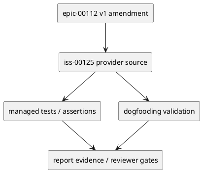

# iss-00125 Authority Aware Delegated Authoring Dogfooding Pilot — 設計（どう実現するか）

## 目的・制約
- 目的: dogfood v1 delegated authoring with proposed canonical drafts, promotion gates, lifecycle blocks, permission fallback, validate/sync, and reviewer evidence.
- 制約: v1 は additive amendment。v0 Issue 001〜006 / #113〜#118 は変更しない。
- 完了条件: E-RQ-010, E-RQ-011, E-RQ-012 / E-AC-010, E-AC-011, E-AC-012 plus operational evidence for E-AC-001..E-AC-009 を、この Issue の provider change、dogfooding validation、tests、rollback/fallback evidence へ追跡できること。

## 既存実装 / 規約の理解
- Provider source of truth:
  - no provider source by default; discovered provider defects open follow-up or amend the owning provider issue
- Dogfooding validation surface:
  - current dogfooding workspace
  - `spec-dock/active/`
  - `active epic/issue reports`
  - `discussions/`
  - spec-dock validate
  - spec-dock sync
- Runtime / docs / managed asset の変更は provider 側から始め、dogfooding workspace は同期・検証対象として扱う。

## 採用方針 / トレードオフ
- 採用: fail-closed、provider-first、additive rollout、fresh reviewer gate。
- 不採用: v0 完了証跡の再解釈、host behavior の未検証 claim、report-only durable decision。
- rollback / fallback: Mark pilot fallback/disabled for write-scoped authoring, keep v0 workflow active, and do not claim verified v1 operation.

## 依存関係分析
- 上流:
  - epic-00112 v1 requirement/design/plan/report
  - v0 historical Issue #113〜#118 evidence
  - complete-or-explicit-fallback evidence from `iss-00120` authority metadata schema
  - complete-or-explicit-fallback evidence from `iss-00121` context-pack/lifecycle gates
  - complete-or-explicit-fallback evidence from `iss-00122` evidence ledger/depth=2 policy
  - complete-or-explicit-fallback evidence from `iss-00123` Permission Profile/task manifest probes
  - complete-or-explicit-fallback evidence from `iss-00124` canonical draft role rewrite
- 下流:
  - Later v1 Issues that depend on this contract must not start implementation until this Issue is reviewed and either complete or explicitly fallbacked.
- 実装順序への影響:
  - `iss-00125` S02 actual pilot authoring must not start until `iss-00120`〜`iss-00124` each has complete-or-explicit-fallback evidence recorded in report.md.
  - Provider defects discovered during pilot must become follow-up/amendment for the owning provider Issue instead of being silently fixed inside the pilot.

## モジュール依存図


## インターフェース契約
- Provider artifacts define the durable contract.
- Dogfooding artifacts prove parity and execution evidence only.
- `report.md` records delegated draft evidence, reviewer verdicts, decision ledger entries, and fallback/rollback outcomes.

## ディレクトリ / ファイル変更計画
```text
spec-dock/initiatives/init-local-00003-architecture-maintenance-and-hardening/epics/epic-00112-delegated-authoring-architecture/issues/iss-00125-authority-aware-delegated-authoring-dogfooding-pilot/
|-- report.md
`-- discussions/

spec-dock/initiatives/init-local-00003-architecture-maintenance-and-hardening/epics/epic-00112-delegated-authoring-architecture/issues/<pilot_target_issue>/
|-- design.md        # draft write only when Task Manifest Lock resolves this real path
|-- plan.md          # draft write only when Task Manifest Lock resolves this real path
|-- report.md        # pilot evidence only when explicitly locked
`-- discussions/     # intermediate evidence only when explicitly locked

spec-dock/
|-- active/context-pack.md      # inspection only; never a write target
|-- .agent/active.json          # inspection only
|-- docs/                       # inspection only
`-- system/active-none/         # inspection only
```
- No provider source is edited by default. Provider defects discovered by the pilot become follow-up issues or plan amendments.
- The pilot target must be a resolved non-active real path and must not be `iss-00125`, v0 `iss-00113`〜`iss-00118`, or v1 provider issues `iss-00120`〜`iss-00124` unless this plan is amended and re-reviewed.
- If no safe pilot target resolves, write proposed draft copies only under `iss-00125/discussions/` and do not claim canonical write verification.

## 要件 → 設計マッピング
- AC-001 -> provider contract, dogfooding evidence, and reviewer gate for iss-00125.
- AC-002 -> provider contract, dogfooding evidence, and reviewer gate for iss-00125.
- AC-003 -> provider contract, dogfooding evidence, and reviewer gate for iss-00125.
- AC-004 -> provider contract, dogfooding evidence, and reviewer gate for iss-00125.

## テスト戦略
  - dogfooding execution evidence
  - reviewer verdicts
  - validation/sync output
  - permission probe records
- `./spec-dock/scripts/spec-dock validate` and `./spec-dock/scripts/spec-dock sync` evidence are recorded when relevant.
- Final review gates include `qa-reviewer`, issue-wide `code-reviewer`, and final `spec-reviewer` during execution.

## リスク / 移行 / ロールバック
- Risk: scope creep into adjacent v1 Issues. Mitigation: keep allowed paths and closes mapping issue-local.
- Risk: delegated/preflight evidence is mistaken for final authority. Mitigation: final reviewer and promotion remain separate.
- Rollback / fallback: Mark pilot fallback/disabled for write-scoped authoring, keep v0 workflow active, and do not claim verified v1 operation.

## 未確定事項
- なし。Implementation-time discoveries must be recorded in `report.md` and promoted to design/plan/follow-up when durable.
