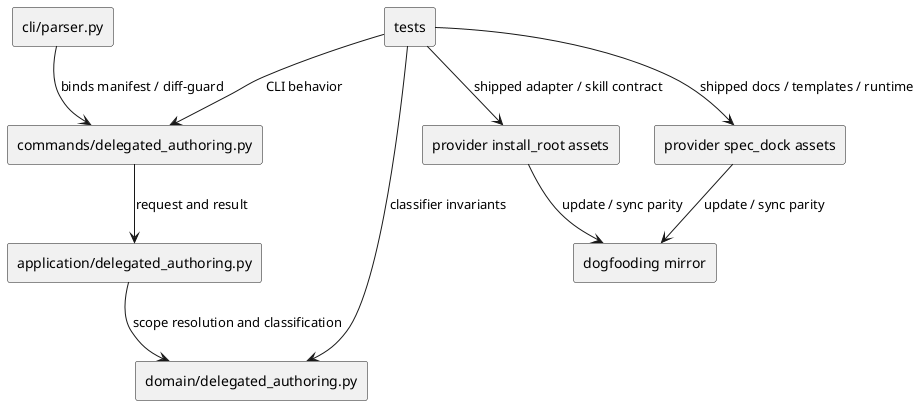

# iss-00127 Scoped Discussion Draft Authoring Correction — 設計

## 親図参照
- 親 Epic: `spec-dock/active/epic/design.md`
- 再利用する決定:
  - `discussions/20260524t133442z-adr-flat-scope-local-discussion-drafts.md`
  - `discussions/20260524t150117z-disc-scoped-discussion-draft-authoring-requirement-draft-v2.md`
  - `discussions/20260524t150916z-disc-fresh-consultant-review-v2-discussion-direct-write-model.md`
  - `discussions/20260524t235542z-disc-agent-permission-classification-gap-analysis.md`

## 目的・制約
- 目的:
  - delegated authoring v2 を、manifest / Permission Profile / canonical draft write 中心の設計から、scope-local flat `discussions/` direct-write 中心の設計へ修正する。
  - sub-agent の file-based context persistence は維持し、canonical docs の authoring / promotion authority は main orchestrator に戻す。
- 必須:
  - system-architect / implementation-planner が canonical `requirement.md` / `design.md` / `plan.md` / `report.md` を直接編集できる成功パスをなくす。
  - sub-agent は対象 scope の `discussions/` 直下に flat Markdown draft / analysis / discussion-local report を直接作成・編集できる。
  - post-run diff guard を runtime helper として追加し、delegated output の採用資格を機械的に判定できるようにする。
  - `delegated-authoring manifest` は deprecated / blocked / no-artifact path として残し、新規 manifest / profile / probe / session artifact を生成しない。
- 禁止:
  - proposal-only を標準運用に戻すこと。
  - per-agent directory、run/task directory、global draft store、`discussions/delegated-authoring/` を新規 delegated output として生成・推奨すること。
  - `draft-requirement` / `draft-design` / `draft-plan` kind をこの issue で追加すること。
- 前提:
  - `iss-00126` 以前の historical delegated-authoring artifacts は grandfathered evidence として残し、削除・rename・validation failure 化しない。

## 既存実装 / 規約の理解
- 既存実装:
  - `src/spec_dock/assets/spec_dock/scripts/spec_dock_runtime/commands/delegated_authoring.py` は `delegated-authoring manifest` を成功時 exit 0 とし、manifest / permission profile / probe plan / session invocation path を出力する。
  - `src/spec_dock/assets/spec_dock/scripts/spec_dock_runtime/application/delegated_authoring.py` は scope の `discussions/delegated-authoring/<task-id>/` を生成し、target artifact を scope の `design.md` / `plan.md` に解決する。
  - `src/spec_dock/assets/spec_dock/scripts/spec_dock_runtime/domain/delegated_authoring.py` は manifest schema、input authority validation、Permission Profile rendering、probe plan rendering、session invocation rendering を中心にしている。
  - provider install_root の skills / adapters は verified task manifest / Permission Profile / probe を条件に `design.md` / `plan.md` draft authoring を許す表現を持つ。
- 採用する既存パターン:
  - runtime は `commands`、`application`、`domain`、`presentation` の層を維持する。
  - provider assets を source of truth とし、dogfooding mirror は sync / update / parity tests で揃える。
  - docs / templates は shipped asset API として扱い、consumer repo に入る文言まで変更する。
- 採用しないもの:
  - delegated authoring manifest を新規成功経路として維持すること。
  - static adapter に broad write を許可し、post-run guard で正当化すること。
  - JSON/TOML authority graph を user-facing acceptance contract として必須にすること。

## 採用方針 / トレードオフ
- D-001: post-run diff guard
  - 決定: `spec-dock delegated-authoring diff-guard` を minimal runtime helper として追加する。
  - スコープ: git diff / status の path-level eligibility classifier に限定する。adoption ledger、canonical artifact、discussion draft schema の深い意味解析は更新しない。
  - 理由: sub-agent direct write を許容する以上、forbidden diff を機械的に reject / ineligible にできる安全弁が必要である。
- D-002: static adapter permissions
  - 決定: static adapter は broad write を許可しない read-mostly fallback として表現する。
  - スコープ: canonical docs write、manifest/Profile/probe 前提、`.codex/permission-probe-evidence` 自然出力先、repo-wide / `spec-dock/initiatives` broad write を削除する。
  - 境界: static fallback が read-mostly であることは、system-architect / implementation-planner を read-only specialist として扱うことを意味しない。
- D-003: scoped-write delegated authoring execution
  - 決定: system-architect / implementation-planner は scoped-write delegated authoring agent として扱い、target scope `discussions/` direct child だけを書ける execution path を持つ。
  - スコープ: read は repo / active scope / source docs / relevant implementation を許可する。write は resolved target scope の `discussions/<ts>-<kind>-<slug>.md` または `discussions/<ts>-<nn>-<kind>-<slug>.md` の新規作成と、main orchestrator が明示指定した既存 proposed discussion draft の更新に限定する。
  - 禁止: canonical docs、implementation files、tests、config、`.agents`、`.codex`、`.github`、`.env*`、nested directory、per-agent directory、run/task directory、`discussions/delegated-authoring/`。
  - 実現方針: static `.codex/agents/*.toml` に broad write を与えず、main orchestrator が target scope を解決した後に scoped invocation / permission context を与える。host が exact write root を表現できない場合は、static fallback run として扱い、write-capable delegated authoring の完了証跡には数えない。
- D-004: manifest command retirement
  - 決定: `delegated-authoring manifest` は command を残して fail-closed stub にする。
  - 理由: unknown command よりも migration message が明確で、historical artifacts の grandfathered 方針とも整合する。

## インターフェース契約
- CLI:
  - `spec-dock delegated-authoring manifest ...`
    - exit code: non-zero
    - output: `spec-dock: blocked (delegated-authoring manifest)`、`status=deprecated`、`reason=deprecated_scope_local_discussion_drafts`
    - side effect: no artifact generation
  - `spec-dock delegated-authoring diff-guard --scope <scope-id> [--baseline-status <path>] [--allow-existing-discussion <path> ...]`
    - exit code: 0 when all inspected diffs are eligible, non-zero otherwise
    - output: `spec-dock: ok (delegated-authoring diff-guard)` or `spec-dock: blocked (delegated-authoring diff-guard)` plus detail lines
    - side effect: none
- Diff guard eligibility:
  - Allowed:
    - target scope の `discussions/` 直下にある、既存 discussion 命名規則 `<ts>-<kind>-<slug>.md` または same-second collision 用 `<ts>-<nn>-<kind>-<slug>.md` に適合した `.md` file の create。
    - `--allow-existing-discussion` で明示された既存 proposed draft `.md` file の update。対象 file も既存 discussion 命名規則 `<ts>-<kind>-<slug>.md` または `<ts>-<nn>-<kind>-<slug>.md` に適合している必要がある。
  - Forbidden:
    - canonical `requirement.md` / `design.md` / `plan.md` / `report.md`
    - implementation / tests / config / docs outside target `discussions/`
    - `.agents` / `.codex` / `.github` / `.env*`
    - nested dirs, symlinks, non-Markdown, naming-rule noncompliant Markdown, delete, rename, copied paths
    - target scope 外の discussion file
  - Baseline:
    - default は current worktree diff を検査する。`--baseline-status` は helper 自身の status file と pre-existing non-target dirtiness を切り分けるために使う。
    - target scope `discussions/` は baseline 時点で clean であることを要求する。baseline に target discussion の dirty/untracked entry がある場合、本文 snapshot がないため `dirty_baseline_discussion` として blocked にする。
    - baseline file が解釈できない場合は blocked にする。
- Discussion draft front matter:
  - required: `created_by_role`, `scope_id`, `source_paths`, `intended_targets`, `adoption_status: unreviewed`, `reflected_to: []`
  - forbidden self-claims: `authority: accepted`, `adoption_status: adopted`, non-empty `reflected_to`
- Agent execution surfaces:
  - read-only static specialist:
    - `researcher`, `consultant`, `deep-consultant`, `repo-analyst`, `spec-reviewer`, `code-reviewer`, `qa-reviewer`, `pr-monitor`, `spark-worker`
    - no file write
  - full workspace-write worker:
    - `dev-coder`, `doc-writer`, `worker`, `utility-worker`, `default`, `explorer`
    - task-scoped broad edits under main orchestrator control
  - scoped-write delegated authoring agent:
    - `system-architect`, `implementation-planner`
    - target scope `discussions/` direct child write only
  - canonical authority:
    - main orchestrator / spec-manager-like orchestration support
    - canonical docs integration and Evidence Adoption Ledger

## 依存関係分析
- Runtime dependency:
  - `cli/parser.py` binds subcommands to `commands/delegated_authoring.py`
  - `commands/delegated_authoring.py` converts argparse args and renders CLI text
  - `application/delegated_authoring.py` resolves scope and orchestrates domain helpers
  - `domain/delegated_authoring.py` owns request validation and path-level classification rules
- Agent permission dependency:
  - static `.codex/agents/system-architect.toml` and `implementation-planner.toml` remain read-mostly fallback surfaces and must not grant broad write.
  - scoped-write execution is a separate orchestrator-mediated path that injects the resolved target `discussions/` write boundary.
  - diff guard validates post-run eligibility; it does not replace the need for an actual target-discussions write-capable execution path.
- Asset dependency:
  - provider `src/spec_dock/assets/install_root/` -> installed `.agents` / `.codex`
  - provider `src/spec_dock/assets/spec_dock/` -> installed `spec-dock/` docs / templates / scripts
- Test dependency:
  - CLI tests fix user-facing command behavior.
  - domain tests fix classifier invariants.
  - installer/update tests fix provider and mirror parity plus shipped wording.
- 実装起点:
  - runtime contract を先に固定し、旧 artifact generation tests を red にする。
  - diff-guard classifier を domain で固定してから CLI / docs / skills を合わせる。
  - docs / templates / mirror を最後に広げ、parity tests と validation で閉じる。

## モジュール依存図
- Title: Delegated Authoring V2 Runtime / Asset Boundary
- Question answered: `delegated-authoring manifest` retirement、`diff-guard` 追加、provider asset / dogfooding mirror 更新をどの依存順で実装するか。
- Scope: runtime delegated_authoring modules、provider install_root assets、provider spec_dock assets、dogfooding mirror、tests。
- Excluded details: 全 command registry、全 installer copy path、全 docs link graph、各 test method の網羅的 call graph。
- Update trigger: runtime command boundary、provider / mirror source of truth、diff-guard classifier responsibility、または implementation step order が変わるとき。



## ディレクトリ / ファイル変更計画
```text
.
|-- src/spec_dock/assets/install_root/
|   |-- .agents/skills/spec-dock-system-architect/SKILL.md
|   |-- .agents/skills/spec-dock-implementation-planner/SKILL.md
|   |-- .agents/skills/spec-driven-tdd-workflow/SKILL.md
|   |-- .codex/AGENTS.md
|   `-- .codex/agents/
|       |-- system-architect.toml
|       `-- implementation-planner.toml
|-- src/spec_dock/assets/spec_dock/
|   |-- docs/
|   |   |-- workflow_spec_authoring.md
|   |   |-- workflow_issue.md
|   |   |-- phase_design.md
|   |   |-- phase_plan.md
|   |   |-- phase_plan_epic.md
|   |   |-- phase_plan_issue.md
|   |   |-- authoring/issue-plan.md
|   |   `-- rules/
|   |       |-- initiative/discussions.md
|   |       |-- epic/discussions.md
|   |       `-- issue/discussions.md
|   |-- scripts/spec_dock_runtime/
|   |   |-- cli/parser.py
|   |   |-- commands/delegated_authoring.py
|   |   |-- application/delegated_authoring.py
|   |   `-- domain/delegated_authoring.py
|   |-- system/active-none/
|   |   |-- initiative/report.md
|   |   |-- epic/report.md
|   |   `-- issue/report.md
|   `-- templates/
|       |-- initiative/report.md
|       |-- epic/report.md
|       `-- issue/report.md
|-- .agents/                          # dogfooding mirror
|-- .codex/                           # dogfooding mirror
|-- spec-dock/                         # dogfooding mirror
`-- tests/
    |-- cli_runtime/test_delegated_authoring.py
    |-- domain_runtime/test_delegated_authoring.py
    `-- test_init_update.py
```

## 要件 → 設計マッピング
- AC-001 -> skills / adapters / workflow docs から canonical direct-write success path を削除し、tests で旧語彙・旧契約を更新する。
- AC-002 -> skills / discussion rules / docs に scope-local flat Markdown direct-write contract を明記する。
- AC-003 -> manifest command を fail-closed stub にし、`discussions/delegated-authoring/` と `.codex/permission-probe-evidence` を新規出力先として生成・推奨しない。
- AC-004 -> report ledger と Markdown front matter contract に集約し、独立 JSON/TOML manifest 必須契約を削除する。
- AC-005 -> front matter forbidden self-claims を docs / skills / inspection tests に反映する。
- AC-006 -> ADR / discussion / canonical authority boundary を workflow docs と issue docs に明記する。
- AC-007 -> `delegated-authoring diff-guard` を追加し、allowed / forbidden diff を tests で固定する。
- AC-008 -> report templates の Evidence Adoption Ledger を V2 の採用判断に合わせて簡素化する。
- AC-009 -> manifest command の blocked / deprecated / no artifact generation behavior を CLI / domain tests で固定する。
- AC-010 -> provider assets と dogfooding mirror を同期し、parity tests / sync / doctor で確認する。
- AC-011 -> targeted tests、`validate`、`sync`、`doctor`、`git diff --check`、reviewer gates で閉じる。
- EC-001 -> static adapter は broad write を許可しない read-mostly fallback とし、system-architect / implementation-planner には別途 scoped-write execution path を用意する。
- EC-002 -> diff guard の forbidden categories と report ledger rejection contract で扱う。
- EC-003 -> docs / tests で historical artifacts を grandfathered とし、削除や validation failure にしない。
- EC-004 -> `--allow-existing-discussion` と skill contract で既存 proposed draft の明示 allowlist だけを許可する。
- EC-005 -> docs / review gate で secrets / credentialed logs を rejected / ineligible にする。

## テスト戦略
- Red / characterization:
  - 既存 `test_manifest_command_generates_*` が旧成功経路を期待して失敗することを確認する。
  - 新規 diff-guard tests を先に書き、allowed discussion create/update と forbidden path categories を固定する。
- Unit / domain:
  - `tests/domain_runtime/test_delegated_authoring.py`
    - manifest generation は deprecated blocked result を返し、artifact paths を持たない。
    - diff classifier は flat Markdown create/update only を許可し、nested / symlink / delete / rename / non-md / forbidden dirs を拒否する。
- CLI:
  - `tests/cli_runtime/test_delegated_authoring.py`
    - `manifest` は non-zero / deprecated / no artifact。
    - `diff-guard` は allowed case で exit 0、forbidden case で non-zero。
- Installer / asset:
  - `tests/test_init_update.py`
    - shipped skills/adapters/docs/templates の旧 manifest/Profile/canonical draft write wording を新 contract へ更新する。
    - provider asset と dogfooding mirror の parity を確認する。
- Workflow / validation:
  - `./spec-dock/scripts/spec-dock validate`
  - `./spec-dock/scripts/spec-dock sync`
  - `./spec-dock/scripts/spec-dock doctor`
  - `git diff --check`

## リスク / 移行 / ロールバック
- リスク:
  - diff guard が正当な draft を false positive で拒否する。
  - baseline dirty diff と sub-agent post-run diff の切り分けが曖昧になる。
  - docs / skills / tests の旧 manifest/Profile 語彙が多く、部分更新だと矛盾が残る。
- 緩和:
  - 初回 diff guard は採用資格判定に限定し、canonical artifact mutation を行わない。
  - baseline file が曖昧な場合、または target discussions が baseline 時点で dirty/untracked な場合は blocked に寄せる。
  - provider asset と dogfooding mirror の両方を検索し、旧成功語彙を targeted tests で更新する。
- ロールバック:
  - manifest command は fail-closed stub のまま残せる。
  - diff guard に問題があれば adoption-ineligible とし、main orchestrator が手動で discussion evidence を採用する運用へ戻せる。
  - historical `iss-00126` artifact は削除しないため、過去証跡の復元性は維持される。

## 未確定事項
- なし。実装中に新しい gap が見つかった場合は `report.md` Decision Ledger に記録し、必要なら plan amendment と spec-reviewer 再レビューを行う。
