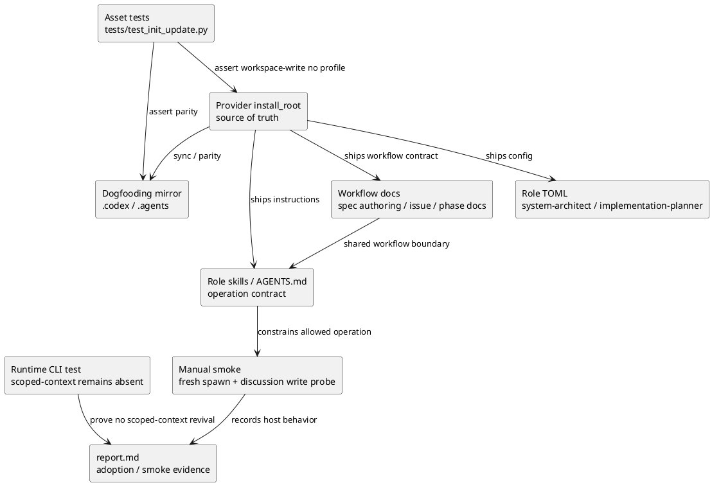
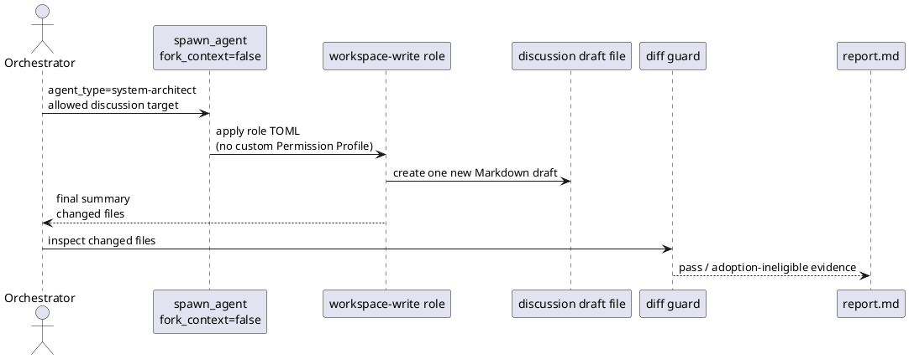

# iss-00131 Restore guarded workspace-write authoring roles — 設計（どう実現するか）

## 親図参照
- Epic:
  - `spec-dock/active/epic/requirement.md`
  - `spec-dock/active/epic/design.md`
- 再利用する決定:
  - canonical docs は main orchestrator single-writer authority とする。
  - subagent output は proposal/evidence であり、採用には main orchestrator の diff guard、Evidence Adoption Ledger、fresh reviewer gate が必要である。
  - `fork_context=true` + `agent_type` は Codex contract 上の対象外 failure として扱う。
- この issue で限定する決定:
  - 親 Epic の actual `design.md` / `plan.md` delegated canonical draft authoring は完了しない。
  - この issue は `system-architect` / `implementation-planner` の fresh spawn と scope-local discussion authoring surface の復旧を対象にする。
  - custom Permission Profile / generated exact-file Permission Profile / `delegated-authoring scoped-context` は復活させない。

## 目的・制約
- 目的:
  - custom Permission Profile と unsupported `write` glob を static role TOML から除去し、Codex が扱える `sandbox_mode = "workspace-write"` role config に戻す。
  - `system-architect` / `implementation-planner` を、scope-local `discussions/` direct-child Markdown を新規作成できる guarded workspace-write authoring role として定義する。
  - provider assets、dogfooding mirror、workflow docs、skills、tests、manual smoke が同じ role contract を説明・検証する状態にする。
- 必須 / 禁止:
  - 必須: `default_permissions` と `[permissions.*]` を両 role から完全削除する。
  - 必須: `sandbox_mode = "workspace-write"`、`approval_policy = "never"`、`web_search = "disabled"`、`[sandbox_workspace_write] network_access = false` を固定する。
  - 必須: developer instructions / skills / docs は allowed write を新規 discussion Markdown 1 件に限定し、canonical docs や既存 draft 更新を禁止する。
  - 禁止: `danger-full-access`、network access、unsupported write glob、generated exact-file Permission Profile、`scoped-context` 復活。
- 非交渉制約:
  - workspace-write は hard path allow-list ではない。design は soft-control + post-run diff guard + adoption gate として扱う。
  - provider authority と dogfooding mirror の片側だけを変更して完了にしない。
- 前提:
  - role-level `workspace-write` が final effective permission として残るかは host/runtime 依存のため、manual smoke と write probe で確認する。
  - `.codex` / `.agents` などが host sandbox で保護される場合があっても、この issue の安全前提にはしない。すべての forbidden path は diff guard と adoption-ineligible 判定で閉じる。

## 既存実装 / 規約の理解
- 参照した実装 / docs:
  - `src/spec_dock/assets/install_root/.codex/agents/system-architect.toml`
  - `src/spec_dock/assets/install_root/.codex/agents/implementation-planner.toml`
  - `.codex/agents/system-architect.toml`
  - `.codex/agents/implementation-planner.toml`
  - `src/spec_dock/assets/install_root/.codex/AGENTS.md`
  - `src/spec_dock/assets/install_root/.agents/skills/spec-dock-system-architect/SKILL.md`
  - `src/spec_dock/assets/install_root/.agents/skills/spec-dock-implementation-planner/SKILL.md`
  - `src/spec_dock/assets/spec_dock/docs/workflow_spec_authoring.md`
  - `src/spec_dock/assets/spec_dock/docs/workflow_issue.md`
  - `src/spec_dock/assets/spec_dock/docs/phase_design.md`
  - `src/spec_dock/assets/spec_dock/docs/phase_plan*.md`
  - `tests/test_init_update.py`
  - `tests/cli_runtime/test_delegated_authoring.py`
- 現状理解:
  - 対象 role TOML は custom Permission Profile と `write` glob により Codex role config apply failure を起こしている可能性が高い。
  - existing tests は static Permission Profile / scoped write taxonomy を期待しているため、新しい workspace-write contract に更新する必要がある。
  - shipped workflow docs には static discussion direct-write / Permission Profile 前提の文言が残り得る。
- 採用するパターン:
  - provider-first update:
    - `src/spec_dock/assets/install_root/` と `src/spec_dock/assets/spec_dock/docs/` を source of truth として更新する。
  - mirror parity:
    - `.codex/`、`.agents/`、`spec-dock/docs/` を provider と同じ contract に合わせる。
  - diff guard:
    - delegated output は target scope `discussions/` direct-child Markdown の新規作成だけを pass とする。
- 採用しないもの:
  - `read-only` final role contract。
  - `sandbox_workspace_write.writable_roots` による workspace root write の縮小。
  - generated exact-file Permission Profile / `delegated-authoring scoped-context`。
  - actual `design.md` / `plan.md` delegated canonical draft authoring。
- 影響範囲:
  - agent TOML / skill docs / workflow docs / tests / dogfooding mirror / issue report evidence。

## 採用方針 / トレードオフ
- 論点: least privilege と delegated authoring workflow value のどちらを優先するか。
  - 選択肢 A: `read-only` role にして fresh spawn を最小安全復旧する。
  - 選択肢 B: `workspace-write` role にして discussion draft authoring を復旧し、diff guard と reviewer gate で安全側に倒す。
  - 決定: B を採用する。A は fallback / degraded mode として残す。
  - 理由: `system-architect` / `implementation-planner` の価値は、consultant 的な助言だけでなく、role-local research / discussion / draft accumulation をファイルとして残せる点にある。
- 論点: hard permission boundary がないことをどう扱うか。
  - 決定: hard boundary として扱わず、workflow-level fail-closed boundary として設計する。
  - 具体策:
    - role instructions は allowed operation を「新規 discussion Markdown 1 件」に限定する。
    - run 後に main orchestrator が changed files を確認する。
    - 許可外 diff があれば adoption-ineligible とし、canonical docs へ昇格しない。
- 論点: 親 Epic の canonical draft authoring との関係。
  - 決定: この issue は limited recovery として扱う。
  - 理由: actual `design.md` / `plan.md` delegated draft authoring は authority model / lifecycle gate / manifest / path isolation を再設計する必要があり、今回の callability fix と同時に閉じるには scope が大きすぎる。

## 依存関係分析
- module / asset 依存:
  - role TOML contract:
    - provider `src/spec_dock/assets/install_root/.codex/agents/*.toml`
    - mirror `.codex/agents/*.toml`
  - role guidance:
    - provider `.codex/AGENTS.md`
    - provider `.agents/skills/spec-dock-*/SKILL.md`
    - mirror `.codex/AGENTS.md`
    - mirror `.agents/skills/spec-dock-*/SKILL.md`
  - shipped workflow docs:
    - provider `src/spec_dock/assets/spec_dock/docs/**`
    - mirror `spec-dock/docs/**`
  - tests:
    - `tests/test_init_update.py` for asset contract / parity / docs wording
    - `tests/cli_runtime/test_delegated_authoring.py` for `scoped-context` absence
- file 依存:
  - TOML contract tests should change before TOML implementation to catch old custom Permission Profile.
  - docs wording tests / inspections should change before docs edits if existing assertions encode old wording.
  - mirror parity should run after provider changes.
- 上流 / 前提:
  - `requirement.md` pass evidence: spec-reviewer `019e66a3-bc4f-70d3-9e90-4eb39f0b602b`
  - active epic requirement remains broader; this issue records limited scope.
- 下流 / 依存先:
  - implementation plan must order work as:
    1. tests / role TOML contract
    2. provider role config and guidance
    3. shipped workflow docs
    4. mirror parity
    5. manual fresh spawn / write smoke
    6. final validation and reviewer gates

## モジュール依存図
- タイトル:
  - Guarded workspace-write role contract and validation surfaces
- 答える問い:
  - どの asset / docs / tests をどの順序で変えると、custom Permission Profile failure を避けつつ discussion authoring role として復旧できるか。
- 範囲:
  - install_root agent TOMLs、role skills、workflow docs、dogfooding mirror、asset tests、runtime scoped-context absence test、manual smoke。
- 含めない詳細:
  - Codex upstream changes、actual canonical draft authoring、generated exact-file profile implementation。
- 更新条件:
  - role permission model、allowed write operation、provider/mirror mapping、manual smoke requirement が変わるとき。



## ローカル図の差分
- 変更する境界 / 責務 / 相互作用:
  - `system-architect` / `implementation-planner` は read-only consultant ではなく write-capable discussion authoring role になる。
  - write boundary は Permission Profile hard allow-list から instruction + diff guard + report adoption evidence へ移る。
  - canonical docs は引き続き main orchestrator-only。

## インターフェース契約
- Static role TOML contract:
  - keep / require:
    - `name`
    - `description`
    - `model = "gpt-5.5"`
    - `model_reasoning_effort = "high"`
    - `web_search = "disabled"`
    - `personality = "pragmatic"`
    - `approval_policy = "never"`
    - `sandbox_mode = "workspace-write"`
    - `notify = [...]` if existing notify remains supported
    - `[features] shell_tool = true`
    - `[sandbox_workspace_write] network_access = false`
    - `developer_instructions`
  - remove / forbid:
    - `default_permissions`
    - `[permissions.*]`
    - `write` glob entries
    - `sandbox_mode = "read-only"` as the normal role contract
    - `sandbox_mode = "danger-full-access"`
    - `[sandbox_workspace_write] network_access = true`
- Developer instruction contract:
  - allowed writes:
    - Create exactly one new flat Markdown file directly under the task-local target scope `discussions/`.
    - Filename must follow `<ts>-<kind>-<slug>.md` or `<ts>-<nn>-<kind>-<slug>.md`.
  - forbidden writes:
    - canonical docs, source, tests, package/config, `.agents`, `.codex`, `.github`, `.env*`, nested directories, non-Markdown files, deletes, renames, out-of-scope discussions, existing draft updates.
  - required self-report:
    - Before writing: state exact target path and why it is allowed.
    - After writing: list changed files and explicitly state whether any forbidden path was touched.
  - authority language:
    - Must not claim reviewer pass, adoption, authority approval, phase promotion, issue ready, or issue finish.
- Docs / skill wording contract:
  - Present `system-architect` / `implementation-planner` as guarded workspace-write discussion authoring roles.
  - Explain that workspace-write is not a hard path allow-list.
  - Explain that diff guard and main orchestrator adoption are mandatory.
  - Explain that `read-only` is fallback/degraded mode, not the normal success path for these roles.
  - Explain that actual canonical draft authoring remains follow-up.
  - Keep the broader workflow rule that existing discussion updates may be possible with an explicit allowlist, but state that this issue's two role guidance and smoke path prohibit existing draft updates and only validate new discussion Markdown creation.
- Runtime command surface:
  - `delegated-authoring scoped-context` stays absent.
  - No new parser / command / application / domain code for scoped-context.

## シーケンス差分


## ドメインモデル差分
- 新規 runtime domain model は追加しない。
- この issue は static agent-tooling assets と shipped workflow guidance の contract を変更する。
- `delegated-authoring scoped-context` runtime model は復活させない。
- `report.md` の evidence model は既存 schema を使い、manual smoke / diff guard / reviewer gate を記録する。

## ディレクトリ / ファイル変更計画
```text
.
|-- src/spec_dock/assets/install_root/
|   |-- .codex/
|   |   |-- AGENTS.md                                      # 変更: guarded workspace-write discussion authoring contract
|   |   `-- agents/
|   |       |-- system-architect.toml                       # 変更: remove Permission Profile; set workspace-write; disable network
|   |       `-- implementation-planner.toml                 # 変更: remove Permission Profile; set workspace-write; disable network
|   `-- .agents/skills/
|       |-- spec-dock-system-architect/SKILL.md             # 変更: allowed/forbidden operation and diff guard
|       `-- spec-dock-implementation-planner/SKILL.md       # 変更: allowed/forbidden operation and diff guard
|-- src/spec_dock/assets/spec_dock/docs/
|   |-- workflow_spec_authoring.md                          # 変更: guarded workspace-write + discussion-only recovery wording
|   |-- workflow_issue.md                                   # 変更: diff guard / adoption-ineligible wording if stale
|   |-- phase_design.md                                     # 変更: system-architect discussion authoring wording
|   |-- phase_plan.md                                       # 変更: implementation-planner discussion authoring wording
|   |-- phase_plan_epic.md                                  # 変更: same contract if referenced
|   |-- phase_plan_issue.md                                 # 変更: same contract if referenced
|   `-- authoring/issue-plan.md                             # 確認/必要なら変更: step contract around delegated evidence
|-- .codex/                                                  # dogfooding mirror
|   |-- AGENTS.md
|   `-- agents/
|       |-- system-architect.toml
|       `-- implementation-planner.toml
|-- .agents/skills/                                          # dogfooding mirror
|   |-- spec-dock-system-architect/SKILL.md
|   `-- spec-dock-implementation-planner/SKILL.md
|-- spec-dock/docs/                                          # shipped docs mirror
|   |-- workflow_spec_authoring.md
|   |-- workflow_issue.md
|   |-- phase_design.md
|   |-- phase_plan.md
|   |-- phase_plan_epic.md
|   |-- phase_plan_issue.md
|   `-- authoring/issue-plan.md
|-- tests/
|   |-- test_init_update.py                                  # 変更: role contract / docs wording / parity
|   `-- cli_runtime/test_delegated_authoring.py              # 既存確認: scoped-context remains absent
`-- spec-dock/active/issue/
    |-- requirement.md
    |-- design.md
    |-- plan.md
    `-- report.md
```

## 要件 → 設計マッピング
- AC-001 -> Static role TOML contract forbids custom Permission Profile.
- AC-002 -> Static role TOML contract requires workspace-write / network disabled.
- AC-003 -> Manual fresh spawn smoke.
- AC-004 -> Developer instruction contract + manual discussion write probe.
- AC-005 -> Diff guard and adoption-ineligible report evidence.
- AC-006 -> Docs / skill wording contract and wording inspection.
- AC-007 -> Provider-first + mirror parity tests.
- AC-008 -> Final validation and reviewer gates.
- AC-009 -> Parent Epic limited-scope decision in requirement/report and docs follow-up note.
- EC-001/EC-004 -> Manual smoke classifies blocked/unavailable, not pass.
- EC-002 -> Diff guard is expected safety boundary, not sandbox impossibility.
- EC-003 -> notify/network limitation is smoke evidence.
- EC-005 -> Inspection classifies historical vs shipped stale wording.

## テスト戦略
- 単体 / structural:
  - Update `tests/test_init_update.py` to assert affected provider TOMLs:
    - have `sandbox_mode = "workspace-write"`.
    - have `[sandbox_workspace_write] network_access = false`.
    - do not have `default_permissions` or `permissions`.
    - do not have `write` glob entries.
  - Update taxonomy tests to classify `system-architect` / `implementation-planner` as guarded workspace-write authoring roles.
- parity:
  - Existing checked-in dogfooding parity tests should prove provider/mirror `.codex` / `.agents` and docs match.
- docs inspection:
  - `rg` for stale `read-only advisory`, `Permission Profile`, `scoped-context`, `discussion-file`, `write-capable path` wording in shipped provider and mirror docs.
  - Accept historical issue docs and this issue explanatory text only if classified in report.
- runtime regression:
  - Preserve `tests/cli_runtime/test_delegated_authoring.py::test_scoped_context_subcommand_is_not_registered`.
- manual:
  - fresh spawn both roles with `fork_context=false`.
  - ask each role to create one new discussion Markdown in the active issue target discussions directory.
  - inspect changed files and record whether only allowed draft file was created.
  - do not perform destructive forbidden-path write probe; treat forbidden write possibility as expected workspace-write risk and close via diff guard.
- validation:
  - `./spec-dock/scripts/spec-dock validate`
  - `git diff --check`
  - fresh spec/code/qa reviewer gates as required by plan.

## 要件 / 例外 -> 検証マッピング
- AC-001:
  - TOML structural unit test and text inspection.
- AC-002:
  - TOML structural unit test.
- AC-003:
  - manual fresh spawn evidence.
- AC-004:
  - manual discussion write probe and diff guard.
- AC-005:
  - diff guard evidence and report adoption-ineligible rule.
- AC-006:
  - wording inspection and spec-reviewer.
- AC-007:
  - parity tests.
- AC-008:
  - targeted tests / validate / diff check / reviewers.
- AC-009:
  - requirement/report inspection and spec-reviewer.
- EC-001 / EC-004:
  - manual smoke blocked/unavailable records.
- EC-002:
  - diff guard failure classification.
- EC-003:
  - smoke/log note if notify/network issue appears.
- EC-005:
  - `rg` classification.

## リスク / 移行 / ロールバック
- リスク: workspace-write により forbidden paths へ技術的に write できる。
  - 緩和: host sandbox の path protection を前提にせず、role instructions, run-local target path, post-run diff guard, adoption-ineligible record, fresh reviewer gate で fail-closed に扱う。
- リスク: parent permission profile override により role-level workspace-write が有効にならない。
  - 緩和: manual smoke で pass/fail を分離し、host limitation を report に残す。実装完了扱いにしない。
- リスク: network disabled が notify helper などに影響する。
  - 緩和: callability と optional notify failure を切り分ける。必要なら follow-up にする。
- リスク: 親 Epic の broader canonical draft authoring が未充足のまま残る。
  - 緩和: report decision ledger と AC-009 で limited recovery と明示し、follow-up / Epic amendment candidate にする。
- ロールバック:
  - role TOML / docs / tests を previous staged state に戻す。
  - `read-only` は emergency fallback として使えるが、user intent 上の normal success path ではないため、rollback 時は report に workflow value regression を記録する。

## 未確定事項
- Q-001:
  - 質問: current Codex host で role-level `workspace-write` が child final effective permission になるか。
  - 推奨案: implementation S04 の manual smoke で確認する。
  - 影響範囲: AC-003 / AC-004 / completion。
- Q-002:
  - 質問: actual canonical draft authoring を次にどう設計するか。
  - 推奨案: this issue completion 後、parent Epic gap として separate issue / amendment を作成する。
  - 影響範囲: epic roadmap。
