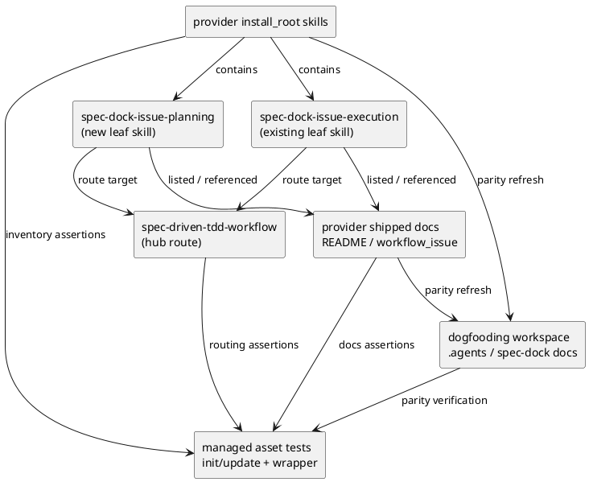
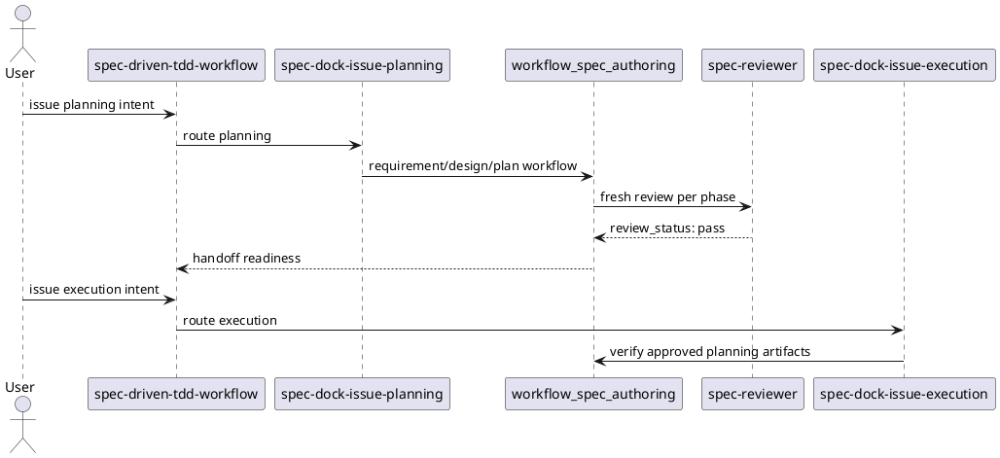

# iss-00138 Split Issue Planning and Execution Skills — 設計（どう実現するか）

## 親図（Diagram）参照
- Epic 図:
  - `epic-00112 Delegated Authoring Architecture for Spec Workflow` の authority-aware delegated authoring boundary を前提にする。
- 再利用する決定:
  - Canonical `requirement.md` / `design.md` / `plan.md` / `report.md` は main orchestrator single-writer authority。
  - `system-architect` と `implementation-planner` は scope-local `discussions/` に draft / analysis evidence を作る。Draft は canonical authority ではない。
  - Fresh `spec-reviewer` pass は delegated draft や preflight review の代替にしない。

## 目的・制約
- 目的:
  - Issue planning entrypoint を追加し、Issue authoring と Issue execution の skill routing を分離する。
  - Existing spec authoring / clarification / delegated draft / issue execution workflow を再定義せず、既存の正本 docs へ短く route する。
- 必須 / 禁止:
  - 必須:
    - Provider-side install assets に `spec-dock-issue-planning` skill を追加する。
    - Hub skill と shipped docs は Issue planning / Issue execution の両方を案内する。
    - Tests は new skill asset、routing text、docs list、dogfooding parity を検出する。
  - 禁止:
    - `spec-dock-issue-planning` に canonical direct authoring authority を与えない。
    - Completion / PR delivery / issue finish policy をこの issue で再設計しない。
- 非交渉制約:
  - Provider-first: source of truth は `src/spec_dock/assets/install_root/` と `src/spec_dock/assets/spec_dock/`。
  - Dogfooding `.agents/skills` と `spec-dock/docs` は parity / validation surface。
  - Reviewer gate は fresh `spec-reviewer` pass を必須にする。

## 既存実装 / 規約の理解
- 参照した実装 / docs:
  - `src/spec_dock/assets/install_root/.agents/skills/spec-dock-initiative-planning/SKILL.md`
  - `src/spec_dock/assets/install_root/.agents/skills/spec-dock-epic-planning/SKILL.md`
  - `src/spec_dock/assets/install_root/.agents/skills/spec-dock-issue-execution/SKILL.md`
  - `src/spec_dock/assets/install_root/.agents/skills/spec-driven-tdd-workflow/SKILL.md`
  - `src/spec_dock/assets/spec_dock/docs/README.md`
  - `src/spec_dock/assets/spec_dock/docs/workflow_issue.md`
  - `tests/test_init_update.py`
  - `tests/cli_runtime/harness.py`
  - `tests/cli_runtime/test_wrappers.py`
- 現状理解:
  - Initiative / Epic には planning leaf skill があるが、Issue には execution leaf skill だけがある。
  - `workflow_spec_authoring.md` は既に Issue requirement / design / plan authoring の正本である。
  - `workflow_issue.md` は Issue spec authoring 節と execution / completion policy を持つため、対応 leaf skill 表記は planning / execution の両方を載せるのが自然。
- 採用するパターン:
  - Initiative / Epic planning skill と同じ concise reminder 形式。
  - Policy body は workflow docs に置き、skill は route と stop condition を短く持つ。
- 採用しないもの:
  - New permission model。
  - Runtime command behavior change。
  - Direct delegated canonical write。

## 採用方針 / トレードオフ
- 論点:
  - `spec-dock-issue-planning` をどこまで強くするか。
- 選択肢:
  - A: Existing workflow を案内する Issue planning leaf skill。
  - B: Scope-local discussion draft author。
  - C: Canonical direct author。
- 決定:
  - A を採用する。ユーザー回答により、既存ルールを保ったまま planning / execution を分割する方針が確定している。
- トレードオフ:
  - A は最小変更で既存 workflow と整合する一方、draft authoring 能力は増やさない。Draft authoring は既存 `system-architect` / `implementation-planner` に残す。

## 依存関係分析
- module / file 依存:
  - `spec-dock-issue-planning/SKILL.md` を追加してから、hub skill / docs / tests の参照を更新する。
  - Hub skill は planning skill 名を参照するため、新 skill file の存在に依存する。
  - Docs README / workflow_issue は shipped docs と dogfooding docs の parity 対象である。
  - Test expectations は managed asset inventory と skill routing text に依存する。
- 上流 / 前提:
  - Requirement phase `spec-reviewer` pass。
  - Existing delegated authoring rules。
- 下流 / 依存先:
  - `plan.md` はこの file dependency から実装順を導く。
  - Implementation phase は new skill, docs, tests, parity の順に閉じる。
- 実装起点:
  - Provider-side `spec-dock-issue-planning/SKILL.md`。
- 順序への影響:
  - Skill addition -> routing/docs update -> tests update -> dogfooding parity -> validation。

## モジュール依存図（Module Dependency Diagram）
- タイトル:
  - Issue planning / execution skill split asset dependency
- 答える問い:
  - どの provider asset が先に固定され、どの docs/tests/dogfooding surface がそれに追随するか。
- 範囲:
  - Skill assets、shipped docs、tests、dogfooding parity。
- 含めない詳細:
  - Runtime command internals、full test call graph、PR delivery lifecycle。
- 更新条件:
  - New skill name、routing policy、managed asset inventory、dogfooding parity strategy が変わるとき。



## ローカル図の差分（Local Diagram Delta）
- 変更する境界 / 責務 / 相互作用:
  - Issue planning は requirement / design / plan authoring entrypoint。
  - Issue execution は approved/reviewer-pass planning artifacts を前提にした implementation entrypoint。
  - `spec-dock-clarification` は planning 前後の first-class clarification companion。

## インターフェース契約
- Skill text contract:
  - `spec-dock-issue-planning`:
    - `workflow_spec_authoring.md` を spec authoring source of truth として参照する。
    - `workflow_clarification.md` を ambiguity / interview source of truth として参照する。
    - `workflow_issue.md` を Issue lifecycle / execution / completion policy として参照する。
    - `phase_plan_issue.md` を Issue plan phase-level checklist として参照する。
    - `authoring/issue-plan.md` を Issue plan field semantics / executable step schema の source of truth として参照する。
    - Canonical docs remain main-orchestrator-owned と明示する。
  - `spec-dock-issue-execution`:
    - Approved/reviewer-pass requirement/design/plan と executable `plan.md` を前提にする。
    - Gap があれば planning / clarification へ戻す。
  - `spec-driven-tdd-workflow`:
    - Issue planning と Issue execution を別 route として列挙する。
    - Planning + execution simultaneous request は gate sequencing を守ると明記する。
- File inventory contract:
  - New managed asset path: `.agents/skills/spec-dock-issue-planning/SKILL.md`。
  - Provider path: `src/spec_dock/assets/install_root/.agents/skills/spec-dock-issue-planning/SKILL.md`。

## シーケンス差分（Sequence Delta）
- 変更する相互作用:
  - Before:
    - User Issue request -> hub -> `spec-dock-issue-execution`。
  - After:
    - User Issue planning request -> hub -> `spec-dock-issue-planning` -> spec authoring / clarification -> reviewer gates -> handoff readiness。
    - User Issue execution request -> hub -> `spec-dock-issue-execution` -> implementation execution。
- UML:


## ドメインモデル差分（Domain Model Delta）
- aggregate / entity / value object 変更:
  - N/A: runtime domain model は変更しない。
- domain event / policy / specification 変更:
  - Skill routing policy と docs wording のみ。
- 不変条件の変更:
  - 既存不変条件を維持する。New invariant は「Issue planning skill は canonical direct authoring authority ではない」。

## クラス / インターフェース詳細設計（必要時）
- N/A:
  - Python class / function interface は変更しない想定。Implementation で test helper の skill list constants は変更する。

## ディレクトリ / ファイル変更計画
```text
.
|-- src/spec_dock/assets/install_root/.agents/skills/
|   |-- spec-dock-issue-planning/SKILL.md      # 追加: Issue requirement/design/plan planning entrypoint
|   |-- spec-dock-issue-execution/SKILL.md     # 変更: execution boundary / gap stop wording
|   `-- spec-driven-tdd-workflow/SKILL.md      # 変更: Issue planning vs execution routing
|-- src/spec_dock/assets/spec_dock/docs/
|   |-- README.md                              # 変更: skill listにIssue planning/executionを明示
|   `-- workflow_issue.md                      # 変更: corresponding leaf skills / boundary wording
|-- .agents/skills/
|   |-- spec-dock-issue-planning/SKILL.md      # dogfooding parity output: provider asset refresh / inspection target
|   |-- spec-dock-issue-execution/SKILL.md     # dogfooding parity output: provider asset refresh / inspection target
|   `-- spec-driven-tdd-workflow/SKILL.md      # dogfooding parity output: provider asset refresh / inspection target
|-- spec-dock/docs/
|   |-- README.md                              # dogfooding parity output: provider docs refresh / inspection target
|   `-- workflow_issue.md                      # dogfooding parity output: provider docs refresh / inspection target
`-- tests/
    |-- cli_runtime/
    |   |-- harness.py                         # 変更: expected managed skill names
    |   `-- test_wrappers.py                   # 変更: initialized repo includes planning skill
    `-- test_init_update.py                    # 変更: managed map / inventory / docs / routing assertions
```

## 要件 → 設計マッピング
- AC-001 -> Add `spec-dock-issue-planning/SKILL.md` in provider and parity surfaces.
- AC-002 -> Planning skill text and hub text state main orchestrator ownership and delegated draft boundary.
- AC-003 -> Execution skill text states approved planning prerequisite and gap stop.
- AC-004 -> Hub routing text separates Issue planning / Issue execution and clarifies sequencing.
- AC-005 -> Tests update managed asset lists, installed output expectations, docs README assertions, wrapper assertions, and dogfooding parity assertion / explicit inspection closure.
- AC-006 -> Docs and skill wording preserve existing workflow semantics and avoid new direct authority.
- EC-001 -> Execution skill stop condition.
- EC-002 -> Hub sequencing language.
- EC-003 -> Planning skill delegated draft explanation.
- EC-004 -> Tests / parity verification.

## テスト戦略
- 単体 / structural:
  - `tests/test_init_update.py` managed asset mapping and authoritative relative paths include `spec-dock-issue-planning`.
  - Bundled skill routing contract asserts hub route text for both Issue planning and execution.
  - Skill text assertions verify `workflow_spec_authoring.md`, `workflow_clarification.md`, `workflow_issue.md`, `phase_plan_issue.md` references and no direct authority claim.
  - Skill text assertions verify `authoring/issue-plan.md` is routed as the field-level executable plan contract source of truth.
- CLI runtime / wrapper:
  - `tests/cli_runtime/harness.py` expected managed skill names includes planning.
  - `tests/cli_runtime/test_wrappers.py` initialized target contains planning skill and updated routing docs.
- Integration / dogfooding:
  - `./spec-dock/scripts/spec-dock validate`
  - Add or extend a focused parity assertion for checked-in dogfooding agent tooling vs provider install root. If no existing helper cleanly covers it, record an explicit dogfooding parity inspection closure in `plan.md` and `report.md`.
  - Treat dogfooding `.agents/skills` and `spec-dock/docs` paths as generated / refreshed parity outputs. Direct editing is allowed only as an explicit provider-parity refresh step with a verification closure; they are not primary implementation sources.
- Full fallback:
  - `python -m unittest discover -v` if focused test impact is scattered.

## 要件 / 例外 -> 検証マッピング
- AC-001 -> file existence assertions and init/update generated asset checks.
- AC-002 -> text assertions for ownership / delegated draft / no authority claims.
- AC-003 -> text assertions in execution skill for approved planning prerequisite and gap return.
- AC-004 -> hub text assertions.
- AC-005 -> managed asset inventory and dogfooding parity tests.
- AC-006 -> spec-reviewer review of docs / skill wording / requirement traceability.
- EC-001 -> execution skill stop condition assertion.
- EC-002 -> hub sequencing assertion.
- EC-003 -> planning skill delegated draft boundary assertion.
- EC-004 -> parity test or explicit validation evidence.

## リスク / 移行 / ロールバック
- リスク:
  - Skill routing text が execution gate bypass を示唆する。
  - Planning skill が `system-architect` / `implementation-planner` の代替に見える。
  - Provider assets と dogfooding workspace が drift する。
  - `workflow_issue.md` を広く編集して completion policy を壊す。
- 移行:
  - Existing `spec-dock-issue-execution` path は残すため後方互換性は高い。
  - Update / init output に new managed skill が追加される。
- ロールバック:
  - New skill path、hub/docs references、test expectations、dogfooding parity additionsを戻す。Runtime command behavior は変更しないため rollback は file asset rollback に閉じる。

## 未確定事項
- none
