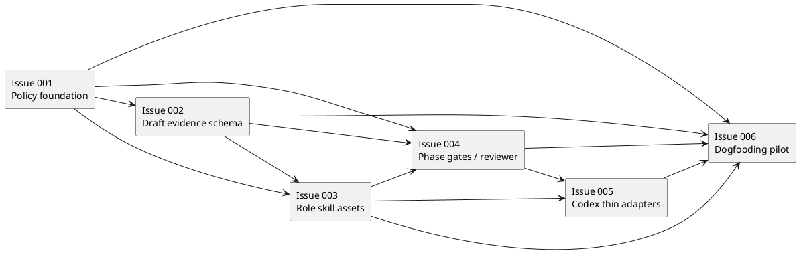
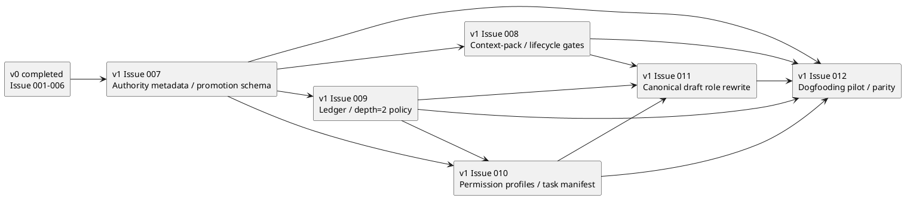

# epic-00112 Delegated Authoring Architecture for Spec Workflow — 計画（Issues / Order）

## この計画で閉じる E-RQ / E-AC

注記: この節は v0 Issue 001〜006 の historical plan contract として保持する。v1 amendment の追加 closure は後続の `v1 Amendment Plan（追加修正 Issue）` を正とする。

- E-RQ:
  - E-RQ-001 Canonical artifact ownership invariant
  - E-RQ-002 Draft-only delegated authoring mode
  - E-RQ-003 Delegation consent and scope contract
  - E-RQ-004 Delegated design authoring contract
  - E-RQ-005 Delegated plan authoring contract
  - E-RQ-006 Delegated draft artifact lifecycle
  - E-RQ-007 Report evidence integration
  - E-RQ-008 Independent spec-reviewer treatment
  - E-RQ-009 Provider-first and dogfooding parity
  - E-RQ-010 Host adapter boundary
  - E-RQ-011 Failure mode handling
  - E-RQ-012 Dogfooding pilot and future write-capable readiness
- E-AC:
  - E-AC-001 Ownership contract
  - E-AC-002 Draft-only safety
  - E-AC-003 Delegated draft lifecycle
  - E-AC-004 Delegated design gate
  - E-AC-005 Delegated plan gate
  - E-AC-006 Reviewer independence
  - E-AC-007 Provider/consumer parity
  - E-AC-008 Dogfooding pilot
  - E-AC-009 Failure mode evidence

## Issue 分割方針
- 分割原則:
  - Policy / schema / role / gate / host / dogfooding を分離し、各 Issue が一つの contract boundary を閉じる。
  - Earlier Issues define authority and evidence before later Issues add callable roles or pilot the workflow.
  - Provider-side source of truth is updated before dogfooding parity work.
  - `.github/agents` / Copilot agent、write-capable delegation、runtime validation、role registry は Issue 化しない。
- 例外:
  - If `.codex/agents` path / syntax cannot be verified in Issue 005, the Issue may close with adapter contract + documented uncertainty, but must not claim verified host integration.

## Issue 一覧（順序 / tranche 付き）
- Issue 001: delegated authoring policy foundation
  - 目的:
    - `workflow_spec_authoring.md` に canonical ownership、draft-only authoring delegation、consent granularity、forbidden actions、manual fallback を固定する。
  - 推奨 title / slug:
    - title: `Delegated Authoring Policy Foundation`
    - slug: `delegated-authoring-policy-foundation`
  - 成果物:
    - Provider docs update under `src/spec_dock/assets/spec_dock/docs/workflow_spec_authoring.md`
    - Dogfooding docs parity under `spec-dock/docs/workflow_spec_authoring.md`
    - Report evidence update for policy decision.
  - tranche:
    - T1 Policy foundation
  - closes:
    - E-RQ-001, E-RQ-002, E-RQ-003 baseline
    - E-AC-001, E-AC-002 baseline
  - 依存:
    - none
  - Issue readiness:
    - Must include explicit non-scope for write-capable delegation and `.github/agents`.
    - Must preserve existing manual authoring path and fresh reviewer pass rule.

- Issue 002: delegated draft artifact and report evidence schema
  - 目的:
    - Delegated draft lifecycle、structured draft artifact、report evidence、report template / active-none surfaces を固定する。
  - 推奨 title / slug:
    - title: `Delegated Draft Evidence Schema`
    - slug: `delegated-draft-evidence-schema`
  - 成果物:
    - Draft lifecycle and artifact contract in provider docs.
    - Report evidence contract in workflow / phase docs.
    - Provider report templates:
      - `src/spec_dock/assets/spec_dock/templates/{initiative,epic,issue}/report.md`
      - `src/spec_dock/assets/spec_dock/system/active-none/{initiative,epic,issue}/report.md`
    - Dogfooding parity for corresponding `spec-dock/templates/**/report.md` and `spec-dock/system/active-none/**/report.md`.
  - tranche:
    - T1 Evidence foundation
  - closes:
    - E-RQ-006, E-RQ-007, E-RQ-011
    - E-AC-003, E-AC-009
  - 依存:
    - Issue 001
  - Issue readiness:
    - Must represent `requested`, `produced`, `integrated`, `partially_integrated`, `rejected`, `superseded`, `blocked`, `stale`.
    - Must include expected verdict, allowed next action, evidence path, and promotion eligibility for every failure mode.

- Issue 003: role skill assets for delegated design and plan authors
  - 目的:
    - `spec-dock-system-architect` と `spec-dock-implementation-planner` の provider-first role skills を追加する。
  - 推奨 title / slug:
    - title: `Delegated Author Role Skills`
    - slug: `delegated-author-role-skills`
  - 成果物:
    - `src/spec_dock/assets/install_root/.agents/skills/spec-dock-system-architect/SKILL.md`
    - `src/spec_dock/assets/install_root/.agents/skills/spec-dock-implementation-planner/SKILL.md`
    - Dogfooding `.agents/skills/...` parity.
    - Managed asset / init-update tests are mandatory for shipped role skill assets.
  - tranche:
    - T2 Role capability
  - closes:
    - E-RQ-004, E-RQ-005
    - E-AC-004, E-AC-005 role-contract baseline only
  - 依存:
    - Issue 001
    - Issue 002
  - Issue readiness:
    - `system-architect` output must include the design draft required sections from `design.md`.
    - `implementation-planner` output must include the plan draft required sections from `design.md`.
    - Both skills must forbid canonical edits, implementation edits, GitHub mutation, destructive command, phase promotion, and reviewer-pass claims.
    - Must prove managed asset parity through `tests/test_init_update.py` or equivalent targeted coverage.

- Issue 004: phase gate and spec-reviewer integration
  - 目的:
    - `phase_design.md` / `phase_plan.md` / `phase_plan_issue.md` に delegated authoring gates と reviewer criteria を組み込む。
  - 推奨 title / slug:
    - title: `Delegated Authoring Phase Gates`
    - slug: `delegated-authoring-phase-gates`
  - 成果物:
    - Delegated Design Authoring Gate.
    - Delegated Plan Authoring Gate.
    - Reviewer criteria for delegated draft provenance, staleness, traceability, scope discipline, and phase gate preservation.
    - Actual `spec-reviewer` invocation surface evidence or update.
    - Epic-specific plan handoff updates in `phase_plan_epic.md`, or explicit rationale if shared `phase_plan.md` fully owns the delegated plan gate.
    - Provider / dogfooding docs parity.
  - tranche:
    - T2 Gate integration
  - closes:
    - E-RQ-003, E-RQ-008, E-RQ-011
    - E-AC-004, E-AC-005 gate/reviewer readiness only
    - E-AC-006, E-AC-009
  - 依存:
    - Issue 001
    - Issue 002
    - Issue 003
  - Issue readiness:
    - Must state that delegated draft is not reviewer pass.
    - Must preserve manual authoring as valid path when delegation is unavailable or intentionally skipped.
    - Must prove delegated-specific criteria are visible to `spec-reviewer` invocation, or update the concrete reviewer surface.

- Issue 005: Codex host callable role adapter
  - 目的:
    - `.codex/agents` に thin callable entrypoints を追加し、role skill を正本にした host adapter boundary を固定する。
  - 推奨 title / slug:
    - title: `Codex Delegated Author Adapters`
    - slug: `codex-delegated-author-adapters`
  - 成果物:
    - Verified or documented `.codex/agents/system-architect.toml`.
    - Verified or documented `.codex/agents/implementation-planner.toml`.
    - Provider source under `src/spec_dock/assets/install_root/.codex/agents/`.
    - Dogfooding parity under `.codex/agents/`.
    - Managed asset / init-update tests are mandatory for shipped host adapter assets.
    - Adapter/skill drift prevention note.
  - tranche:
    - T3 Host integration
  - closes:
    - E-RQ-010
    - E-AC-002 host-adapter portion
  - 依存:
    - Issue 003
    - Issue 004
  - Issue readiness:
    - Must not duplicate long-form role instructions.
    - Must explicitly exclude `.github/agents` / Copilot agent implementation.
    - If host syntax is uncertain, close only with documented uncertainty and no verified-integration claim.
    - Must classify closure as `verified_host_adapter` or `adapter_contract_only`.

- Issue 006: dogfooding parity and validation pilot
  - 目的:
    - Shipped workflow / skills / adapters を dogfooding workspace で使い、draft-only delegated authoring の実地証跡を残す。
  - 推奨 title / slug:
    - title: `Delegated Authoring Dogfooding Pilot`
    - slug: `delegated-authoring-dogfooding-pilot`
  - 成果物:
    - Provider / consumer parity evidence.
    - `spec-dock validate` and `spec-dock sync` evidence.
    - At least one delegated design draft and one delegated plan draft saved under `discussions/`.
    - Canonical integration evidence in `report.md`.
    - Fresh `spec-reviewer` result for pilot artifacts.
    - Metrics summary and write-capable defer decision.
    - At least one negative / blocked case exercise or explicitly simulated evidence.
  - tranche:
    - T4 Dogfooding and final evidence
  - closes:
    - E-RQ-009, E-RQ-012
    - E-AC-004 operational evidence
    - E-AC-005 operational evidence
    - E-AC-007, E-AC-008
  - 依存:
    - Issue 001
    - Issue 002
    - Issue 003
    - Issue 004
    - Issue 005
  - Issue readiness:
    - Must use shipped / documented workflow assets, not ad hoc prompt-only delegation.
    - Must record pilot metrics for draft count, integration ratio/cost, rejected reasons, traceability defects, scope creep or gate violations, forbidden action attempts, reviewer findings, stale draft events, provider/consumer drift, and implementation deviation if implementation follows.
    - Must record `write-capable delegation remains deferred` unless a later Epic / Issue explicitly approves it.
    - If Issue 005 closes as `adapter_contract_only`, must record `host_invocation_verified=false` and avoid verified Codex host callability claims.

## Issue dependency graph
- タイトル:
  - Delegated authoring issue dependency graph
- 答える問い:
  - Which Issues must land before later role, host, and dogfooding work can safely proceed?
- 範囲:
  - Epic issue dependencies only.
- 含めない詳細:
  - Issue-internal TDD steps, commit rhythm, implementation tasks.
- 更新条件:
  - Issue split, dependency order, or tranche changes.

## 統合チェックポイント
- G1 Requirement / design gate closure:
  - Epic requirement and design have fresh `spec-reviewer` pass.
  - Issue 001 and Issue 002 cannot start from stale requirement/design assumptions.
- G2 Policy + evidence foundation:
  - Issue 001 and Issue 002 complete.
  - Draft-only ownership and report evidence are defined before role skills are introduced.
- G3 Role + gate integration:
  - Issue 003 and Issue 004 complete.
  - Role skills and reviewer criteria agree on draft output, blockers, forbidden actions, and evidence.
- G4 Host adapter integration:
  - Issue 005 complete or documented uncertainty accepted.
  - `.codex/agents` is thin and does not duplicate canonical skill instructions.
- G9 Final dogfooding / Epic closure:
  - Issue 006 complete.
  - Provider/consumer parity, validation, sync, reviewer, and pilot metrics are recorded.

## 品質ゲート
- test:
  - Unit / content tests for managed assets and docs where existing patterns support them.
  - Init/update asset parity tests for new role skills and `.codex/agents` adapters.
- observability:
  - `report.md` records each delegated draft invocation, artifact path, integration result, reviewer result, and promotion decision.
- migration:
  - No runtime data migration.
  - Existing manual authoring workflow remains valid throughout rollout.
- docs:
  - Provider docs and dogfooding docs are updated together or dogfooding refresh evidence explains intended differences.
  - Report templates and active-none report scaffolds include delegated evidence sections.

## ロールアウト / docs impact
- ロールアウト順序:
  1. Policy docs.
  2. Draft evidence schema and report templates.
  3. Role skills.
  4. Phase/reviewer docs.
  5. Codex adapters.
  6. Dogfooding pilot and final evidence.
- 契約 / docs 更新:
  - `workflow_spec_authoring.md`
  - `phase_design.md`
  - `phase_plan.md`
  - `phase_plan_epic.md`
  - `phase_plan_issue.md`
  - report templates / active-none scaffolds
  - role skills
  - `.codex/agents`
  - dogfooding workspace copies

## Issue 準備完了条件
- Issue に要求する最低条件:
  - Requirement/design/plan for the Issue must trace to this Epic E-RQ/E-AC and design decisions.
  - Each Issue must state provider-side source of truth and dogfooding parity surface.
  - Each Issue must include step-local verification strategy appropriate to docs / skills / adapters / tests.
  - Any delegated authoring used while authoring the Issue must follow the draft-only evidence contract once implemented; before implementation, manual authoring remains valid.

## 最終完了条件

注記: この節は v0 Issue 001〜006 の historical completion contract として保持する。v1 amendment 適用後の最終完了条件は `v1 Amendment final exit contract` を正とする。

- E-AC 完了:
  - E-AC-001..E-AC-009 have implementation evidence or explicit non-applicable evidence.
- 統合 / ロールアウト完了:
  - All six Issues are done or explicitly superseded by reviewer-approved plan amendment.
  - Provider / consumer parity is verified.
  - `spec-dock validate` and `spec-dock sync` evidence is recorded.
- docs 影響解決:
  - Provider docs, templates, active-none scaffolds, role skills, host adapters, and dogfooding copies are aligned.
  - Final fresh `spec-reviewer` confirms requirement / design / plan / report alignment.

## 依存 / ブロッカー
- D-001:
  - `.codex/agents` path / syntax verification may affect whether Issue 005 closes as verified adapter implementation or documented uncertainty.
- D-002:
  - `spec-reviewer` availability is required for phase gates and final closure.
- D-003:
  - GitHub auth is required to create the six GitHub-backed child Issues.

## 未確定事項
- なし:
  - `.github/agents` / Copilot support remains non-scope.
  - Runtime validation and write-capable delegation remain deferred.
  - Issue 005 fallback for host syntax uncertainty is part of the plan, not an unresolved scope question.

## v1 Amendment Plan（追加修正 Issue）

この節は、完了済みの Issue 001〜006 を上書きしない。v0 実装の上に積み上げる追加修正計画として扱う。v1 Issue 007〜012 は、spec-dock / GitHub 上では次の実IDで作成済みであり、実行はこの対応表と依存順に従う。

| v1計画ID | spec-dock ID | GitHub | title / slug | 実行順序 |
| --- | --- | --- | --- | --- |
| v1 Issue 007 | `iss-00120` | `#120` | `Authority Metadata and Promotion Record Schema` / `authority-metadata-and-promotion-record-schema` | 1 |
| v1 Issue 008 | `iss-00121` | `#121` | `Authority-Aware Context Pack and Lifecycle Gates` / `authority-aware-context-pack-lifecycle-gates` | 2 |
| v1 Issue 009 | `iss-00122` | `#122` | `Evidence Adoption Ledger and Bounded Depth-2 Delegation` / `evidence-adoption-ledger-depth2-delegation` | 2 |
| v1 Issue 010 | `iss-00123` | `#123` | `Role-Scoped Permission Profiles and Task Manifest Probes` / `role-scoped-permission-profiles-task-manifest` | 3 |
| v1 Issue 011 | `iss-00124` | `#124` | `Canonical Draft Authoring Role Rewrite` / `canonical-draft-authoring-role-rewrite` | 4 |
| v1 Issue 012 | `iss-00125` | `#125` | `Authority-Aware Delegated Authoring Dogfooding Pilot` / `authority-aware-delegated-authoring-dogfooding-pilot` | 5 |

### Amendment 方針

- v0 issue reports / plans / observed evidence は変更しない。
- v1 issue は provider source of truth を起点にし、dogfooding workspace は validation / parity surface とする。
- write-scoped draft authoring は authority-aware gates と Permission Profile probe が揃うまで有効化しない。
- Permission Profile が fail-open する場合は write-scoped authoring を無効化し、v0 discussions proposal path を継続する。

### v1 Issue 007: authority metadata and promotion record schema

- title / slug:
  - `Authority Metadata and Promotion Record Schema`
  - `authority-metadata-and-promotion-record-schema`
- 目的:
  - `status` / `authority` / normative `grants` / `approval` / requirement authority source / promotion candidate hash / promotion record を provider docs と report scaffolds に定義する。
- provider source:
  - `src/spec_dock/assets/spec_dock/docs/`
  - `src/spec_dock/assets/spec_dock/templates/`
  - `src/spec_dock/assets/spec_dock/system/active-none/`
- dogfooding validation surface:
  - `spec-dock/docs/`
  - `spec-dock/templates/`
  - `spec-dock/system/active-none/`
- test surface:
  - `tests/` content assertions and managed scaffold parity tests.
- rollback / fallback:
  - Revert schema docs/templates and keep v0 draft-only evidence workflow active.
- closes:
  - E-RQ-001, E-RQ-003, E-RQ-004, E-RQ-012
  - E-AC-001, E-AC-005, E-AC-012

### v1 Issue 008: authority-aware context-pack and lifecycle gates

- title / slug:
  - `Authority-Aware Context Pack and Lifecycle Gates`
  - `authority-aware-context-pack-lifecycle-gates`
- 目的:
  - proposed artifact が implementation / issue ready / issue finish / phase completion に混入しない runtime gate を追加する。
- provider source:
  - `src/spec_dock/assets/spec_dock/scripts/spec_dock_runtime/`
  - related docs under `src/spec_dock/assets/spec_dock/docs/`
- dogfooding validation surface:
  - `spec-dock/scripts/spec_dock_runtime/`
  - `spec-dock/docs/`
- test surface:
  - runtime tests under `tests/cli_runtime/`, `tests/domain_runtime/`, or nearest existing validation/context-pack tests.
- rollback / fallback:
  - Disable authority-aware runtime handoff for write-scoped drafts and continue v0 discussions proposal / manual integration path.
- closes:
  - E-RQ-003, E-RQ-005, E-RQ-012
  - E-AC-002, E-AC-005

### v1 Issue 009: evidence adoption ledger and bounded depth-2 delegation

- title / slug:
  - `Evidence Adoption Ledger and Bounded Depth-2 Delegation`
  - `evidence-adoption-ledger-depth2-delegation`
- 目的:
  - child specialist output を ledger 経由で採用 / 部分採用 / 棄却 / 保留できるようにし、depth=2 の許可 graph と cap を固定する。
- provider source:
  - `src/spec_dock/assets/spec_dock/docs/`
  - `src/spec_dock/assets/spec_dock/templates/`
  - `src/spec_dock/assets/install_root/.agents/skills/`
- dogfooding validation surface:
  - `spec-dock/docs/`
  - `spec-dock/templates/`
  - `.agents/skills/`
- test surface:
  - managed asset tests and content assertions for ledger fields, allowed graph, forbidden graph, and reviewer independence.
- rollback / fallback:
  - Keep child specialist use read-only and require main orchestrator to integrate evidence manually without depth=2 write delegation.
- closes:
  - E-RQ-006, E-RQ-007, E-RQ-009, E-RQ-012
  - E-AC-006, E-AC-007, E-AC-009

### v1 Issue 010: role-scoped Permission Profiles and task manifest probes

- title / slug:
  - `Role-Scoped Permission Profiles and Task Manifest Probes`
  - `role-scoped-permission-profiles-task-manifest`
- 目的:
  - role-specific write scope を Permission Profile、task manifest、resolved path allowlist、positive / negative write probe、fallback policy として導入する。
- provider source:
  - `src/spec_dock/assets/install_root/.codex/agents/`
  - related provider docs under `src/spec_dock/assets/spec_dock/docs/`
- dogfooding validation surface:
  - `.codex/agents/`
  - local probe evidence recorded under the active epic / issue report.
- test surface:
  - managed asset parity tests plus CLI/Desktop probe evidence where available.
- rollback / fallback:
  - Mark host profile as unverified, disable write-scoped delegation, and use v0 proposal path or directory-write fallback only when probes are closed-safe.
- closes:
  - E-RQ-008, E-RQ-010, E-RQ-012
  - E-AC-008, E-AC-011

### v1 Issue 011: canonical draft authoring role rewrite

- title / slug:
  - `Canonical Draft Authoring Role Rewrite`
  - `canonical-draft-authoring-role-rewrite`
- 目的:
  - `system-architect` / `implementation-planner` を v0 read-only evidence producer から v1 draft canonical author に更新する。ただし final authority は持たせない。
- provider source:
  - `src/spec_dock/assets/install_root/.agents/skills/`
  - `src/spec_dock/assets/spec_dock/docs/workflow_spec_authoring.md`
  - `src/spec_dock/assets/spec_dock/docs/phase_design.md`
  - `src/spec_dock/assets/spec_dock/docs/phase_plan.md`
  - `src/spec_dock/assets/spec_dock/docs/phase_plan_epic.md`
  - `src/spec_dock/assets/spec_dock/docs/phase_plan_issue.md`
- dogfooding validation surface:
  - `.agents/skills/`
  - `spec-dock/docs/`
  - draft authoring evidence in the target scope.
- test surface:
  - managed asset tests, role instruction content assertions, and negative checks for forbidden promotion / previous-phase writes.
- rollback / fallback:
  - Revert role skills to v0 read-only proposal mode and require main orchestrator canonical integration.
- closes:
  - E-RQ-001, E-RQ-002, E-RQ-004, E-RQ-008, E-RQ-009
  - E-AC-003, E-AC-004, E-AC-009

### v1 Issue 012: authority-aware delegated authoring dogfooding pilot

- title / slug:
  - `Authority-Aware Delegated Authoring Dogfooding Pilot`
  - `authority-aware-delegated-authoring-dogfooding-pilot`
- 目的:
  - v1 workflow を dogfooding し、actual `design.md` draft と `plan.md` draft、promotion gate、context-pack / lifecycle blocks、Permission Profile fallback を実地検証する。
- provider source:
  - no new provider source by default; any discovered provider defect must open a follow-up or amend the relevant provider issue.
- dogfooding validation surface:
  - current dogfooding workspace
  - active epic / issue reports
  - `spec-dock validate`
  - `spec-dock sync`
- test surface:
  - dogfooding execution evidence, reviewer verdicts, validation/sync output, permission probe records.
- rollback / fallback:
  - Mark pilot as fallback or disabled for write-scoped authoring, keep v0 workflow active, and do not claim verified v1 operation.
- closes:
  - E-RQ-010, E-RQ-011, E-RQ-012
  - E-AC-010, E-AC-011, E-AC-012
  - operational evidence for E-AC-001..E-AC-009

### v1 Amendment dependency graph

### v1 Amendment final exit contract

- E-AC-001..E-AC-012 are closed by implementation evidence or explicit fallback evidence.
- Issue 001〜006 remain historical v0 work and are not rewritten.
- Provider / consumer parity is verified for each v1 issue that changes shipped assets.
- `spec-dock validate` and `spec-dock sync` evidence is recorded after the amendment rollout.
- Final fresh `spec-reviewer` confirms updated requirement / design / plan / report alignment.
