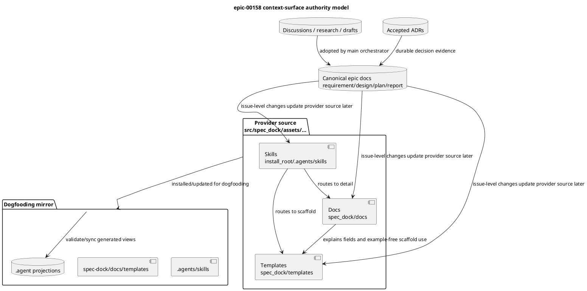

# epic-00158 Agent Workflow PDCA Hardening — 設計（どう実現するか）

## 全体像

- 対象境界:
  - この Epic は、SpecDock が shipped asset として配布する agent-facing context surface の設計を扱う。
  - 主対象は provider-side の skills / docs / templates と、dogfooding mirror での検証境界である。
  - Runtime gate、CLI enforcement、automated regression harness は first wave の設計対象外とし、cleaned surface が安定した後の PDCA work として残す。
- 影響領域:
  - Installed skills: `src/spec_dock/assets/install_root/.agents/skills/`
  - Shipped docs: `src/spec_dock/assets/spec_dock/docs/`
  - Shipped templates: `src/spec_dock/assets/spec_dock/templates/`
  - Dogfooding mirror / validation: `.agents/`, `spec-dock/`, `spec-dock/.agent/*`
- 既存関係:
  - Provider-side source が shipped asset の正本であり、dogfooding mirror は install/update 後の検証面である。
  - Canonical `requirement.md` / `design.md` / `plan.md` / `report.md` は main orchestrator-owned であり、sub-agent や external research の output は採用判断まで evidence である。
  - Accepted ADR が durable decision authority を持ち、Issue design / plan はこの Epic design に trace する。
- 参照する親 diagram:
  - N/A: 親 Initiative は architecture maintenance の受け皿を定義するが、この Epic 固有の text-surface authority boundary は本設計で定義する。

## コンポーネント / モジュール構成（Component / Module View）

- タイトル:
  - Agent-facing context surface ownership model
- 答える問い:
  - Agent が読む surface ごとに、何を authority とし、何を authority にしないか。
- 範囲:
  - Skills / docs / templates / discussions / canonical docs / ADR / dogfooding mirror。
- 含めない詳細:
  - 個別 issue の file-level edit 手順、runtime enforcement 実装、full docs rewrite。
- 更新条件:
  - skill/docs/templates の責務分担、canonical authority、dogfooding mirror 境界が変わるとき。

| Surface | Owns | Must not own |
|---|---|---|
| Skill `SKILL.md` | Mandatory task order, stop conditions, first-read gates, evidence obligations, next-doc routing | Full field semantics, long policy explanation, exhaustive examples |
| Workflow / phase docs | Lifecycle details, field meanings, hard cases, shared policy, phase-specific review criteria | Hidden mandatory first action that the skill omits |
| Templates | Thin final-artifact starting shape, evidence slots, discussion/canonical scaffold fields | Compliance authority, phase promotion authority, examples, long field semantics |
| Discussion drafts / research | Evidence, proposal, synthesis, ADR candidates | Canonical authority, reviewer pass, phase promotion |
| Canonical `requirement.md` / `design.md` / `plan.md` / `report.md` | Main orchestrator-owned source of truth and adoption ledger | Sub-agent direct ownership |
| Accepted ADR | Durable architecture decision evidence | Implementation readiness by itself |
| Dogfooding mirror | Validation and installed-surface inspection | Provider source authority |

### 図表（UML / 推奨: コンポーネント / モジュール）



## パッケージ依存（Package Dependency）

- タイトル:
  - Text-surface dependency model
- 答える問い:
  - Runtime package dependency ではなく、agent が読む authority / reference の依存がどう流れるか。
- 範囲:
  - Hub skill、leaf skills、workflow docs、phase docs、templates、report ledgers。
- 含めない詳細:
  - Python import graph、CLI runtime implementation、installer module dependency。
- 更新条件:
  - runtime package dependency や CLI implementation が first-wave scope に入るとき。

### 図表（UML / 推奨: パッケージ依存 / 依存差分）

- N/A: この Epic の first wave は text-surface cleanup であり、Python package dependency、runtime services、CLI module dependency を変更しない。意味のある依存は、skill から docs/templates への reference と、evidence から canonical docs への adoption flow である。

## ドメインモデル（Domain Model / DDD 必要時）

- ユビキタス言語の参照:
  - `Context surface`: agent が作業前または作業中に読む file / generated view。
  - `Workflow spine`: skill の first-read surface に置く、必須順序、停止条件、evidence obligation、reviewer gate。
  - `Detail surface`: docs が所有する概念、field semantics、hard cases、policy detail。
  - `Scaffold surface`: templates が所有する artifact shape と evidence slots。具体例や詳細な field semantics は docs が所有する。
  - `Evidence`: canonical へ反映する前の research / discussion / draft / external analysis。
  - `Adoption`: main orchestrator が `report.md` に採否を記録し、必要なら canonical docs へ再記述する行為。
  - `Dogfooding mirror`: provider-side shipped asset が install/update 後にどう見えるかを検証する local consumer surface。
- 集約ルート:
  - N/A: persistent domain aggregate は追加しない。
- エンティティ / 値オブジェクト:
  - N/A: runtime domain model は変更しない。
- ドメインイベント / ポリシー / 仕様:
  - Policy: Skills own operational workflow spine; docs own detailed semantics and examples; templates own thin scaffolds and evidence slots.
  - Policy: `spec-dock-clarification` owns its own source-grounded grill workflow in the skill.
  - Policy: Delegated / external output remains evidence until main orchestrator adoption and report ledger recording.
- 不変条件:
  - Templates must not become compliance authority.
  - Fresh `spec-reviewer` pass is the only automatic phase promotion gate.
  - Provider-side source remains shipped asset authority.

### 図表（UML / 任意: domain model / aggregate）

- N/A: この Epic は runtime domain aggregate を追加しない。用語と policy invariant は本文で固定する。

## 契約

### インターフェース契約（API / 必要時）

- API-001:
  - N/A: runtime API 変更なし。

### イベント契約（Event / 必要時）

- EVT-001:
  - N/A: runtime event 変更なし。

### データ境界

- 正本:
  - Shipped skill source: `src/spec_dock/assets/install_root/.agents/skills/`
  - Shipped docs/templates source: `src/spec_dock/assets/spec_dock/{docs,templates}/`
  - Epic canonical source: `spec-dock/active/epic/{requirement,design,plan,report}.md`
  - Active selection authority: `spec-dock/.agent/active.json`
- 一貫性モデル:
  - Provider-side source を変更し、dogfooding mirror を `validate` / `sync` / targeted inspection で確認する。
  - Delegated draft は `adoption_status: unreviewed` / `reflected_to: []` のまま evidence とし、main orchestrator が canonical docs と `report.md` に採用証跡を残すまで authority にしない。

## データモデル

- model / table 変更:
  - なし。
- 不変条件:
  - `report.md` Evidence Adoption Ledger は、採用状態、出所、claim、採用先、根拠、証跡、reviewer、blocking、next action を確認できる粒度を持つ。
  - Spec Authoring Gate は phase ごとの reviewer verdict と promotion / next action を記録する。

### 図表（UML / 任意: data model）

- N/A: persistence model / migration impact はない。Report ledger は Markdown artifact contract として扱う。

## 主要フロー

- Flow-A: Requirement / design / plan authoring gate
  1. Main orchestrator が対象 scope、parent docs、workflow docs、discussions、ADR を調査する。
  2. Canonical artifact を main orchestrator が更新する。
  3. Fresh `spec-reviewer` が canonical artifact と upstream context を review する。
  4. `review_status: pass` の場合だけ次 phase へ進む。
  5. Non-pass の場合は指摘修正、clarification、prior phase return のいずれかに戻る。
- Flow-B: Delegated design / plan evidence adoption
  1. Main orchestrator が scope-local discussion draft を bounded delegation で依頼する。
  2. Sub-agent は `discussions/` direct child に draft を作成し、canonical docs を編集しない。
  3. Main orchestrator が draft の provenance / diff / scope を確認する。
  4. 採用部分だけ canonical docs に再記述し、`report.md` EAL / delegated evidence に記録する。
  5. Fresh `spec-reviewer` が canonical artifact を review する。
- Flow-C: Provider / dogfooding verification
  1. Issue-level implementation は provider-side source を変更する。
  2. Dogfooding mirror を update / sync / targeted inspection で確認する。
  3. `.agent` projections と dashboard を確認し、report に検証証跡を残す。

### 図表（UML / 推奨: main sequence）

```plantuml
@startuml
title epic-00158 evidence adoption and dogfooding sequence
' Question answered: How does delegated evidence become canonical design and later shipped surface change?
' Scope: Epic authoring, reviewer gate, provider source, dogfooding verification.
' Excluded details: issue-level implementation steps and exact file edits.
' Update trigger: evidence adoption or provider/mirror verification contract changes.

actor "Main orchestrator" as Orchestrator
participant "Delegated authoring role\nsystem-architect / implementation-planner" as Delegate
database "Epic discussions" as Discussions
database "Canonical docs\nrequirement/design/plan/report" as Canonical
participant "spec-reviewer" as Reviewer
folder "Provider source\nsrc/spec_dock/assets/..." as Provider
folder "Dogfooding mirror\n.agents/ + spec-dock/" as Mirror
database ".agent projections" as AgentState

Orchestrator -> Delegate: bounded scope-local draft request
Delegate -> Discussions: write one flat Markdown evidence file
Delegate --> Orchestrator: draft path, no authority claim
Orchestrator -> Canonical: record EAL / delegated evidence
Orchestrator -> Canonical: rewrite adopted content
Orchestrator -> Reviewer: fresh review canonical artifact
Reviewer --> Orchestrator: pass or non-pass verdict
Orchestrator -> Provider: later issue edits shipped source
Provider -> Mirror: update/inspect installed copy
Mirror -> AgentState: validate/sync projections
AgentState --> Orchestrator: verification evidence
@enduml
```

## 状態 / アクティビティ（State / Activity / 必要時）

- State:
  - Requirement/design/plan phase state is already owned by `workflow_spec_authoring.md`; this Epic does not introduce a new runtime state machine.
- Activity:
  - Useful for first-wave sequencing, but detailed work order belongs in `plan.md`.

### 図表（UML / 任意: state / activity）

- N/A: Lifecycle state is defined by existing authoring workflow; issue ordering is fixed in the Epic plan, not design.

## 失敗設計

- 失敗モード:
  - Skill bloat: workflow spine が長くなりすぎ、docs と重複する。
  - Authority drift: skill が docs authority と矛盾する、または docs が hidden mandatory workflow を持ち続ける。
  - Clarification link risk: `workflow_clarification.md` を急に削除し既存 link を壊す。
  - Evidence laundering: delegated / external output を ledger 採用なしに canonical と扱う。
  - Guard inversion: regression / runtime gate が first-wave cleanup を置き換える。
  - Provider/mirror confusion: dogfooding mirror だけを編集して shipped source 変更と誤認する。
- リトライ:
  - Reviewer non-pass は指摘修正後に fresh reviewer を再実行する。
  - Dogfooding mirror mismatch は provider source、update/sync path、generated projection の順に切り分ける。
- 冪等性:
  - Docs/skill/template cleanup は provider source diff と mirror verification により再実行可能にする。
  - `validate` / `sync` は検証として繰り返せる。
- 部分失敗:
  - 一部 issue が broad / narrow すぎる場合は ADR の split / merge guidance に従い、regression checks を前倒ししない。
  - Clarification doc は first wave では bridge を既定とし、full retirement は link cleanup の見通しが立つまで deferred にできる。

## 移行戦略

- 移行戦略:
  - First wave は provider-side skills / docs / templates を段階的に整える。
  - Existing links を壊さないため、`workflow_clarification.md` は first wave では bridge / reference へ変えるのを既定とする。
  - Historical discussion / note / manifest-heavy delegated artifacts は grandfathered evidence とし、今回の standard change だけで rename / invalidation しない。
- 必要時の dual write/read:
  - Dual write は不要。
  - Provider source と dogfooding mirror の両方を見るが、authority は provider source に置く。
- ロールバック:
  - Text-surface changes は provider-side asset content を戻し、update / dogfooding verification を再実行する。
  - Clarification bridge conversion が link ambiguity を起こした場合は doc-owned text へ機械的 rollback 可能だが、accepted ADR の first-read risk を再導入するため report に記録する。

## 観測性 / セキュリティ

- 観測性:
  - Provider-side asset diff を skill / docs / templates family ごとに確認する。
  - Dogfooding mirror diff または targeted mirror inspection を残す。
  - `./spec-dock/scripts/spec-dock validate` と `./spec-dock/scripts/spec-dock sync` を実行する。
  - Targeted `rg` で non-pass reviewer wording、evidence adoption wording、clarification source-of-truth wording、template authority wording を確認する。
  - Epic / Issue `report.md` の Evidence Adoption Ledger、Spec Authoring Gate、Delegated Draft Evidence を更新する。
- ロール / 認可:
  - Main orchestrator が canonical docs を所有する。
  - `system-architect` と `implementation-planner` は scope-local discussion draft evidence を作成できるが、canonical edit、reviewer pass claim、phase promotion claim はしない。
  - `spec-reviewer` は canonical artifact に対する fresh gate として使う。
- 監査 / PII:
  - No secrets, tokens, `.env*`, or PII handling are required.
  - ChatGPT / Deep Research output は source / adoption status を記録し、canonical authority と混同しない。

## テスト戦略

- 単体:
  - Content-level inspection: skills が mandatory first-read gates を持ち、ownership ADR と矛盾しないことを確認する。
  - Docs inspection: docs が detail semantics / hard cases を持ち、skill-owned workflow と矛盾する authority claim を残さないことを確認する。
  - Templates inspection: thin scaffold / evidence slot に徹し、examples や compliance authority wording を避けることを確認する。
- 統合:
  - Shipped asset 変更時は installer/init/update coverage に必要な assertion を追加または更新する。
  - Provider-side assets が `.agents/` / `spec-dock/` mirror に反映されることを dogfooding で確認する。
- E2E:
  - First wave では automated E2E harness は必須にしない。
  - Manual dogfooding smoke として、target skill を first-read した agent が next action / stop condition / reviewer gate / evidence obligation / next docs を説明できるか確認する。
- E-AC 対応:
  - E-AC-001 -> skills/docs/templates の横断 inspection と contradiction check。
  - E-AC-002 -> Epic plan と issue docs の traceability check。
  - E-AC-003 -> `spec-dock-clarification/SKILL.md` first-read smoke。
  - E-AC-004 -> reviewer non-pass wording check と Spec Authoring Gate。
  - E-AC-005 -> `report.md` EAL / delegated evidence review。
  - E-AC-006 -> provider source / dogfooding mirror validation。
  - E-AC-007 -> requirement / design / plan gate records。

## 関連 ADR

- `20260605t080509z-adr-skill-docs-template-context-surface-ownership.md`:
  - skill / docs / templates の責務分担を固定する。
- `20260605t080509z-01-adr-clarification-skill-owned-workflow.md`:
  - `spec-dock-clarification` を skill-owned workflow とし、`workflow_clarification.md` を bridge / reference とする。
- `20260605t080509z-02-adr-first-wave-issue-decomposition.md`:
  - first-wave issue set と deferred work を固定する。

## 要件 → 設計マッピング

| Requirement | Design treatment | Acceptance criteria supported |
|---|---|---|
| E-RQ-001 | Context surface ownership model を中心契約として定義 | E-AC-001 |
| E-RQ-002 | Skill first-read workflow spine と docs/templates routing を定義 | E-AC-001, E-AC-004 |
| E-RQ-003 | Clarification exception と bridge/reference migration を定義 | E-AC-003 |
| E-RQ-004 | Fresh reviewer gate と non-pass state の扱いを authority/evidence contract として定義 | E-AC-004, E-AC-007 |
| E-RQ-005 | Evidence adoption と canonical authority の分離を定義 | E-AC-005 |
| E-RQ-006 | First-wave issue decomposition と deferred work を設計制約として保持 | E-AC-002 |
| E-RQ-007 | Provider source / dogfooding mirror の source-of-record 境界を定義 | E-AC-006 |

## 未確定事項

- Blocking question:
  - なし。
- Non-blocking design notes:
  - `workflow_clarification.md` の full retirement は first wave では固定せず、bridge 化を既定とする。
  - `Align Skill Docs Template Context Surfaces` の粒度は plan で issue slicing として決める。
  - Regression checks / manual harness / runtime gate の開始条件は plan では deferred とし、first-wave completion 後の PDCA issue で再評価する。
