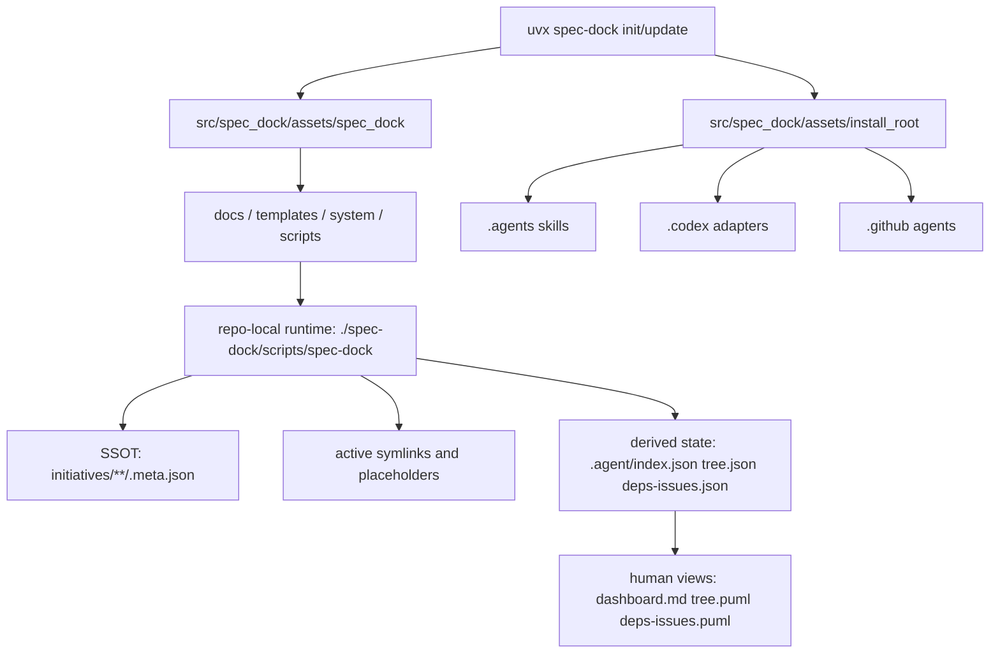
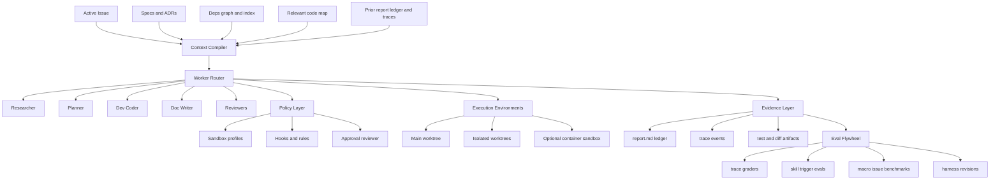

# spec-dock改善のためのハーネスエンジニアリングとコンテキストエンジニアリング調査報告

## エグゼクティブサマリー

`spec-dock` は、一般的な「長いシステムプロンプトで何とかする」系のエージェント運用より、かなり先に進んでいます。とくに、`requirement.md`、`design.md`、`plan.md`、`report.md` を分離し、`issue start` / `issue finish`、`active` シンボリックリンク、`.meta.json` を SSOT にした構造、`sync` による agent-facing projection、single-writer authority、behavior-slice 単位の実行契約、reviewer gate を明文化している点は、現在の Codex 系フレームワークが推奨している方向性と強く整合しています。つまり `spec-dock` は「未成熟な prompt-first ツール」ではなく、すでに **spec-first な agent harness** として成立しています。 citeturn12view0turn15view0turn14view2turn17view5turn28view0

そのうえで、2026年時点のベストプラクティスから見ると、次に強化すべきなのは **文書運用そのもの** ではなく、**文書を agent runtime に橋渡しするハーネス層** です。具体的には、`active` 周辺の文脈を最小・段階的に組み立てる **context compiler**、worker ごとの権限差分を固定する **sandbox / approval / rule profiles**、会話ログでなく構造化イベントを残す **tracing / eval flywheel**、および durable / episodic / ephemeral を分離した **memory stratification** が優先です。OpenAI と Anthropic の最新ドキュメントや実運用記事は、今の設計競争が「モデル性能」より「ハーネス設計」に移っていることを明示しています。 citeturn30search3turn44view0turn32view1turn45search13

要点を一文で言うと、`spec-dock` の今後の改善方針は **“仕様書を増やす” ではなく “仕様書・実装・検証・権限制御・評価をつなぐ実行ハーネスを機械可読化する”** です。現在の強みは壊さず、Codex / Copilot / Claude Code に共通する設計原則、すなわち **小さい恒常指示 + JIT skill 注入 + isolated subagents + deterministic hooks + compaction + trace-based evals** を追加していくのが最も筋が良いです。 citeturn38view0turn32view3turn32view4turn37view10turn39view3turn36view3

## spec-dockの現状理解

`spec-dock` は、`uvx spec-dock init/update` で既存リポジトリにスキャフォールドを配置し、日常運用は repo-local の `./spec-dock/scripts/spec-dock` で行う構成です。README と runtime の説明から、インストーラ本体は `src/spec_dock/` 側にあり、導入後はコピー済みのローカル runtime script が node 作成、active 切替、`sync`、`validate` を担います。これは「導入時だけパッケージ依存」「運用時はローカル資産」という設計です。 citeturn46view0turn46view4turn21view0

リポジトリ内部には provider 側の正本と、dogfooding 用 consumer 側ワークスペースが共存しています。`AGENTS.md` は、`src/spec_dock/assets/spec_dock/...` が provider-side source of truth であり、`spec-dock/` は生成された consumer-side workspace だと明示しています。したがって、このリポジトリを読むときは「ツール実装」と「ツール自身を使った仕様データ」を分けて理解しないと誤読しやすい、というのがまず重要です。 citeturn28view0

workspace の中核は `spec-dock/initiatives/**/.meta.json` を SSOT にした仕様ツリーです。`guide.md` と `reference_sync.md` では、`spec-dock/initiatives/` の Initiative → Epic → Issue 階層を正本とし、`spec-dock/active/` は現在対象の固定入口、`.agent/index.json` / `.agent/tree.json` / `.agent/deps-issues.json` は機械向け派生状態、`tree*.puml` や `dashboard.md` は人間向け可視化として位置づけられています。つまり、`spec-dock` は **canonical state**, **working entrypoint**, **derived views** を分離しています。これは現在の agent harness で非常に良いパターンです。 citeturn12view0turn17view5turn17view6turn26view0

また runtime は、`cli`、`commands`、`application`、`domain`、`infra`、`presentation` に分かれた hybrid layered architecture を採用しています。これは `AGENTS.md` と runtime ディレクトリ一覧の両方で確認できます。`application` には `issue_lifecycle.py` や `delegated_authoring.py`、`domain` には `authority.py`、`deps.py`、`tree.py`、`validation.py`、`infra` には `active_store.py`、`artifact_writer.py`、`git_cli.py`、`github_cli.py`、`presentation` には `cli_text.py`、`json_state.py`、`markdown.py`、`puml.py` があり、責務分離は明確です。テストも installer/runtime/presentation などの表面別に分かれています。 citeturn28view0turn20view0turn24view0turn24view1turn24view2turn24view3turn24view4

workflow 面では、`workflow_spec_authoring.md` が requirement → spec-reviewer pass → design → spec-reviewer pass → plan → spec-reviewer pass という phase promotion gate を定義し、`workflow_clarification.md` は既存 docs / code / 外部一次情報を先に調べ、それでも残る曖昧さだけを一問一答で解消するよう求めています。Issue execution はさらに厳格で、`plan.md` を executable contract、`report.md` を observed evidence ledger と切り分け、implementation step ごとに delegation gate、verification、reviewer gate、commit、最終品質ゲートを要求しています。 citeturn15view0turn16view2turn13view2turn13view3turn13view6

特に良いのは、canonical `requirement.md` / `design.md` / `plan.md` / `report.md` を main orchestrator の single-writer authority とし、sub-agent の成果は `discussions/` 直下の draft として扱う設計です。これは、agent 出力の採否を人間または親エージェントが再編成して authoritative docs に反映する現在のベストプラクティスと一致します。会話ログや worker raw note を正本化しない方針も妥当です。 citeturn15view0turn14view1

一方で、いくつかの点は公開情報だけでは完全に読み切れません。`src/spec_dock/assets/install_root/` に `.agents/`、`.codex/`、`.github/` があり、Codex-compatible multi-skill set と host-specific adapter 資産が同梱されていることは確認できますが、`.codex/agents/spec-manager.toml` と `.github/agents/orchestrator.agent.md` の詳細な権限制御や trigger 条件は、上位 docs では十分に説明されていません。`context-pack.md` も agent-facing guidance として言及はあるものの、どういう algorithm で assembled されるかは明文化が弱いです。ここは「未指定」と扱うのが正確です。 citeturn28view0turn46view5turn17view5

もう一点、README には v2 の現在形として `spec-dock/initiatives/`、`spec-dock/active/`、`spec-dock/.agent/` が書かれている一方、`About` セクションにはなお `.spec-dock/ workspace` という旧表現が残っています。これは軽微ですが、現在の `spec-dock` が重視している「repo knowledge を system of record にする」という方針から見ると、ドキュメントドリフトが実際に起きている例です。改善対象として小さくありません。 citeturn46view4turn46view5

上図は、`AGENTS.md`、README、`guide.md`、`reference_sync.md`、runtime ディレクトリ構造から復元した `spec-dock` の現在像です。provider 側と consumer 側が二層になっている点、SSOT と派生状態を分けている点、adapter 資産を install_root 側で管理している点が本質です。 citeturn28view0turn12view0turn17view5turn46view4turn46view5

## 背景と重要概念

いまの agentic coding でいう **harness engineering** は、単なる prompt engineering ではありません。OpenAI は Codex harness を「stateless な LLM を persistent・tool-using・self-correcting agent に変える」実行基盤として説明し、Anthropic も長時間アプリ開発の成否はモデル単体ではなく harness design に左右されると述べています。最近の survey でも、コードはもはや生成物であるだけでなく、agent が状態を持ち、検証され、行動を組み立てる **executable / verifiable / stateful harness** として扱われています。 citeturn37view5turn44view0turn45search13turn29search2

**spec-driven development** は、その harness の前段で「何を作るか」を仕様として固定し、agent に対して ad-hoc prompt ではなく artifact chain を渡す方法論です。GitHub Spec Kit は、Spec → Plan → Tasks → Implement を中核にし、spec を shared source of truth として扱うと説明しています。さらに `/speckit.clarify` による曖昧さ解消、`/speckit.checklist` と `/speckit.analyze` による gate、複雑案件では phased implementation で context saturation を避けることを推奨しています。これは `spec-dock` がすでに実装している方向と非常に近いです。 citeturn41view0turn41view1turn41view2

**context engineering** は、「良いプロンプトを書くこと」より広い概念です。Codex docs は、コンテキストとして関連ファイル、画像、file contents、tool output、作業記録を入力しつつ、長いタスクでは compaction によって relevant information を保持し、不要部分を捨てることを説明しています。Anthropic は `CLAUDE.md` と auto memory を分け、固定ルールと実行から学んだ知見を別物として扱います。LangChain/LangGraph 系も context engineering を「select context」「tools / memory / HITL を伴う stateful orchestration」と捉えています。要するに、context engineering の核心は **何を永続化し、何を毎回注入し、何をオンデマンドで読み込むかの設計** です。 citeturn39view3turn44view1turn45search12turn45search20

この分野では、主要フレームワークの設計がかなり収束してきています。OpenAI Codex は `AGENTS.md`、skills、subagents、hooks、rules、sandbox / approval policy を持ち、GitHub Copilot は AGENTS / instructions / custom agents / agent skills / isolated subagents を持ち、Claude Code は `CLAUDE.md`、skills、subagents、hooks、auto memory を持ちます。違いは UI や naming であって、実務上の primitives はほぼ共通です。`spec-dock` を改善するなら、特定ベンダー機能に閉じるより、この共通 primitive に沿って設計するのが将来互換性の面でも有利です。 citeturn38view0turn32view3turn32view4turn37view10turn42search2turn42search3turn42search4turn42search5turn42search8turn44view1turn44view2turn44view3turn44view4

### Codex系フレームワークに共通する文脈チャネル

| チャネル | 役割 | 典型的な載せ方 | ベストプラクティス | spec-dock への含意 |
|---|---|---|---|---|
| 恒常指示 | プロジェクト原則、境界、命名規約 | `AGENTS.md`、`CLAUDE.md`、Copilot instructions | 短く具体的にし、事実・原則だけを置く。手順書化しすぎない。 citeturn38view0turn44view1turn42search4 | `guide.md` や root ルールを「原則」に寄せ、procedural 部分は skill へ逃がす |
| JIT 手順 | 繰り返し使うワークフローや専門手順 | Skills | skill body は使用時だけ注入し、説明文は trigger 条件を明確にする。instruction-only を原則にし、script-backed は必要時のみ。 citeturn32view3turn38view4turn38view5turn44view4 | `spec-dock` の leaf workflow をさらに「発火条件」「禁止条件」つきで整理する |
| 分業 | 調査・実装・レビューの文脈分離 | Subagents / custom agents | isolated context と scoped tools を使う。親と同じ巨大文脈を共有しない。 citeturn32view4turn38view6turn42search2turn44view3 | `dev-coder` / `doc-writer` / reviewer 群を formal worker profile に昇格させる |
| 決定論的制御 | 必ず守らせたい policy | Hooks / Rules | LLM に頼らず shell hook や prefix rule で強制する。 citeturn37view10turn32view10turn44view2 | `validate`、secret scan、allowed paths、report entry 作成を hook 化する |
| 実行から学ぶ記憶 | 反復で得た知見の再利用 | Auto memory / session memory / long-term memory | durable docs と分離し、学習メモは再確認可能にする。 citeturn44view1turn36view5turn35search9 | `report.md` と別に run-local memory 層を持つ |
| 長時間継続 | context window 超過耐性 | Compaction / resume / goal mode | 目標、進捗、圧縮ルールを分ける。 compaction 依存にしすぎず重要 state は artifact に外出しする。 citeturn39view2turn37view8turn35search19turn36view0 | `context-pack.md` を compaction に頼らない明示 state の受け皿にする |

## 具体的ベストプラクティス

まず結論から言うと、`spec-dock` は **spec-driven authoring** と **execution governance** はかなり強い一方、**context assembly**, **policy enforcement**, **evaluation flywheel** が相対的に弱いです。したがって改善対象は、仕様書テンプレートの追加よりも、そこから runtime に流し込むハーネスの明示化です。 citeturn15view0turn14view2turn36view3turn36view2

### 設計時に外せない実務チェック

| チェック項目 | 推奨内容 | 現状の spec-dock | 判断 |
|---|---|---|---|
| SSOT を一つに絞る | canonical state と derived view を分離する | `.meta.json` 正本、`.agent/*` 派生で達成済み。 citeturn12view0turn17view5 | 強い |
| 曖昧さ解消を phase 化する | 調査後も残る不明点だけ一問一答で潰す | `workflow_clarification.md` がこの形。 citeturn15view0turn16view2 | 強い |
| plan と report を分離する | 予定と観測証跡を混同しない | `plan.md` は contract、`report.md` は evidence ledger。 citeturn13view2 | 強い |
| sub-agent を proposal-only にする | authoritative docs を複数 agent が直接書かない | single-writer authority を明文化済み。 citeturn15view0turn14view1 | 強い |
| skill 化を進める | 長い reusable handoff は skill に切り出す | hub + leaf skill あり。さらに trigger 品質評価が必要。 citeturn46view5turn32view6turn36view2 | 改善余地あり |
| 原則・手順・禁止事項を別層に置く | static instructions と JIT procedure を混ぜない | docs はかなり整理されているが、AGENTS / skill / runtime policy の層分離はまだ強化余地。 citeturn12view0turn28view0turn44view4 | 改善余地あり |
| 仕様から必要文脈だけを抽出する | full tree 全読みを避け、dependency slice を読む | `index.json` / `deps-issues.json` を持つが、context compiler の algorithm は不明瞭。 citeturn17view5 | ギャップ |

### 実行時に必要なハーネスチェック

| チェック項目 | 推奨内容 | codex系の根拠 | spec-dock への具体化 |
|---|---|---|---|
| Plan first | 複雑タスクは先に plan / goal を作る | Codex は複雑・曖昧タスクで `/plan` を推奨。 citeturn38view8turn39view2 | `issue start` 時に active issue から auto-generated execution brief を作る |
| Isolated subagents | 調査、実装、レビューは別 context で走らせる | Codex / Copilot / Claude は isolated context subagents を持つ。 citeturn32view4turn42search2turn44view3 | `dev-coder` と reviewer 群を formal profile 化し、allowed paths を機械可読化する |
| Deterministic hooks | 守らせたいことは hook / rule で強制する | Codex rules/hooks と Claude hooks は deterministic control を前提。 citeturn32view10turn37view10turn44view2 | `report.md` 更新、`validate`、secret scan、non-clean tree block を hook 化する |
| Safe default sandbox | network off, workspace write limited, escalation explicit | Codex は workspace-write + no network が既定。 citeturn38view7turn32view7 | worker ごとに `read-only reviewer`, `workspace writer`, `networked researcher` の三段階に分ける |
| Long-run continuity | compaction / resume / memory を使う | Codex は auto compaction と resume、Claude は auto memory。 citeturn37view8turn35search19turn44view1 | `active/context-pack.md` を durable summary にし、thread state 依存を減らす |
| Evaluate process, not only output | trace と command sequence も評価する | OpenAI skill evals は process / style / efficiency を分ける。 citeturn36view2turn36view3 | reviewer pass だけでなく trace-grader を導入する |

ここで重要なのは、**大きなシステムプロンプトを育てることは主戦場ではない** という点です。OpenAI は repeatable work を skill に移すこと、Anthropic は skill body が使われるまで context cost がほぼゼロであることを説明しています。Aider の architect/editor mode も、計画と編集の役割分離が品質向上に効くことを示す実務例です。したがって `spec-dock` でやるべきことは、`workflow_*.md` をただ厚くすることではなく、**どの worker が、どの scope で、どの手順を、いつ呼ぶか** を skill / agent profile / hook に分配することです。 citeturn32view6turn44view4turn45search2

さらに、最新の研究と実務知見は「改良が効くのは system prompt だけではない」と示しています。AHE 論文は、改善の効果が tools、middleware、long-term memory に載る一方で、system prompt 単独ではむしろ後退する場合があると述べています。これは `spec-dock` に対して非常に重要で、改良ポイントを prompt wording より **context assembly / tool surface / memory / eval loop** に置くべき理由になります。 citeturn45search6

## 推奨アーキテクチャとパターン

### spec-dock に追加すべきハーネス層

`spec-dock` に最も相性が良いのは、既存の docs-first 設計を保ったまま、その上に **context compiler** と **traceable runtime contract** を足す構成です。すでに `index.json`、`deps-issues.json`、`active`、`report.md`、`worktree` があるので、土台は十分あります。足りないのは、それらを「どの順で」「どの worker に」「どの token budget で」供給するかの機械可読性です。OpenAI の App Server / Codex core の考え方、Anthropic の long-running harness 設計、Spec Kit の staged workflow を合わせると、次の構成が最も自然です。 citeturn32view1turn44view0turn41view1

この形にすると、`spec-dock` は「仕様書 scaffolder」から **agent-native development harness** に格上げできます。特に意味が大きいのは以下の五層です。 citeturn36view3turn36view2turn37view10turn38view7turn44view2

第一に、**Context Compiler** です。`active issue` を起点に、`requirement/design/plan/report`、上流 Epic / Initiative の relevant section、依存 Issue の blocker summary、該当コード周辺の file map、直近 trace の失敗要約だけを束ねて worker に渡します。`index-all.json` を常時読むのではなく、`index.json + deps-issues.json + active` を default working set にし、必要時だけ escalation するという現在の `reference_sync.md` の思想を、そのまま prompt assembly algorithm に昇格させるべきです。 citeturn17view5turn12view0

第二に、**Worker Router** です。今の `spec-dock` は `dev-coder`、`doc-writer`、`qa-reviewer`、`code-reviewer`、`spec-reviewer` といった役割を docs で定義していますが、これを host adapter ごとに formal profile として持つべきです。Codex、Copilot、Claude Code はいずれも specialized agents / subagents を isolated context で運用する前提に寄っているため、`spec-dock` 側も「役割名だけある」状態から、「tool scope / allowed paths / stop conditions / output schema を持つ worker definition」へ進めるべきです。 citeturn13view6turn32view4turn42search2turn44view3

第三に、**Policy Layer** です。承認、sandbox、network rules、path restrictions、report update、post-edit formatting、secret scan、clean tree check を LLM 任せにしないことが重要です。Codex は rules・hooks・approval reviewer・network allowlist を持ち、Claude Code も hooks を deterministic control として使うよう勧めています。`spec-dock` はすでに governance が強いので、それを shell hook / policy file に落とすだけで再現性が一気に上がります。 citeturn32view10turn38view7turn32view8turn32view9turn44view2

第四に、**Evidence Layer** です。今の `report.md` は非常に良い設計ですが、agent 実行の観測点としては text ledger だけでは足りません。OpenAI の eval guidance は traces を最初の debugging surface としています。したがって、`report.md` は人間が読む durable ledger、trace events は機械が読む operational ledger として二層化すべきです。具体的には、tool call、worker handoff、approval request、review verdict、test result、file diff summary を JSONL または SQLite に保存し、そのサマリだけを `report.md` に反映する構成がよいです。 citeturn36view3turn34search0

第五に、**Eval Flywheel** です。skill や harness は「良さそう」ではなく、継続的に score できる必要があります。OpenAI は skill eval を lightweight end-to-end test として捉え、Outcome / Process / Style / Efficiency に分解することを推奨しています。OpenHands Benchmarks や SWE-agent 系の知見も、agent-computer interface や evaluation harness 自体が性能を左右すると示しています。`spec-dock` でも、Issue 実行ベンチ、clarification ベンチ、review ベンチ、trigger ベンチを持つべきです。 citeturn36view2turn45search1turn45search17turn45search7

### 代替アプローチ比較

| アプローチ | 特徴 | 利点 | 欠点 | 総評 |
|---|---|---|---|---|
| Prompt-centric | 会話ごとに長い指示を貼る | 実装が最速 | 再現性が低く、文脈飽和しやすい | `spec-dock` には不適合。現在地より後退。 citeturn36view0turn39view3 |
| Spec-centric だが harness 弱め | spec / plan はあるが、context assembly と权限制御が曖昧 | 仕様統制は効く | 実行で drift や thrash が出る | 多くの SDD 導入初期がここ。Spec Kit でも analyze/checklist が必要な理由。 citeturn41view1turn41view2 |
| Harness-centric spec-driven | spec を SSOT にしつつ、skills / subagents / hooks / evals を加える | 再現性、スケール、改善速度が高い | 実装コストは上がる | `spec-dock` が目指すべき形。 citeturn30search3turn44view0turn36view2turn36view3 |

## よくある失敗モードと緩和策

| 失敗モード | 早期兆候 | 原因 | 緩和策 |
|---|---|---|---|
| 文脈飽和 | 同じ調査を繰り返す、指示忘れ、無関係ファイル読み込み | full context 注入、artifact 外出し不足 | `active` 起点の context compiler、phased execution、compaction は補助にだけ使う。 citeturn39view3turn41view1turn36view5 |
| spec drift | 実装は終わったが docs が合わない | canonical docs と diff の同期不足 | `S90 docs impact`, spec-reviewer、spec↔code drift checker を強制する。 citeturn13view3turn41view3 |
| tool thrashing | 無駄な ls / grep / test 連打 | 明確な step closure と verification contract がない | `Spec-Locked Closure Index` と step-local verification を必須にする。 citeturn14view2turn16view3turn16view4 |
| subagent の権限過多 | reviewer が書き換える、不要な network 使用 | tool scope が曖昧 | read-only reviewer と write-capable worker を分離し、tool / path allowlist を formalize する。 citeturn13view6turn42search2turn44view3 |
| skill の誤発火・未発火 | 呼ばれるべき skill が呼ばれない、関係ない skill が動く | name / description / negative cases が弱い | skill trigger eval を CSV データセットで管理し、explicit / implicit / negative control を入れる。 citeturn36view2 |
| 安全でない外部取得 | 急に web の怪しい指示に従う | network / search を open にし過ぎる | network off を既定、必要時のみ allowlist、web result を untrusted 扱いにする。 citeturn38view7turn32view7 |
| 会話ログに重要判断が埋まる | 後続 worker が意図を再現できない | durable decision の昇格不足 | `report.md` ledger から design / ADR / plan amendment へ昇格を義務化する。 citeturn14view1turn13view2 |
| 非再現実行 | rerun すると別挙動になる | hook / env / adapter version の暗黙差異 | config layers、hook versions、worktree layout、approved command set を固定し、trace と一緒に保存する。 citeturn32view1turn38view2turn16view6 |
| 評価の盲点 | 「たまたま通った」変更が混入する | result-only 評価 | outcome だけでなく process / style / efficiency も採点する。 citeturn36view2turn36view3 |

ここで特に注意すべきなのは、**compaction を魔法の解決策と誤認しないこと** です。Compaction は長いスレッドの継続性を高めますが、仕様判断や進捗ルールまで implicit state に押し込むべきではありません。重要 state は `report.md`、ADR、plan amendment、context pack に外出しし、compaction は conversation の transport 最適化として扱うべきです。これは Codex の compaction 説明と Anthropic の memory / CLAUDE.md 分離の両方から導かれる実務原則です。 citeturn37view8turn36view5turn44view1

## 評価とメトリクス

評価設計は、**trace first, dataset second, macro-eval third** の三段構えが最も実務的です。OpenAI の guide は、まず trace grading で workflow-level issue を見つけ、次に dataset / eval runs に移行して repeatability を得るよう勧めています。skill 評価も「prompt → captured run → checks → score」という lightweight end-to-end test として設計されています。したがって `spec-dock` も、最初から巨大ベンチマークを作るより、まず trace が取れるようにするのが先です。 citeturn36view3turn36view2turn34search0

### spec-dock に推奨する評価階層

| レベル | 単位 | 見るもの | 具体例 | 推奨ソース |
|---|---|---|---|---|
| Micro | skill / hook / reviewer | trigger、command sequence、forbidden action、出力形式 | `spec-dock-issue-execution` が必要 reviewer を呼んだか | OpenAI skill eval パターン。 citeturn36view2 |
| Meso | 1 Issue 実行 | spec lock、step closure、tests、docs impact、finish 条件 | 典型 Issue を fixture repo で replay | trace grading と dataset eval。 citeturn36view3 |
| Macro | 複数 Issue / release workflow | lead time、drift、rollback、human interrupts | Initiative から merge までの end-to-end | Macro eval と harness evolution。 citeturn34search16turn45search6 |
| External benchmark | OSS bugfix / code tasks | 汎化性能 | SWE-bench / OpenHands Benchmarks を簡略導入 | interface / harness の効能比較。 citeturn45search17turn45search1turn45search7 |

### 実装すべき主要メトリクス

| メトリクス | 定義 | なぜ重要か |
|---|---|---|
| Spec Gate Pass Rate | requirement / design / plan が fresh reviewer pass で閉じる割合 | 曖昧な spec のまま実装に進んでいないかを測る。 citeturn15view0 |
| Clarification Closure Time | 不明点発見から authoritative artifact 反映までの時間 | 調査と意思決定の詰まりを可視化する。 citeturn16view2turn15view0 |
| Delegation Success Rate | subagent handoff のうち採用可能だった割合 | worker 定義や context の粒度が適切かを見る。 citeturn14view2turn44view3 |
| Reviewer First-Pass Rate | 手戻りなしで reviewer pass した率 | spec / plan / diff の品質を表す。 citeturn13view3turn15view0 |
| Tool Thrash Index | 無効 command 数 / 総 command 数 | context/compiler の質が悪いと上がる。 citeturn36view2turn16view4 |
| Drift Rate | 実装後に spec-reviewer で docs/spec misalignment が出た割合 | docs を後追いで修正していないかを見る。 citeturn13view3 |
| Approval Interrupt Rate | sandbox boundary での人手割込み頻度 | permission profile が粗すぎるか細かすぎるかの指標。 citeturn32view8turn32view9 |
| Context Escalation Rate | default working set を超えて full history を読む頻度 | context compiler の品質評価になる。 citeturn17view5turn39view3 |
| Reproducibility Rate | 同一 fixture で同じ closure を再現できた割合 | harness 改善が prompt の偶然に依存していないかを測る。 citeturn45search6 |

`spec-dock` 向けの最初の eval で重要なのは、完了率より **失敗の分類** です。OpenAI の trace grading の問いは、「正しい tool を選んだか」「handoff が必要な場面で起きたか」「instruction / safety policy に違反しなかったか」という process-centric なものです。`spec-dock` でも、Issue 完了率より先に、`spec gap`, `wrong worker`, `missing review`, `docs drift`, `unsafe network`, `context saturation`, `tool thrash` の分類器を持つべきです。 citeturn36view3

## 推奨ツールとライブラリ

### 優先度の高い採用候補

| 用途 | 推奨候補 | spec-dock との相性 | 注意点 |
|---|---|---|---|
| Codex 系の中核 runtime | Codex CLI / App Server | App Server は OpenAI 自身が first-class integration と位置づけ、後方互換な JSON-RPC surface を提供している。`spec-dock` の Codex adapter を厚くするより、将来的には App Server 対応を考える価値が高い。 citeturn32view1turn37view9 | Vendor 依存を避けるなら abstraction を挟む |
| Spec-first workflow | GitHub Spec Kit | constitution / specify / clarify / checklist / analyze / implement という staged process は、`spec-dock` の思想と整合する。community extension も豊富。 citeturn41view1turn41view3 | そのまま置換ではなく、パターン抽出が適切 |
| Cross-framework compat | GitHub Copilot custom agents / skills / instructions | `.github/agents` や instructions と親和性が高い。subagent は isolated context。 citeturn42search2turn42search3turn42search4turn42search5 | host ごとに skill 継承・tool scope が異なる |
| Cross-framework compat | Claude Code skills / subagents / hooks / memory | skills は JIT 注入、hooks は deterministic control、memory は project guidance と learnings の分離に使える。 citeturn44view1turn44view2turn44view3turn44view4 | naming が違うだけで primitives は近い |
| Local planner/editor split | Aider architect mode | 計画と編集の分離を小さく試すには有効。`dev-coder` の実験用ベースラインになる。 citeturn45search2 | spec-first governance は別途必要 |
| Eval harness | OpenAI traces / graders / datasets、OpenHands Benchmarks | trace-first で改善サイクルを回しやすい。OpenHands は benchmark infrastructure を提供。 citeturn36view3turn45search1 | benchmark が現実タスクを完全再現するわけではない |
| Macro observability | MLflow / Langfuse | OpenHands agent runs の observability/eval 例があり、trace と eval を結びやすい。 citeturn29search8turn45search4turn34search13 | 本質はツールより event schema 設計 |
| Agent orchestration library | OpenAI Agents SDK / LangGraph | いずれも state, memory, HITL, observability を扱いやすい。 citeturn35search13turn45search20 | `spec-dock` 自体は framework-agnostic であるべき |

### spec-dock に対する具体的な次の適用順

実装順としては、以下の順が合理的です。第一に `context-pack.md` を単なる案内ファイルから **compiled context artifact** に拡張します。第二に、worker profile を TOML/Markdown frontmatter で機械可読化します。第三に、`validate`、`report append`、`clean tree check`、`secret scan`、`network allowlist` を hooks / rules へ分離します。第四に trace store と grader を追加し、最後に benchmark fixtures を用意します。この順なら既存ワークフローを壊さず、最小の差分で agent-native harness へ寄せられます。 citeturn17view5turn14view2turn37view10turn36view3

### ギャップと未確定事項

今回の調査で、以下は **公開情報だけでは確定できない**、または `spec-dock` 側でまだ **明示されていない** と判断しました。

| 項目 | 状態 | 補足 |
|---|---|---|
| `context-pack.md` の生成アルゴリズム | 未明示 | `agent-facing guidance` として言及はあるが、source selection や token budget は docs からは読み切れない。 citeturn17view5 |
| `.codex/agents/spec-manager.toml` と `.github/agents/orchestrator.agent.md` の詳細 contract | 部分的に未明示 | install_root 配下の存在は確認できるが、上位 docs で trigger / permission / lifecycle の説明が十分ではない。 citeturn28view0turn46view5 |
| agent workflow の event schema | 未明示 | `report.md` は強いが、trace / event / telemetry の構造化保存は見当たらない。 citeturn14view1turn36view3 |
| skill trigger の定量評価 | 未確認 | skill 群は存在するが、trigger/negative-control 評価資産は公開 docs では確認できない。 citeturn46view5turn36view2 |
| README の旧表現との整合 | ドキュメントドリフトあり | `.spec-dock` 表現が残っている。v2 の current workspace は `spec-dock/`。 citeturn46view4turn46view5 |
| 非 GitHub issue tracker 前提の運用 | 未指定 | 現行 docs では GitHub-backed identity が中心で、single-repo contract が強い。 citeturn17view1turn14view0 |

本報告の推奨は、予算・日本語利用・配置先プラットフォームに制約を置かないという依頼に従い、**repo-local runtime + optional isolated worktrees + CI/trace backend を併用する hybrid 前提** で組み立てています。ただし、現在の `spec-dock` は repo-local runtime と GitHub-backed workflow を強く前提に置いているため、完全 cloud-only agent runtime への最適化は本調査の射程外です。 citeturn21view0turn46view6turn17view1