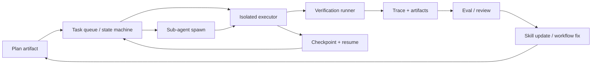
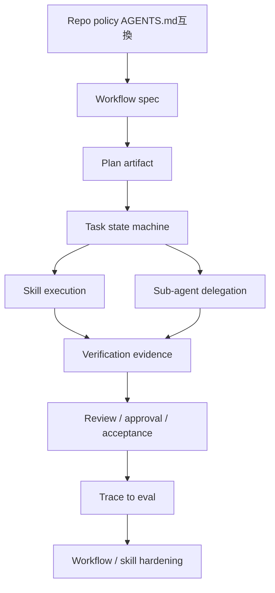

# SpecDock epic-00158 Agent Workflow PDCA Hardening 調査報告

## エグゼクティブサマリー

本調査の結論は明確です。現在の公開コーディングエージェント実装に共通する「長時間・長距離のソフトウェア開発ワークフロー」を安定化する鍵は、**モデル能力そのものではなく、ハーネス設計**にあります。特に繰り返し出てくるのは、**明示的な計画アーティファクト、分離された実行環境、永続化と再開、検証駆動のチェック工程、 repo-local な指示注入、サブエージェントのコンテキスト分離、そしてトレースから eval に繋ぐ改善ループ**です。SWE-agent 論文は ACI 設計が性能を大きく左右すると主張し、OpenHands SDK・LangGraph・Codex/Agents SDK・Claude Code・CrewAI などの公開実装も、別々の表現でほぼ同じ方向を取っています。 citeturn7search9turn19search1turn22search2turn23search0turn42search1turn35search11turn27search4

[一次情報] 実装詳細がもっとも厚いのは、**SWE-agent、OpenHands SDK、LangGraph/Deep Agents、Codex/Agents SDK、Claude Code、AutoGen、CrewAI**です。これらは設定、状態、再開、許可ゲート、サブエージェント、評価ループについて、少なくとも一部は公式 docs / repo / API reference で確認できます。対して **Cursor、Devin、Continue、Goose** は公開 docs が豊富でも、内部の実行ランタイムや永続化実装の詳細は限定的です。したがって SpecDock が参考にすべきなのは、「表面機能」よりも「公開された制御機構」です。 citeturn12search2turn19search1turn22search2turn30search5turn35search11turn25search1turn27search4turn17search1turn4search10turn15search2turn38search4

[推論] SpecDock の epic-00158 に直接 transferable なのは、次の五本柱です。
第一に、**workflow を会話ではなく state machine として扱うこと**。
第二に、**skill を prompt 断片ではなく、入出力・前提・検証・権限を持つ契約として定義すること**。
第三に、**sub-agent を共有会話の派生ではなく、独立コンテキストを持つ実行単位として扱うこと**。
第四に、**repo 指示、ユーザー指示、タスク指示、実行ポリシーの優先順位を明文化すること**。
第五に、**Check と Act をCI・trace・eval で閉じること**です。これらはそれぞれ、OpenHands の自動永続化、LangGraph の durable execution / interrupts、Codex の AGENTS.md / subagents / approvals、Claude Code の CLAUDE.md / hooks / subagents、CrewAI の checkpointing、Continue の PR checks、Aider の lint/test 連携に対応する公開パターンから導けます。 citeturn19search1turn22search0turn23search0turn30search8turn30search0turn31search2turn35search8turn35search7turn35search14turn27search4turn15search2turn21search1

[競合/更新注意] いくつかの資料は鮮度に注意が必要です。AutoGen は公式 GitHub README で maintenance mode と明記されています。一方で stable docs は state save/load や group chat resume を継続的に整備しています。OpenHands は 2025 の Cloud API blog と 2026 の V1 docs で API 表記が変わっており、現行仕様は docs 側を優先すべきです。OpenAI の Evals platform は 2026 年に段階的廃止予定で、eval の思想は有効でも、OpenAI Evals API 自体への依存は将来性が低いです。 citeturn5search10turn25search1turn39search7turn9search1turn42search3

[要検証] 逆に、公開 docs だけでは十分に分からない領域もあります。Cursor Cloud Agent の内部キューと checkpoint 実装、Devin の child session の実際の orchestration ポリシー、Claude Code や Cursor の内部 planning heuristics、Continue の長時間自律実行の実態は、公開 docs だけでは runtime behavior を断定できません。これらは採用判断ではなく、**PoC で検証すべき仮説**として扱うのが妥当です。 citeturn17search1turn17search6turn4search3turn4search10turn35search12turn15search2

**凡例**
**[一次情報]** 公開一次資料に直接書かれている事実
**[推論]** 複数の一次資料から導いた Deep Research 上の設計含意
**[競合/更新注意]** 現行仕様と競合しうる、または鮮度注意の情報
**[要検証]** SpecDock が issue planning 前に自前で確認すべき主張

## ソースマップと比較マトリクス

### ソースマップ

| 対象 | 主ソース | 日付 / 鮮度 | 何が分かるか | 証拠強度 | SpecDock への関係 |
|---|---|---|---|---|---|
| SWE-agent | 公式 docs の config/trajectory/history processor/custom tools、公式論文 citeturn12search2turn12search4turn12search20turn12search14turn7search9 | docs は日付不明・2026-06-05参照、論文は 2024 | 単一 YAML 設定、trajectory 再現、history 圧縮、tool 設計、ACI 重視 | 強 | workflow 契約・履歴圧縮・再現実験の雛形 |
| OpenHands | SDK docs の persistence / delegation / security / skills / PR review、Cloud API、公式 blog / repo / paper citeturn19search1turn19search0turn20search0turn20search1turn20search5turn9search1turn39search4turn20search12 | docs は日付不明・2026-06-05参照、blog は 2024–2026 | 自動永続化、イベント保存、サブエージェント、確認ポリシー、PR review、 multi-tenant 化 | 強 | SpecDock の workflow runtime と state 保存の直接参考 |
| Aider | 公式 docs の repo map / lint-test / git / commands / watch-files / leaderboards citeturn21search0turn21search1turn21search2turn21search20turn21search21turn13search1 | docs は日付不明・2026-06-05参照 | repo map、編集モード、git undo、lint/test 自動修復、IDE コメント駆動 | 強 | Check 工程と repo-context の設計に有効 |
| Continue | 公式 docs の config.yaml / checks / MCP / prompt caching citeturn14search0turn15search2turn15search4turn15search5 | docs は日付不明・2026-06-05参照 | config.yaml agent 定義、rules / tools / MCP、PR checks を repo に置く設計 | 中 | repo-local ルールと PR review の軽量設計に有効 |
| Goose | 公式 docs の projects / sessions / permissions / hints / persistent instructions / subagents / headless / CI/CD / ACP blog citeturn38search4turn38search13turn38search1turn16search2turn16search5turn38search14turn38search3turn38search11turn38search10 | docs/blog は 2025–2026 | working directory 単位の session 継続、permission modes、repo hints、headless automation | 中 | session resume と instruction layering の参考 |
| Claude Code | 公式 docs の memory / hooks / skills / sub-agents / settings / model config / SDK citeturn35search8turn35search7turn35search4turn35search14turn35search1turn35search12turn35search11 | docs は日付不明・2026-06-05参照 | CLAUDE.md と auto memory、deterministic hooks、permissionMode、hybrid planning model | 強 | instruction / hook / sub-agent 設計の最重要比較対象 |
| Cursor | 公式 docs の rules / plan mode / search / worktrees / cloud agent / headless CLI / analytics / hooks citeturn17search0turn17search6turn17search9turn17search11turn17search1turn17search5turn17search3turn17search7 | docs は日付不明・2026-06-05参照 | rules + AGENTS.md、reviewable plan、Explore subagent、worktrees、cloud/background 実行 | 中 | plan-before-code と isolated worktree の参考 |
| Devin | 公式 docs の automations / knowledge / release notes / review / DeepWiki / instructing guide citeturn4search10turn4search4turn4search3turn4search14turn4search8turn4search0 | docs/release notes は 2024–2026 | event-driven automation、knowledge / playbooks、child session structured JSON、CI-aware review | 中 | long-running ops / automations / review の public UI パターン |
| LangGraph / Deep Agents | official docs の overview / interrupts / workflows-agents / deep agents overview / comparison / changelog / agent server changelog citeturn22search2turn22search0turn5search5turn23search0turn23search1turn22search10turn22search6 | 2024–2026 | durable execution、interrupts、subagents、virtual FS、permissions、run queue、error recovery | 強 | SpecDock orchestration core の最有力参照系 |
| LangSmith / OpenAI Agents SDK | official docs の traces/evals/agent builder/cookbook/sandbox agents citeturn7search3turn7search7turn42search0turn42search1turn42search7turn42search9 | 2025–2026 | traces → feedback → eval → handoff、harness と sandbox の分離 | 強 | PDCA を閉じる trace/eval flywheel の参考 |
| AutoGen | stable docs の state / HITL / teams / code executors / MCP、repo README、AutoGenBench blog citeturn25search1turn25search4turn25search5turn26search1turn26search8turn25search8turn5search10turn43search0 | 2024–2026 | save/load state、termination-based pause/resume、Docker executor、tool intervention、MCP | 中 | state API と HITL の基本設計に有効 |
| CrewAI | official docs の checkpointing / flows / memory / processes / HITL / AGENTS.md / changelog citeturn27search4turn29search4turn29search19turn29search5turn29search6turn27search6turn27search1 | 2025–2026 | checkpointing、Flow state、hierarchical manager、memory、enterprise HITL | 中 | workflow checkpoint と manager-agent パターンの参考 |
| ベンチマーク | SWE-bench / SWE-bench Verified / OpenHands Index / RoadmapBench citeturn7search0turn7search8turn7search20turn7search2turn7search6turn7search10 | 2024–2026 | issue resolution から long-horizon までの評価軸 | 強 | SpecDock の regression harness 設計に必須 |

### 比較マトリクス

| フレームワーク | 計画 / PDCA | 状態 / 再開 | sub-agent / skill / 指示 | 実行隔離 / 権限 | 評価 / CI / HITL | 公開 docs の限界 |
|---|---|---|---|---|---|---|
| SWE-agent | YAML 設定で行動と履歴処理を制御。competitive runs では複数試行＋discriminator も公開。 citeturn12search2turn12search23 | trajectory 保存、config 同梱で exact rerun を支援。 citeturn12search4 | custom tools と history processors を設定で拡張。 citeturn12search14turn12search20 | Docker sandbox 前提。ACI 設計を重視。 citeturn12search8turn7search9 | ベンチ用途に強い。実運用 PR/HITL docs は薄い。 citeturn12search3turn7search9 | production orchestration や multi-tenant の公開実装は限定的。 |
| OpenHands SDK | conversation / skill / delegation / critic / iterative refinement を公開。 citeturn10view0turn19search0 | public field 変更を即時保存し、base_state と event files に分離。 pause/resume あり。 citeturn19search1turn20search3 | skills、file-based agents、sub-agent delegation。 citeturn20search1turn10view0 | confirmation policy と security analyzer、Docker / Apptainer / cloud workspace。 citeturn20search0turn10view0 | PR review、QA testing、benchmarks repo、OpenHands Index。 citeturn20search5turn7search14turn7search2 | 商用 cloud の内部 queueing は一部 blog 依存。 |
| Aider | architect/editor mode と manual task scoping。 citeturn21search20turn21search3 | 長時間 run の durable resume は限定的だが、git history と /undo が強い。 citeturn21search2 | repo map、manual file add、conventions file、watch-files。 citeturn21search0turn21search6turn21search14turn21search21 | 主にローカル git repo。 sandbox policy docs は薄い。 | lint/test 自動実行で Check を強化。 leaderboard も公開。 citeturn21search1turn13search1 | cloud orchestration や resumable state machine は主眼ではない。 |
| Continue | Plan より rules / checks 中心。 config.yaml で構成反復。 citeturn14search0 | 明示的 checkpoint/resume public docs は薄い。 | models / rules / MCP / docs を YAML で定義。 PR checks は repo-local markdown。 citeturn14search0turn15search2turn15search4 | MCP env で secrets 注入可能。 isolation 実装は利用側依存。 citeturn15search4 | GitHub status checks と suggested fix。 citeturn15search2 | 長時間自律 execution の runtime internals はほぼ非公開。 |
| Goose | Plan feature、RPI pattern、Ralph Loop など明示的 planning tutorial が豊富。 citeturn38search19turn38search6turn38search20 | projects / sessions / resume / fork を CLI で公開。 citeturn38search4turn38search13 | .goosehints、persistent instructions、subagents、recipes。 citeturn16search2turn16search5turn16search19turn38search21 | permission modes、Docker、headless、ACP。 citeturn38search1turn38search16turn38search10 | CI/CD tutorial、observability tutorials。 citeturn38search11turn16search6 | 内部 executor / queue / persistence 形式の詳細は限定的。 |
| Claude Code | plan mode 向け model alias、公表された long-running guardrails は hooks と memory の組合せ。 citeturn35search12turn35search7 | auto memory と remote control はあるが、完全な checkpoint serialization public docs は薄い。 citeturn35search8turn35search16 | CLAUDE.md、skills、custom subagents、settings scopes。 citeturn35search8turn35search4turn35search14turn35search1 | sandbox settings、allow/deny、PreToolUse hook。 citeturn35search0turn2search11 | hooks による deterministic control。 PR/CI 公開 docs は限定。 citeturn35search7 | 内部 orchestration heuristics や persistence 実装は非公開。 |
| Cursor | reviewable Plan Mode と Explore subagent を前面に出す。 citeturn17search6turn17search9 | cloud agent / headless CLI はあるが、checkpoint details は非公開。 citeturn17search1turn17search5 | Rules + AGENTS.md、search tools、worktrees。 citeturn17search0turn17search11 | worktrees による隔離、hooks。 citeturn17search11turn17search7 | analytics あり。 CI/headless は docs あり。 citeturn17search3turn17search5 | runtime / permissions / queue internals の実装公開が薄い。 |
| Devin | Automations と Knowledge / Playbooks による継続運用。 citeturn4search10turn4search0turn4search4 | sleeping session 再起動、child session structured JSON、pin sessions。 citeturn4search3 | Knowledge、Playbooks、DeepWiki、child sessions。 citeturn4search4turn4search0turn4search8 | enterprise secrets、MCP allowlist、build pinning。 citeturn4search3 | Devin Review、CI logs in review chat、auto-fix。 citeturn4search14turn4search3 | 実際の orchestration / diff merge / isolation 実装はほぼ非公開。 |
| LangGraph / Deep Agents | explicit workflow/agent distinction、write_todos、interrupts。 citeturn5search5turn22search0turn23search0 | durable execution、persistence、time travel / interrupt resume。 citeturn22search2turn22search0 | subagents、virtual FS、skills、memory。 citeturn23search0turn22search5 | permissions、sandboxes、pluggable backends。 citeturn23search0turn23search1 | LangSmith traces/evals、durable run queue。 citeturn7search3turn22search6 | coding-agent 固有 UX ではなく runtime/harness 寄り。 |
| OpenAI Codex / Agents SDK | AGENTS.md、skills、subagents、workflow cookbook、long horizon guidance。 citeturn30search8turn45search0turn30search0turn30search5turn6search4 | MCP server で session 継続、Responses/sandboxes 系は long-running 前提。 citeturn30search5turn42search9 | AGENTS.md、skills、subagents、MCP。 citeturn6search10turn45search1turn30search0 | OS-enforced sandbox、approval policy、auto-review、protected paths。 citeturn31search2turn31search6turn31search7 | traces→feedback→eval→handoff cookbook、GitHub review。 citeturn42search1turn30search15 | 一部 docs は速く更新されるため changelog 追従が必要。 |
| AutoGen | group chat / orchestrator / termination 条件。 citeturn25search2turn25search5 | save_state/load_state、run 再開、team state caution。 citeturn25search1turn25search3turn25search7 | teams、custom agents、MCP tools。 citeturn25search9turn25search8 | Docker code executor、intervention approval。 citeturn26search1turn26search4turn26search8 | AutoGenBench。 citeturn43search0 | framework は現行だが repo は maintenance mode。戦略採用は慎重に。 citeturn5search10 |
| CrewAI | Flow state、hierarchical manager、planning flag。 citeturn27search3turn29search2turn29search15 | checkpointing で crew/flow/agent resume。 citeturn27search4turn28search8 | memory、knowledge、AGENTS.md、coding tools。 citeturn29search19turn27search6 | guardrails / HITL / apps/actions の docs あり。 citeturn27search0turn27search7 | observability baked in、enterprise HITL。 citeturn27search0turn27search1turn28search7 | 詳細な runtime internals より framework abstraction が中心。 |

[推論] 比較すると、**実運用向けに最も再利用価値が高い設計思想**は「OpenHands + LangGraph/Deep Agents + Codex/Agents SDK + Claude Code」の重なりです。これらは、単に“できる”ではなく、**state、permissions、subagents、instruction loading、trace/eval**を別々の制御面として明示しているためです。Aider、Continue、Goose、Cursor は運用 UX や軽量導入に強い一方、内部ランタイムの説明密度は相対的に低く、SpecDock のコア設計には補助的参照として扱うのが安全です。 citeturn19search1turn23search0turn30search5turn35search11turn21search1turn15search2turn38search4turn17search1

## 長時間ワークフローの共通アーキテクチャパターン

### 共通アーキテクチャ

[一次情報] 公開実装の多くは、**オーケストレーション層**と**実行環境層**を分離しています。LangGraph の Sandbox Agents は、ハーネスが trusted services と状態管理を持ち、sandbox が stateful execution を担当する構造を明示しています。Codex もローカルでは OS-enforced sandbox を前提に approvals と sandbox mode を別 knobs として扱います。OpenHands も SDK / conversation / workspace / remote agent server を分離し、Cloud API では `WAITING_FOR_SANDBOX`、`PREPARING_REPOSITORY`、`SETTING_UP_SKILLS`、`READY` の起動状態を返します。 citeturn42search9turn31search2turn9search1turn10view0

[推論] SpecDock でも **「技能を選ぶ頭脳」「コードを触る箱」「検証する装置」**を一体化しない方がよいです。実装上は、少なくとも以下を分離した方がよいです。
**workflow controller**、**workspace executor**、**skill registry**、**state store**、**approval/security policy**、**verification runner**、**trace/eval sink**。この分離がないと、resume・権限制御・CI 再現・sub-agent 並列化のいずれかで破綻しやすくなります。これは LangGraph の runtime 分離、OpenHands の event/base state 分離、Codex の approvals と sandbox の分離、Claude Code hooks の deterministic enforcement から導かれます。 citeturn22search2turn19search1turn31search10turn35search8turn35search7

この図は [推論] ですが、要素自体は公開実装に対応しています。write_todos や plan mode は A/B、sandbox/worktree は C、lint/test/PR checks は D、traces/evals は E/F、skills/AGENTS.md は G に相当します。 citeturn23search0turn17search6turn21search1turn15search2turn42search1turn45search2

### repo-context と instruction-loading のパターン

[一次情報] repo-local instruction loading は 2025–2026 の公開実装でかなり収束しています。Codex は `AGENTS.md` を repo-local instruction として自動注入し、working directory から project root まで探索して `.codex/` と組み合わせます。Claude Code は `CLAUDE.md` と auto memory を会話開始時にロードしますが、これらは「強制ポリシー」ではなく context であり、確実に止めたいなら PreToolUse hook を使うよう明示しています。Cursor は Project / Team / User Rules と `AGENTS.md` を persistent instructions として扱います。Goose は `.goosehints` を session start 時に読み、persistent instructions を毎ターン再注入します。CrewAI も coding tools guide で `AGENTS.md` を repo root の source of truth とすることを推奨しています。 citeturn6search10turn30search12turn30search8turn35search8turn2search11turn17search0turn16search2turn16search5turn27search6

[一次情報] OpenHands は skills を structured prompts と keyword triggers として扱い、Continue は `config.yaml` に models / context / rules / prompts / docs / MCP servers を定義します。Aider は repo map と必要ファイルの明示追加を中心にし、必要なら conventions file や `/read` で追加コンテキストを与える設計です。Devin は Knowledge と Playbooks を分け、Knowledge を cross-session な一般文脈、Playbooks を step-by-step procedure に使うよう案内しています。 citeturn20search1turn14search0turn21search0turn21search6turn21search14turn4search0turn4search4

[推論] SpecDock では instruction-loading を少なくとも四層に分けるべきです。
**global operator policy**、**repo policy**、**workflow/skill policy**、**task-local instructions**。そして repo policy は `AGENTS.md` 互換に寄せる価値があります。理由は、Codex・Cursor・CrewAI がすでに `AGENTS.md` を採用し、Continue は MCP JSON 互換を Claude/Cursor/Cline から取り込めるため、**instruction asset の可搬性**が今後の実務価値になる可能性が高いからです。 citeturn27search6turn17search0turn30search8turn15search4

### planning、state、handoff、resume のパターン

[一次情報] planning については、Cursor の Plan Mode が「コードを書く前に reviewable な実装計画」を生成し、Deep Agents は `write_todos` tool を built-in で持ち、Goose は dedicated planner model と Plan feature を公開し、CrewAI は hierarchical process で manager agent / manager LLM を要求します。AutoGen の Magentic-One も orchestrator agent が plan を作り動的に修正すると説明しています。 citeturn17search6turn23search0turn38search19turn29search2turn29search10turn25search0

[一次情報] state / resume については、OpenHands SDK が `base_state.json` と append-only `events/event-*.json` を自動保存し、`conversation.pause()` と再 `run()` を公開しています。LangGraph は interrupt 時に graph state を persistence layer に保存し、外部入力を待って再開できます。AutoGen は agents / teams / termination conditions の `save_state()`/`load_state()` を持ち、v0.4 では group chat object をそのまま再 run して再開できます。CrewAI は `Crew.from_checkpoint()` で途中から再開し、JSON provider と SQLite provider を用意しています。OpenHands Cloud API の起動状態や Goose の project/session resume も、workflow を「会話ログ」ではなく「中断可能な実行」として扱っている証拠です。 citeturn19search1turn20search3turn22search0turn25search1turn25search7turn27search4turn28search8turn9search1turn38search4turn38search13

[一次情報] handoff についても共通項があります。Codex subagents は specialized agents を並列起動し結果を collected response に統合し、サブエージェントは親の sandbox policy を継承します。OpenHands の DelegateTool は sub-agent ごとに独立 conversation context を持ちつつ、同じ workspace 上で並列実行し、結果を consolidated observation として返します。AutoGen は handoff termination や external termination を使って team から application に制御を戻します。Devin release notes では child sessions が automation workflow 用 structured JSON を返せるようになったと説明しています。 citeturn30search0turn6search3turn19search0turn25search4turn25search5turn4search3

[推論] SpecDock に必要なのは「handoff message」ではなく **handoff contract** です。最低でも、**task id、目的、前提、許可ツール、許可パス、期待成果物、検証コマンド、終了条件、summary schema** を持つべきです。公開実装では OpenHands child/sub-agent、Codex subagents、AutoGen termination condition がそれぞれ別の形でこれを表現していますが、SpecDock はこれを統一 schema にした方が強いです。 citeturn19search0turn30search0turn25search4

## 実行制御、サンドボックス、権限、監視

### tool execution、sandboxing、permission gates のパターン

[一次情報] destructive な作業を長時間任せる系の公開ハーネスは、ほぼ例外なく **sandbox + approval** を別レイヤーで持ちます。Codex docs は、デフォルトで network access が off であり、OS-enforced sandbox が通常は current workspace に制限し、approval policy がいつ停止して許可を求めるかを制御すると述べています。`approvals_reviewer=auto_review` も sandbox boundary 自体は変えません。Claude Agent SDK reference は sandbox の filesystem/network 設定、excluded commands、unsandboxed fallback を公開しています。OpenHands は `AlwaysConfirm` / `NeverConfirm` / `ConfirmRisky` と security analyzer を分けています。Goose は permission modes を持ち、manual / smart approval では tool call ごとに Allow/Deny が出ます。AutoGen は Docker executor を推奨し、tool execution を intervention handler や approval_func で止められます。 citeturn31search2turn31search6turn35search0turn20search0turn38search1turn26search1turn26search8

[一次情報] 並列実行で共有 repo を直接触ると統合時に壊れやすい、という点も公開資料で繰り返し強調されます。Cursor は isolated Git worktrees を docs で前面に出し、OpenHands 系の async software engineering blog では、CAID が git worktrees / branches / merges / tests を coordination primitive として使うことを説明しています。人間のソフトウェア開発で使う primitives をそのまま multi-agent coordination に写す、という考え方です。 citeturn17search11turn39search1

[推論] SpecDock では sub-agent 並列化を入れるなら、**共有 workspace 並列編集**よりも **worktree / branch / patch artifact** のいずれかを標準にした方がよいです。OpenHands DelegateTool のような「同一 workspace + 独立 conversation context」は簡便ですが、SpecDock が長時間 SWE に寄るほど、Git primitive を harness primitive に昇格させる価値が上がります。これは Cursor worktrees と CAID の双方が示唆しています。 citeturn17search11turn39search1

### 失敗モード、再試行、秘密情報、監視とスケール

[一次情報] 長時間ワークフローの失敗モード対策は、単なる try/retry ではなく **checkpoint / alternate model / context compaction / stuck detection / background queue** に分かれています。OpenHands docs index には LLM fallback strategy、stuck detector、parallel tool execution、observability & tracing が並びます。LangGraph v1.2.0 changelog は node execution の timeout・error recovery・graceful shutdown を追加したと述べます。OpenHands 2024 cloud blog は multi-tenant 化のために in-memory state をやめ、どの instance が死んでも新しい instance に reconnect できるようにしたと説明しています。 LangSmith Agent Server changelog は durable run queue を Postgres polling から Redis に移して負荷を下げたと書いています。 citeturn10view0turn22search10turn39search4turn22search6

[一次情報] 秘密情報の扱いでは、Codex docs export が cloud secrets は setup 中のみ利用可能で agent phase 前に削除されると説明し、Continue の MCP config は `env` に secrets を注入できます。Devin release notes では enterprise-level secrets、MCP allowlist、build pinning が公開されています。 citeturn6search16turn15search4turn4search3

[推論] SpecDock で最低限必要なのは、**retry** ではなく **failure taxonomy** です。具体的には、`model_error`、`tool_error`、`sandbox_error`、`verification_failed`、`approval_denied`、`stuck`、`integration_conflict`、`instruction_conflict`、`context_overflow` を区別し、それぞれに resume / repair policy を持つべきです。OpenHands・LangGraph・Codex・AutoGen の公開実装は名前こそ違え、この粒度で系を分けています。 citeturn19search1turn22search10turn31search2turn25search3

## 評価、CI、回帰ハーネス、人間レビュー

### evaluation、CI、benchmark、regression harness のパターン

[一次情報] 公開実装の reliable workflow は、ほぼ必ず **“Check” を外部化**しています。Aider は変更のたびに lint/test を自動で走らせます。Continue は `.continue/checks/` の markdown を GitHub status checks に変え、失敗時に suggested fix を提示します。OpenHands は PR review workflow を公開し、2〜3 分で code quality / security / best practices をレビューするとしています。Codex は GitHub pull request review の use case を公開し、regressions / missing tests / docs issues を surface すると説明しています。OpenAI の cookbook は traces から human/model feedback を集めて Promptfoo eval に変換し、Codex-ready handoff に繋ぐ improvement loop を示しています。LangSmith は datasets / evaluators / offline/online evaluation フローを公開しています。 citeturn21search1turn15search2turn20search5turn30search15turn42search1turn7search3

[一次情報] ベンチマーク側も短期課題から長期課題へ広がっています。SWE-bench は 2,294 件の GitHub issue / PR ベース問題で、SWE-bench Verified はそのうち 500 件の human-validated subset です。OpenHands Index は issue resolution、greenfield apps、frontend development、software testing、information gathering の五タスクで ability / cost / runtime を見るとしています。RoadmapBench は 17 repos・5 languages・115 long-horizon coding tasks で、中央値 3,700 行 / 51 ファイルの変更を要求します。Aider leaderboard は 225 の Exercism exercises を six languages で試します。AutoGenBench も benchmark download / run / reporting を担う standalone tool として公開されました。 citeturn7search0turn7search20turn7search2turn7search6turn7search10turn13search1turn43search0

[競合/更新注意] OpenAI Evals API そのものは 2026 年に read-only / shutdown 予定です。つまり、**eval 文化は採るべきだが、特定ベンダの eval substrate への依存は避けるべき**です。OpenAI 自身も Cookbook では Promptfoo に変換するループを示しています。 citeturn42search3turn42search1

[推論] SpecDock の regression harness は、少なくとも三層にすべきです。
**skill-level eval**、**workflow-level replay**、**repo-level gated verification** です。
skill-level は「その skill を正しく呼んだか」「期待コマンドを実行したか」。workflow-level は「checkpoint を跨いでも完了するか」。repo-level は「tests/lint/typecheck/PR checks を通るか」。これは OpenAI の skill eval blog、OpenHands / Continue / Aider の検証パターンからほぼ直接導けます。 citeturn45search2turn20search5turn15search2turn21search1

### PR review と human-in-the-loop のパターン

[一次情報] HITL の公開パターンは二系統あります。ひとつは **permission/HITL as safety gate**。LangGraph interrupts、Claude Code hooks / PreToolUse、OpenHands confirmation policy、AutoGen intervention / handoff termination がこれに当たります。もうひとつは **PR/review/HITL as quality gate**。Continue checks、OpenHands PR review、Codex GitHub review、Devin Review、CrewAI Flow HITL Management がこれに当たります。 citeturn22search0turn35search8turn35search7turn20search0turn26search8turn25search4turn15search2turn20search5turn30search15turn4search14turn28search7

[一次情報] Devin release notes は review chat で CI status と logs を見られること、sleeping session を retrigger で起こせること、auto-fix with Devin を出すことを示しています。これは「人間レビューの場」と「修正アクションの起点」を同じ surface に置く設計です。OpenHands の PR review も customize 可能な review guidelines を示します。Continue checks は failing check から fix を accept/reject できます。 citeturn4search3turn4search14turn20search5turn15search2

[推論] SpecDock では human-in-the-loop を一つの概念にまとめない方がよいです。**approval gate**、**review gate**、**acceptance gate** を分けるべきです。approval は destructive action 前、review は change proposal 後、acceptance は verification evidence が揃った後です。これを分けないと、“人が見た”ことと“本当に通す条件を満たした”ことが混ざります。 citeturn20search0turn30search15turn15search2turn4search14

## SpecDock への移植方針、リスク、候補 issue

### SpecDock に移せる設計提案

[推論] SpecDock に対して最も安全で再利用価値が高い提案は、以下の順序です。いずれも **採用前に PoC と verification checklist を通すこと**が前提です。

**提案の中核**
SpecDock は「prompt を良くする」より先に、**workflow contract を厳格化**するべきです。具体的には、workflow ごとに plan artifact、task state、checkpoint、verification evidence、handoff schema、approval policy、trace id を持たせます。skills は「呼ばれる知識」ではなく **検証可能な作業ユニット**として定義し、sub-agent は **並列 worker** ではなく **独立会話・独立ポリシー・独立成果物を持つ delegation runtime** として扱います。これは OpenHands、LangGraph、Codex、Claude Code の重なりから見て、最も堅い方向です。 citeturn19search1turn23search0turn30search5turn35search11

**SpecDock で優先すべき transferable patterns**

1. **append-only event log + materialized snapshot**
   OpenHands の base state + events、LangGraph の persistence、CrewAI checkpointing が示す通り、会話全体を一塊で保存するより、イベント列と最新状態を分けた方が resume・監査・差分 replay に強いです。 citeturn19search1turn22search0turn27search4

2. **plan artifact を first-class にする**
   Cursor plan mode、Deep Agents `write_todos`、Goose Plan、CrewAI hierarchical manager は、長時間 run で plan を隠し状態にしない方が安定することを示します。 citeturn17search6turn23search0turn38search19turn29search2

3. **repo-local instruction layering**
   AGENTS.md / CLAUDE.md / rules / .goosehints / skills を見れば、ツールごとの名称は違っても pattern は同じです。SpecDock は AGENTS.md 互換の repo policy と、workflow-local policy を分けて扱うべきです。 citeturn30search8turn35search8turn17search0turn16search2turn20search1

4. **sub-agent は独立 context + 明示 handoff**
   Codex、OpenHands、Deep Agents はサブエージェントで context isolation を重視しています。SpecDock も parent conversation に計画と統合だけを残し、worker には task-bound context を渡すべきです。 citeturn30search0turn19search0turn23search0

5. **権限は policy で、記憶は context で、強制は hook/gate で**
   Claude Code memory docs は記憶は context であって enforcement ではないと書いています。ここを混同しないのが重要です。SpecDock でも「知識」「推奨」「禁止」を別メタデータに分けるべきです。 citeturn35search8turn35search7

6. **Check を repo 外でなく repo 内に置く**
   Continue checks や Aider lint/test は、検証コマンドが repo と一緒に動く方が durable です。SpecDock の skill 定義にも `verify` を持たせるべきです。 citeturn15search2turn21search1

7. **trace → feedback → eval → workflow fix を閉じる**
   OpenAI cookbook と LangSmith、OpenHands benchmarks は、この loop を公開しています。SpecDock も production failure を issue 化して終わらせず、再現シナリオと skill/workflow tests に落とす必要があります。 citeturn42search1turn7search3turn7search14

### アンチパターンとリスク

[推論] SpecDock が避けるべきアンチパターンは次の通りです。

**ひとつの巨大会話に全部を押し込むこと。**
LangGraph / Deep Agents、OpenHands、Goose、Claude Code がいずれも context condensation・subagents・memory layering を持つ時点で、単一 thread に依存する設計は時代遅れです。 citeturn20search2turn23search0turn16search5turn35search8

**shared mutable workspace で並列編集すること。**
CAID と Cursor worktrees が示すとおり、統合失敗は後からしか見つからないことが多いです。 citeturn39search1turn17search11

**approval を唯一の安全策にすること。**
Claude Code hooks や OpenHands security analyzer のように、policy と analyzer を分けるべきです。人間が毎回見る運用はスケールしません。 citeturn35search7turn20search0

**save_state の整合条件を軽視すること。**
AutoGen は team が running 中の `save_state()` は不整合になりうると明記しています。checkpoint timing を設計しない resume は危険です。 citeturn25search3

**ベンチマークの pass rate を実運用 reliability と誤認すること。**
SWE-bench Verified は重要ですが短中期 issue resolution 中心であり、RoadmapBench のような long-horizon bench は別物です。OpenHands Index も ability/cost/runtime を同時に見ます。単一数字の追跡は危険です。 citeturn7search20turn7search10turn7search2

**特定ベンダの eval substrate にロックインすること。**
OpenAI Evals platform の廃止予定は、そのリスクを示しています。 citeturn42search3

### epic-00158 向け candidate follow-up issues

| タイトル | 問題 | ソース根拠 | 影響しそうな docs / assets | 受け入れ証拠 |
|---|---|---|---|---|
| ワークフロー実行ログを event log + snapshot に分離する | 現在の workflow 状態が会話依存だと、途中再開・監査・部分 replay が弱くなる | OpenHands は base state と append-only events を分離し自動保存、LangGraph は durable execution / interrupts、CrewAI は checkpoint resume を提供する。 citeturn19search1turn22search0turn27search4 | workflow runtime spec、state store schema、execution trace docs | プロセス kill 後に同一 workflow_id で resume し、二重実行なく次の未完了 step から継続できる |
| plan artifact と todo state machine を first-class 化する | 「考えたが残らない」設計では PDCA の P と C が曖昧になり、後続修正も追跡不能になる | Cursor Plan Mode、Deep Agents `write_todos`、Goose Plan、CrewAI hierarchical manager は plan を作業面に出している。 citeturn17search6turn23search0turn38search19turn29search2 | workflow schema、planning UI/CLI、ADR | 各 run に plan artifact、task ids、status transitions、abandon reason が残る |
| AGENTS.md 互換の repo policy 層を導入する | repo-specific conventions が task prompt に埋没すると再利用性が低く drift しやすい | Codex、Cursor、CrewAI は AGENTS.md、Claude Code は CLAUDE.md、Goose は .goosehints を使う。 citeturn30search8turn17search0turn27search6turn35search8turn16search2 | repo policy docs、skill loading docs、CLI/runner config | global / repo / workflow / task の優先順位表と、ロードされた instruction tree の可視化がある |
| skill を prompt 断片でなく実行契約にする | skill が自然言語説明だけだと、呼び出し条件・検証・権限が曖昧で hardening できない | OpenHands skills は structured prompts、OpenAI skills は reusable/versioned instructions、Continue checks や Aider lint/test は検証可能な単位として扱える。 citeturn20search1turn45search1turn15search2turn21search1 | skill schema、skill registry、authoring guide | skill に inputs、preconditions、allowed tools、verify commands、expected artifacts、failure codes がある |
| sub-agent handoff schema と isolation policy を定義する | delegation が自由文だけだと context pollution と責務の曖昧化が起きる | Codex / OpenHands / Deep Agents / AutoGen は sub-agent や handoff termination を持つ。 citeturn30search0turn19search0turn23search0turn25search4 | delegation docs、sub-agent runtime、handoff payload schema | sub-agent run は独自 run_id / summary / artifacts / verification result を返し、親 run に統合される |
| risky action 用の approval policy と security analyzer を分離する | 「全部承認」か「全部自動」の二択では安全性と速度が両立しない | Codex は approvals と sandbox を分離、OpenHands は confirmation policy と analyzer を分離、Claude hooks は deterministic stop を提供。 citeturn31search2turn20search0turn35search7 | policy docs、security model、approval UI | destructive/network/secret/path-escape の各カテゴリに別 policy があり、ログ上で理由が追える |
| worktree / patch-based 並列実行を検証する | shared workspace 並列編集は integration conflict を増やす | Cursor worktrees と CAID/OpenHands blog は git worktrees/branches/merges/tests を coordination primitive として使う。 citeturn17search11turn39search1 | workspace strategy docs、git integration、sub-agent executor | 同一 repo で並列 sub-agent を走らせても file overwrite race が起きず、merge/test で統合できる |
| trace から eval を生成する improvement loop を追加する | 失敗事例が issue だけで終わると、同種の失敗が繰り返される | OpenAI cookbook は traces→feedback→Promptfoo eval→Codex handoff を示し、LangSmith は datasets/evaluators を提供する。 citeturn42search1turn7search3 | observability docs、eval dataset、regression harness | 失敗 run から replay case と rubric が自動生成され、次回 CI に組み込まれる |
| repo-local verification harness を skill/workflow に紐付ける | 完了判定がモデル自己申告だと false positive が増える | Aider lint/test、Continue PR checks、OpenHands PR review、Codex GitHub review がすべて外部検証を使う。 citeturn21search1turn15search2turn20search5turn30search15 | verify command docs、CI integration、PR review docs | workflow 完了条件にテスト・lint・typecheck・repo checks の evidence が必須化される |
| monitoring と failure taxonomy を定義する | 失敗理由が「agent failed」に潰れると PDCA の Act が設計できない | LangGraph は timeout/error recovery、OpenHands は metrics/tracing pages と startup statuses、LangSmith は tracing/evaluation、CrewAI は observability を前提化している。 citeturn22search10turn9search1turn7search11turn27search0 | telemetry schema、dashboard、run reason enum | failure reason が taxonomy 化され、time-to-resume / stuck rate / approval denial rate を計測できる |

### 実装前 verification checklist

[要検証] 以下は採用前に SpecDock 自身で確認すべき最低チェックです。各項目は上記の公開パターンから導かれるもので、未確認のまま設計固定すべきではありません。 citeturn19search1turn22search0turn31search2turn20search0turn42search1turn39search1

| チェック項目 | 何を確認するか | 合格条件 |
|---|---|---|
| resume の整合性 | process kill / host restart / manual pause の各ケースで再開できるか | 未完了 step だけが再実行され、二重 side effect がない |
| handoff の再現性 | sub-agent の成果が要約だけでなく構造化 payload で戻るか | task id・artifact・verification を親が機械読解できる |
| instruction precedence | global / repo / workflow / task の衝突時にどれが勝つか | 文書化された precedence と実行時 preview がある |
| destructive action control | rm / git push / network / secret access をどう止めるか | policy ごとの deny/approve/auto-review が選択可能 |
| verification determinism | 同じ artifact に対して同じ verify result を返しやすいか | repo-local command / rule に基づいて判定できる |
| parallel isolation | 並列エージェントが同一ファイルを安全に扱えるか | worktree / patch / lock strategy のいずれかがある |
| trace completeness | 誰が何を実行し何で失敗したか追えるか | run / child run / tool call / approval / test result が繋がる |
| eval regeneration | production failure を再現テストにできるか | one-click で replay case / rubric / fixture が作れる |
| secrets boundary | secret が prompt 層に漏れず executor だけで消費されるか | logs / traces / artifacts に raw secret が出ない |
| benchmark relevance | epic-00158 に対し短期 benchmark だけを見ていないか | long-horizon replay case を自前で揃えている |

## 出典一覧、未解決点、次の調査枝

### 出典一覧

本報告の主要一次資料は、OpenAI・Anthropic・LangChain・OpenHands・Microsoft AutoGen・CrewAI・Aider・Continue・Goose・Cursor・Devin の公式 docs / official repo / official blog / release notes / papers です。特に基礎設計の裏付けとして強く依拠したのは、SWE-agent 論文、OpenHands SDK docs、LangGraph/Deep Agents docs、Codex docs と cookbook、Claude Code docs、AutoGen stable docs、CrewAI checkpointing docs、Continue checks docs、Aider lint/test and repo map docs です。 citeturn7search9turn19search1turn23search0turn30search5turn42search1turn35search11turn25search1turn27search4turn15search2turn21search1turn21search0

評価・ベンチマークについては、SWE-bench / SWE-bench Verified、OpenHands Index、RoadmapBench、AutoGenBench、Aider leaderboard を主に参照しました。これらは「どの仕組みがありそうか」を示す補助にはなりますが、**SpecDock の設計入力としては benchmark score そのものより、評価軸・再現手順・artifact 保存方式**の方が重要です。 citeturn7search0turn7search20turn7search2turn7search10turn43search0turn13search1

### 不確実性と次の調査枝

[不確実性] 現時点で公開情報だけでは、**Cursor Cloud Agent、Devin の orchestration internals、Claude Code / Cursor の内部 planner heuristics、Continue の長時間自律実行 runtime**を断定できません。これらは public feature docs はある一方、queue / checkpoint serialization / retry policy / merge conflict policy の低レベル資料が不足しています。 citeturn17search1turn4search10turn35search12turn15search2

[競合/更新注意] AutoGen は stable docs が更新されている一方で repo は maintenance mode です。OpenAI の Evals platform は 2026 年に read-only / shutdown 予定です。OpenHands は旧 blog と現行 V1 docs が混在します。したがって実装採用時は「古い blog の convenience API」より「現行 docs / changelog / repo」を優先すべきです。 citeturn5search10turn42search3turn39search7turn9search1

[推奨される次の research branch] 次段階で価値が高いのは、**公開 docs 比較**から **小型 PoC 比較**への移行です。具体的には、
**checkpoint/replay correctness の比較 PoC**、
**worktree vs shared workspace の conflict rate 比較**、
**repo-local AGENTS.md 互換仕様の設計案比較**、
**skill contract に verify / approval / artifact fields を持たせた時の authoring cost**、
**trace から replay eval を自動生成する最小実装** の五つです。これらは本報告の推論を SpecDock 固有の実証データに変えるための、最小の次枝です。根拠となる公開パターンはすでに揃っており、残るのは SpecDock 文脈での検証です。 citeturn19search1turn39search1turn30search8turn45search2turn42search1