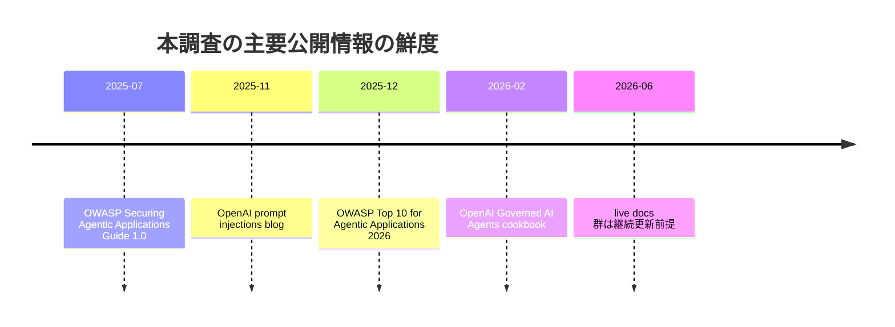
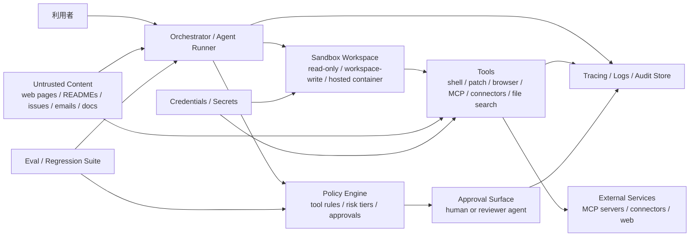

# SpecDock epic-00158 Agent Workflow PDCA Hardening 公開情報ベース調査報告

## Executive summary

本調査で最も強い結論は、Codex 系の coding-agent harness を安全かつ監査可能にする中心設計は、**モデル能力の強化ではなく、境界・承認・証跡・再実行可能性の分離**にある、という点です。公開一次情報では、OpenAI Codex はサンドボックス境界、コマンド prefix ルール、承認ポリシー、ネットワーク allowlist、HTTP method 制限、Auto-review、作業ログ保持を明示しており、Agents SDK は `needs_approval`、`RunState` の永続化、`new_items`/`interruptions`/guardrail 結果/trace processor を提供しています。OWASP も、外部データを常に非信頼として扱うこと、最小権限、メモリ隔離、人間承認、包括的監視を中核防御として推奨しています。つまり、SpecDock で再利用価値が高いのは「許可する処理の精密化」と「承認・証跡・再開の一貫性」であり、「なんとなく安全そうなモデル挙動への期待」ではありません。 citeturn8view1turn8view2turn11view0turn24view0turn25view0turn37view0turn35view1

特に重要なのは、**隠れた推論を記録しなくても十分なレビュー証跡は作れる**という点です。Codex Auto-review は、レビュー対象として「ユーザーメッセージ、表出したアシスタント更新、関連ツール呼び出しと出力、承認対象アクション」を扱い、**hidden assistant reasoning は含めない**と明記しています。一方で Agents SDK は、`new_items` に agent/tool/handoff/approval metadata、`interruptions` に保留承認、`to_state()` に再開可能スナップショット、guardrail 結果配列に入力・出力・ツール検査結果を持たせています。したがって、SpecDock のレビュー証跡は「非表示 CoT を保存する」方向ではなく、「表出済み根拠、正規化済み tool 引数、承認判断、差分、検証コマンド、trace id」を保存する方向が妥当です。 citeturn11view0turn23view1turn23view2turn20view0

高リスク項目として独立検証が必要なのは少なくとも五つあります。第一に、**Auto-review を人間承認の代替にどこまで使うか**です。OpenAI 自身が「deterministic security guarantee ではない」と明示しているため、破壊的操作・機密送信・外部書き込みの最終承認を完全自動化する設計は、SpecDock 側のセキュリティレビューを必須とすべきです。第二に、**trace の既定値で機微データが含まれる**点です。Agents SDK では `trace_include_sensitive_data` が既定で `True` です。第三に、**MCP/connector は第三者保持・居住地制約を OpenAI 側が肩代わりしない**点です。第四に、**Rules と Sandbox Agents は実験的/ベータ**であり、仕様変化を前提にすべきです。第五に、**Prompt injection は OpenAI 自身が frontier challenge と位置づける未解決問題**であり、単一の guardrail で解決できる前提は危険です。 citeturn11view0turn22view1turn33view0turn8view3turn26view0turn26view1turn32view0turn35view1

SpecDock へ移植しやすい公開ベストプラクティスを要約すると、**非信頼コンテンツの隔離、書き込み系ツールの exact-action 承認、コマンド allow/prompt/forbidden ルール、ネットワークの domain+method 最小化、ワークスペース外アクセスの明示 grant、trace の機微データ抑制、checkpoint と approval state の永続化、そして「evaluate what you deploy」式のセキュリティ回帰テスト**です。これは広義の PDCA hardening と整合し、Plan ではリスク階層と policy-as-code、Do では境界と承認実装、Check では traces/evals/log review、Act では allowlist/guardrail/policy の反復更新という構造になります。 citeturn15view0turn15view5turn15view6turn24view4turn25view0turn13view5turn37view0turn38view1

## Source map and freshness

本報告は、**公開 Web の一次資料を優先**し、OpenAI 公式 docs / cookbook / SDK docs、OWASP 公式ガイド、OpenTelemetry 公式 docs、LangSmith/LangGraph 公式 docs を主軸に構成しました。なお、OpenAI の live docs は多くが明示日付を持たないため、鮮度判定は「明示日付あり」か「undated live docs」として扱っています。以下の freshness 列の一部は、資料の明示日付に加え、**本調査による鮮度評価**を含みます。 citeturn14view0turn32view0turn35view2turn35view3turn20view0turn26view0

### Source map

| Source | Date and freshness | Surface covered | Evidence strength | Relevance to SpecDock |
|---|---|---|---|---|
| OpenAI Codex 「Agent approvals & security」および関連サンドボックス docs citeturn3view0turn4view0turn5view0turn6view0 | undated live docs、現行仕様だが一部 open-source 実装依存 | approval policy、sandbox mode、ネットワーク既定、OS sandbox | 強い一次資料 | 承認・サンドボックス設計の基準面 |
| OpenAI Codex 「Rules」 citeturn7view0turn8view1turn8view2turn8view3 | undated live docs、**experimental** 明記 | コマンド allow/prompt/forbidden、prefix ルール、shell smuggling 対策 | 強い一次資料だが変更リスクあり | Shell 実行ポリシーの直接参照元 |
| OpenAI Codex 「Auto-review」 citeturn11view0 | undated live docs、current open-source implementation 言及あり | reviewer agent、hidden reasoning 非保存、circuit breaker、denial/override | 強い一次資料 | 承認自動化の限界と証跡設計 |
| OpenAI Codex Web 「Agent internet access」 citeturn13view0turn13view1turn13view4turn13view5 | undated live docs | internet off by default、domain allowlist、HTTP method 制限、prompt injection/exfiltration リスク | 強い一次資料 | Browser/ネットワーク境界の設計根拠 |
| OpenAI Agents SDK 「Human-in-the-loop」「Guardrails」「Results」「Tracing」 citeturn23view0turn24view0turn25view0turn23view1turn23view2turn20view0turn22view1turn22view2 | undated live docs、現行 SDK surface | `needs_approval`、RunState、guardrail phases、trace processor、sensitive trace | 強い一次資料 | SpecDock の harness 実装パターンに最も近い |
| OpenAI Agents SDK 「Sandbox Agents」「Sandbox clients」 citeturn26view0turn26view1turn26view2turn27search2turn27search3 | beta、0.14.0+ 系機能 | workspace manifest、extra path grants、snapshot/resume、client 選択 | 強い一次資料だが beta | ファイル・shell・workspace 境界の移植元 |
| OpenAI 「MCP and Connectors」「Secure MCP Tunnel」 citeturn32view1turn33view0turn32view2 | undated live docs | `require_approval`、trusted server、URL risk、third-party retention、outbound-only tunnel | 強い一次資料 | connector/MCP 境界と承認設計の基準 |
| OpenAI blog 「Understanding prompt injections」 citeturn32view0 | 2025-11-07、比較的新しい | prompt injection の性質、logged-out mode、final confirmation | 中〜強の一次資料 | 生成 AI 研究/製品の最新 stance |
| OpenAI cookbook 「Building Governed AI Agents」 citeturn14view0turn15view0turn15view1turn15view3turn15view4turn15view5turn15view6 | 2026-02-23、新しい | policies as code、trace、risk-proportionate controls、evaluate what you deploy | 一次資料だが cookbook 性質上参照実装寄り | PDCA/評価/ガバナンスに直結 |
| OWASP 「AI Agent Security Cheat Sheet」 citeturn35view0turn37view0turn38view1turn38view2 | undated live cheat sheet、現行ベストプラクティス | least privilege、HITL、memory security、audit metadata | 強い業界標準資料 | OpenAI docs を補完する標準的コントロール群 |
| OWASP 「LLM Prompt Injection Prevention Cheat Sheet」 citeturn35view1turn36view4turn36view6turn36view7 | undated live cheat sheet | 非信頼入力、防御層、monitoring、kill switch、persistent attack | 強い業界標準資料 | prompt injection hardening の網羅的補助線 |
| OWASP 「Top 10 for Agentic Applications 2026」 citeturn35view3 | 2025-12-09、新しい | autonomous/agentic AI のリスク地図 | 中程度のフレームワーク資料 | リスク分類の背景資料 |
| OpenTelemetry 公式 docs / semconv / traces | 2025-2026 更新あり。`Semantic Conventions` と `Traces` は比較的新しい。 citeturn16search0turn16search2turn16search4turn16search9turn16search18 | trace/span/semantic convention/collector | 強い標準資料 | vendor-neutral な audit/telemetry schema の基礎 |
| LangSmith / LangGraph 公式 docs citeturn20view1turn20view2turn20view3turn20view4turn20view5 | live docs | trace/project/run/thread、sampling、OTEL fan-out、checkpoint/interrupt | 中〜強の maintainer docs | SpecDock の観測・checkpoint 設計に転用可能 |
| OpenAI Guardrails Python 「Prompt Injection Detection」 citeturn39view0 | live docs | tool-call validation / tool-output validation、設定、ベンチ結果 | 一次資料 | セキュリティ eval/guardrail 層の具体例 |

### Freshness timeline



上の timeline で日付があるものは文書自体の明示日付、Codex/Agents SDK/LangSmith/LangGraph/OTel の多くは live docs として継続更新前提です。そのため、**設計判断に直結する項目は実装直前に再確認**が必要です。特に Codex Rules の experimental 表記、Sandbox Agents の beta 表記、Auto-review の「current open-source implementation」記述は、将来変更の可能性が高い箇所です。 citeturn8view3turn11view0turn26view0turn26view1turn35view2turn35view3turn14view0turn32view0

## Threat and trust boundaries

SpecDock の正確なアーキテクチャは本依頼では**未指定**です。そのため以下は、Codex-like coding-agent harness に共通する**転用可能な脅威モデル**です。明示的に一次資料から読める境界と、そこから導く Deep Research の推論を分けて扱います。 citeturn26view1turn32view1turn37view0

### Trust-boundary model



この図で、**User → Orchestrator**、**Orchestrator → Policy/Approval**、**Orchestrator → Sandbox**、**Tools → External Services**、**Tracing/Audit Store** は一次資料に直接対応する境界です。**Untrusted Content が Orchestrator/Tool に流入し、Secrets と交差すると exfiltration が起こる**という脅威整理は、Codex internet access、OpenAI の prompt injection blog、OWASP の prompt injection/agent security 資料を統合した推論です。 citeturn13view4turn32view0turn35view0turn35view1

### Threat model

| Threat class | Directly sourced facts | Deep Research inference for SpecDock | Verification urgency |
|---|---|---|---|
| Prompt injection / indirect instruction hijack | OpenAI は web/README/issue などの非信頼コンテンツ由来の prompt injection と code/secret exfiltration を明示し、OWASP も外部データを常に非信頼として扱うよう求めています。 citeturn13view4turn32view0turn35view0turn35view1 | 取得系ツールと実行系ツールを同一 run で直結すると、取得内容が実行計画を上書きしやすい。SpecDock は fetch/plan/execute を少なくとも論理的に分離すべきです。 | 高 |
| Tool misuse / excessive agency | OWASP は over-permissioned tool、wildcard command、unchecked autonomy を危険視し、Codex/Agents は approval / rule surfaces を提供します。 citeturn37view0turn37view1turn35view4turn24view0 | 書き込み・削除・外部送信・権限変更は「通常の tool call」ではなく、別クラスの high-risk action として扱うべきです。 | 高 |
| Sandbox escape / boundary erosion | Codex は sandbox mode と approval policy を分け、Auto-review は permission grant ではないと明記しています。Sandbox Agents でも `extra_path_grants` は trusted config 扱いです。 citeturn11view0turn27search2turn26view1 | 例外 path grant や broad allowlist は、便利さではなく boundary erosion と見なすべきです。 | 高 |
| Evidence failure / unverifiable behavior | Agents SDK tracing, results, RunState, LangGraph checkpoints, LangSmith traces は run の再現・再開・監視 surface を提供します。 citeturn20view0turn23view1turn23view2turn20view4turn20view5turn20view2 | trace id と approval id と artifact id が結びついていないと、後追い監査は成立しません。 | 高 |
| Secret leakage via traces/logs | Agents SDK は `trace_include_sensitive_data` が既定 `True`、MCP は third-party retention を持ち得る、OWASP は plain-text secret logging を anti-pattern とします。 citeturn22view1turn33view0turn37view5 | trace/log の redaction を既定で有効にしない設計は、監査性 improve のつもりで機密漏えい面積を拡大します。 | 高 |
| Broken approval semantics | OWASP は exact-action binding と replay protection を勧め、Agents SDK は durable RunState / sticky approvals、Codex Auto-review は narrow override と circuit breaker を提供します。 citeturn38view1turn24view4turn11view0 | 「一度 approve したから似た操作も許可」は危険です。approval は exact action に結びつけるべきです。 | 高 |

## Prompt injection and tool governance

### Prompt injection and untrusted content handling patterns

公開一次資料で一貫しているのは、**外部コンテンツを命令として扱わない**という原則です。OpenAI の prompt injection blog は、第三者が会話文脈へ悪意ある指示を差し込むことで AI を誤誘導する攻撃だと説明し、Codex internet access docs は GitHub issue 本文の中に仕込まれた `curl -X POST` が commit 情報流出を引き起こし得る具体例を示しています。OWASP も、ユーザー入力・取得文書・API 応答・メールをすべて非信頼とし、入力 sanitization、instructions/data の明確な分離、既知パターン filter、別 LLM call による検証・要約を推奨しています。 citeturn32view0turn13view4turn35view0turn35view1

SpecDock に移植可能なパターンは次の四層です。第一に、**取得系データの quarantine** です。web/MCP/connector/file 由来データはそのまま executor に流さず、一度「要約用」「参照用」コンテキストに落とすべきです。第二に、**instructions と data の構造分離** です。OWASP は structured prompt formats と clear separation を推奨しています。第三に、**tool call 前後の妥当性検査** です。OpenAI Guardrails Python の Prompt Injection Detection は、実行前に user goal と function call の整合を見て、実行後に tool output が request と整合するかを見ています。第四に、**人間確認は consequential action 直前に置く**ことです。OpenAI も purchase や email send のような consequential action 前の最終確認を推奨しています。 citeturn36view6turn39view0turn32view0

**直接の一次資料事実**としては、「Prompt injection は未解決で、built-in safeguards だけでは足りない」「logged-out mode のように sensitive access を減らす」「外部コンテンツは untrusted」「remote content sanitization と monitoring を行う」です。**Deep Research の推論**として、SpecDock は fetch/plan/execute の間に、少なくとも「非信頼コンテンツ要約レイヤ」を一枚挟むべきです。そうしないと、レビュー対象として残したい user intent と attacker-controlled text が同じ平面に混ざりやすくなります。 citeturn32view0turn35view1turn36view4turn36view7

### Tool permission and approval-gate patterns

Codex と Agents SDK の共通点は、**ツール権限をプロンプトではなく実行面で裁く**ことです。Codex では `approval_policy` が `untrusted` / `on-request` / `on-failure` / `never` に分かれ、`on-request` では必要時に sandbox 境界越え承認、`on-failure` では sandbox 制約で失敗した場合のみ承認、`untrusted` では allowlist 外すべて承認対象、`never` では承認を出さず自律実行します。OpenAI は `never` でサンドボックスが無い場合の破壊性にも注意を促しています。 citeturn5view0turn6view0

Codex Rules は、コマンド prefix 単位で `allow` / `prompt` / `forbidden` を定義でき、複数マッチ時は **`forbidden > prompt > allow` の最も厳しい決定**が勝ちます。また、`match` / `not_match` という inline unit tests を持ち、`bash -lc "git add . && rm -rf /"` のような複合 shell を tree-sitter で安全に分解できる場合は分解評価し、危険コマンドの smuggling を防ぐ設計です。これは shell allowlist を「文字列一致」だけで実装すると破綻する、という重要な一次資料です。 citeturn8view1turn8view2turn8view5

Agents SDK でも同様に、`needs_approval=True` または call ごとの非同期判定関数で sensitive tool call を止められます。対象は `function_tool`、`Agent.as_tool()`、`ShellTool`、`ApplyPatchTool`、さらに local/hosted MCP に広がっています。手動承認時は `result.interruptions` に pending item が入り、`result.to_state()` で `RunState` を作って `state.approve(...)` / `state.reject(...)` 後に再開できます。`RunState` は durable で、sticky approval も直列化して保持できます。 citeturn24view0turn24view1turn24view3turn24view4turn23view3

OWASP はさらに一歩踏み込み、**high-impact action では「Agent が提案し、別の policy/execution component が scope・privilege・approval state を独立検証する」べき**だと述べています。また approval record には actor、tool 名、target resource、normalized params、timestamp、expiry を含め、replay protection を持つ短命 artifact を使うよう勧めています。SpecDock に転用するなら、承認 UI は「コマンド文字列」ではなく、**正規化済み action object** を表示・署名する方がよい、という結論になります。 citeturn38view1

### 推奨する承認ゲート階層

| Risk tier | Typical action | Sourced control pattern | SpecDock transfer note |
|---|---|---|---|
| Low | 読み取り、検索、既知ディレクトリ内の非破壊確認 | allowlist / auto-approve を使ってもよいが、最小権限前提。 citeturn37view0turn38view1 | 明確な read-only scope が前提 |
| Medium | repo 内編集、lint/test、限定的 patch | `workspace-write`、`needs_approval` 条件付き、tool/output guardrail。 citeturn6view0turn24view0turn25view0 | repo 内でも protected path を分けるべき |
| High | 外部送信、new domain access、credential 使用、広い shell | human/HITL or reviewer gate、exact-action binding。 citeturn11view0turn32view0turn38view1 | reviewer 自動化だけで完結させない方が安全 |
| Critical | 削除、権限変更、本番反映、不可逆操作 | 二重確認、短命承認 token、replay 防止、独立 executor。 citeturn38view1turn11view0 | **独立検証必須** |

## Browser connector file shell and sandbox boundaries

### Browser, connector, file, and shell boundary patterns

Codex web の internet access は、**agent phase では既定で無効**です。必要時のみ environment ごとに有効化し、さらに domain allowlist と許可 HTTP methods を絞れます。OpenAI は、追加保護として `GET` / `HEAD` / `OPTIONS` に限定し、`POST` / `PUT` / `PATCH` / `DELETE` を止める構成を勧めています。これは「検索・参照」と「送信・更新」を method level で切る、非常に具体的な設計パターンです。 citeturn13view0turn13view1turn13view5

MCP/connector 境界でも原則は同じです。OpenAI は、connector/remote MCP は敏感データの読取・送信・外部 action を伴うため、`require_approval` と `allowed_tools` を使って sensitive action を明示承認させるよう勧めています。加えて、公式サービス提供者自身がホストする trusted server を優先し、出力に含まれる URL や image URL を安易に埋め込まないよう警告しています。Responses API の MCP tool は各 call 承認を既定とし、`store=true` なら送受信データは API 側で 30 日保持されるが、MCP サーバ自体の retention/residency は別問題であり、組織側責任だと明記されています。 citeturn33view0turn32view1

private MCP を使う場合、Secure MCP Tunnel は**inbound port を開けず、public endpoint も不要で、内側ホストからの outbound HTTPS only** で OpenAI-hosted endpoint と接続します。SpecDock 観点では、これは connector 境界を「アプリから直接社内資産へ reach させる」のでなく、「中継・キュー・監視可能な接続点」に寄せるパターンです。少なくとも public internet に MCP を直出しするよりは信頼境界を明確化しやすい設計です。 citeturn32view2turn31search0

ファイル境界については、Sandbox Agents の `Manifest` が良い参照実装です。workspace entry path は **workspace-relative でなければならず**、`..` による escape も禁止されます。`extra_path_grants` は trusted configuration として扱うべきで、model output や他の untrusted payload から読み込むべきではない、と明記されています。さらに snapshot/persist には workspace root しか含めず、extra grants は durable state ではなく runtime access です。これは「一時アクセス権」と「持続ワークスペース状態」を分離する実装パターンとして重要です。 citeturn27search2turn26view1

Shell boundary では、Agents SDK は `ShellTool` を hosted container / local runtime の両方にまたがらせる一方、`ComputerTool` と `ApplyPatchTool` は local harness 前提、Codex tool は workspace-scoped task delegation として experimental 扱いです。したがって SpecDock は「同じ shell」という表向きの API 名であっても、**どの trust domain で実行される shell か**を区別しないと設計を誤ります。 citeturn28view0turn28view2turn28view3turn28view6

### Sandboxing and destructive-action controls

Codex の sandbox mode には `read-only`、`workspace-write`、`danger-full-access` があり、`on-request` では既定で read-only sandbox に入り、書き込みやネットワークが必要になったとき承認を求めます。`approval_policy="never"` では承認できないため、OpenAI は read-only では厳しすぎることが多く、`workspace-write` を推奨しています。network は別軸で既定無効のままです。これは、**filesystem 権限と network 権限を別ノブに分ける**好例です。 citeturn4view0turn5view0turn13view0

OS レベルでは、open-source Codex は macOS で Apple App Sandbox / Seatbelt、Linux で Landlock / seccomp / bubblewrap を利用すると説明しています。つまり「プロンプトで危険命令を止める」だけでなく、**OS sandbox で syscall / path / process の面を絞る**構成です。SpecDock の harness でも、policy layer と OS/container layer を必ず多層化すべきです。 citeturn6view0

Auto-review は便利ですが、**permission grant ではなく reviewer swap**です。main agent と reviewer agent は同じ sandbox / approval policy / network/filesystem limit の中で動き、reviewer は boundary-crossing request の可否だけを判定します。さらに OpenAI は、秘密の送信、credential probing、広範囲の security weakening、不可逆破壊操作を block 対象にし、明示 denial 後は迂回や workaround を禁じる強い instruction を main agent に返します。現在実装では denial circuit breaker もあり、同一 turn 内で 3 連続 denial または rolling 50 review 中 10 denial で turn を abort します。 citeturn11view0

破壊的操作の confirmation については、OWASP が「action preview」「risk level」「audit trail」「interrupt and rollback」を推奨し、OpenAI の prompt injection blog も「purchase や email 送信などの consequential action 前に最終確認する」ことを説明しています。したがって SpecDock の destructive-action 控えは、単純 yes/no の確認ダイアログよりも、**対象 resource、正規化 parameters、想定副作用、rollback 可否、approval expiry を並べる exact-action preview** に寄せる方がよい、というのが本調査の結論です。 citeturn38view0turn38view1turn32view0

## Observability, audit evidence, and regression testing

### Observability, tracing, and audit-log patterns

OpenAI Agents SDK は tracing を既定有効にし、LLM generations、tool calls、handoffs、guardrails、custom events を trace として記録します。ただし **Zero Data Retention では tracing unavailable** であり、さらに `generation_span()` や `function_span()` は機微入力/出力を含み得て、`trace_include_sensitive_data` は既定で `True` です。SpecDock が tracing を入れるなら、導入第一歩は「トレースを入れる」ことではなく、**何を入れないかを先に決める**ことです。 citeturn20view0turn22view1

Agents SDK は observability 用 surface をよく分けています。`RunResult` / `RunResultStreaming` は `final_output` だけでなく、`new_items` に agent/tool/handoff/approval metadata、`interruptions` に pending approvals、`to_state()` に resume state、`raw_responses` と guardrail result arrays に低レベル診断情報を持ちます。さらに tracing layer は custom processor を追加または差し替え可能です。つまり SpecDock は、**運用 trace** と **審査証跡** を別保存先へ fan-out できる設計にしやすいです。 citeturn23view1turn23view2turn22view1turn22view2

LangSmith は、project の中に traces、trace の中に runs、multi-turn を thread で束ねる data model を採用しています。LangGraph は各 step で checkpoint を保存し、interrupt・time travel・fault tolerance を支えます。OTel は trace を root span と child spans の木として捉え、semantic conventions によって span/log/metric/resource の共通属性名を定義します。したがって、SpecDock の最小十分な audit linkage は、**`thread_id` / `trace_id` / `span_id` / `approval_id` / `artifact_id` / `policy_version` / `session_id`** を結ぶ形が妥当です。これは OTel、LangSmith、LangGraph、Agents SDK がそれぞれ別の側面で提供する構造を揃える推論です。 citeturn20view2turn20view4turn20view5turn16search0turn16search2turn16search9turn16search18

OpenAI cookbook も、governed AI agents の構成で tracing を observability の中核に置き、さらに **“evaluate what you deploy”** として、本番で使うのと同じ guardrail config を eval に流すべきだと述べています。これは監査証跡にも重要で、運用中の policy version と eval dataset/result がつながっていないと、後から「この防御が有効だったか」を説明できません。 citeturn15view0turn15view1

### 推奨する trace taxonomy

以下は**一次資料の surface を組み合わせた推奨スキーマ**であり、OpenAI/OTel/LangSmith がそのまま規定している単一 schema ではありません。したがってこれは **Deep Research inference** です。根拠は OTel の trace/span 構造、LangSmith の project/trace/run/thread、Agents SDK の trace/result/approval surfaces にあります。 citeturn16search0turn16search2turn20view2turn20view0turn23view1turn23view2

| Layer | Recommended entity | Why it matters | Source basis |
|---|---|---|---|
| Request | `trace_id` | 1 回の user request / run を一意に追う | OTel trace、LangSmith trace、Agents tracing citeturn16search2turn20view2turn20view0 |
| Step | `span_id` / `parent_span_id` | model/tool/approval/guardrail/shell step を階層化 | OTel span、Agents tracing citeturn16search9turn20view0 |
| Conversation | `thread_id` / `session_id` | multi-turn memory, replay, approvals, checkpoint をつなぐ | LangSmith threads、LangGraph threads、Agents sessions citeturn20view2turn20view4turn27search4 |
| Approval | `approval_id` | exact action と reviewer/human 決定を結ぶ | Agents interruptions/RunState、OWASP exact-action binding citeturn24view3turn24view4turn38view1 |
| Policy | `policy_version` / `rule_match` | どの allowlist/guardrail/risk policy で判断したかを残す | Codex Rules、cookbook evaluate-the-deployed-policy citeturn8view1turn15view0 |
| Artifact | `artifact_id` / `uri` / `hash` | diff, test log, screenshot, eval report の追跡 | LangGraph checkpointing + audit inference citeturn20view4turn20view5 |

### Example log schema

以下も **推奨例** です。SpecDock 固有 schema ではありません。監査に十分な証跡を残しつつ hidden reasoning を保存しない方針で書いています。根拠は Codex Auto-review の「hidden reasoning 非含有」、Agents SDK の approval/result surfaces、OTel/LangSmith の trace model です。 citeturn11view0turn23view1turn23view2turn20view2turn16search0

```json
{
  "event_id": "evt_01J...",
  "ts": "2026-06-05T10:23:14.512Z",
  "service.name": "specdock-agent-harness",
  "trace_id": "trc_...",
  "span_id": "spn_...",
  "parent_span_id": "spn_root",
  "thread_id": "thread_123",
  "session_id": "sess_123",
  "agent_id": "coding-agent",
  "run_id": "run_456",
  "phase": "tool_approval",
  "risk_tier": "high",
  "tool_name": "shell.exec",
  "normalized_action": {
    "command_prefix": ["git", "push"],
    "target": "origin/main"
  },
  "redacted_arguments": "git push origin main",
  "approval": {
    "approval_id": "apr_789",
    "required": true,
    "mode": "human",
    "decision": "approved",
    "decision_reason": "release job only",
    "expires_at": "2026-06-05T10:28:14Z"
  },
  "policy": {
    "policy_version": "2026-06-05.1",
    "matched_rules": ["prompt:git push", "forbid:curl POST *"]
  },
  "sandbox": {
    "mode": "workspace-write",
    "network": "disabled",
    "writable_roots": ["/workspace/repo"]
  },
  "evidence": {
    "surface_messages": ["user_request", "assistant_status"],
    "tool_outputs": ["diff:sha256:...", "test_log:sha256:..."]
  },
  "privacy": {
    "sensitive_data_included": false,
    "cot_included": false
  }
}
```

### Eval and regression testing patterns

公開資料で最も移植価値が高い原則は、OpenAI cookbook の **“evaluate what you deploy”** です。同一 policy config を guardrail 実行と eval 実行に使い、conversation-aware guardrail では production と同じ multi-turn context を含めるべきだと明示されています。OWASP も、known attack pattern を使った定期 testing、suspicious pattern monitoring、incident response、kill switch を deployment/operations checklist に含めています。 citeturn15view0turn15view4turn15view6turn36view6turn36view7

OpenAI Guardrails Python の Prompt Injection Detection は、tool call と tool output をそれぞれ user goal に照らして misaligned 判定する具体例で、AgentDojo 由来データセットを含む benchmark を公開しています。これは「prompt injection を文章単体で見る」のではなく、**conversation trace と action alignment** に落として評価する方向を示しています。SpecDock でも、単純な prompt blacklist テストより、**goal/action alignment テスト**へ寄せる方が実運用に近いはずです。 citeturn39view0

### 推奨セキュリティ回帰テスト

| Test case | What to inject or simulate | Expected control | Acceptance evidence |
|---|---|---|---|
| Hidden command in issue body | GitHub issue / README / doc 内に `curl -X POST` 風の exfiltration 命令を埋め込む | planner/guardrail が非信頼コンテンツ扱いし、送信系 action は承認か拒否になること。 citeturn13view4turn35view0turn35view1 | trace と approval log に blocked/paused が残る |
| Compound shell smuggling | `git add . && rm -rf /` など safe+dangerous の混在 | command parser/rules が分解評価し、最厳ルールで拒否すること。 citeturn8view1turn8view2 | execpolicy test の出力、あるいは同等の unit test |
| Misaligned tool call | weather 質問に対し `wire_money` や `delete_file` を提案 | prompt injection detection か approval policy が misaligned / high-risk として止めること。 citeturn39view0turn38view1 | guardrail result と interruption |
| Tool output over-disclosure | 正当 tool output に unrelated account data を混入 | tool/output guardrail が block or redact すること。 citeturn39view0turn25view0turn38view2 | redacted output と guardrail log |
| Exact-action approval binding | approve 後に parameter を変更して再送 | 変更後 action に旧 approval が再利用されないこと。 citeturn38view1turn24view4 | approval_id mismatch と再承認要求 |
| Trace redaction | secret / token / cookie らしき値を tool args/output に混入 | logs/traces に平文 secret が残らないこと。 citeturn22view1turn25view0turn37view5 | trace export の redaction 確認 |
| Checkpoint resume | 承認待ちで停止→別プロセスで再開 | state/thread/checkpoint が欠損なく継続すること。 citeturn24view4turn20view4turn20view5 | resumed run が同一 thread/log chain を継続 |
| Policy parity | 本番 policy と eval policy を比較 | “deployed policy == evaluated policy” が成立すること。 citeturn15view0 | CI で config hash 一致 |

### Privacy and secret-handling constraints

このテーマでは、一次資料から読める制約がかなり明確です。Agents SDK tracing は機微データを既定で含み得て、ZDR 下では tracing 自体が unavailable です。MCP/connector は third-party service であり、OpenAI 側の ZDR や data residency を満たしても、その先の MCP server が同じ保証を持つとは限りません。OWASP も、PII/credential の plain-text logging と、暗号化や redaction なしの agent memory 永続化を anti-pattern としています。 citeturn22view1turn20view0turn33view0turn37view3turn37view5

「hidden reasoning を漏らさず、レビュー証跡を残す」という観点では、Codex Auto-review が最も参考になります。reviewer は compact transcript、表出済み assistant 更新、relevant tool calls/outputs、承認要求アクションを見る一方、hidden assistant reasoning は見ません。SpecDock でも、保存対象は **surface conversation、tool arguments の正規化版、tool outputs の redacted 版、approval decision、policy version、diff/test artifact** に絞るのが妥当です。個人情報や秘密そのものは trace の価値より漏えいコストの方が大きいので、保持する場合でも hash / envelope encryption / short-retention を別途設計すべきです。この最後の retention 設計は本調査の**推論**であり、社内 security review 対象です。 citeturn11view0turn22view1turn33view0turn37view3

## Transferable recommendations for SpecDock

### Transferable recommendations

以下は **SpecDock 向けの転用提案**です。SpecDock 固有アーキテクチャは未指定なので、実装手段ではなく control objective と acceptance evidence に寄せています。各行で「事実」「推論」「要検証」を分けています。 citeturn26view1turn15view3

| Recommendation | Type | Source-backed rationale | Why it likely matters to SpecDock |
|---|---|---|---|
| ツールを risk tier で分類し、read / modify / external send / admin を別承認面に分ける | 推論だが強い | OWASP は risk-based HITL と exact-action binding を推奨し、Codex/Agents は承認 surface を持つ。 citeturn38view1turn24view0 | coding agent では「編集」と「送信」を同じ重みで扱うと事故る |
| shell 実行を prefix ルールで allow / prompt / forbidden 化し、複合 shell の unit test を持つ | 事実に近い推奨 | Codex Rules が具体的にこの設計を採用。 citeturn8view1turn8view2turn8view5 | 実行ポリシーを曖昧な自然文から切り離せる |
| fetch/plan/execute の間に「非信頼コンテンツ要約レイヤ」を入れる | 推論 | OpenAI と OWASP が external content を untrusted とし、separate validation/summarization を推奨。 citeturn35view0turn35view1turn32view0 | prompt injection を executor まで直通させない |
| ネットワークを default deny にし、domain allowlist + safe methods only を基本にする | 事実に近い推奨 | Codex web は internet off by default、`GET/HEAD/OPTIONS` 制限を推奨。 citeturn13view0turn13view1turn13view5 | code/secret exfiltration の面積を下げる |
| trace 既定で secret/PII/COT を保存しない | 推論だが高確度 | Agents SDK では sensitive trace が既定有効、Codex reviewer は hidden reasoning を含めない。 citeturn22view1turn11view0 | observability を入れた瞬間に漏えい面が広がるため |
| approval record を exact action に bind し、TTL と replay protection を持たせる | 事実に基づく推奨 | OWASP 高リスク action integrity controls。 citeturn38view1 | 改ざん・再利用を防ぐ |
| `RunState` / checkpoint / thread_id を使った pause-resume を audit と結合する | 事実に近い推奨 | Agents SDK と LangGraph が durable pause/resume を提供。 citeturn24view4turn20view4turn20view5 | manual approval や incident replay に必要 |
| “evaluate what you deploy” を security regression の基本原則にする | 事実に近い推奨 | OpenAI cookbook が明示。 citeturn15view0 | PDCA の Check を形式化できる |

### Anti-patterns and risks

| Anti-pattern | Why it is risky | Source basis | Risk note |
|---|---|---|---|
| wildcard shell / broad tool grants | excessive agency、privilege escalation、意図しない destructive action | OWASP allowed_commands=`*` の bad example、Codex broad prefix 注意。 citeturn37view0turn11view0 | 高 |
| 外部コンテンツをそのまま executor context へ投入 | indirect prompt injection、data exfiltration | Codex internet access example、OWASP untrusted external data。 citeturn13view4turn35view0turn35view1 | 高 |
| trace/log を「全部残せば安心」と考える | secret/PII leakage、retention burden | Agents tracing sensitive default、OWASP plain-text secret logging anti-pattern。 citeturn22view1turn37view5 | 高 |
| approval を coarse-grained に使い回す | mutated action への誤適用、replay | OWASP exact-action binding、Agents sticky approvals は同一 run state 前提。 citeturn38view1turn24view4 | 高 |
| Auto-review を deterministic security control とみなす | OpenAI 自身が否定 | Auto-review limits。 citeturn11view0 | 高 |
| workspace 外 path grant を model/untrusted payload から決める | boundary erosion | Sandbox manifest の trusted config 警告。 citeturn27search2 | 高 |
| official でない third-party MCP aggregator を無批判利用 | retention/residency/hidden behavior 不明 | MCP trusted servers guidance。 citeturn33view0 | 高 |
| prompt guardrail だけで十分と考える | persistent attack / output-side exfiltration / tool misuse を取りこぼす | OWASP defense-in-depth、OpenAI prompt injection 未解決性。 citeturn35view1turn32view0 | 高 |

### Candidate follow-up issues for epic-00158

| Title | Problem | Source-backed rationale | Likely impacted docs or assets | Acceptance evidence |
|---|---|---|---|---|
| Tool risk registry and approval matrix | ツールごとの危険度が曖昧だと承認面が崩れる | OWASP risk-based HITL、OpenAI `needs_approval` / MCP `require_approval`。 citeturn38view1turn24view0turn33view0 | threat model doc、tool catalog、approval policy doc | 全 tool に risk tier / capability / approval mode が付与されている |
| Shell exec policy with tested prefix rules | shell allow/deny が自然言語依存 | Codex Rules の prefix_rule と inline tests。 citeturn8view1turn8view5 | command policy file、security tests、runbook | safe/unsafe shell ケースに対する policy test 緑化 |
| Exact-action approval token design | 承認再利用・改ざん・replay の危険 | OWASP binding/TTL/replay、Agents RunState。 citeturn38view1turn24view4 | approval service spec、UI copy、audit schema | parameter 変更時に新 approval が必須になる |
| Untrusted-content quarantine pipeline | fetched content が executor を污染する | OpenAI prompt injection guidance、OWASP sanitization/summarization。 citeturn32view0turn35view0turn35view1 | orchestrator design doc、prompt contract、guardrail config | fetch content が plan 用サニタイズ層を経由する |
| Network default-deny with domain and method policy | internet access が exfiltration 面になる | Codex internet off by default、GET/HEAD/OPTIONS 推奨。 citeturn13view0turn13view1 | sandbox/env config、network policy doc | new domain / unsafe method が blocked か approval になる |
| Connector and MCP trust-boundary policy | third-party connector/MCP の境界が曖昧 | OpenAI trusted server / URL caution / retention responsibility。 citeturn33view0turn32view2 | connector policy、vendor review checklist | official server 優先・review 記録・logging 方針が定義される |
| Trace redaction and evidence schema | observability 導入で機密漏えいしやすい | Agents tracing sensitive default、Codex hidden reasoning exclusion。 citeturn22view1turn11view0 | telemetry schema、privacy doc、redaction library | secret/PII/COT が trace に乗らない自動テスト |
| Checkpointed HITL and replay evidence | approvals/interruptions の再開と監査が分断される | Agents RunState、LangGraph checkpoints。 citeturn24view4turn20view4turn20view5 | state persistence doc、incident playbook | pause-resume 後も同一 trace/thread に収束する |
| Security eval suite for prompt injection and tool misuse | 変更後に防御が退行しやすい | “evaluate what you deploy”、OWASP regression/testing。 citeturn15view0turn36view6 | eval datasets、CI workflow、release checklist | representative attack corpus が CI で実行される |
| Destructive action confirmation design | irreversible action の確認が弱い | OpenAI final confirmation、OWASP high-impact integrity controls。 citeturn32view0turn38view1 | UI spec、approval copy、ops runbook | preview に target/scope/expiry/rollback が表示される |

### Verification checklist before implementation

以下は **実装前の独立検証チェック**です。高リスク項目は security review を前提にすべきです。 citeturn11view0turn22view1turn33view0

- [ ] SpecDock の書き込み系・送信系・管理系 tool が、read 系と別 risk tier になっている。
- [ ] shell policy に broad allow が無く、compound shell を含む regression tests がある。
- [ ] network policy が default deny で、例外は domain と method の両方で最小化されている。
- [ ] untrusted web/MCP/file content が sanitizer / summarizer / validator を経由する。
- [ ] approval record が exact action に bind され、TTL と replay protection を持つ。
- [ ] trace/log の既定で secret/PII/COT が含まれない。
- [ ] RunState / checkpoint / thread linkage が incident replay と両立する。
- [ ] eval config と production policy config の hash 一致が確認できる。
- [ ] third-party connector/MCP の retention / residency / scope が文書化されている。
- [ ] Auto-review や自動承認が、critical action の最終 control として過信されていない。

## Sources, uncertainties, and research gaps

### Sources used and citation list

本報告の主要出典は以下です。**Primary** は実装・製品・標準の一次資料、**Framework docs** は maintainer-authored docs、**Standards** は OWASP/OTel です。すべて公開 Web のみを使用しています。 citeturn3view0turn7view0turn11view0turn13view4turn20view0turn24view0turn25view0turn26view1turn32view1turn32view2turn32view0turn14view0turn35view0turn35view1turn16search18turn20view2turn20view4

**Primary**
- OpenAI Codex docs: Agent approvals & security / Sandboxing / Rules / Auto-review / Agent internet access. citeturn3view0turn6view0turn7view0turn11view0turn12view0
- OpenAI Agents SDK docs: Human-in-the-loop / Guardrails / Results / Tracing / Sandbox Agents / Tools / Sessions. citeturn23view0turn25view0turn23view1turn23view2turn20view0turn26view0turn26view1turn23view3turn27search4
- OpenAI API docs: MCP and Connectors / Secure MCP Tunnel / MCP server guide. citeturn32view1turn33view0turn32view2turn32view3
- OpenAI blog: Understanding prompt injections. citeturn32view0
- OpenAI cookbook: Building Governed AI Agents. citeturn14view0turn15view0turn15view1turn15view3turn15view4turn15view5turn15view6
- OpenAI Guardrails Python: Prompt Injection Detection. citeturn39view0

**Standards and industry guidance**
- OWASP AI Agent Security Cheat Sheet. citeturn35view0turn37view0turn38view1turn38view2
- OWASP LLM Prompt Injection Prevention Cheat Sheet. citeturn35view1turn36view4turn36view6turn36view7
- OWASP Top 10 for Large Language Model Applications v1.1. citeturn35view4
- OWASP Top 10 for Agentic Applications 2026. citeturn35view3

**Observability and tracing frameworks**
- OpenTelemetry docs: observability framework、trace/span、semantic conventions. citeturn16search18turn16search2turn16search9turn16search0turn16search4
- LangSmith docs: observability concepts、OTel tracing、sampling. citeturn20view1turn20view2turn20view3
- LangGraph docs: persistence、interrupts、checkpoint/time-travel. citeturn20view4turn20view5

### Uncertainties and recommended next research branches

本報告は、高信頼な公開一次資料を優先したため、いくつかの論点は**意図的に保守的**に扱っています。第一に、OpenAI の「Safety best practices」「Workload identity federation」「Deployment checklist」は今回の本文で深掘りしませんでした。これらは secret issuance、CI identity、environment credential hardening で有用な可能性が高く、**次の調査枝**として優先度が高いです。第二に、Codex Security cloud / plugin の threat-model 改善 docs、Auto-review policy repo 本体、Secure MCP Tunnel の day-2 operations は未精査です。第三に、OTel の GenAI 向け semantic conventions や self-hosted collector 設計は、本報告では vendor-neutral な最小原則までしか扱っていません。第四に、研究論文の系統的サーベイは不十分で、AgentDojo や tool-result corruption defense 文献は補助線にとどまっています。これらは、SpecDock が独自の security review や issue planning に入る前に追加調査する価値があります。 citeturn40search0turn11view0turn31search3turn31search12turn39view0turn16search17

**高リスクで独立検証が必要な主張**
- Auto-review を critical action の最終防御に使えるか。OpenAI はその保証をしていません。 citeturn11view0
- trace/log retention が SpecDock の privacy/tenant/data-residency 要件と両立するか。MCP 先は特に別扱いです。 citeturn22view1turn33view0
- hosted shell / hosted tools / MCP が SpecDock の信頼境界に適合するか。これはアーキテクチャ固有です。 citeturn28view0turn32view1turn32view2
- Codex Rules / Sandbox Agents の beta・experimental surface を production control としてどこまで採用するか。 citeturn8view3turn26view0turn26view1
- 「レビュー証跡として十分な surface」と「機微データ最小保持」の均衡点。これは組織の監査要件次第です。 citeturn11view0turn22view1turn38view2

以上を踏まえると、SpecDock epic-00158 の実務上の優先順位は、**まず境界と承認、次に証跡スキーマ、最後に自動 reviewer や追加 guardrail の高度化**です。公開一次資料は、そこを逆順にすると失敗しやすいことをかなり一貫して示しています。 citeturn11view0turn37view0turn15view0turn35view1