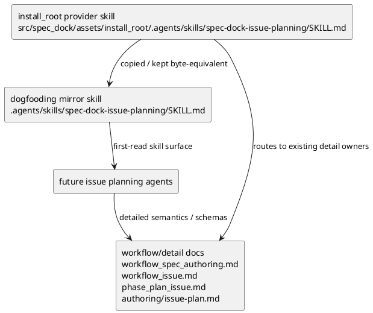

# iss-00159 Make Issue Planning Skill Expose Mandatory Authoring Gates — 設計

## 目的・制約

`spec-dock-issue-planning` skill の first-read surface に、Issue authoring で agent が守る mandatory workflow spine を追加する。

この issue は instruction surface の局所改善であり、workflow policy、runtime gate、template compliance authority、reviewer behavior は変更しない。

## 既存実装 / 規約の理解

- Provider-side source of truth:
  - `src/spec_dock/assets/install_root/.agents/skills/spec-dock-issue-planning/SKILL.md`
- Dogfooding mirror:
  - `.agents/skills/spec-dock-issue-planning/SKILL.md`
- 既存 skill の性質:
  - docs routing と reviewer gate reminder はある。
  - mandatory phase order、fresh pass の意味、non-pass state、delegated draft authority、executable plan handoff、report evidence obligation が first-read surface としては薄い。
- 既存テスト / 検証 surface:
  - `tests/test_init_update.py::TestInitUpdate::test_issue_71_checked_in_dogfooding_agent_tooling_parity_matches_install_root_assets` は install_root asset と dogfooding mirror の parity を検出する。
  - `git diff --check` と targeted inspection で skill text の構造と whitespace を確認する。

## 採用方針 / トレードオフ

- 採用:
  - Skill 先頭側に `Mandatory Issue Authoring Workflow` section を追加する。
  - Skill には順序、停止条件、evidence obligation、doc routing を短い runbook として置く。
  - 詳細 schema と field semantics は既存 docs への参照に留める。
  - Provider-side source と dogfooding mirror は同じ本文で更新する。
- 採用しない:
  - `workflow_spec_authoring.md` / `workflow_issue.md` の長い policy を skill へコピーしない。
  - runtime command、validation、GitHub issue lifecycle、template schema は変更しない。
  - hub skill、issue execution skill、epic / initiative planning skill へ横展開しない。

## 依存関係分析

- file dependency:
  - `.agents/skills/spec-dock-issue-planning/SKILL.md` は dogfooding runtime の読み取り面。
  - `src/spec_dock/assets/install_root/.agents/skills/spec-dock-issue-planning/SKILL.md` は install / update で配布される source of truth。
  - 両者は semantic identity を保つ必要があり、今回の設計では byte-equivalent に更新する。
- 上流:
  - `requirement.md`
  - `spec-dock/docs/workflow_spec_authoring.md`
  - `spec-dock/docs/workflow_issue.md`
  - `spec-dock/docs/phase_plan_issue.md`
  - `spec-dock/docs/authoring/issue-plan.md`
- 下流:
  - `spec-dock-issue-planning` を使う今後の Issue authoring workflow。
  - 後続 issue の hub / docs / templates alignment。
- 実装起点:
  - Provider-side skill text を更新し、同じ内容を dogfooding mirror へ反映する。

## モジュール依存図（Module Dependency Diagram）

Title: Issue planning skill instruction surface delta

Question answered: どの source が配布元で、どの mirror が実際の dogfooding first-read surface か。

Scope: `spec-dock-issue-planning/SKILL.md` の provider source と dogfooding mirror。

Excluded details: install / update runtime の内部コピー処理、他 skill、workflow docs 本文。

Update trigger: provider / mirror の責務、install_root の source-of-truth、または対象 skill の配布方式が変わるとき。



## インターフェース契約

- Skill section contract:
  - `Mandatory Issue Authoring Workflow` を skill の先頭側に置く。
  - Requirement -> fresh `spec-reviewer` pass -> design -> fresh `spec-reviewer` pass -> plan -> fresh `spec-reviewer` pass -> execution handoff を本文で識別できるようにする。
  - `fresh` は current artifact candidate の latest substantive change 後の `review_status: pass` であると説明する。
  - missing / stale / failed / unavailable / denied / waived / provisional は pass ではないと明示する。
  - unresolved gap は clarification または該当 authoring phase へ戻す。
  - delegated draft は canonical authority ではなく、main orchestrator による採用と `report.md` evidence が必要であると明示する。
  - non-executable `plan.md` は execution handoff blocker であると明示する。
  - lifecycle / spec authoring / clarification / issue plan phase / field semantics の docs routing を維持する。

## ディレクトリ / ファイル変更計画

```text
.
|-- src/
|   `-- spec_dock/
|       `-- assets/
|           `-- install_root/
|               `-- .agents/
|                   `-- skills/
|                       `-- spec-dock-issue-planning/
|                           `-- SKILL.md    # 変更: provider-side source of truth
|-- .agents/
|   `-- skills/
|       `-- spec-dock-issue-planning/
|           `-- SKILL.md                    # 変更: dogfooding mirror, provider と byte-equivalent
`-- tests/
    `-- test_init_update.py                 # 読取 / 既存 parity test を利用
```

## 要件 → 設計マッピング

- AC-001 -> `Mandatory Issue Authoring Workflow` に phase order を追加する。
- AC-002 -> non-pass reviewer state と fresh pass の定義を追加する。
- AC-003 -> unresolved gap の戻し先を追加する。
- AC-004 -> delegated draft / canonical authority boundary を追加する。
- AC-005 -> 詳細 schema は docs routing に留める。
- AC-006 -> executable `plan.md` handoff blocker を追加する。
- AC-007 -> `report.md` への Spec Authoring Gate evidence obligation を追加する。
- AC-008 -> provider / mirror を byte-equivalent に更新し、既存 parity test と `cmp` で確認する。
- AC-009 -> doc routing list を維持し、activity-to-doc mapping を明確にする。
- EC-001 -> provider / mirror の更新方針を report に記録する。
- EC-002 -> section heading と bullet checklist で長文化を抑える。
- EC-003 -> full harness は作らず inspection / parity / targeted unittest で閉じる。

## テスト戦略

- Inspect-only:
  - provider skill と mirror skill に必要 section / phrase があることを `rg` と manual inspection で確認する。
- Structural / parity:
  - `cmp` で provider source と dogfooding mirror が byte-equivalent であることを確認する。
  - 既存 unittest `tests.test_init_update.TestInitUpdate.test_issue_71_checked_in_dogfooding_agent_tooling_parity_matches_install_root_assets` を実行する。
- Repository hygiene:
  - `git diff --check`
  - `./spec-dock/scripts/spec-dock validate`

## リスク / ロールバック

- リスク:
  - Skill が長くなりすぎると first-read surface の可読性が下がる。
  - Docs の詳細 policy と skill wording が矛盾すると、後続 issue の前提が崩れる。
- 緩和:
  - Skill には operational spine のみを置き、詳細 schema は docs へ誘導する。
  - Provider / mirror parity と spec-reviewer の docs/spec alignment review を通す。
- ロールバック:
  - 対象 2 ファイルの skill text 差分を戻すだけで runtime behavior は戻る。CLI/runtime state は変更しない。

## 未確定事項

- なし。`requirement.md` の Q-001 は provider-side source と dogfooding mirror を同時更新する方針で解決済み。
